<!-- parte: 00-resumo.md -->

# Resumo executivo

## A pergunta

O interior de São Paulo depende de verba de fora e de deputado tanto quanto o Maranhão? O autor é do interior
paulista e achava que sim. Para responder, o estudo abriu as contas de 2024 dos 3.462 municípios dos 13 estados
do Nordeste e do Sudeste (3.356 com contas utilizáveis), a série de 2002 a 2025 e as emendas federais pagas em
2025. A pergunta foi dividida em quatro leituras, porque cada uma tem resposta diferente.

Tabela. A tese em quatro leituras

| Leitura | O que os dados mostram | Veredito |
|---|---|---|
| Em número de prefeituras | São Paulo tem 150 municípios de até 5 mil habitantes; o Maranhão tem 5. Acima de 80% de dependência há 338 prefeituras paulistas e 210 maranhenses. Acima de 90%, 92 e 184 | vale, e depende do corte |
| Em reais por habitante | Até 5 mil habitantes, Sudeste e Nordeste recebem o mesmo: R$ 8,9 mil e R$ 8,5 mil por habitante. De 5 a 50 mil, o paulista recebe de 9% a 12% a menos que o maranhense do mesmo tamanho | empata no minúsculo |
| Em parcela da receita | A tamanho igual, o município maranhense depende 13,5 pontos percentuais a mais (até 50 mil habitantes). O Nordeste, 6,7 pontos a mais que o Sudeste | cai |
| Em verba de deputado federal | Emenda federal paga em 2025: R$ 149 por habitante no município paulista de até 20 mil habitantes, a menor mediana dos 13 estados. No Maranhão, R$ 357 | cai |

## Dez números para guardar

1. **78,8%** dos 645 municípios paulistas têm até 50 mil habitantes. Neles mora 15,1% da população do estado e
   entram 5,5% dos tributos próprios municipais. No Maranhão são 89,9% dos municípios e 51,7% da população.
2. O FPM é a maior fonte de receita em **53%** das prefeituras paulistas e em **7%** das maranhenses. No
   Maranhão, o FUNDEB lidera em 89%. Quem parece com o interior paulista é Minas Gerais, onde o FPM lidera em 82%
   dos municípios, e também o Rio Grande do Norte, a Paraíba e o Piauí.
3. Não existe corte de dependência, de 50% a 95%, em que a parcela de municípios dependentes se iguale entre São
   Paulo e Maranhão. A igualdade só aparece quando a classe inclui todo mundo, e uma classe em que cabem todos
   não separa ninguém.
4. Por município ou por morador, a conta muda. **54%** das prefeituras paulistas recebem mais de 80% da receita
   de fora, mas nelas moram **7%** dos paulistas. No Maranhão, 98% das prefeituras e 79% da população.
5. Uma prefeitura paulista de até 5 mil habitantes gasta **R$ 1.764** por habitante com Câmara e administração.
   Uma de 20 a 50 mil gasta R$ 618. É custo fixo: o gasto por habitante cai depressa até perto de 20 mil
   habitantes e depois para de cair.
6. **93%** dos municípios paulistas de até 5 mil habitantes põem no FUNDEB mais do que recebem dele.
7. Há **546** municípios logo acima dos degraus de população do FPM e **189** logo abaixo, no Censo de 2022. O
   estudo mede o amontoado e não afirma a causa.
8. De 2002 a 2025 a dependência quase não saiu do lugar: de 89,1% para 86,3% no município paulista de até 20 mil
   habitantes, de 97,8% para 94,5% no maranhense. O que mudou foi a composição: o FPM caiu de 53% para 29% da
   receita no Maranhão e ficou perto de 36% em São Paulo.
9. A emenda segue a cadeira, não o habitante. Pela regra de 2025 são **R$ 73** por habitante em São Paulo,
   R$ 193 no Maranhão e R$ 1.463 em Roraima. O Nordeste como bloco tem 1,09 vez o peso da sua população na
   Câmara. Quem tem cadeira a mais é o Norte de estados pequenos (1,48), e quem tem a menos é São Paulo, a quem
   faltam 42.
10. Levar a máquina de todos os municípios de até 5 mil habitantes ao custo da faixa de 20 a 50 mil
    economizaria, no teto, **R$ 2,35 bilhões** por ano. É 0,28% da receita municipal das duas regiões.

## O que é pouco intuitivo

São Paulo não parece com o Maranhão. O Maranhão é um caso à parte dentro do próprio Nordeste: quase não tem
município minúsculo e vive do FUNDEB. A diferença entre os dois estados começa na malha de municípios, e ela tem
história. De 1988 a 2000 São Paulo criou 73 municípios, 51 deles com menos de 5 mil habitantes. O Maranhão
criou 85, e só 12 eram desse tamanho (TOMIO, 2002, p. 64).

A segunda surpresa é de método. O número que mais circulou na imprensa em 2025, R$ 1.816 contra R$ 393 por
habitante, soma só FPM e FUNDEB. Com a receita inteira e contando por morador, a vantagem do município pequeno
cai para 13% (PERES; MARQUES; ARMANI, 2025; conta deste estudo na seção 15).

## O que o estudo não diz

- É o retrato de um ano de contas declaradas pelas próprias prefeituras, com série longa só para as grandes
  rubricas.
- Descreve. Não prova causa. Onde arrisca um mecanismo, diz com que conta.
- Mede a emenda federal paga a prefeituras e a fundos municipais em 2025. Não mede emenda estadual nem o que vai
  para entidades privadas.
- Não mede a qualidade do gasto nem o serviço que chega ao morador.
- Não recomenda política pública. A Parte III lista as opções em debate e o que a evidência diz de cada uma.

## Como foi feito e como ler

Uma pessoa fez as perguntas e três modelos de linguagem executaram e se conferiram: o Claude montou a base e os
testes, o GPT replicou as contas às cegas e o Grok procurou o melhor argumento contra cada achado. As hipóteses
foram escritas antes dos testes. A conferência derrubou onze frases da primeira versão, e todas estão listadas.

A Parte I traz as contas. A Parte II explica a regra por trás delas: a história das emancipações, a teoria de
escala das cidades, a representação no Congresso e a linha do tempo das emendas. A Parte III lê com a mesma
desconfiança as vozes do debate público, da nota técnica do Centro de Estudos da Metrópole aos vídeos de rede
social, e lista as saídas em discussão. A Parte IV traz o método, a divisão do trabalho e uma reflexão sobre o
uso de inteligência artificial em estudos como este.

Os gráficos interativos, com a tabela por trás de cada um e a ficha de cada município, estão no deck que
acompanha este relatório.

<!-- parte: 10-numeros.md -->

# Parte I. O que as contas mostram

Esta parte responde, com as contas de 2024 de 3.356 municípios do Nordeste e do Sudeste e com a série de 2002 a 2025, se o interior de São Paulo depende de dinheiro de fora e de deputado tanto quanto o Maranhão. A tese do autor se divide em quatro leituras, e o dado dá uma resposta diferente a cada uma. Aqui, transferências são o dinheiro que vem de outro governo, e verba negociada é a soma de convênio, transferência de capital e emenda.

Tabela. As quatro leituras da tese e o que as contas de 2024 dizem de cada uma

| Leitura | O que se compara | Veredito |
|---|---|---|
| Parcela da receita | Transferências sobre a receita, a tamanho igual | Cai: o maranhense depende 13,5 pontos percentuais a mais |
| Reais por habitante | Transferências por habitante | Empata entre as regiões até 5 mil habitantes; acima disso o paulista recebe de 9% a 12% a menos |
| Verba negociada | Emenda federal e convênio | Cai na emenda federal; vale só no convênio com o governo do estado |
| Por município ou por morador | Prefeituras dependentes e quem mora nelas | Vale em número de prefeituras com corte de 80%; cai com corte de 90% e por morador |

## 1. Quatro em cada cinco municípios paulistas são pequenos, e neles moram 15% dos paulistas

O estudo cobre 3.462 municípios de 13 estados: 1.668 no Sudeste e 1.794 no Nordeste, dos quais 645 em São Paulo e 217 no Maranhão (IBGE, 2023). As contagens e as parcelas de população desta seção usam todos eles. As parcelas de receita usam os 3.356 com contas utilizáveis em 2024 (BRASIL, [2026]c).

O palpite de que 80% dos municípios paulistas são pequenos estava certo. Têm até 50 mil habitantes 508 dos 645 municípios de São Paulo, ou 78,8%. No Maranhão são 195 de 217, ou 89,9%. No Sudeste, 1.411 (84,6%); no Nordeste, 1.619 (90,2%). O que separa os estados é quanta gente mora nesses municípios: 15,1% da população paulista e 51,7% da maranhense; 20,8% da população do Sudeste e 44,5% da do Nordeste.

No mapa da {fig:01_mapa_populacao_SP_MA}, quanto mais escuro o município, mais habitantes. Compare o oeste paulista, coberto pelos tons claros das faixas menores, com o Maranhão, onde o tom mais claro, o de até 5 mil habitantes, quase não aparece.

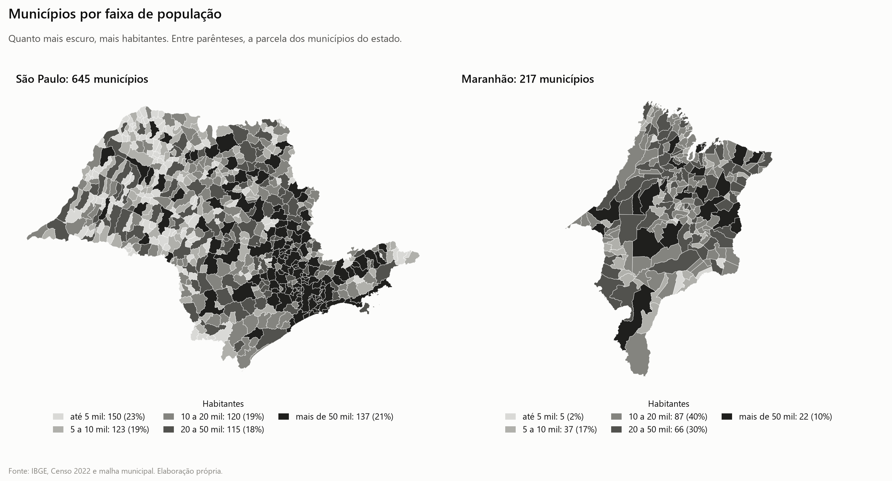

A diferença entre os dois estados está na ponta de baixo. Estão na menor faixa do Fundo de Participação dos Municípios (FPM), de até 10.188 habitantes, 275 municípios paulistas (42,6%) e 44 maranhenses (20,3%). Têm até 5 mil habitantes 150 paulistas (23,3%) e 5 maranhenses (2,3%). Entre as regiões a distância é menor: até 5 mil habitantes, 397 municípios no Sudeste (23,8%) e 248 no Nordeste (13,8%); até 10.188, 776 (46,5%) e 630 (35,1%).

Na {fig:02_acumulado_populacao_SP_MA}, cada curva conta os municípios do menor para o maior: em cima, como parcela dos municípios do estado; embaixo, em número. Até perto de 20 mil habitantes a curva paulista corre acima da maranhense, porque São Paulo tem em proporção mais municípios minúsculos. Daí em diante a maranhense passa à frente e chega à marca de 50 mil habitantes com 89,9% dos municípios, contra 78,8% da paulista. A curva é de municípios, não de moradores.

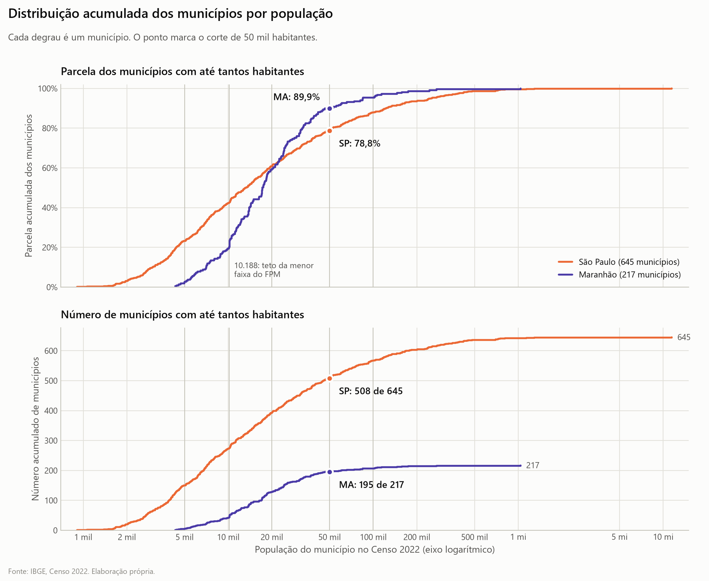

O peso econômico dos pequenos é menor ainda que o peso em população. Nos municípios paulistas de até 50 mil habitantes entra 14,9% da receita municipal do estado e só 5,5% dos tributos próprios. A {fig:03_peso_dos_pequenos_SP_MA} põe lado a lado, para três cortes de população (10.188, 20 mil e 50 mil habitantes), a parcela dos municípios, da população, da receita e dos tributos próprios. Ela usa só os municípios com contas utilizáveis, e por isso mostra 41% dos municípios paulistas na faixa de até 10.188 habitantes, e não os 42,6% da contagem de todos os municípios. Repare, no quadro de até 50 mil habitantes, que em São Paulo as barras encolhem muito da primeira linha para a última, e no Maranhão bem menos.

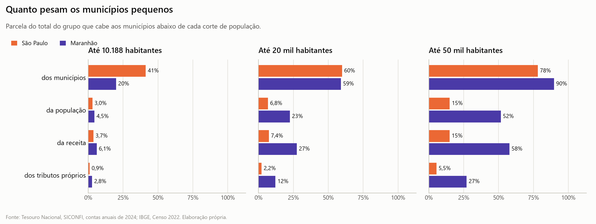

> **Ressalva.** O Maranhão tem cinco municípios de até 5 mil habitantes. Toda comparação entre os dois estados nessa faixa é frágil. Nela, a comparação que se sustenta é Sudeste contra Nordeste.

Esta seção descreve a malha de municípios, não a dependência. Contar prefeituras dependentes exige escolher um corte, e a resposta muda com ele, como mostra a seção 3.

> **O que o dado diz à tese.** O ponto de partida do autor se confirma: São Paulo tem trinta vezes mais municípios de até 5 mil habitantes que o Maranhão. Mas esses municípios abrigam uma fração pequena dos paulistas, e isso pesa em todas as leituras seguintes.

## 2. O FPM é a maior fonte em metade das prefeituras paulistas; no Maranhão, é o FUNDEB

A pergunta desta seção é qual fonte responde pela maior fatia da receita de cada prefeitura. A conta principal usa o que entrou no caixa, já sem os 20% do FPM e do ICMS que cada município aporta ao FUNDEB, o fundo da educação básica. A conta alternativa usa o FPM e o ICMS brutos e conta o FUNDEB só pelo saldo entre o recebido e o aportado.

Tabela. Parcela dos municípios em que cada fonte é a maior fatia da receita, contas de 2024

| Maior fatia | SP | MA | Sudeste | Nordeste |
|---|---:|---:|---:|---:|
| FPM, conta principal | 53,2% | 7,0% | 65,0% | 46,6% |
| FUNDEB, conta principal | 1,3% | 89,3% | 1,7% | 46,5% |
| ICMS e IPVA, conta principal | 23,4% | 2,3% | 14,1% | 2,6% |
| Tributos próprios, conta principal | 21,2% | 0,5% | 10,8% | 1,7% |
| Royalties, conta principal | 0,3% | 0,0% | 3,2% | 0,3% |
| FPM, conta alternativa | 55,3% | 35,3% | 67,9% | 75,3% |
| FUNDEB, conta alternativa | 0,0% | 60,0% | 0,1% | 17,5% |

No mapa da {fig:05_mapa_maior_fatia_SP_MA}, São Paulo aparece em mosaico: FPM, em azul, no oeste, no Vale do Ribeira e em boa parte do litoral; ICMS, em laranja, onde há usina, indústria ou refinaria; tributos próprios, em verde, na Grande São Paulo e no entorno de Campinas. O Maranhão fica quase todo de uma cor, o roxo do FUNDEB, com ICMS no sul da soja, em Balsas e Tasso Fragoso.

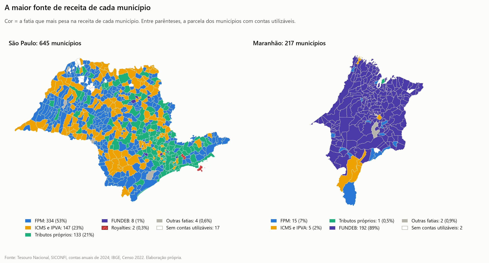

Ampliando para os 13 estados, o mapa da {fig:11_mapa_maior_fatia_SE_NE} mostra onde a cor do FPM domina. Procure as manchas contínuas de FPM em Minas Gerais e na faixa que vai do Piauí à Paraíba, e a mancha de FUNDEB que cobre o Maranhão e parte do Ceará e da Bahia.

Por estado, o FPM é a maior fonte em 82% dos municípios de Minas Gerais, 78% do Rio Grande do Norte, 74% da Paraíba, 63% de Pernambuco e de Sergipe, 53% de São Paulo, 51% do Piauí, 45% do Espírito Santo, 44% da Bahia, 28% do Ceará, 17% de Alagoas, 7% do Maranhão e 5% do Rio de Janeiro, onde os royalties lideram em 46%.

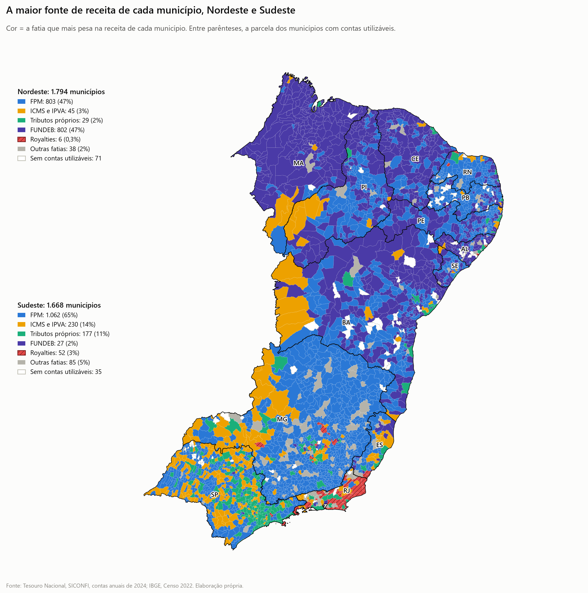

O placar da {fig:12_placar_maior_fatia_por_uf} traz os estados em dois blocos, o Sudeste em cima e o Nordeste embaixo, sem ordená-los. Compare o primeiro trecho de cada barra, o do FPM: São Paulo fica no meio, entre os 82% de Minas Gerais e os 7% do Maranhão.

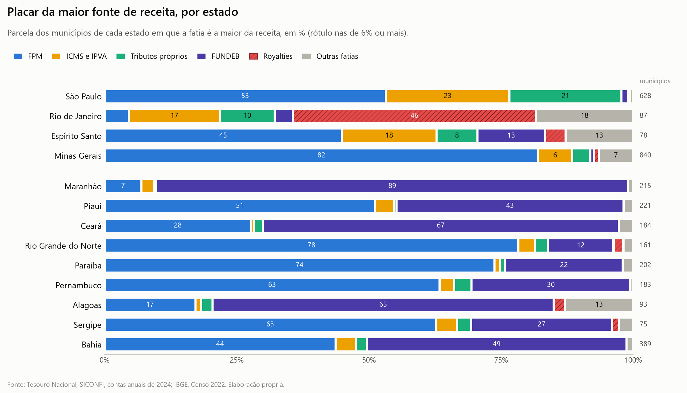

O resultado pouco intuitivo é este: na conta principal, quem se parece com o interior paulista é Minas Gerais, o Rio Grande do Norte, a Paraíba e o Piauí, estados de muito município minúsculo vivendo de FPM. O Maranhão é um caso à parte dentro do próprio Nordeste, com quase tudo vindo do FUNDEB e quase nenhum município minúsculo.

### 2.1 O que muda na conta alternativa

A ordem entre as regiões depende da contabilidade. Na conta principal, o FPM lidera em 18,4 pontos percentuais a mais de municípios no Sudeste que no Nordeste. Com o FUNDEB pelo saldo, lidera em 7,5 pontos a mais no Nordeste. A razão é mecânica: o município nordestino recebe do FUNDEB bem mais do que aporta, e quando só o saldo conta, o FPM bruto volta ao primeiro lugar em 75,3% deles.

Duas coisas não mudam. Em São Paulo o FUNDEB quase nunca lidera: 1,3% dos municípios numa conta e 0,0% na outra. No Maranhão lidera na maioria: 89,3% e 60,0%. A semelhança de Minas, Rio Grande do Norte, Paraíba e Piauí com o interior paulista pertence à conta principal.

O resultado também não depende do ano. Na média de 2023 a 2025, no painel de 830 municípios de São Paulo e do Maranhão com contas utilizáveis nos três anos, o FPM é a maior fatia em 52,2% dos paulistas e o FUNDEB em 90,1% dos maranhenses.

> **Como ler.** O mapa mostra só a maior fatia e joga fora mais da metade da receita. Onde a maior fatia tem 31% e a segunda 30%, o município aparece de uma cor só.

Receitas de uma vez só mexem em casos isolados: o precatório do antigo FUNDEF, de R$ 1,4 bilhão em 159 municípios, quase todos do Nordeste; a outorga de concessão de saneamento em Alagoas e no Rio de Janeiro; e transferência de capital fora do comum, como em Biquinhas, em Minas Gerais, que recebeu do estado 59% da sua receita de 2024. A fatia "SUS" é só o repasse corrente de fundo a fundo; o SUS de convênio e de capital, R$ 3,058 bilhões em 2.142 municípios, fica em "outras transferências".

> **O que o dado diz à tese.** Confirma que metade das prefeituras paulistas vive antes de tudo do FPM, contra 7% das maranhenses. Mas o dinheiro de fora do Maranhão vem por outro canal, o FUNDEB, e a comparação entre as regiões se inverte quando a contabilidade muda.

## 3. Em parcela da receita, o município maranhense depende mais em toda faixa de tamanho

Dependência, aqui, é a parcela da receita que vem de transferências. A receita é líquida das deduções do FUNDEB e não inclui a previdência própria dos servidores.

Tabela. Mediana da parcela da receita que vem de transferências, por faixa de população, contas de 2024

| Habitantes | SP | MA | Sudeste | Nordeste |
|---|---:|---:|---:|---:|
| até 5 mil | 90,2% | 96,5% | 92,2% | 94,6% |
| 5 a 10 mil | 85,9% | 95,4% | 88,7% | 94,2% |
| 10 a 20 mil | 81,5% | 94,4% | 86,0% | 93,3% |
| 20 a 50 mil | 76,7% | 93,8% | 79,5% | 91,7% |
| 50 a 100 mil | 68,2% | 89,8% | 70,7% | 86,5% |

O valor maranhense da primeira linha é a mediana de cinco municípios.

### 3.1 A tamanho igual, 13,5 pontos separam os dois estados

Comparando municípios do mesmo tamanho, o maranhense de até 50 mil habitantes depende 13,5 pontos percentuais a mais que o paulista, com intervalo de 95% de 12,6 a 14,3 pontos. Essa comparação entre os dois estados é exploratória, porque a hipótese foi ajustada depois de ver o dado deles. O teste que vale como confirmação é o regional: o Nordeste depende 6,7 pontos a mais que o Sudeste, com intervalo de 6,3 a 7,1.

O resultado regional resiste a todas as variações tentadas. Vale nas duas contabilidades da seção 2, vale quando se leva em conta que municípios de um mesmo estado se parecem, vale sem Minas Gerais, vale na mediana e vale sem os 100 municípios com alerta de FPM ou de FUNDEB, caso em que as diferenças ficam em 13,4 e 6,7 pontos. Na média de 2023 a 2025, São Paulo contra Maranhão dá 13,6 pontos, com intervalo de 12,8 a 14,5; nos mesmos 671 municípios em 2024, 13,5.

Na {fig:09_dispersao_dependencia_SP_MA}, cada faixa de população tem duas caixas. A caixa cobre a metade central dos municípios, o traço é a mediana e os pontos soltos são os municípios fora da curva. As caixas maranhenses ficam estreitas e no alto em todas as faixas, e as paulistas descem e se alargam à medida que a população cresce.

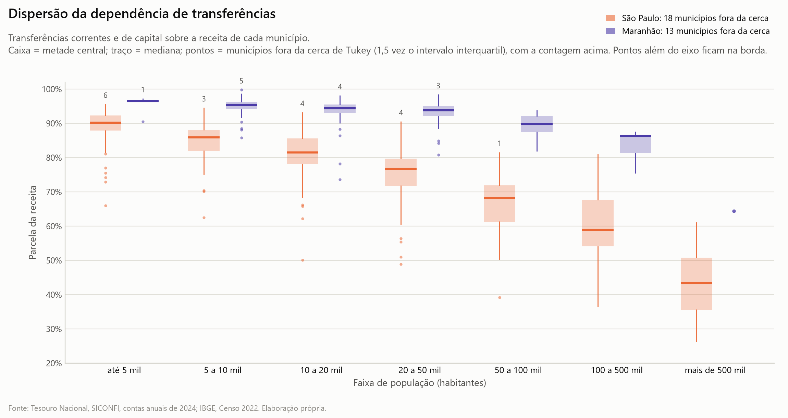

A distância cresce com o tamanho. No município de até 5 mil habitantes as duas regiões quase se encontram, com 92,2% no Sudeste e 94,6% no Nordeste. Entre as regiões a distância é de 4,9 pontos de 5 a 10 mil habitantes, 6,6 de 10 a 20 mil e 10,9 de 20 a 50 mil. O município do Sudeste ganha base própria quando cresce. O do Nordeste ganha bem menos.

A {fig:13_dependencia_por_uf} repete a medida para os municípios de até 20 mil habitantes dos 13 estados, da maior para a menor mediana. Oito estados do Nordeste vêm primeiro, com mediana acima de 93%. Os quatro do Sudeste vêm depois, com São Paulo por último entre eles. Sergipe fecha a lista, abaixo de São Paulo.

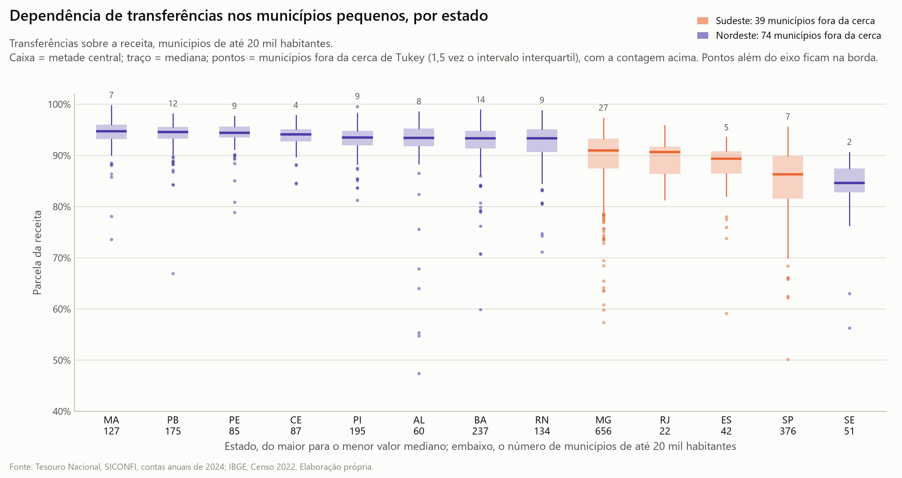

O tributo próprio explica o encontro na ponta de baixo. Na mediana, ele responde por 7,4% da receita no município paulista de até 5 mil habitantes e por 3,7% no nordestino. Tirando o imposto de renda retido da folha da própria prefeitura, que a contabilidade oficial conta como tributo próprio, sobram 5,4% e 1,6%. Na mediana dos municípios pequenos do Nordeste, metade do tributo próprio é esse imposto retido.

A diferença entre São Paulo e Maranhão não é efeito de tamanho. Dando a São Paulo a mistura de tamanhos do Maranhão, a média paulista vai de 78,2% para 78,3%. Os 15 pontos de distância entre as médias vêm de dentro de cada faixa. Até 50 mil habitantes, a mistura de tamanhos até esconde parte da distância: a diferença observada entre as médias é de 10,8 pontos e, a tamanho igual, de 13,5.

Parte da distância acompanha a economia local. Pondo o PIB por habitante na conta, a diferença cai de 13,5 para 10,3 pontos entre os dois estados e de 6,7 para 3,2 entre as regiões. Isso descreve o mecanismo, já que receita própria nasce da atividade econômica do lugar. Não é um viés a descontar do resultado.

### 3.2 Por município, mais da metade de São Paulo; por morador, um em cada catorze

Com o corte em 80% da receita vinda de transferências, estão acima dele 338 das 628 prefeituras paulistas com contas utilizáveis, ou 53,8%, e 210 das 215 maranhenses, ou 97,7%. No Sudeste são 70,1% e no Nordeste, 93,2%. Em número absoluto, São Paulo tem mais prefeituras nessa condição que o Maranhão.

A contagem por morador dá outra figura. Nas 338 prefeituras paulistas mora 7,1% da população do estado, um paulista em cada catorze. Nas 210 maranhenses mora 78,7%, quase quatro em cada cinco moradores. No Sudeste a parcela é de 16,6% e no Nordeste, de 57,8%. Somando todas as prefeituras, as transferências são 49% da receita dos municípios paulistas e 87% da dos maranhenses.

Os municípios sem contas utilizáveis não mudam o quadro. Supondo todos abaixo ou todos acima do corte, a parcela fica entre 52,4% e 55,0% dos 645 paulistas e entre 96,8% e 97,7% dos 217 maranhenses.

É aqui que mora o mal-entendido. Quem percorre o interior paulista vê prefeitura dependente em mais da metade dos municípios e está certo. Quem olha onde as pessoas moram vê um estado em que a dependência alta alcança pouca gente e também está certo. As duas contagens medem coisas diferentes.

### 3.3 Como classe única, as curvas só se igualam onde todos estão dentro

O autor perguntou se, tratando a dependência como classe única, em que o município depende ou não depende, existe um corte em que a parcela de municípios dependentes se iguala entre os estados.

Tabela. Parcela dos municípios em que as transferências passam de cada corte, contas de 2024

| Corte | SP, todos | MA, todos | SP, até 20 mil hab. | MA, até 20 mil hab. |
|---|---:|---:|---:|---:|
| 50% | 96,8% | 100,0% | 100,0% | 100,0% |
| 60% | 90,1% | 100,0% | 99,7% | 100,0% |
| 70% | 78,0% | 99,5% | 97,9% | 100,0% |
| 80% | 53,8% | 97,7% | 82,2% | 98,4% |
| 90% | 14,6% | 85,6% | 24,2% | 94,5% |
| 95% | 0,6% | 36,3% | 1,1% | 46,5% |

A resposta é que a igualdade existe, mas só nas pontas da curva. No conjunto de todos os municípios, as parcelas de São Paulo e do Maranhão só se igualam em zero, com corte acima de 99,8%. Entre os municípios de até 20 mil habitantes, as duas são 100% com qualquer corte até 50,1%; até 10.188 habitantes, com qualquer corte até 62,5%; até 5 mil, com qualquer corte até 66,0%. Esses limites são a menor dependência encontrada entre os paulistas de cada recorte. Daí para cima a parcela paulista cai, a maranhense se mantém, e as curvas não se cruzam de novo antes de zerar.

Na {fig:19_corte_dependencia_SP_MA}, cada quadro é um recorte de tamanho (todos os municípios, até 20 mil, até 10.188 e até 5 mil habitantes) e percorre os cortes de 50% a 100%. Olhe o vão entre as duas linhas: no quadro de todos os municípios ele já existe em 50%; nos outros três abre entre 65% e 75%, é largo em 90% e só fecha quando quase nenhum município passa do corte.

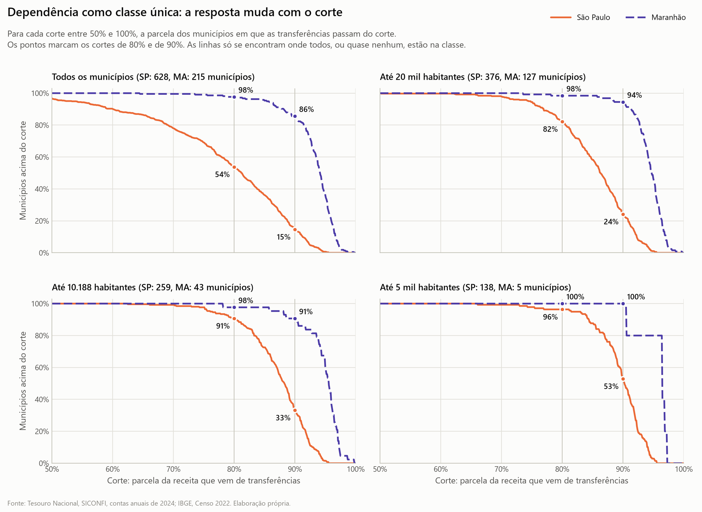

Essa igualdade não informa nada. Ela diz que todo município pequeno dos dois estados recebe de fora mais da metade da receita. Isso vale para quase todo município pequeno do país e decorre do desenho do federalismo fiscal brasileiro, em que o imposto se arrecada onde está a atividade econômica e se redistribui por fórmula. Uma classe em que cabem todos não separa ninguém.

Assim que o corte passa a separar, separa contra a tese. Nos municípios de até 20 mil habitantes, passam de 80% de dependência 82,2% dos paulistas e 98,4% dos maranhenses; passam de 90%, 24,2% e 94,5%. Até 5 mil habitantes, passam de 90% 52,9% dos paulistas e os cinco maranhenses. Em número de prefeituras a ordem também vira: acima de 80%, 338 em São Paulo e 210 no Maranhão; acima de 90%, 92 e 184.

Entre as regiões o quadro é o mesmo: nos municípios de até 20 mil habitantes, passam de 90% de dependência 45,9% dos do Sudeste e 83,7% dos do Nordeste.

A classe única descarta a informação que distingue os dois estados, que é a distância dentro da classe: um município com 81% e outro com 97% ficam do mesmo lado do corte de 80%. Por isso o estudo trabalha com a parcela contínua, com reais por habitante e com a população que mora nos municípios dependentes.

> **O que o dado diz à tese.** Em parcela da receita a tese cai: o município maranhense depende mais em toda faixa de tamanho e em todo corte de 50% a 95%. O que sobra dela é a contagem de prefeituras acima de 80%, que é maior em São Paulo porque o estado tem mais municípios.

## 4. Em reais por habitante, o município minúsculo recebe o mesmo nas duas regiões

A parcela da receita esconde o tamanho do cheque. Um município pode ter 90% da receita vinda de fora e receber pouco por habitante, ou o contrário. Esta seção mede as transferências em reais por habitante.

Tabela. Mediana das transferências por habitante, por faixa de população, contas de 2024

| Habitantes | SP | MA | Sudeste | Nordeste |
|---|---:|---:|---:|---:|
| até 5 mil | R$ 9.236 | R$ 8.782 | R$ 8.859 | R$ 8.457 |
| 5 a 10 mil | R$ 5.913 | R$ 6.542 | R$ 5.785 | R$ 6.028 |
| 10 a 20 mil | R$ 5.047 | R$ 5.661 | R$ 4.881 | R$ 5.387 |
| 20 a 50 mil | R$ 4.265 | R$ 4.835 | R$ 4.314 | R$ 4.553 |

O efeito muda com o tamanho, e cada faixa tem um veredito próprio.

Até 5 mil habitantes, Sudeste e Nordeste empatam. A tamanho igual, a diferença é de -0,6%, com intervalo de 95% de -3,2% a +2,1%, que inclui o zero.

Até 5 mil habitantes, São Paulo contra Maranhão não dá para dizer. São cinco municípios maranhenses. A diferença é de -3,0% em 2024, com intervalo de -18% a +15%, e de -1,5% na média de 2023 a 2025, com intervalo de -17% a +16%. A mediana dos cinco balança de um recorte para outro: no triênio, em reais de 2025, R$ 9.781 em São Paulo e R$ 8.426 no Maranhão.

De 5 a 50 mil habitantes, o município paulista recebe de 9% a 12% a menos que o maranhense do mesmo tamanho. O teste registrado antes de ver o dado, único para todos os municípios de até 50 mil habitantes, dá -9,3%, com intervalo de -12,3% a -6,1%. O teste só de 5 a 50 mil dá -11,6%, com intervalo de -14,4% a -8,7%, mas foi escrito depois de ver o dado e vale menos como prova. Na média de 2023 a 2025 a diferença é de -9,5%, com intervalo de -12,2% a -6,7%. Faixa por faixa, a diferença de 5 a 10 mil habitantes, de R$ 546, deixa de se distinguir de zero depois da correção para comparações múltiplas.

Entre as duas regiões, a diferença de 5 a 50 mil habitantes é de 5% a favor do Nordeste e não se distingue de zero quando se leva em conta que municípios do mesmo estado se parecem. Ela depende de Minas Gerais.

A {fig:14_transferencias_por_habitante_por_uf} mostra a distribuição nos municípios de até 20 mil habitantes de cada estado, da maior para a menor mediana. São Paulo fica no meio da lista, junto de outros estados de muito município minúsculo, como Piauí, Paraíba e Minas Gerais, e à frente do Maranhão.

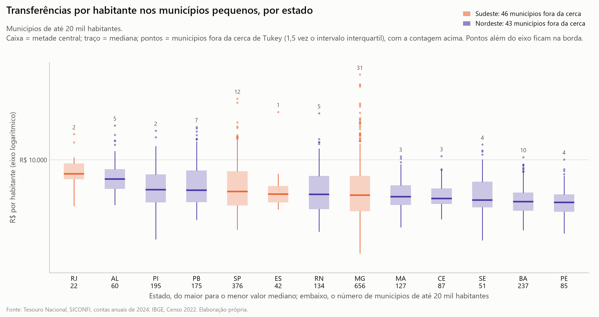

A resposta para o estado inteiro depende de como se conta. Na média dos municípios, São Paulo recebe R$ 5.924 por habitante e o Maranhão, R$ 5.642. Na mediana dos municípios, R$ 5.123 e R$ 5.375. Por morador, dividindo a soma das transferências pela soma da população, R$ 3.193 e R$ 4.527. São Paulo fica à frente na média por município porque tem muito município minúsculo, e fica atrás na mediana e por morador.

O tamanho pesa mais que a região. O município do Sudeste de até 5 mil habitantes recebe cerca de R$ 3,4 mil a mais por habitante que o nordestino de 10 a 20 mil, que é o tamanho mais comum no Nordeste. É dessa comparação, entre o município típico de cada lugar, que sai a parte da tese que se sustenta: o paulista de até 5 mil habitantes recebe em torno de R$ 9,2 mil por habitante, 72% a mais que o município maranhense mediano, com R$ 5,4 mil.

O mecanismo provável é a regra do FPM, que paga um piso igual a todo município de até 10.188 habitantes. Na seção 12, a conta com um FPM proporcional à população atribui à escada do fundo 68% da distância, em reais por habitante, entre o município de até 5 mil habitantes e o de 20 a 50 mil. O FPM líquido por habitante vai de R$ 4.137 no município paulista de até 5 mil habitantes a R$ 1.177 no de 20 a 50 mil. Borá, com 907 habitantes no Censo, recebeu R$ 17,5 milhões de FPM bruto em 2024. A cota mínima do FPM vale 10% a mais em São Paulo que no Maranhão, porque a fatia de cada estado no fundo está congelada desde 1990.

> **O que o dado diz à tese.** Aqui a tese tem seu melhor resultado: o município minúsculo do Sudeste recebe por habitante o mesmo que o do Nordeste, e muito mais que o município nordestino típico. De 5 mil habitantes para cima ela cai, porque o paulista recebe de 9% a 12% a menos que o maranhense do mesmo tamanho.

## 5. A emenda federal é a menor do grupo em São Paulo; o que o estado tem a mais é convênio estadual

A versão "verba de deputado" da tese pede uma medida do dinheiro que depende de negociação. O estudo usa duas. A medida restrita, que é a principal, soma convênios e transferências de capital lançados nas contas da prefeitura, sem o SUS e sem o convênio corrente estadual de educação, que pode ser repasse regular. A medida ampla inclui essas duas parcelas e fica como teste de sensibilidade.

> **Ressalva.** A versão anterior do estudo chamava a medida ampla de "transferências voluntárias". Ela tinha R$ 3,058 bilhões do SUS dentro, e a Lei de Responsabilidade Fiscal tira o SUS dessa categoria (BRASIL, 2000, art. 25). Nenhuma das duas medidas é a transferência voluntária da lei.

### 5.1 Emenda federal

As emendas parlamentares federais pagas em 2025 a prefeituras e fundos municipais vêm do Portal da Transparência (BRASIL, 2026a). O valor pago inclui restos a pagar de anos anteriores. Na mediana dos municípios de até 20 mil habitantes, por habitante: Sergipe R$ 670, Piauí R$ 622, Paraíba R$ 586, Rio de Janeiro R$ 518, Rio Grande do Norte R$ 493, Pernambuco R$ 462, Alagoas R$ 454, Espírito Santo R$ 378, Maranhão R$ 357, Ceará R$ 294, Minas Gerais R$ 274, Bahia R$ 234 e São Paulo R$ 149. São Paulo é o último na mediana, na média e ponderando por população.

Na {fig:16_emendas_por_habitante_por_uf}, os estados vão da maior para a menor mediana: São Paulo é o último, à direita, e o Maranhão, o nono dos 13.

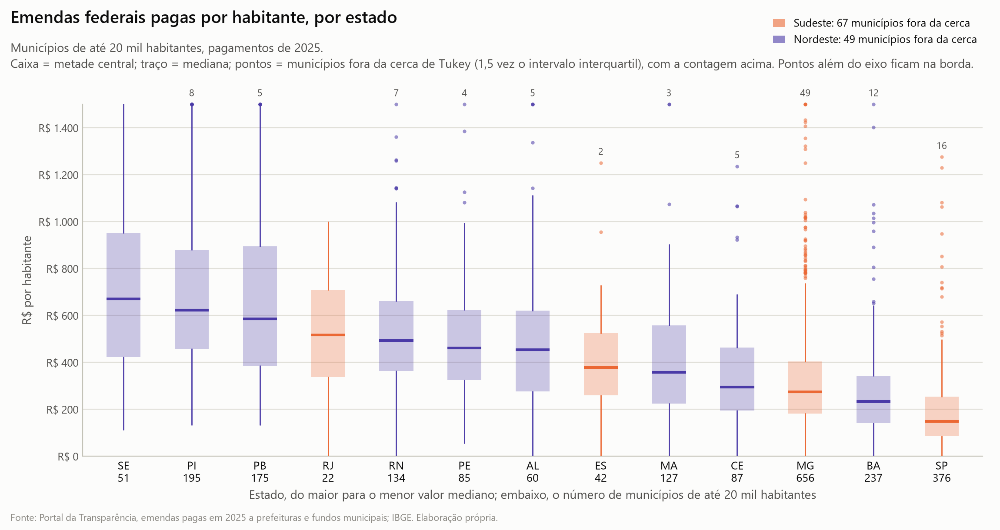

Em parcela da receita de 2025, a emenda federal equivale a 1,8% em São Paulo, 5,2% no Maranhão e 7,9% no Piauí. Sobre a receita de 2024, que era o denominador da versão anterior, 2,0%, 5,5% e 9,0%. A base de 2025 ainda não existe para Minas Gerais, Espírito Santo e Rio de Janeiro.

A tamanho igual, o município maranhense recebe R$ 240 a mais de emenda federal por habitante que o paulista, e o do Nordeste, R$ 235 a mais que o do Sudeste. É o que a regra produz. A cota de emenda é por parlamentar e por bancada, e São Paulo tem um deputado federal para cada 634 mil habitantes, contra um para cada 376 mil no Maranhão.

O arquivo só cobre prefeitura e fundo municipal. Em São Paulo, um terço da emenda com destino no estado vai para o governo estadual e para entidades, e essa parte fica fora da conta.

### 5.2 Convênio e transferência de capital

Na medida restrita, mediana dos municípios de até 20 mil habitantes, a verba negociada que vem da União equivale a 0,66% da receita em São Paulo e 0,75% no Maranhão, contra 3,3% no Piauí e 3,9% na Paraíba. Na medida ampla, 0,74% e 0,90%. O ano de 2024 foi fraco de convênio federal: na média de 2023 a 2025, as medianas são de 0,94% em São Paulo e 1,50% no Maranhão.

A verba negociada que vem do governo do estado equivale a 2,5% da receita em São Paulo e 0,0% no Maranhão, na medida restrita. Na ampla, 4,2% e 0,0%. Os vizinhos de São Paulo divergem: 6,0% no Espírito Santo, 2,3% em Minas Gerais e 0,0% no Rio de Janeiro, na restrita.

A {fig:18_voluntarias_do_estado_por_uf} mostra a verba estadual por estado, na medida restrita, da maior para a menor mediana. Espírito Santo, São Paulo e Minas Gerais vêm na frente, e o Rio de Janeiro é o último. Em oito dos nove estados do Nordeste a mediana fica abaixo de 1% da receita.

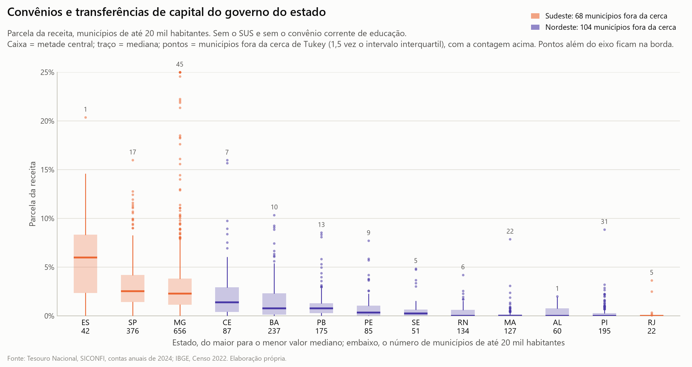

A tamanho igual, na medida restrita, o município paulista tem 2,3 pontos percentuais a mais de verba estadual que o maranhense, com intervalo de 95% de 2,1 a 2,5, e 0,9 ponto a menos de verba federal, com intervalo de 0,5 a 1,3. Na ampla, 4,4 pontos a mais e 1,0 a menos. Entre as regiões, o Sudeste tem 2,1 pontos a mais de verba estadual na restrita; a diferença federal, de 1,3 ponto a favor do Nordeste, não se distingue de zero quando se leva em conta a semelhança entre municípios do mesmo estado. Na média de 2023 a 2025, nos 671 municípios de até 50 mil habitantes dos dois estados, o resultado se mantém: 2,1 pontos a mais de verba estadual em São Paulo, com intervalo de 1,9 a 2,3, e 1,0 ponto a menos de verba federal, com intervalo de 0,7 a 1,3.

> **Ressalva.** O 0,0% do Maranhão é mediana de lançamento contábil, não prova de que o estado não repassa. Das 127 prefeituras maranhenses de até 20 mil habitantes, 84 lançaram zero nessas contas, ou 68 na medida ampla. Na média, a verba estadual é 0,24% da receita no Maranhão e 3,19% em São Paulo; na ampla, 0,36% e 5,22%.

O que São Paulo tem de diferente é o governo do estado como fonte de verba negociada, e o tamanho disso caiu com a revisão da medida, de 4,2% para 2,5% da receita. No município paulista de até 5 mil habitantes, a verba negociada federal e estadual equivale a 53% do investimento, e só a estadual, a 35%. Na medida ampla eram 74% e 56%.

### 5.3 O que estas medidas não enxergam

As contas da prefeitura não servem para medir emenda. Cerca de seis em cada dez reais de emenda vão para o fundo municipal de saúde e entram na conta do SUS. A conta própria da emenda de transferência especial, a emenda Pix, registra 69% do valor pago em São Paulo e 24% no Maranhão, onde o dinheiro aparece em "outras transferências da União". Por isso a emenda foi medida só pelo Portal da Transparência.

Ficam de fora também os consórcios intermunicipais e o gasto que o estado faz direto no município.

Falta a peça que decide esta versão da tese: emenda de deputado estadual e convênio estadual por município e por programa. O estudo não tem esse dado.

> **O que o dado diz à tese.** Na verba de deputado federal a tese cai: São Paulo recebe a menor emenda por habitante dos 13 estados. Ela se mantém em um ponto, o convênio com o governo do estado, que pesa 2,5% da receita do município paulista pequeno e não aparece na mediana maranhense. Se esse dinheiro passa por deputado estadual, o estudo não sabe dizer.

## 6. A máquina custa quase o triplo por habitante no município minúsculo, e em São Paulo ele ainda aporta mais ao FUNDEB do que recebe

### 6.1 Câmara e administração

O custo da máquina é medido pelo gasto nas funções legislativa e de administração. Por habitante, ele é de duas a três vezes maior no município de até 5 mil habitantes que no de 20 a 50 mil: R$ 1.764 contra R$ 618 em São Paulo, R$ 1.520 contra R$ 648 no Sudeste e R$ 1.788 contra R$ 613 no Nordeste.

Na {fig:07_custo_da_maquina_SP_MA}, o quadro da esquerda traz o gasto por habitante. Olhe a forma da curva: ela despenca até perto de 20 mil habitantes e depois fica plana. O quadro da direita divide os tributos próprios por esse gasto: a linha paulista só chega a 1, ponto em que os tributos pagam a máquina, perto de 10 mil habitantes, e a maranhense fica abaixo de 1 em todas as faixas.

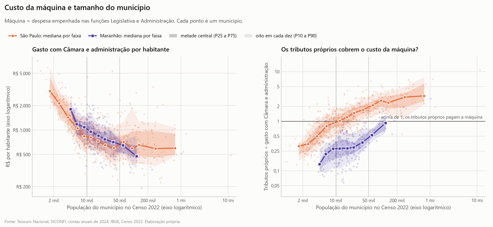

A economia de escala é forte no município minúsculo e se esgota perto de 20 mil habitantes. Até 5 mil habitantes, dobrar a população corta o gasto por habitante quase pela metade. De 5 a 20 mil, o corte é bem menor. De 20 a 100 mil, o efeito não se distingue de zero. Essas estimativas por trecho são das duas regiões juntas e foram feitas depois de ver a curva. O número único registrado antes, uma queda média de 0,28% no gasto por habitante para cada 1% a mais de população, esconde a curva.

Entre as regiões não há diferença estável a tamanho igual: -2% na média, indistinguível de zero, e -7% na mediana, com o Sudeste abaixo.

> **Ressalva.** A medida não é comparável entre estados. Em São Paulo quase toda a administração geral está na função de administração. Fora de São Paulo, a administração da saúde e da educação costuma ser lançada dentro dessas duas funções. A medida usada é um piso. Somando a administração geral de todas as funções chega-se a um teto, que no Maranhão é 59% maior que o piso e em São Paulo é igual a ele.

Os tributos próprios não pagam a Câmara e a administração em 91% dos municípios paulistas de até 5 mil habitantes, em 64% dos de 5 a 10 mil e em 13% dos de 20 a 50 mil. No Maranhão, não pagam em 96% de todos os municípios, e ainda em 83% dos de 50 a 100 mil habitantes. Essa conta inclui o imposto de renda retido na fonte como tributo próprio. Sem ele, os percentuais sobem para 96%, 77% e 25% em São Paulo e para 98% e 92% no Maranhão.

### 6.2 A simulação do critério da PEC 188

A PEC 188/2019 propunha extinguir municípios com menos de 5 mil habitantes e arrecadação de IPTU, ITBI e ISS abaixo de 10% da receita. O estudo simulou o critério sobre as contas de 2024, na leitura da Confederação Nacional de Municípios (CNM), que usou a receita corrente líquida como denominador (CONFEDERAÇÃO NACIONAL DE MUNICÍPIOS, [2019?]). Cairiam no critério 242 municípios em Minas Gerais, 133 em São Paulo, 83 no Piauí, 68 na Paraíba, 49 no Rio Grande do Norte e 5 no Maranhão. O resultado fica perto da lista da CNM: 223, 135, 75, 68, 48 e 4.

Na {fig:15_criterio_pec188_por_uf}, a ordem dos estados é a da malha de municípios minúsculos da seção 1, com Minas Gerais e São Paulo no topo.

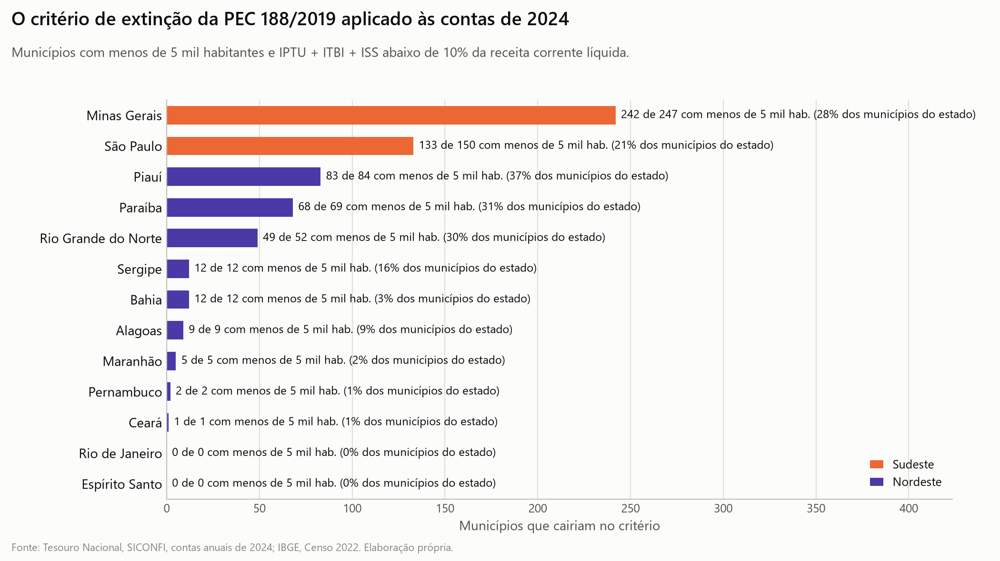

A PEC foi arquivada em 22/12/2022 e não há proposta em tramitação com esse critério. O texto do critério na proposta protocolada não foi aberto nesta revisão; a simulação segue a leitura da CNM, entidade que representa as prefeituras e se opôs à proposta (CONFEDERAÇÃO NACIONAL DE MUNICÍPIOS, [2019]).

### 6.3 FUNDEB: quem aporta e quem recebe

Dos municípios paulistas de até 5 mil habitantes, 93% são doadores líquidos do FUNDEB: aportam 20% de um FPM e de um ICMS grandes para o tamanho deles e têm poucos alunos. No Sudeste são 91%. No Nordeste, 21% na mesma faixa e 1% de 5 a 50 mil habitantes. No Maranhão, nenhum dos cinco. O resultado resiste a tirar os 62 municípios com aporte suspeito, 27 deles no Piauí: 93% em São Paulo, 91% no Sudeste e 22% no Nordeste.

Esse dinheiro não sai de São Paulo para o Maranhão. São 27 fundos, um por estado. Dentro do fundo paulista, o município minúsculo perde para os que têm mais alunos. Dentro do maranhense, todos os municípios ganham, do governo do estado e da complementação da União. O resultado é uma diferença de natureza: o dinheiro de fora do município pequeno paulista é livre, vindo de FPM e ICMS, e o do maranhense é carimbado para a educação. As contas anuais não separam os três tipos de complementação da União.

> **O que o dado diz à tese.** O município minúsculo paulista não paga a própria Câmara e a própria administração com o que arrecada, e nisso se parece com o maranhense. A diferença está no tipo de dinheiro que recebe: livre em São Paulo, vinculado à educação no Maranhão.

## 7. A nota C da CAPAG aparece na mesma proporção nos dois estados

A CAPAG é a nota de capacidade de pagamento do Tesouro Nacional. Ela mede endividamento, poupança corrente e liquidez. Não mede autonomia: um município pode viver de transferência e ter nota A.

Tabela. Distribuição das notas da CAPAG sobre todos os municípios de cada grupo, posição de 01/09/2026

| Nota | SP | MA | Sudeste | Nordeste |
|---|---:|---:|---:|---:|
| A ou A+ | 22,0% | 14,3% | 25,0% | 9,7% |
| B ou B+ | 13,5% | 18,4% | 18,8% | 21,6% |
| C | 60,2% | 56,7% | 47,9% | 55,6% |
| D | 0,2% | 0,0% | 0,1% | 1,0% |
| Sem nota | 4,2% | 10,6% | 8,2% | 12,2% |

Entre os municípios que têm nota, a C aparece em 63% dos paulistas e em 63% dos maranhenses. No Nordeste também são 63%, e no Sudeste, 52%, puxado pelo Espírito Santo, com 19%, e por Minas Gerais, com 45%. Na nota C os dois estados empatam. No topo São Paulo está melhor: A ou A+ em 23% dos que têm nota, contra 16% no Maranhão (BRASIL, 2026b).

O índice IFGF Autonomia, da Firjan, mede outra coisa e dá o resultado oposto. Ele conta a cota-parte do ICMS como receita local, o que favorece o município com indústria ou usina. A mediana paulista bate no teto do índice, 1,00, e a maranhense no piso, 0,00. Nos municípios paulistas de até 10 mil habitantes a mediana é 0,7, e nos do Sudeste, 0,3. A Firjan é uma federação de indústrias, e a escolha de tratar o ICMS como receita local é dela.

> **O que o dado diz à tese.** A nota de capacidade de pagamento não separa os dois estados na faixa de baixo, o que é compatível com a tese. Mas ela não mede dependência, e o índice que tenta medi-la põe São Paulo no teto e o Maranhão no piso.

## 8. A população publicada se concentra logo acima dos degraus do FPM

O FPM divide os municípios do interior em faixas de população, e cada degrau para cima aumenta a cota. Se a população publicada fosse indiferente à regra, haveria tantos municípios logo abaixo de um degrau quanto logo acima.

Tabela. Municípios do país com população até 2% acima e até 2% abaixo dos degraus do FPM

| Recorte | Até 2% acima | Até 2% abaixo |
|---|---:|---:|
| Censo 2022, soma dos 17 degraus | 546 | 189 |
| Censo 2022, degrau de 10.188 habitantes | 104 | 20 |
| Censo 2010, soma dos 17 degraus | 479 | 157 |

No Censo 2022, 74% dos municípios vizinhos de um degrau estão acima dele; o acaso daria perto de 50% (IBGE, 2023). O excesso resiste a trocar a janela de 2% por uma janela fixa em habitantes, não aparece em degraus falsos deslocados e existe nas cinco regiões do país.

A soma não quer dizer que cada degrau tenha excesso. Um teste de densidade degrau a degrau, pelo método de Cattaneo, Jansson e Ma, foi rodado pela revisão cruzada e não foi refeito pelo autor. Com correção para 17 comparações, ele aponta quebra em quatro degraus no Censo 2022, os de 10.188, 13.584, 16.980 e 23.772 habitantes, e em cinco no Censo 2010, os mesmos e o de 30.564. Em 10.188 habitantes, a densidade logo acima é 4,82 vezes a de logo abaixo em 2022 e 7,45 vezes em 2010. Cinco degraus têm municípios de menos para testar.

Nas estimativas de 2024 a 2026 o excesso não some, ele se desloca. A estimativa é o Censo multiplicado por um fator de crescimento, então quem estava até 2% acima do degrau em 2022 aparece de 2% a 5% acima em 2024.

O autor esperava não achar esse padrão no Censo 2022 e estava errado. O dado mostra a concentração e não mede a causa. O estudo não afirma nenhuma. As causas possíveis são quatro, sem ordem de importância:

- esforço de coleta e contestação por parte de quem ficaria logo abaixo do degrau;
- decisão judicial que fixa população acima da do Censo, noticiada em reportagem do Valor de 22/02/2026 que a revisão cruzada citou e o autor não abriu;
- população usada pelo Tribunal de Contas da União diferente da do Censo final, caso de 111 municípios do estudo, 13 deles perto do primeiro degrau, segundo conta da revisão cruzada que não atribuiu a diferença a decisão judicial sem olhar caso a caso;
- um padrão antigo, já apontado na literatura para o Censo 2010 (MONASTERIO, 2013).

Falta medir quanto pesa cada causa. Há um complicador: abaixo do primeiro degrau, 53,6% dos municípios têm o coeficiente protegido pela Lei Complementar 198/2023, contra 4,5% acima, segundo a mesma conta da revisão cruzada (BRASIL, 2023). Subir de faixa hoje muda pouco o coeficiente efetivo desses municípios.

> **O que o dado diz à tese.** Nada diretamente. O recado é de método: perto dos degraus do FPM a população publicada não é uma medida neutra do tamanho, e toda comparação "a tamanho igual" deste relatório carrega essa imprecisão.

## 9. Em 23 anos a dependência caiu três pontos e a distância entre os dois estados ficou igual

A série longa vem do IPEADATA, que publica as séries municipais da Secretaria do Tesouro Nacional (IPEA, 2026). É receita bruta, com os mesmos totais das contas anuais. A dependência desta seção é transferência corrente sobre receita corrente bruta. Não é a mesma medida da seção 3, e os níveis das duas não se comparam: os da série longa ficam alguns pontos acima. A série serve para ver tendência.

As comparações começam em 2002 de propósito. Até 2001 o imposto de renda retido na fonte entrava como transferência e a função de administração tinha outra classificação. Comparar com 2000 fabrica uma queda que não existiu. As figuras mostram a série desde 2000, sem 2008, ano em que a cobertura do Nordeste ficou abaixo de 85%.

> **Como ler.** Em cada quadro das figuras desta seção, a linha é a mediana do grupo. A mancha escura cobre a metade central dos municípios e a mancha clara, oito em cada dez. Os pontos soltos são os municípios fora da curva, além do limite convencional de afastamento em relação à metade central. O número no alto de cada ano conta quantos são, e o triângulo avisa que há algum além do eixo.

A {fig:41_longo_dep_corrente_SP_MA} separa os municípios em três tamanhos: até 10 mil, de 10 a 50 mil e mais de 50 mil habitantes. É um recorte diferente do da tabela de quatro indicadores desta seção, que é de até 20 mil habitantes. Nos quadros de até 50 mil habitantes, olhe a inclinação da linha, quase plana até 2021, e a largura da mancha, estreita no Maranhão e larga em São Paulo. Os rótulos da figura marcam 2000 e 2025; as comparações do texto partem de 2002.

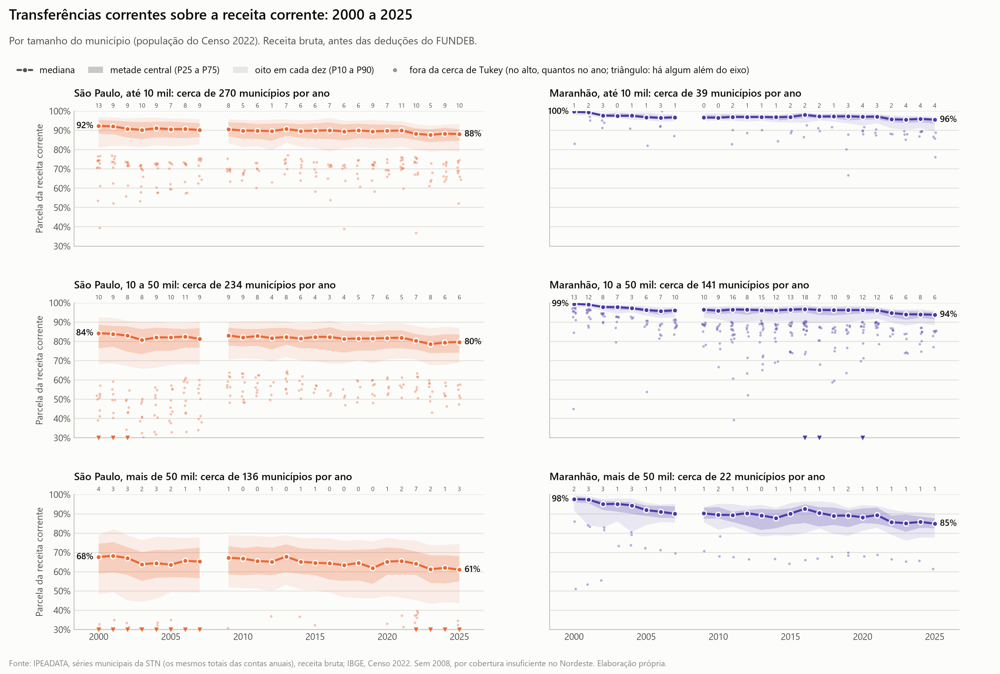

Tabela. Mediana de quatro indicadores nos municípios de até 20 mil habitantes de São Paulo e do Maranhão, em parcela da receita corrente

| Indicador | 2002 | 2025 | Mudança em pontos | Intervalo de 95% |
|---|---:|---:|---:|---:|
| Transferências correntes, SP | 89,1% | 86,3% | -2,7 | -3,2 a -2,2 |
| Transferências correntes, MA | 97,8% | 94,5% | -3,2 | -4,2 a -2,8 |
| FPM, SP | 37,3% | 35,5% | -1,6 | -2,1 a -0,9 |
| FPM, MA | 52,8% | 28,9% | -23,2 | -24,9 a -21,3 |
| Cota-parte do ICMS, SP | 26,2% | 20,9% | -5,4 | -5,9 a -4,9 |
| Cota-parte do ICMS, MA | 4,7% | 9,6% | +4,9 | 4,1 a 6,0 |
| Câmara e administração, SP | 18,3% | 13,1% | -4,6 | -5,2 a -4,1 |
| Câmara e administração, MA | 21,0% | 14,7% | -6,7 | -8,2 a -4,5 |

A mudança é a mediana da variação dentro de cada município presente nos dois anos, e por isso não é a subtração exata das duas colunas.

### 9.1 O que tem teste e o que não tem

Três tipos de afirmação desta seção passaram por teste, todos com municípios de até 20 mil habitantes. O primeiro é a mudança de 2002 a 2025 dentro do mesmo município, que está na tabela de quatro indicadores. O segundo é a tendência por década. O terceiro é a comparação entre a mudança do Sudeste e a do Nordeste. Todas as mudanças da tabela resistem à correção para comparações múltiplas. A exceção, fora da tabela, é a cota-parte do ICMS no Nordeste, que ficou parada: de 8,0% para 7,8% da receita corrente, variação que não se distingue de zero.

Entre as regiões, a dependência caiu 3,1 pontos percentuais no Sudeste, de 92,3% para 88,7%, e 3,4 pontos no Nordeste, de 96,7% para 93,0%. A diferença entre as duas quedas é de 0,6 ponto, com intervalo de 0,3 a 1,0. O peso do FPM caiu 6,5 pontos no Sudeste, de 49,7% para 40,9%, e 16,1 pontos no Nordeste, de 52,6% para 36,3%; a diferença, de 9,4 pontos, tem intervalo de 8,7 a 10,2.

Não têm teste as afirmações sobre quando a mudança ocorreu, sobre a causa dela e sobre a ordem dos estados. Elas vêm da leitura das curvas e de contas auxiliares, e estão marcadas como tal a seguir.

### 9.2 A dependência ficou parada até 2021

De 2002 a 2021 a mediana da dependência caiu menos de um ponto. Os outros dois ou três pontos vieram depois de 2021, e a maior parte não é imposto próprio. Segundo conta da revisão cruzada, não refeita pelo autor, de 2021 para 2022, nos municípios de até 10 mil habitantes, a dependência caiu 1,4 ponto nos dois estados e o rendimento de aplicações financeiras subiu 1,4 ponto da receita em São Paulo e 0,6 no Maranhão. O rendimento explica a queda em São Paulo e menos da metade no Maranhão. Que a causa seja o juro alto continua hipótese.

A distância entre São Paulo e o Maranhão é a mesma de 2002, cerca de 8 pontos. Por estado, a ordem da dependência quase não mudou em 23 anos: Maranhão, Paraíba, Bahia e Piauí no topo, São Paulo e Rio de Janeiro no fim. Na {fig:47_longo_dep_corrente_por_uf}, cada estado tem um quadro, do mais dependente para o menos dependente em 2025. Em todos a mediana desce poucos pontos entre 2000 e 2025, sem mudar de patamar.

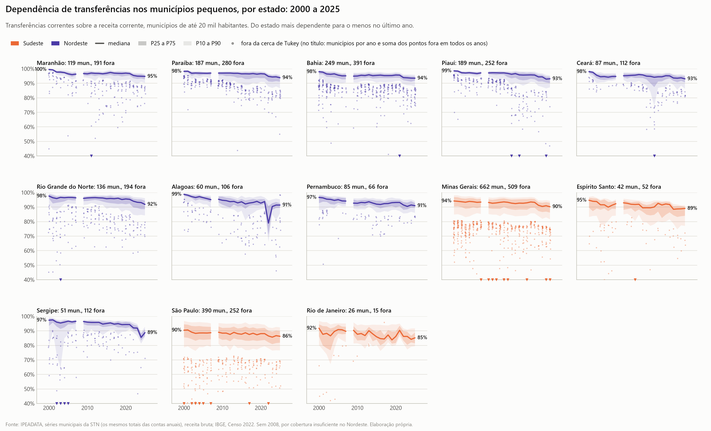

O ano de 2024 não é exceção. No painel de 2022 a 2025, com a mesma receita líquida da seção 3 e só para São Paulo e Maranhão, a dependência do município de até 10 mil habitantes ficou entre 87,1% e 88,3% em São Paulo e entre 95,2% e 95,7% no Maranhão.

### 9.3 O FPM perdeu peso no Nordeste e o ICMS, no interior paulista

O peso do FPM caiu muito mais no Nordeste que no Sudeste. No Maranhão caiu quase à metade, com o FUNDEB e o ICMS ocupando o lugar. É troca de uma transferência por outra, sem ganho de base própria.

Na {fig:43_longo_pct_fpm_rc_SE_NE}, o Sudeste está na coluna da esquerda e o Nordeste na da direita, em três tamanhos de município. Compare os rótulos de 2000 e de 2025: nos municípios de até 10 mil habitantes, o Nordeste começa acima do Sudeste, com 58% contra 50%, e termina abaixo, com 40% contra 44%. O recorte da figura não é o de até 20 mil habitantes dos testes, que partem de 2002.

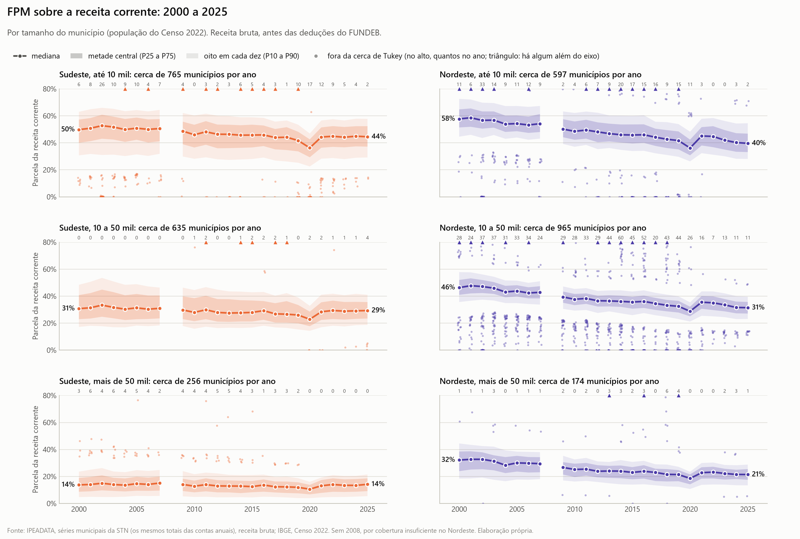

Em São Paulo o FPM desceu até 2019 e voltou; hoje pesa quase o mesmo que em 2002. Parte da volta é regra. A Emenda Constitucional 112/2021 acrescentou ao fundo 0,25% da arrecadação do imposto de renda e do IPI em 2022 e 2023, 0,5% em 2024 e 1% a partir de 2025, segundo a pesquisa do estudo, sem conferência no texto da emenda. O fundo passou de 24,75% dessa arrecadação em 2022 para 25,5% em 2025, cerca de 3% a mais só pela regra. No painel de 2022 a 2025, o peso do FPM no município de até 10 mil habitantes subiu de 33,6% para 36,0% no paulista e caiu de 30,3% para 27,3% no maranhense. O Sudeste pequeno só passou à frente do Nordeste em 2023 e 2024, e por causa de Minas Gerais. O município pequeno paulista está no nível do nordestino.

A cota-parte do ICMS perdeu um quinto do peso no município pequeno paulista e dobrou no maranhense. É a fonte que mais distingue o interior paulista do nordestino, e a distância está encolhendo. A regra de rateio mudou dentro do período nos dois estados; no Maranhão, por lei estadual de 2022 com repasse pela regra nova desde 2024, segundo a revisão cruzada, em informação que o autor não conferiu na lei.

O peso da Câmara e da administração na receita corrente caiu em todo lugar, de 5 a 7 pontos, sem diferença entre Sudeste e Nordeste. No Maranhão a série oscila muito, com mínimo de 14% em 2012.

### 9.4 A média de três anos confirma o retrato de 2024

As comparações entre São Paulo e Maranhão foram refeitas com a média de 2023 a 2025, em reais de 2025, no painel de 830 municípios com contas utilizáveis nos três anos, 617 paulistas e 213 maranhenses. Os resultados já apareceram em cada seção e batem com os de 2024. As conclusões entre os dois estados não dependem do ano. O triênio serve como faixa, não como número novo, porque 2023 e 2025 não passaram pela mesma conferência de 2024. Para as regiões não há triênio: a base de 2023 só tem São Paulo e Maranhão, e a de 2025 ainda não tem Minas Gerais, Espírito Santo e Rio de Janeiro. O investimento mediano por habitante em São Paulo, em reais de 2025, foi de R$ 640 em 2023, R$ 565 em 2024 e R$ 376 em 2025, de modo que 2024 não aparece como pico.

> **O que o dado diz à tese.** A distância entre o interior paulista e o maranhense é antiga e estável: cerca de 8 pontos em 2002 e em 2025. O que mudou aproxima os dois em um ponto só, o ICMS, que pesa menos em São Paulo e mais no Maranhão do que há 23 anos.

## 10. O oeste paulista concentra os municípios pequenos, mas a tamanho igual não depende mais que o resto do estado

São Paulo tem 11 regiões intermediárias na divisão do IBGE. Ordenadas pela mediana da parcela da receita que vem de transferências em 2024, as quatro primeiras são as do oeste: Presidente Prudente, com 87,3% em 55 municípios; Marília, com 87,1% em 54; Araçatuba, com 85,6% em 41; e São José do Rio Preto, com 85,4% em 87. São também as de município menor. O município mediano tem 7.085 habitantes na região de Presidente Prudente, 6.383 na de Marília, 5.519 na de Araçatuba e 6.867 na de São José do Rio Preto. O FPM é a maior fatia da receita em 76,4%, 64,8%, 68,3% e 67,8% dos municípios dessas regiões.

No meio da lista ficam Sorocaba, com 83,1%, Bauru, com 82,9%, Ribeirão Preto, com 80,0%, Araraquara, com 77,3%, e São José dos Campos, com 76,5%. No fim, Campinas, com 72,3% e município mediano de 31.328 habitantes, e São Paulo, com 65,6% e município mediano de 149.477. Na região de Campinas o FPM é a maior fatia em 35,6% dos municípios, e na de São Paulo, em 14,0%. Nenhuma região do Maranhão fica abaixo de 92%.

A {fig:49_longo_dep_corrente_SP_regioes_1} mostra as quatro regiões do oeste na série longa, com a medida bruta da seção 9, um quadro por região. Os quatro quadros se parecem: mediana perto de 90% em 2000 e entre 85% e 88% em 2025.

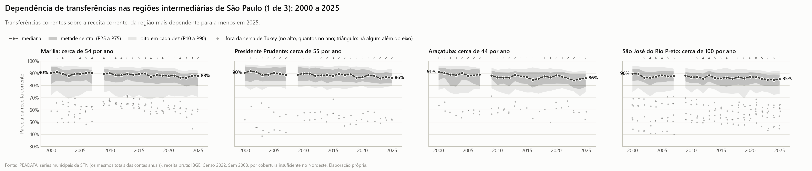

A tamanho igual, o oeste não se separa do resto do estado. Olhando só os municípios de 5 a 10 mil habitantes, nove das dez regiões que têm município nessa faixa ficam entre 83% e 88%: de 83,5% em Araraquara, com 5 municípios, a 87,8% em Presidente Prudente, com 10. São José dos Campos, fora do oeste, tem 87,4% em 8 municípios. Só Campinas fica abaixo, com 76,9% em 11 municípios.

O teste confirma a leitura. Comparando municípios do mesmo tamanho, as quatro regiões do oeste dependem 0,9 ponto percentual a mais que o resto do estado, com intervalo de 95% de -0,2 a +2,0, que inclui o zero. O interior profundo paulista tem endereço porque é no oeste que estão os municípios pequenos. Um município do oeste não depende mais que outro do mesmo tamanho no Vale do Paraíba ou na região de Sorocaba.

> **O que o dado diz à tese.** O autor acertou o lugar e errou a causa. A dependência alta do oeste paulista vem do tamanho dos municípios, não da região, e mesmo a região paulista mais dependente fica mais de quatro pontos abaixo da região maranhense menos dependente.

<!-- parte: 20-regra.md -->

# Parte II. A regra, a escala e a representação

A Parte I mediu quanto da receita de cada município vem de fora. Esta parte trata das regras que produzem esse resultado: a que deixou criar município, a que reparte o Fundo de Participação dos Municípios (FPM), a que reparte as cadeiras do Congresso e a que reparte as emendas ao orçamento. O texto separa o que foi medido neste estudo, o que foi lido em outro autor e o que ficou sem conferir. A teoria de escala das cidades entra como teste do que o tamanho explicaria sem a regra.

## 11. São Paulo já tinha município minúsculo antes de 1988 e criou mais 51 depois

São Paulo tem 150 municípios de até 5 mil habitantes, 23,3% dos seus 645. O Maranhão tem 5, 2,3% dos seus 217 (IBGE, 2023). O Maranhão não criou poucos municípios. A diferença está no tamanho dos que cada estado criou e no que já existia antes.

### 11.1 O que a contagem de Tomio mostra

Tomio (2002, p. 64) contou os municípios criados de 1988 a 2000. No país foram 1.438, aumento de 35%; 765 (53%) nasceram com menos de 5 mil habitantes. São Paulo passou de 572 para 645 municípios: 73 novos, aumento de 13%, dos quais 51 (70%) com menos de 5 mil habitantes. O Maranhão passou de 132 para 217: 85 novos, aumento de 64%, dos quais 12 (14%) com menos de 5 mil e 35 (41%) com mais de 10 mil.

O Maranhão emancipou mais que São Paulo, em número e em proporção, e emancipou município médio. São Paulo emancipou pouco e quase só município minúsculo.

A explicação de Tomio para a quantidade é institucional: a lei complementar de cada estado, a posição do governador e o tamanho da coalizão na Assembleia. Em São Paulo, a primeira lei estadual, de 1990, foi "extremamente permissiva"; depois o governo se opôs e não teve maioria para endurecer a regra (TOMIO, 2002, p. 82-83). O FPM entra como incentivo: "garante a sobrevivência da maior parte das unidades emancipadas", e a perda de quem cede se dilui entre os municípios do mesmo estado (p. 70). O artigo é de ciência política. Explica a quantidade de emancipações e não mede o efeito fiscal.

### 11.2 O que Brandt mede: quem pagou a conta dentro de cada estado

Brandt (2010), consultora legislativa do Senado, estimou quanto do FPM de cada estado foi para os municípios pequenos criados depois de 1988. Há uma primeira versão, de 2008. O texto defende a exigência de estudo de viabilidade para novas emancipações, e a conta deve ser lida com isso em vista.

Em São Paulo, 62 municípios pequenos novos ficam com 4,4% do FPM do interior do estado. No Maranhão, 37 ficam com 8,7%; no Piauí, 104 com 36,5%; no Tocantins, 95 com 53,2% (BRANDT, 2010, p. 67). O município que cede população quase nunca muda de faixa. Quem paga são os outros municípios do estado.

Os dois estados exigiam o mesmo mínimo, 1.000 eleitores (BRANDT, 2010, p. 63-64). O piso legal não explica por que o Maranhão criou municípios maiores. A tabela de Brandt conta 81 municípios novos no Maranhão, e a de Tomio, 85; as fontes diferem.

### 11.3 O que vem de antes de 1988

Se 51 dos municípios paulistas minúsculos nasceram depois de 1988 e hoje há 150 de até 5 mil habitantes, cerca de dois terços são anteriores. A conta é grosseira, porque compara população de datas diferentes. Borá, o menor do estado, é de 1965. Os 4,4% de Brandt apontam na mesma direção.

A única obra da lista sobre o interior paulista é a dissertação de Siqueira (2003), da Unicamp. A hipótese: até 1985, a criação de municípios acompanhou a ocupação do território, onde havia mais gente e mais economia; nos anos 1990, concentrou-se nas áreas de menores índices demográficos e econômicos. Nos casos estudados, 67 municípios em que predominavam os médios viraram 140 em que predominam os minúsculos (SIQUEIRA, 2003, p. 148-149). A hipótese se confirmou em 60% dos casos. A conclusão da autora: "uma única hipótese sobre o processo emancipatório não comporta satisfatoriamente a heterogeneidade do interior paulista" (p. 202).

A dissertação traz um ponto de 1990, de segunda mão: nos municípios paulistas de até 10 mil habitantes, o FPM era 39% da receita e a cota do ICMS, 29% (p. 149). A tese de doutorado da autora, sobre Campinas, serve por um ponto: desmembramento também acontece em região metropolitana rica (SIQUEIRA, 2008).

> **Ressalva.** Este estudo não datou a criação de cada município. Os dois terços anteriores a 1988 são estimativa. O motivo de o Maranhão ter criado municípios maiores também não está medido: as fontes mostram o fato e o mesmo piso legal nos dois estados.

### 11.4 O que a literatura fiscal tira disso

Gomes e Mac Dowell (2000), do IPEA, são a origem de boa parte do que se repete desde então. Com dados de 1996, mostram a receita própria dos municípios de até 5 mil habitantes em 10,1% da receita corrente no Sudeste e 2,9% no Nordeste (p. 12), e o Legislativo custando R$ 20,6 por habitante até 5 mil habitantes contra R$ 10,5 de 20 a 50 mil, em valores da época (p. 21). Usam o dado contra o município pequeno. O mesmo texto sustenta que os municípios pequenos não são sempre os de população mais pobre.

Mendes, Miranda e Cosio (2008), da Consultoria Legislativa do Senado, localizam a causa: o FPM por habitante cai de forma abrupta com a população por causa da cota mínima dos municípios de até 10.188 habitantes (p. 35-36). A correlação entre FPM por habitante e IDH é quase nula, com R² de 0,03 (p. 36-37). O texto não mede a demanda por serviço que usa como critério, e o custo fixo de existir como município não entra na conta.

## 12. A população não substitui as outras medidas: a economia urbana explica a base própria e a regra explica o repasse

O autor perguntou se a população é uma variável substituta da dependência, do custo da máquina e da saúde fiscal. São coisas separadas, ligadas por dois mecanismos. A teoria de escala das cidades descreve um. A tabela do FPM e o custo fixo da prefeitura descrevem o outro.

### 12.1 O que a teoria prevê

Em sistemas de cidades, uma grandeza total Y costuma seguir Y = Y0 · N^β, em que N é a população. Com β acima de 1, a grandeza cresce mais que a população; abaixo de 1, menos. Bettencourt et al. (2007) mediram três famílias. Riqueza e inovação crescem mais: patentes novas com expoente 1,27 (Estados Unidos, 2001), PIB 1,15 (China, 2002). Necessidades individuais acompanham a população: moradias 1,00. Infraestrutura cresce menos: área de vias 0,83 (Alemanha). Geoffrey West popularizou a ideia em livro como "regra dos 15%"; o livro não foi consultado aqui.

Dois críticos foram lidos pelo resumo. Um grupo liderado por Elsa Arcaute variou o recorte de "cidade" na Inglaterra e no País de Gales e achou expoentes que mudam muito com o recorte; só a versão preliminar do artigo foi consultada, e a referência da publicação não foi conferida. Leitão et al. (2016) concluem que a evidência de não linearidade depende do modelo estatístico. No Brasil, Meirelles et al. (2018) acharam arrecadação de tributos crescendo mais que a população e serviços de investimento centralizado fora do previsto, o que atribuem a "decisões políticas de cima para baixo".

A teoria trata de grandezas produzidas pela interação entre pessoas. Transferência definida em lei não é produto de interação, e não há motivo para esperar que siga a curva.

### 12.2 O que os expoentes deste estudo mostram

A tabela a seguir traz o expoente de cada grandeza total contra a população, nos 3.356 municípios com contas utilizáveis (BRASIL, [2026]c; IBGE, 2023). As duas últimas colunas vêm de um ajuste por trechos de população.

Tabela. Expoente de cada grandeza contra a população, municípios do Nordeste e do Sudeste, 2024

| Grandeza total | Conjunto, com intervalo de 95% | São Paulo | Maranhão | Até 5 mil hab. | Acima de 50 mil hab. |
|---|---:|---:|---:|---:|---:|
| PIB | 1,14 (1,12 a 1,16) | 1,11 | 1,05 | 0,70 | 1,19 |
| Tributos próprios | 1,22 (1,20 a 1,24) | 1,20 | 1,20 | 0,54 | 1,35 |
| ISS | 1,27 (1,25 a 1,30) | 1,25 | 1,22 | 0,70 | 1,43 |
| IPTU | 1,68 (1,63 a 1,73) | 1,44 | 2,09 | 0,22 | 1,76 |
| FPM | 0,52 (0,51 a 0,53) | 0,48 | 0,66 | ver texto | ver texto |
| Transferências, total | 0,77 (0,76 a 0,78) | 0,75 | 0,80 | 0,30 | 0,84 |
| Receita total | 0,84 (0,83 a 0,85) | 0,86 | 0,84 | 0,32 | 0,98 |
| Câmara e administração | 0,75 (0,74 a 0,77) | 0,78 | 0,70 | 0,14 | 0,98 |

> **Como ler.** Expoente 1,00: a grandeza cresce na proporção da população. Acima de 1, o município maior tem mais por habitante; abaixo de 1, menos. O intervalo é estreito pelo tamanho da amostra e não garante que a forma da curva esteja certa.

Na coluna do conjunto aparece o quadro da teoria: PIB com 1,14, quase o 1,15 da China, base própria acima de 1, transferências e máquina abaixo. As emendas federais de 2025 têm expoente 0,57 (0,54 a 0,59), com ajuste fraco (R² de 0,39). As duas últimas colunas mostram que a relação não é uma reta.

### 12.3 Onde a previsão vale

A previsão vale nos municípios grandes. Só com os de até 50 mil habitantes, o PIB tem expoente 1,01 (0,98 a 1,04) e os tributos próprios, 1,04. Acima de 50 mil, 1,17 e 1,32. A mediana do ISS por habitante nos cinco trechos de população é R$ 117, R$ 108, R$ 113, R$ 142 e R$ 349: igual até 20 mil habitantes, com o salto depois de 50 mil. No município de até 20 mil habitantes, onde a pergunta do autor se passa, o ganho de aglomeração não aparece.

O FPM tem expoente 0,52 e R² de 0,91 contra a população. Parece lei de escala e é a tabela de coeficientes lida em logaritmo. Ajustado pelo coeficiente legal e pelo estado, o R² vai a 0,989, e o expoente da população passa a 0,04 (0,03 a 0,05). Dentro da menor faixa, até 10.188 habitantes (1.354 municípios), um município de 2 mil habitantes e um de 10 mil recebem o mesmo FPM total. No degrau de 10.188, o FPM salta 28%, e nenhuma outra grandeza salta ali de forma distinguível de zero.

A máquina segue custo fixo. O expoente de Câmara e administração vai de 0,14 até 5 mil habitantes a 0,98 acima de 50 mil: um piso mais uma parte proporcional. A economia de escala da teoria (0,83) valeria em todos os tamanhos; aqui ela se esgota. A mediana por habitante nos cinco trechos (até 5 mil, de 5 mil a 10.188, de 10.188 a 20 mil, de 20 a 50 mil e acima de 50 mil habitantes) é R$ 1.606, R$ 950, R$ 748, R$ 624 e R$ 592. A Parte I chega ao mesmo ponto: elasticidade de -0,91 até 5 mil habitantes e de -0,07, indistinguível de zero, de 20 a 100 mil.

A receita total quase não cresce no município minúsculo. Até 5 mil habitantes, dobrar a população aumenta a receita em 25% (expoente 0,32).

### 12.4 O FPM proporcional: quanto da queda é regra

Uma conta separa a economia da regra. O FPM de cada município foi trocado por um FPM proporcional à população, mantido o total de cada estado, e a dependência foi recalculada. O exercício é mecânico: nada mais reage. Serve para ordem de grandeza.

Tabela. Dependência de transferências com o FPM real e com um FPM proporcional à população, 2024

| Recorte | Inclinação por unidade de log da população | Mediana até 5 mil hab. | Mediana de 20 a 50 mil hab. |
|---|---:|---:|---:|
| Conjunto, real | -5,43 | 93,2% | 88,0% |
| Conjunto, FPM proporcional | -4,29 | 89,4% | 87,4% |
| São Paulo, real | -7,43 | 90,2% | 76,7% |
| São Paulo, FPM proporcional | -6,05 | 84,1% | 73,4% |
| Maranhão, real | -3,03 | 96,5% | 93,8% |
| Maranhão, FPM proporcional | -2,46 | 95,7% | 93,9% |

A inclinação está em pontos percentuais. Em parcela da receita, a escada do FPM responde por cerca de um quinto da queda com o tamanho: 21% no conjunto e 19% em São Paulo. O resto vem do tributo próprio e das outras transferências. A queda é mais forte em São Paulo (-7,43) que no Maranhão (-3,03): o município maranhense cresce sem ganhar base própria. A mediana maranhense até 5 mil habitantes é de cinco municípios.

Em reais por habitante, é quase tudo regra. Com o FPM proporcional, a mediana das transferências por habitante do município de até 5 mil cairia de R$ 8.844 para R$ 5.698 no conjunto. Da distância para a faixa de 20 a 50 mil, a escada do FPM responde por 68% no conjunto e 64% em São Paulo.

### 12.5 População, PIB e máquina não medem a mesma coisa

Para a dependência em parcela da receita, a população sozinha explica 41% da variação e o PIB por habitante, 37%. As duas são quase independentes entre si (correlação de postos de 0,17) e juntas explicam 63%. O custo da máquina por habitante não explica: R² de 0,01.

Para as transferências em reais por habitante, população e máquina explicam o mesmo tanto (0,53 e 0,52), por motivos diferentes. Com a população e as transferências por habitante na mesma regressão, o coeficiente da população sobre a máquina vai a 0,02 e o das transferências fica em 1,15. O município pequeno gasta mais com Câmara e administração por habitante porque recebe mais, e recebe mais pelo piso do FPM. A regressão não distingue "gasta porque tem" de "precisa, e por isso a regra dá".

O tamanho não fecha a conta entre São Paulo e Maranhão. A Parte I mede 13,5 pontos a tamanho igual nos municípios de até 50 mil habitantes; aqui a conta usa os 843 municípios dos dois estados, de todos os tamanhos. A distância bruta de dependência é de 14,8 pontos (13,7 a 16,0). Com a população como controle, 15,5. Com população e PIB por habitante, sobram 11,9 (10,6 a 13,1). O que sobra é a composição da receita: FUNDEB no Maranhão, ICMS e tributo próprio em São Paulo.

> **O que o dado diz à tese.** A tamanho e PIB por habitante iguais, o município maranhense continua 11,9 pontos mais dependente que o paulista. A tese acerta em outro ponto: no município minúsculo, o repasse por habitante é produto da regra do FPM, a mesma nos dois estados.

### 12.6 Limites

- Município não é cidade. A teoria usa a área urbana funcional; aqui a unidade é a da regra fiscal. São Paulo e Guarulhos entram como dois pontos. Os expoentes descrevem prefeituras e não confirmam nem refutam a teoria.
- Expoente de corte transversal não é lei. Tudo é o ano de 2024. Nada diz que um município pequeno que cresça seguirá a curva.
- O expoente depende do corte: o PIB dá 1,14 no conjunto, 1,01 até 50 mil habitantes e 1,17 acima.
- Bom ajuste não é mecanismo. O FPM tem R² de 0,91 sem economia urbana por trás, e o ISS acima de 1 pode ser regra de incidência e capacidade de cobrar.
- São Paulo e Maranhão quase não se sobrepõem em PIB por habitante (mediana maranhense de R$ 12,6 mil; percentil 5 paulista de R$ 21,5 mil). O resíduo de 11,9 pontos é descrição, sem leitura causal.

## 13. No Congresso, a cadeira a mais é do Norte pequeno e do Senado, e a emenda por habitante acompanha a cadeira por habitante

O autor perguntou se o quadro fiscal tem a ver com o número de representantes, já que se costuma dizer que os estados do Nordeste pesam mais que sua população. O fenômeno existe e tem nome. O endereço que a queixa lhe dá está errado em boa parte.

### 13.1 O nome e a medida

O nome técnico é desproporcionalidade da representação territorial, em inglês *malapportionment*: a diferença entre a fatia de cadeiras e a fatia de população de cada distrito (SAMUELS; SNYDER, 2001). Em português usam-se também sobrerrepresentação e sub-representação dos estados e "distorção da representação" (NICOLAU, 1997). A desproporcionalidade partidária, entre votos e cadeiras por partido, é outra coisa.

A medida usual é o índice de Loosemore-Hanby aplicado a cadeiras e população, o MAL de Samuels e Snyder: metade da soma das diferenças absolutas entre a porcentagem de cadeiras e a de população de cada estado. Lê-se como a porcentagem de cadeiras em estado "errado". A segunda medida é a razão entre as duas fatias: acima de 1, sobrerrepresentado.

A regra: o artigo 45 da Constituição manda repartir os deputados em proporção à população, com piso de 8 e teto de 70 por estado; o artigo 46 dá três senadores a cada estado; a Lei Complementar 78 fixa 513 deputados (BRASIL, 1993). A divisão em vigor é a da eleição de 1994.

### 13.2 Os valores

Com o Censo 2022 (IBGE, 2023), a conta deste estudo dá MAL de 10,4% na Câmara e 37,4% no Senado: uma em cada dez cadeiras da Câmara em estado "errado" e mais de uma em cada três no Senado. Nas duas casas somadas, 11,8%. Redistribuir a Câmara pelo Censo, mantidos piso e teto, baixaria o índice para 8,4%. O resto é o piso e o teto, que estão na Constituição.

Tabela. Representação das regiões no Congresso contra a população do Censo 2022

| Região | % da população | Deputados | Razão na Câmara | Razão no Senado | Cadeiras a mais ou a menos na Câmara |
|---|---:|---:|---:|---:|---:|
| Norte | 8,55 | 65 | 1,48 | 3,03 | +21,2 |
| Nordeste | 26,91 | 151 | 1,09 | 1,24 | +12,9 |
| Centro-Oeste | 8,02 | 41 | 1,00 | 1,85 | -0,2 |
| Sul | 14,74 | 77 | 1,02 | 0,75 | +1,4 |
| Sudeste | 41,78 | 179 | 0,84 | 0,35 | -35,3 |

A última coluna compara com a divisão proporcional pura das 513 cadeiras.

> **Ressalva.** As cadeiras por estado não foram conferidas em tabela oficial do TSE; a soma dá 513 e São Paulo, Maranhão e os estados no piso batem com fontes abertas. Os índices são conta própria. Os valores de Samuels e Snyder para os anos 1990, perto de 0,09 na Câmara e 0,40 no Senado, vêm de resultado de busca.

### 13.3 O caso de São Paulo

São Paulo tem 44,4 milhões de habitantes e 70 deputados: um para cada 634.446 habitantes, contra a média nacional de 395.869. A razão é 0,62 na Câmara e 0,17 no Senado. Pela proporção pura teria 112,2 cadeiras; faltam 42,2. No Sudeste, só São Paulo perde: o Rio de Janeiro tem 5,4 cadeiras a mais. O Maranhão, com 18 deputados e razão de 1,05, está perto da proporção.

Do outro lado estão Roraima, Amapá, Acre, Tocantins e Rondônia: 2,6% da população, 7,8% da Câmara e 18,5% do Senado. Roraima tem um deputado para cada 79.588 habitantes. Um voto ali pesa 8 votos paulistas na Câmara e 70 no Senado.

### 13.4 Quem estudou e o que disse

Samuels e Snyder (2001) criaram o índice para 78 países. Stepan (1999a, 1999b) classifica as federações pelo quanto restringem a maioria e trata o Brasil como caso extremo. Nicolau (1997) mede a distorção da Câmara de 1945 a 1994 e põe o prejuízo em São Paulo e o ganho nos estados pequenos do Norte. Soares e Lourenço (2004) simulam as bancadas sem piso nem teto e acham pouca mudança entre partidos. Sobre dinheiro: Gibson e Calvo (2000) descrevem na Argentina as províncias sobrerrepresentadas como apoio barato para o governo federal; Arretche e Rodden (2004) acham que, no Brasil, a transferência negociada segue a coalizão do presidente e a sobrerrepresentação, e a constitucional não; Hiroi (2019) diz que a sobrerrepresentação traz dinheiro e não traz desenvolvimento.

Dessas obras, a referência foi conferida em base bibliográfica e o texto não foi lido; o resumo é o que se atribui a cada autor. Ficaram de fora, por estarem só de memória, o artigo de origem do índice, de Loosemore e Hanby, e um texto de Wanderley Guilherme dos Santos que defende a desproporção como proteção de minorias territoriais. É a posição contrária à intuição paulista e precisa ser lida antes de entrar no argumento.

### 13.5 A ADO 38 e o que veio depois

Em 25/08/2023, o STF julgou a Ação Direta de Inconstitucionalidade por Omissão 38, movida pelo governo do Pará, e decidiu por unanimidade que o Congresso estava em mora por não redistribuir as cadeiras. Deu prazo até 30/06/2025; sem lei, o TSE faria a conta.

O Congresso respondeu com o Projeto de Lei Complementar 177/2023: 531 deputados, ninguém perde cadeira, 18 novas para os estados que cresceram. O Senado aprovou em 25/06/2025, por 41 a 33. O presidente vetou o projeto inteiro em 16/07/2025, por aumento de despesa sem estimativa completa de impacto. Em 29/09/2025, uma liminar do relator suspendeu os efeitos da decisão de 2023, com base na anualidade eleitoral, e deixou a correção para 2030. Segundo o Congresso em Foco, o plenário referendou a liminar em 01/10/2025 (STF..., 2025); a página do STF não foi conferida. Não foi localizado registro de votação do veto até 05/10/2026.

Na eleição de 04/10/2026 valeu a divisão de 1994: São Paulo 70, Maranhão 18.

Uma redistribuição das 513 cadeiras pelo Censo 2022, feita neste estudo com o piso e o teto atuais, tiraria 7 cadeiras do Nordeste e 4 do Rio de Janeiro e daria 4 ao Pará e 4 a Santa Catarina. Não é o cálculo oficial do TSE. O projeto de 531 cadeiras protegia as bancadas dos estados que encolheram.

### 13.6 A emenda por habitante segue a cadeira por habitante

A ponte com o dinheiro passa pela emenda parlamentar, cuja cota é por parlamentar e por bancada. Pela regra de 2025, cada estado recebe a cota de deputado vezes o número de deputados, mais três cotas de senador, mais uma parte igual da emenda de bancada. Senadores e bancada somam R$ 633,3 milhões por estado, seja qual for a população. A emenda de comissão fica fora, porque não tem estado.

A regra dá R$ 73 por habitante em São Paulo, R$ 193 no Maranhão e R$ 1.463 em Roraima; a média do país é R$ 178. A tabela a seguir compara a regra com o que os municípios pequenos receberam.

Tabela. Emenda pela regra de 2025 e emenda paga aos municípios de até 20 mil habitantes, nove dos 13 estados

| Estado | Razão no Congresso | Regra, R$ por hab. | Mediana municipal paga em 2025, R$ por hab. | Emenda sobre a receita de 2024 |
|---|---:|---:|---:|---:|
| Sergipe | 1,70 | 422 | 670 | 9,3% |
| Piauí | 1,36 | 308 | 622 | 9,0% |
| Paraíba | 1,29 | 272 | 586 | 8,4% |
| Rio de Janeiro | 1,04 | 146 | 518 | 5,8% |
| Espírito Santo | 1,16 | 262 | 378 | 5,6% |
| Maranhão | 1,06 | 193 | 357 | 5,5% |
| Minas Gerais | 0,93 | 127 | 274 | 4,0% |
| Bahia | 1,02 | 148 | 234 | 3,8% |
| São Paulo | 0,56 | 73 | 149 | 2,0% |

Entre os 13 estados, a correlação entre a emenda pela regra e a mediana municipal é de 0,81 (Pearson) e 0,73 (Spearman); com a razão de representação no Congresso, 0,87. Sem São Paulo, a de Spearman cai para 0,66. A mediana municipal fica perto do dobro da regra, porque dentro de cada estado o município pequeno recebe mais por habitante que o grande.

O teto de 70 explica a menor parte da distância. Com 112 deputados, São Paulo iria de R$ 73 para R$ 109 por habitante, ainda abaixo do Maranhão. O que pesa é a parte igual por estado. Estado pequeno ganha em qualquer região: o Espírito Santo (R$ 262) recebe mais por habitante que a Bahia (R$ 148).

### 13.7 Três leituras erradas

**A sobrerrepresentação é do Nordeste.** O Norte tem 21,2 cadeiras a mais com 8,6% da população; o Nordeste, 12,9 com 26,9%. Dessas 12,9, só 2,1 vêm do piso de 8. As outras 10,9 vêm de a divisão ser de 1993: Bahia, Pernambuco, Paraíba, Piauí e Alagoas perderam fatia da população e mantiveram as cadeiras, como o Rio de Janeiro e o Rio Grande do Sul. Dentro do Norte, Pará (0,83) e Amazonas (0,80) são sub-representados. A desproporção grande está no Senado, e lá o mais favorecido também é o Norte: 25,9% das cadeiras com 8,6% da população. Se o Nordeste voltasse à proporção exata, São Paulo recuperaria menos de um terço do que perde.

**Estado com muitos municípios tem mais cadeira.** O que rende cadeira é ser estado. Minas tem 853 municípios e razão de 1,02 na Câmara; São Paulo, 645 e 0,62; Roraima, 15 e 4,97. Em municípios minúsculos, o Sudeste é mais fragmentado que o Nordeste: 23,8% dos seus municípios têm até 5 mil habitantes, contra 13,8%. O município pequeno ganha no FPM, não na bancada.

**A correlação entre estados explica o que cada prefeitura recebe.** A correlação de 0,81 é de 13 pontos, com São Paulo no extremo. A regra dá o total por estado; a divisão entre municípios é decisão de cada parlamentar, e este estudo não a mede. A representação também não decide o grosso da receita: FPM, FUNDEB e cota do ICMS têm regra própria. Em sentido contrário, a regra do FPM foi votada por um Congresso desproporcional, e a representação pode tê-la moldado.

> **O que o dado diz à tese.** Fato medido: São Paulo é o estado mais sub-representado, e seus municípios pequenos recebem a menor emenda federal por habitante entre os 13 estados. Interpretação: que uma coisa cause a outra município a município. A base não cobre o Norte, onde a regra daria o maior efeito.

## 14. De 1988 às emendas Pix, mudou a obrigação de pagar e o tamanho da cota; o critério de repartição ficou o mesmo

A emenda parlamentar ao orçamento existe desde 1988. De 2013 a 2022, quatro mudanças tornaram o pagamento obrigatório e aumentaram a cota. A cota continua repartida por parlamentar e por bancada, e quem escolhe o município é o parlamentar.

### 14.1 A linha do tempo

Tabela. Marcos das emendas parlamentares ao orçamento federal, 1988 a 2025

| Ano | Marco | O que mudou | Conferência |
|---|---|---|---|
| 1988 | Constituição, art. 166 | O Congresso volta a emendar o orçamento. O Executivo paga se quiser | Não reaberta |
| 2015 | Emenda Constitucional 86 | Emenda individual obrigatória: 1,2% da receita corrente líquida, metade para saúde | Texto lido |
| 2019 | Emenda Constitucional 100 | Emenda de bancada estadual obrigatória: até 1% da receita corrente líquida | Texto lido |
| 2019 | Emenda Constitucional 105 | Transferência especial: repasse direto a estado e município, sem convênio | Texto lido |
| 2020 | Marcador RP9 | O relator-geral distribui verba por indicação informal, sem registro de quem pediu | Lei não conferida; execução medida |
| 2022 | STF, ADPFs 850, 851, 854 e 1014 | Por 6 a 5, o RP9 para criar despesa é declarado inconstitucional | Busca; página não aberta |
| 2022 | Emenda Constitucional 126 | Dois dias depois, a cota individual sobe de 1,2% para 2% | Texto lido |
| 2024 | Lei Complementar 210 | Regras de objeto, plano de trabalho e limite de crescimento | Texto lido |
| 2025 | Plano homologado no STF | Só se empenha emenda com o nome de quem indicou e de quem recebe | Notícia oficial lida |

Três marcos ficam fora por estarem só de memória na pesquisa: a CPI mista do Orçamento de 1993 e 1994, a Resolução 1/2006 do Congresso, que restringiu a emenda de relator a correção de erro e omissão, e a lei de diretrizes de 2014, primeira regra de execução obrigatória.

### 14.2 O que é igual e o que é diferente entre os tipos

Tabela. Tipos de emenda ao orçamento federal

| Tipo e marcador | Quem indica | Pagamento obrigatório | Autor identificado | Finalidade definida |
|---|---|---|---|---|
| Individual com finalidade definida (RP6) | Cada deputado e senador | Sim, desde 2015 | Sim | Sim |
| Individual por transferência especial (RP6) | O mesmo parlamentar | Sim | Sim | Não; plano de trabalho desde 2024 |
| Bancada estadual (RP7) | A bancada do estado | Sim, desde 2019 | A bancada | Sim |
| Comissão (RP8) | Comissão permanente | Não | Só desde 2025 | Sim; genérica até a LC 210 |
| Relator-geral (RP9) | O relator, por pedidos informais | Não | Não | Só no papel |

Em todos os tipos, quem decide o município e o valor é um parlamentar ou um grupo de parlamentares, sem fórmula de população, renda ou necessidade. Todos saem da despesa discricionária da União. E um tipo ocupa o lugar do outro: fechado o RP9 em 2022, cresceram a individual e a de comissão em 2023.

Três coisas os separam. Quem assina: na individual o autor sempre foi público; no RP9 e, até 2024, na de comissão, não era. Para quê: só a transferência especial dispensa finalidade; sabia-se quem mandou e para qual prefeitura, e não o que a prefeitura fez. E se o governo pode segurar: individual e bancada são obrigatórias; comissão e relator dependem de liberação, e é ali que cabe negociação de voto.

Juntar tudo em "verba de deputado" está certo para a pergunta deste estudo, que é quem reparte e por qual critério. É impreciso para a pergunta jurídica: o STF derrubou o RP9 por falta de autoria e manteve a emenda obrigatória.

### 14.3 Os apelidos e quem usa cada um

"Orçamento secreto" é apelido da emenda de relator-geral, o RP9. Segundo a pesquisa, foi cunhado pelo jornal O Estado de S. Paulo em reportagem de Breno Pires de 08/05/2021; a reportagem não foi aberta. O que era secreto era o autor da indicação, não o gasto. Em 2021 e 2022 o termo foi usado pela oposição ao governo da época; os partidos que foram ao STF são Cidadania, PSB, PSOL e PV. O tribunal adotou o termo no título do julgamento.

"Emenda Pix" é apelido de imprensa da transferência especial, por analogia com o sistema de pagamento do Banco Central: o dinheiro cai direto na conta. A pesquisa não localizou quem usou primeiro. A Abraji usa o apelido na ação que moveu no STF.

"Novo orçamento secreto" é atribuído pela pesquisa, sem conferência, à imprensa e à oposição ao governo atual, desde 2023, para a emenda de comissão.

Os apelidos nasceram em jornal. O uso segue a posição política: a oposição tende ao apelido, o governo e o comando do Congresso tendem ao nome técnico, e os papéis se inverteram de 2022 para 2023. Este relatório usa o nome oficial e põe o apelido entre aspas.

### 14.4 Os valores desde 2018

A série é do Portal da Transparência (BRASIL, 2026a). As colunas por tipo estão em valores correntes; a última, a preços médios de 2025 pelo IPCA. Começa em 2018 porque o Portal está incompleto em 2014 e 2015 e traz em 2016 e 2017 um "relator" que não é o RP9.

Tabela. Emendas ao orçamento federal, valor empenhado por tipo, em R$ bilhões

| Ano | Individual | Bancada | Comissão | Relator | Total a preços de 2025 |
|---|---:|---:|---:|---:|---:|
| 2018 | 8,5 | 3,4 | 0,2 | 0,0 | 17,5 |
| 2019 | 8,5 | 4,7 | 0,2 | 0,4 | 19,4 |
| 2020 | 9,2 | 6,5 | 0,6 | 21,2 | 50,9 |
| 2021 | 9,4 | 7,2 | 0,0 | 16,7 | 41,8 |
| 2022 | 10,7 | 5,8 | 0,3 | 8,6 | 29,2 |
| 2023 | 20,9 | 7,6 | 6,9 | 0,0 | 38,8 |
| 2024 | 24,7 | 8,4 | 11,7 | 0,0 | 47,1 |
| 2025 | 24,3 | 11,6 | 11,3 | 0,0 | 47,1 |

De 2018 a 2025, o empenhado real foi de R$ 17,5 bilhões para R$ 47,1 bilhões: 2,7 vezes. O pico foi 2020. De 2022 para 2023, o relator foi a zero, a individual quase dobrou e a de comissão foi de R$ 0,3 para R$ 6,9 bilhões. A transferência especial, dentro da coluna individual, foi de R$ 0,8 bilhão em 2020 para R$ 8,1 bilhões em 2024, a preços de 2025. O ano de 2026 está parcial: R$ 38,6 bilhões empenhados até setembro.

Para 2026, a Agência Senado noticiou cerca de R$ 61 bilhões em emendas na lei orçamentária (ORÇAMENTO..., 2026); as três parcelas que a notícia detalha somam R$ 49,9 bilhões, e a diferença não está explicada. A parcela das emendas na despesa discricionária da União não entra aqui: as duas fontes localizadas não foram abertas e não coincidem.

### 14.5 O STF e a Lei Complementar 210

O julgamento de dezembro de 2022 fixou que a emenda do relator-geral serve só para corrigir erros e omissões. Em agosto de 2024, o relator das ações sobre a transferência especial e as emendas obrigatórias suspendeu os pagamentos até haver regras de transparência e rastreabilidade, e o plenário manteve a decisão.

A resposta do Congresso foi a Lei Complementar 210 (BRASIL, 2024): emenda de bancada só para projeto estruturante e sem rateio entre os membros; emenda de comissão com objeto preciso; plano de trabalho para a transferência especial; limite de crescimento do total. Em 26/02/2025, o STF homologou o plano de trabalho do Congresso e do Executivo. Em 2025 e 2026 houve operações da Polícia Federal sobre emendas. Investigação não é condenação.

> **Ressalva.** Datas e placares das decisões do STF de 2021 a 2024 vêm de resumo de busca ou de memória, porque as páginas do tribunal bloquearam a leitura. Estão conferidas no texto oficial as quatro emendas constitucionais, a Lei Complementar 210 e a notícia da homologação.

### 14.6 A ponte com o estudo: quanto a emenda pesa no município pequeno

A emenda federal paga em 2025 equivale a 1,77% da receita de 2025 na mediana dos municípios paulistas de até 20 mil habitantes e a 5,19% na dos maranhenses. Por habitante, R$ 149 em São Paulo, a menor mediana entre os 13 estados, e R$ 357 no Maranhão (BRASIL, 2026a, [2026]c).

Tabela. Emenda federal paga em 2025 a prefeituras e fundos municipais, mediana por faixa de população, com a parcela calculada sobre a receita de 2024

| Faixa de população | SP, R$ por hab. | SP, % da receita de 2024 | MA, R$ por hab. | MA, % da receita de 2024 |
|---|---:|---:|---:|---:|
| Até 5 mil | 194 | 2,0 | 573 | 6,3 |
| 5 a 10 mil | 147 | 2,2 | 458 | 6,8 |
| 10 a 20 mil | 114 | 1,8 | 318 | 5,2 |
| 20 a 50 mil | 91 | 1,6 | 261 | 4,9 |
| 50 a 100 mil | 71 | 1,2 | 190 | 4,2 |
| 100 a 500 mil | 57 | 1,0 | 211 | 3,9 |

A parcela nesta tabela usa a receita de 2024, e por isso fica acima do 1,77% e do 5,19% do parágrafo anterior, que usam a receita de 2025. A linha maranhense até 5 mil habitantes tem cinco municípios.

Quatro resultados saem daí e da Parte I.

A emenda é fração pequena da receita. No município paulista de até 5 mil habitantes, o FPM é R$ 4.137 por habitante e a emenda federal, R$ 194: 21 vezes. No nordestino da mesma faixa, R$ 3.698 contra R$ 794.

A tamanho igual, o Maranhão recebe R$ 240 a mais de emenda federal por habitante que São Paulo, e o Nordeste R$ 235 a mais que o Sudeste. É o que a cota produz.

A emenda reforça o viés do FPM. Entre os 3.356 municípios, a emenda por habitante sobe com o FPM por habitante (correlação de Spearman de +0,46) e cai com a população (-0,48). As duas regras favorecem o município minúsculo e o estado pequeno: o FPM pelo piso do coeficiente, a emenda pelo piso de representação.

O que São Paulo tem a mais é verba negociada com o governo do estado. Na medida restrita, sem o SUS, ela é 2,54% da receita na mediana dos municípios paulistas de até 20 mil habitantes e 0,0% na dos maranhenses; na ampla, que inclui o SUS, 4,24%. O zero maranhense é mediana de lançamento contábil: 84 das 127 prefeituras lançaram zero nessas contas. No município paulista de até 5 mil habitantes, a verba negociada federal e estadual equivale a 53% do investimento.

> **O que o dado diz à tese.** A parte da tese que fala em verba de deputado federal cai: o município pequeno paulista recebe menos emenda federal, por habitante e em parcela da receita, que o de qualquer outro dos 13 estados. Em São Paulo, a verba negociada vem sobretudo do governo do estado. A emenda de deputado estadual e o convênio estadual por programa não foram medidos, e é essa a peça que decide a versão "verba de deputado" da tese.

Dois limites. O arquivo de emendas só cobre prefeitura e fundo municipal; em São Paulo, um terço da emenda com destino no estado vai para o governo estadual e para entidades. E a base não tem voto de parlamentar nem data de liberação: não testa se a emenda compra apoio.

<!-- parte: 30-debate.md -->

# Parte III. O debate público e as saídas

Esta parte sai das contas e entra na conversa sobre elas. Primeiro lê a nota técnica do Centro de Estudos da Metrópole, de 2025, e a confronta com a base de 2024. Depois descreve sete vozes do debate com a mesma régua: quem fala, de onde, o que prova, o que deixa de fora. Em seguida lista as saídas em discussão e o que a evidência diz de cada uma. Fecha com o que continua sem resposta.

## 15. A nota do Centro de Estudos da Metrópole acerta a direção e erra o tamanho e o alvo

### 15.1 O que a nota é

A Nota Técnica 23, "Municípios e a questão fiscal no Brasil: mais do que heterogêneos?", saiu em 11 de agosto de 2025, com 34 páginas. Os autores são Ursula Peres, economista da EACH-USP, Eduardo Marques, do Departamento de Ciência Política da FFLCH-USP e diretor do centro, e Gabriela Armani, doutoranda em Harvard (PERES; MARQUES; ARMANI, 2025, p. 1 e 33). O Centro de Estudos da Metrópole (CEM) tem sede na USP e no Cebrap, na cidade de São Paulo, e é financiado pela FAPESP. O objeto de pesquisa da casa é a cidade grande.

O formato é o de nota técnica: sem parecer de pares, sem base nem código publicados. A própria nota diz que os resultados "não apresentam especial novidade" diante da literatura (p. 27).

### 15.2 O que ela mede e com que tipologia

A pergunta é se "município" serve como categoria única ou se há tipos distintos. A nota responde com três grupos montados sobre a hierarquia urbana da pesquisa Regiões de Influência das Cidades de 2018, do IBGE: "aldeias e centros locais", "vilas" e "metrópoles e centros regionais". Os 627 municípios sem classe na pesquisa foram distribuídos pela população: acima de 175 mil habitantes no grupo maior, de 31 mil a 175 mil nas vilas, abaixo de 31 mil nas aldeias (p. 11 e 12). São 4.377 aldeias, 659 vilas e 179 metrópoles e centros regionais. As aldeias são 83,9% dos municípios e 28,0% da população (p. 12).

O dado é um painel de 2005 a 2022. A parte fiscal é descritiva: média por tipo, sem teste, intervalo ou controle (p. 20 a 27). A nota não informa se a média é ponderada pela população nem se os valores estão corrigidos pela inflação. A receita aparece em quatro grupos.

Tabela. Receitas e gastos por habitante na NT 23, média de 2005 a 2022, em reais

| Item, na definição da nota | Aldeias | Vilas | Metrópoles |
|---|---:|---:|---:|
| "Transferências federais": FPM e FUNDEB | 1.816 | 686 | 393 |
| Transferências estaduais: cota do ICMS e do IPVA | 964 | 920 | 913 |
| "Receitas próprias": IPTU e ISS | 181 | 400 | 664 |
| Receitas de capital | 230 | 127 | 127 |
| Gasto social: educação, saúde e assistência | 2.505 | 2.034 | 1.973 |
| Gasto urbano | 680 | 590 | 703 |

Fonte dos valores: Peres, Marques e Armani (2025, p. 20 e 25).

### 15.3 Os números que correram e o que cada um soma

O par que foi para a imprensa é R$ 1.816 contra R$ 393 por habitante, apresentado como "transferência federal". Ele soma duas coisas: o FPM e o FUNDEB. O FUNDEB é um fundo de cada estado, formado por 20% de ICMS, FPM, FPE, IPVA e outros impostos, e repartido por matrícula. A União entra só com a complementação, que vai aos estados mais pobres. Em São Paulo, o FUNDEB é quase todo ICMS paulista. Ficam fora do grupo "federal" da nota o SUS, o FNDE, a assistência social, os convênios e os royalties.

A "receita própria" da nota é só IPTU e ISS. Ficam de fora ITBI, taxas e imposto de renda retido na folha. Na base deste estudo, as quatro receitas da tabela cobrem cerca de 85% da receita do município pequeno e 74% da do grande (por morador, Nordeste e Sudeste, 2024).

A nota não soma as quatro receitas. Somadas, dão R$ 3.191 nas aldeias, R$ 2.133 nas vilas e R$ 2.097 nas metrópoles: a aldeia fica 52% acima da metrópole, e a vila e a metrópole empatam.

### 15.4 O que a nota não tem

**Dado de emenda.** A palavra aparece três vezes, sempre como hipótese para a receita de capital: "ligadas, entre outros recursos, às emendas" (p. 2) e "provavelmente via emendas parlamentares" (p. 25). Receita de capital mistura operação de crédito, venda de bens e convênio de obra, e a maior parte da emenda entra como receita corrente da saúde.

**Medida de demanda.** A nota diz isso três vezes, por exemplo: "não explora as necessidades municipais" (p. 22). A frase central, de que os pequenos "recebem muito mais do que deveriam" (p. 22), apoia-se num pressuposto: o custo por habitante cresce com a escala urbana. A tabela 2 da nota aponta para o outro lado no gasto social: a pobreza é de 45,9% nas aldeias e de 23,6% nas metrópoles (p. 13).

**Proposta de fusão.** A nota nega de forma expressa: "Não pretendemos sugerir aqui qualquer reforma política [...], tampouco a fusão ou extinção de municípios, a redução de cargos de prefeitos ou qualquer coisa do gênero" (p. 4).

**Comparação entre regiões.** A nota chama a distribuição regional dos tipos de "bastante equânime" (p. 12), com 88,6% de aldeias no Nordeste e 79,3% no Sudeste.

### 15.5 Como a cobertura mudou o enunciado

As cinco matérias lidas têm uma fonte só, a assessoria do CEM. Nenhuma ouviu um prefeito ou outro pesquisador. Concordância entre elas não vale como confirmação.

A nota de imprensa do CEM pôs "emendas parlamentares" no título (CENTRO DE ESTUDOS DA METRÓPOLE, 2025). A Agência FAPESP, braço de divulgação da financiadora do centro, publicou em 29 de setembro de 2025 o texto da assessoria com um título mais forte: "Padrão de distribuição de emendas parlamentares prejudica cidades grandes" (PADRÃO..., 2025). São dois saltos: a emenda e o prejuízo, que a nota não mediu. No Jornal da USP, em entrevista de rádio de 25 de agosto de 2025, uma das autoras fala em "explosão recente das emendas parlamentares" e em recursos "aplicados sem planejamento" (MUNICÍPIOS..., 2025). Nenhuma das duas afirmações está na nota. O Poder360 de 11 de agosto foi o único a registrar que a nota não analisa necessidades (BARBOSA, 2025).

A frase "nem deveriam existir" não aparece na nota nem em nenhuma das cinco matérias. Se circulou, a origem não foi localizada.

### 15.6 Onde os dados concordam com a nota

A base deste estudo não tem a classificação do IBGE. O confronto usa os mesmos cortes de população que a nota aplicou aos não classificados: até 31 mil habitantes, de 31 a 175 mil e acima de 175 mil. O território é outro e o ano é 2024. Os níveis em reais não se comparam; as razões entre grupos, sim.

Três resultados da nota se repetem. A União manda ao município pequeno 3,3 vezes o que manda ao grande, por morador. O gasto com saúde e educação por habitante é maior no pequeno (1,4 vez na média dos municípios; 1,3 na nota). E a emenda federal, que a nota não mediu, é ainda mais concentrada que o FPM: 6,4 vezes. O grupo pequeno tem 20,7% da população e 48,9% das emendas pagas a prefeituras em 2025.

Tabela. Receita por morador em três grupos de população, Nordeste e Sudeste, 2024, em reais

| Item | Até 31 mil | 31 a 175 mil | Acima de 175 mil | Pequeno ÷ grande |
|---|---:|---:|---:|---:|
| Transferências da União, sem o FUNDEB comum | 3.335 | 2.003 | 1.009 | 3,3 |
| das quais FPM | 1.827 | 894 | 331 | 5,5 |
| Emenda federal paga em 2025 | 322 | 159 | 50 | 6,4 |
| Tributos próprios, todos | 519 | 1.060 | 2.408 | 0,22 |
| Receita de capital | 333 | 232 | 340 | 0,98 |
| Receita total | 6.373 | 5.595 | 5.623 | 1,13 |
| Câmara e administração | 936 | 749 | 625 | 1,5 |

### 15.7 Onde discordam ou qualificam

**A receita inteira por morador.** Com todas as receitas e contando por morador, o município pequeno tem 13% a mais que o grande (10% no Sudeste). Na soma das quatro receitas da nota, eram 52%. A diferença de tributos próprios a favor do grande, de R$ 1.889 por morador, cobre 81% da diferença nas transferências da União. Com IPTU e ISS e média simples, cobria 34%. A frase da nota, de que a receita própria "não chega perto de compensar" (p. 21), não vale para a receita completa. A receita de capital empata.

**O custo fixo da máquina.** Câmara e administração custam R$ 1.606 por habitante na mediana dos municípios de até 5 mil habitantes das duas regiões e R$ 522 acima de 500 mil. Essa diferença cobre 24% da diferença de receita mediana entre as duas faixas. O argumento existe e explica a menor parte.

**O FUNDEB.** A nota soma o FUNDEB do lado de quem recebe. Em São Paulo, 93% dos municípios de até 5 mil habitantes são doadores líquidos do fundo: aportam 20% de um FPM e de um ICMS grandes para o tamanho deles e têm poucos alunos. No Sudeste são 91%; no Nordeste, 21% na mesma faixa.

**FPM e emenda.** A divulgação pôs os dois sob a mesma manchete. Dos R$ 2.326 por morador de diferença nas transferências da União, 64% são FPM e perto de 12% são emenda. O FPM é regra permanente; a emenda é decisão anual de parlamentar.

**Quem tem menos.** No Sudeste a receita por morador é plana de 10 mil habitantes para cima, entre R$ 6,0 mil e R$ 6,4 mil: a cidade grande troca FPM por tributo próprio. No Nordeste a receita cai com o tamanho, até R$ 4.138 na faixa de 100 a 500 mil habitantes. O grupo grande do Sudeste tem R$ 6.118 por morador; o do Nordeste, R$ 4.300. Essa distância, de 42%, é o triplo da que separa o pequeno do grande. E o município pequeno paulista recebe menos da União (R$ 2.566 contra R$ 4.049 por morador) e menos emenda (R$ 150 contra R$ 361) que o maranhense.

> **O que o dado diz à tese.** O excesso que a nota aponta é real no município de até 5 mil habitantes: R$ 9.903 de receita por morador no Sudeste, 58% acima das faixas de 10 a 50 mil habitantes, e a máquina leva 16% dessa receita (R$ 1.629 por morador). O custo fixo não explica essa diferença. São Paulo tem 150 municípios nessa faixa.

### 15.8 O que nenhum dos dois mede

Nem a nota nem este estudo medem demanda: custo de um pacote padrão de serviços, cobertura, fila, déficit de infraestrutura. Sem isso, "mais do que deveriam" e "o que lhes cabe" ficam igualmente sem prova. Nenhum mede o gasto direto do estado e da União no território (universidade, hospital estadual, metrô, polícia), que não passa pelo orçamento da prefeitura. Nenhum quantifica a centralidade: a cidade-polo atende o morador da vizinha, e a nota enuncia esse custo sem medi-lo. Este estudo também não tem a matrícula municipal por habitante nem as outras três regiões.

### 15.9 A posição do autor e o que os dados sustentam dela

O autor deste estudo discorda das conclusões da nota. É posição de quem mora no interior paulista, e pede a mesma desconfiança aplicada ao centro que estuda a metrópole. Os dados sustentam quatro partes da discordância: o rótulo "federal" está errado para o FUNDEB; a vantagem total do pequeno é de 13% por morador, e a de 52% depende do recorte de receitas; a nota não tem dado de emenda nem medida de demanda; e quem menos tem é a cidade média e grande do Nordeste.

Os dados não sustentam outras três. A direção da nota está certa e se repete em 2024. No município de até 5 mil habitantes o excesso é inequívoco, e é a faixa em que São Paulo tem mais prefeituras. E este estudo, como a nota, não mede demanda: não pode afirmar que o pequeno recebe o que deveria.

Tabela. Afirmações que circularam, o que a nota diz e o que este estudo encontra

| Afirmação que circulou | O que a nota diz de fato | O que este estudo encontra |
|---|---|---|
| O pequeno recebe R$ 1.816 de transferência federal contra R$ 393 | O par é FPM mais FUNDEB, média de 2005 a 2022 | União sem o FUNDEB comum: 3,3 vezes por morador em 2024 |
| As emendas favorecem os municípios pequenos | Não há dado de emenda; só receita de capital | Emenda de 2025: 6,4 vezes por morador, e 12% da diferença |
| As cidades grandes são prejudicadas | Não mede demanda nem prejuízo | Grande do Sudeste: R$ 6.118 por morador; do Nordeste: R$ 4.300 |
| A receita própria do grande não compensa | Conta só IPTU e ISS, na média simples | Tributos próprios cobrem 81% da diferença |
| A receita de capital do pequeno é quase o dobro | Sim, na média dos municípios | Por morador, empata: R$ 333 e R$ 340 |
| Municípios pequenos não deveriam existir | Nega propor fusão ou extinção | Frase não localizada na nota nem nas matérias |

## 16. Cada voz do debate acerta um pedaço e omite a regra do FPM

As fichas seguem a mesma ordem. O viés é dito pelo vínculo, pelo financiamento e pelo interesse declarado.

### 16.1 Gazeta do Povo, vídeo de 2019 sobre a PEC 188

**Quem e quando.** Canal de um jornal de Curitiba, que vive de assinatura e anúncio. O vídeo, de 3 minutos e 32 segundos, saiu em 6 de novembro de 2019, um dia depois de o governo federal entregar ao Senado a PEC 188, a onze meses da eleição municipal (AS CIDADES..., 2019).

**Tese e prova.** A proposta pode extinguir 872 municípios, e o peso cai no Sudeste (275) e no Sul (245), mais que no Nordeste (203). A prova é um levantamento próprio com contas de 2018.

**Pressuposto e omissão.** Supõe que "arrecadação própria" tem definição única, e não diz quais tributos contou. Ficam de fora a população atingida, a economia esperada e o FPM.

**Vocabulário e público.** "Tirar do mapa", "sumir do mapa", "na mira", "a tesoura do Ministério da Economia". O título põe o ministro como sujeito da ação. O público é o morador que quer saber se a cidade dele está na lista.

**Confronto.** A geografia confere: pelo critério da PEC nas contas de 2024, são 242 municípios em Minas, 133 em São Paulo e 5 no Maranhão. O total varia com a definição: de 843 (Câmara dos Deputados) a 872 (Gazeta) e 1.217 (CNM). Oliveira e Oliveira (2023, p. 15) acham de 97% a 98% dos municípios de até 5 mil habitantes abaixo do critério em todos os anos de 2015 a 2020.

### 16.2 Ricardo Amorim, vídeo de 2026

**Quem e quando.** Economista, dono de consultoria, palestrante. O vídeo, de 2 de março de 2026, fecha com oferta de palestras. É ano de eleição geral (AMORIM, 2026).

**Tese e prova.** Há municípios demais; onde não se sustentam, a prefeitura e a Câmara consomem o dinheiro do hospital e da escola. O único número é "mais de 5.500 municípios". A prova é por cena.

**Pressupostos.** Arrecadar pouco imposto próprio equivale a ser inviável. O dinheiro do município pequeno é curto. O que se gasta com a máquina sai do serviço, real por real.

**Omissão e vocabulário.** Não cita o FPM nem conta de economia. As palavras são de empresa: "o cobertor fica curto", "máquina administrativa". O público é o empresário e o profissional de rede social.

**Confronto.** Confere que milhares não pagam a própria máquina: os tributos próprios ficam abaixo do gasto com Câmara e administração em 2.598 dos 3.356 municípios das duas regiões. Não confere o alcance: neles mora 29,7% da população, e o critério pega 87% dos municípios nordestinos de 20 a 50 mil habitantes. Não confere o cobertor curto: o município de até 5 mil habitantes tem a maior receita por morador de todas as faixas. A troca entre prefeito e enfermeira envolve de 3 a 5 pontos percentuais da receita: a máquina leva 15% no minúsculo do Sudeste e 18% no do Nordeste, contra 12% a 13% de 20 a 50 mil habitantes.

### 16.3 Confederação Nacional de Municípios

**Quem e quando.** Entidade de representação das prefeituras. Folheto de mobilização contra a PEC, de 2019 (CONFEDERAÇÃO NACIONAL DE MUNICÍPIOS, [2019]). A nota institucional de 6 de novembro de 2019, um dia depois da PEC, não pôde ser aberta; o folheto traz os mesmos números. O público são prefeitos e parlamentares.

**Tese e prova.** A extinção de um município "não pode ser avaliada considerando somente a 'arrecadação própria'": para a entidade, as transferências constitucionais "pertencem aos Municípios e à população local". Dos 1.252 municípios de menos de 5 mil habitantes, 1.217 ficam abaixo de 10% em ISS, IPTU e ITBI. Aplicado a todos os 5.568, o critério reprova 4.585, ou 82%.

**Pressuposto e omissão.** A transferência constitucional pertence ao município tanto quanto o imposto que ele cobra. Ficam de fora o custo da máquina por habitante no município minúsculo e o piso do FPM.

**Vocabulário.** "Extinção", onde a PEC diz incorporação; "entidades municipalistas"; um "bem-estar social, na maioria das vezes, melhor do que nas grandes cidades". O mesmo folheto pede mais 1% de FPM.

**Confronto.** Confere a contagem: Minas 242 contra 223 da lista da CNM (CONFEDERAÇÃO NACIONAL DE MUNICÍPIOS, [2019?]), São Paulo 133 contra 135, Maranhão 5 contra 4. Pesa a omissão: Câmara e administração custam R$ 1.764 por habitante na mediana do paulista de até 5 mil e R$ 618 no de 20 a 50 mil. A entidade representa os prefeitos cujos cargos a medida extinguiria.

### 16.4 Frente Nacional de Prefeitas e Prefeitos, na reportagem da BBC

**Quem e quando.** A Frente Nacional de Prefeitas e Prefeitos (FNP) reúne prefeitos das cidades grandes. Fala por dados fornecidos a uma reportagem da BBC News Brasil feita em Borá, de 30 de setembro de 2024, véspera de eleição municipal (ALVIM, 2024).

**Tese e prova.** O município pequeno vive de transferência. Segundo a entidade, o FPM foi 18,5% da receita corrente dos municípios em 2022 e 45,1% nos de até 10.188 habitantes. Em 2023, 94,8% de 5.434 municípios tinham 50% ou mais da receita corrente vinda de fora, e "cerca de 19%" tinham 80% ou mais.

**Pressuposto e omissão.** Supõe uma definição de "receita vinda de fora" que a reportagem não informa. A matéria ilustra a regra com o segundo menor município do país. O público é o leitor geral.

**Confronto.** Borá confere: FPM em 66% da receita e receita própria feita, na maior parte, de imposto de renda retido na folha. O número de 19% não confere, e é tratado em 16.9.

### 16.5 A nota do CEM e sua cobertura

A seção 15 traz a leitura inteira. Em resumo: centro de pesquisa da metrópole, financiado pela FAPESP, em 2025, com as regras das emendas em mudança depois da Lei Complementar 210/2024. A tese: o pequeno recebe mais do que sua demanda justifica. O pressuposto: a demanda cresce com o porte. O vocabulário pesa: "aldeia" para um grupo que inclui 75,1% dos municípios de 20 a 50 mil habitantes, "disfuncional". A cobertura é toda da rede USP e FAPESP.

### 16.6 Terra e DINO, texto pago de 2020

**Quem e quando.** Texto distribuído por um serviço pago de divulgação e hospedado num portal, em 15 de janeiro de 2020, com a PEC parada no Senado. O cliente é uma empresa de software de processos digitais para prefeituras, e o porta-voz é um executivo dela (MAIS..., 2020). Não é reportagem do portal.

**Tese e prova.** Com a ameaça de extinção, a prefeitura pequena precisa mostrar eficiência, e digitalizar processos é o caminho. Os números são os da CNM.

**Pressuposto e omissão.** O problema seria de gestão interna, mas o critério da PEC é de receita. Só a marca do distribuidor avisa que é publicidade.

**Vocabulário e público.** "Sob ameaça", "a conta precisa fechar". Dirige-se a prefeitos e secretários.

**Confronto.** Os números emprestados conferem: 96% dos municípios de até 5 mil habitantes das duas regiões caem no critério em 2024. O remédio não confere: tributo próprio é 7,4% da receita no paulista minúsculo e 3,7% no nordestino.

### 16.7 Marcos Mendes, coluna na Folha em 2020

**Quem e quando.** Economista do Insper, ex-consultor legislativo do Senado, em coluna de jornal de São Paulo, durante a tramitação da PEC (MENDES, 2020).

**Tese e prova.** "Mais importante que tentar acabar à força com os pequenos municípios [...] é redirecionar o FPM para onde o dinheiro público é mais necessário." Com dados de 2017, sem fonte declarada na coluna: FPM de R$ 2.300 por habitante até 5 mil habitantes contra R$ 567 de 30 a 50 mil; FPM médio do município de R$ 1.144 no Sudeste e R$ 948 no Nordeste.

**Pressuposto e omissão.** Supõe que a necessidade está no município médio e na periferia populosa. O "perdedor típico" é descrito, não contado. O público é o leitor de economia.

**Confronto.** Confere a queda do FPM com o tamanho: R$ 4.137 por habitante no paulista de até 5 mil e R$ 1.177 no de 20 a 50 mil, em 2024. A vantagem do Sudeste é efeito de contar municípios: a tamanho igual, Sudeste e Nordeste empatam até 5 mil habitantes (diferença de -0,6%, intervalo de -3,2% a +2,1%).

### 16.8 Resumo das sete vozes

Tabela. Sete vozes do debate: lugar de fala, tese, omissão e confronto com os dados de 2024

| Voz | De onde fala | Tese | O que fica de fora | Diante dos dados |
|---|---|---|---|---|
| Gazeta do Povo, 2019 | Jornal de assinatura | 872 municípios podem acabar | População atingida; definição de receita própria | Geografia confere; total depende da definição |
| Amorim, 2026 | Consultor e palestrante | Menos prefeitura, mais serviço | FPM; conta de economia | Máquina cara confere; cobertor curto não |
| CNM, 2019 | Representa prefeitos | O critério é ruim; extinguir fere a federação | Custo da máquina por habitante | Contagem confere; omissão pesa |
| FNP na BBC, 2024 | Prefeitos de cidades grandes | O pequeno vive de transferência | Definição do indicador | Borá confere; os 19% não cabem |
| CEM e cobertura, 2025 | Centro da metrópole, com verba da FAPESP | O pequeno recebe mais do que deveria | Custo fixo; regiões; emenda | Direção confere; tamanho e alvo não |
| Terra e DINO, 2020 | Empresa de software | A ameaça pede gestão digital | Que é texto pago | Números conferem; remédio não |
| Mendes, 2020 | Insper, ex-Senado | Mudar o FPM em vez de extinguir | Custo fixo; contagem do perdedor | Queda do FPM confere; vantagem do Sudeste some a tamanho igual |

Nenhuma das sete separa parcela da receita de reais por habitante, nem município de morador. Quem quer menos município fala em "máquina" e "inviável"; quem quer manter fala em "extinção" e "ente".

### 16.9 O número da FNP e os deste estudo não cabem juntos

A FNP diz que "cerca de 19%" dos municípios do país tinham 80% ou mais da receita corrente vinda de fora em 2023. Neste estudo, em 2024, passam de 80% de transferências 53,8% dos municípios paulistas, 97,7% dos maranhenses, 70,1% dos do Sudeste e 93,2% dos do Nordeste. Só as duas regiões dariam perto de metade dos municípios do país.

A definição usada pela FNP não foi localizada. A entidade pode ter tirado da conta o FUNDEB, o SUS ou a cota do ICMS, ou a reportagem pode ter trocado o corte. O anuário de onde o dado sai não foi aberto.

> **Ressalva.** Enquanto a fonte da FNP não for aberta, nenhum dos dois números deve ser citado contra o outro.

### 16.10 Os comentários: apoio à extinção por um motivo só

A amostra são os 62 comentários do vídeo da Gazeta no YouTube, todos lidos em 5 de outubro de 2026. Cerca de 65% dos comentários e 80% das curtidas apoiam a extinção. Os quatro mais curtidos são de apoio e dão o mesmo motivo: menos prefeito, vereador, assessor e cargo comissionado. Cerca de 15% criticam o enquadramento do vídeo e lembram que a cidade não some, o município é que é incorporado. Outros 15% são contra ou fazem ressalva. Nenhum comentário cita FPM, estrutura tributária, distância ou consórcio.

No vídeo de 2026, em outra rede, só 18 comentários estavam visíveis: cerca de 45% de aprovação simples, nenhum contrário. A amostra é parcial. Comentário de rede não é pesquisa de opinião.

## 17. Nenhuma das saídas em debate é grande, barata e sem perdedor

Sete opções aparecem no debate. Uma está contratada (a cota do IBS por população, da Emenda Constitucional 132/2023), uma foi arquivada (a PEC 188) e uma andou por decisão do Supremo Tribunal Federal (a transparência das emendas). O texto não recomenda nenhuma.

### 17.1 Fusão ou incorporação

A PEC 188/2019 previa incorporar ao vizinho o município com menos de 5 mil habitantes e IPTU, ITBI e ISS abaixo de 10% da receita. Foi arquivada em 22 de dezembro de 2022, e não há proposta em tramitação com esse critério. A Lei Complementar 230, de 15 de abril de 2026, trata de outra coisa: o desmembramento de parte de um município para incorporação a um vizinho. Proíbe criar município novo e exige plebiscito. Serve para acertar divisa. Fusão e extinção de município inteiro continuam sem lei. A lei foi conferida por um artigo jurídico (SANTOS; SOUZA; BARROS, 2026), e não pelo texto oficial.

A proposta acadêmica mais ampla é a de Dantas Junior e Diniz (2025, p. 12 e 16): fundir municípios vizinhos do mesmo estado até 119.213 habitantes, o que reduziria o país a 1.656 unidades, com 40% a mais de esforço de arrecadação. O ganho é aritmético: juntar esforço baixo com esforço alto sobe a média. O artigo não estima economia de despesa.

A evidência internacional vem, nesta pesquisa, de resumos de busca, sem leitura dos artigos. Com essa marca: um estudo sobre a reforma dinamarquesa de 2007 acha efeito nulo no gasto total; um sobre Brandemburgo acha queda do gasto administrativo só nas fusões compulsórias; um sobre Israel acha queda do gasto municipal. Os resultados positivos são de fusão imposta a municípios muito pequenos.

Este estudo acrescenta a curva. A elasticidade do custo da máquina é de -0,91 até 5 mil habitantes, -0,40 de 5 a 20 mil e perto de zero de 20 a 100 mil. Pela mediana por tamanho, dois municípios de 3 mil habitantes que virassem um de 6 mil sairiam de R$ 1.691 para R$ 954 por habitante no Sudeste. Dois de 30 mil que virassem um de 60 mil iriam de R$ 651 para R$ 766. Se há ganho, ele está abaixo de 20 mil habitantes.

Tabela. Teto de economia com Câmara e administração nos municípios de até 5 mil habitantes, 2024

| Recorte | Municípios | Gasto atual | Teto de economia | % da receita deles | % da receita municipal do recorte |
|---|---:|---:|---:|---:|---:|
| São Paulo | 137 | R$ 0,84 bi | R$ 0,56 bi | 11,5% | 0,19% |
| Sudeste | 374 | R$ 2,14 bi | R$ 1,30 bi | 10,0% | 0,24% |
| Nordeste | 226 | R$ 1,56 bi | R$ 1,04 bi | 13,3% | 0,37% |
| As duas regiões | 600 | R$ 3,70 bi | R$ 2,35 bi | 11,3% | 0,28% |

São Paulo tem 150 municípios de até 5 mil habitantes; 138 têm contas utilizáveis e 137 declararam a despesa por função. A conta do teto usa esses 137.

> **Ressalva.** O valor é teto, e não previsão. Supõe que todo município de até 5 mil habitantes passe a ter o custo por habitante da mediana de 20 a 50 mil da sua região, sem custo de transição.

### 17.2 Mudar a fórmula do FPM

Hoje o FPM do interior é repartido em 18 faixas de população, com piso até 10.188 habitantes. Uma família de propostas troca a escada por função contínua. Outra reparte por capacidade e necessidade. Mendes, Miranda e Cosio (2008, p. 105-106) propõem um "Novo FPM" repartido pelo hiato fiscal: de um lado a capacidade de arrecadar, do outro a pressão de demanda, medida por densidade, crescimento, tamanho e população urbana. O mesmo texto mostra que a relação entre FPM por habitante e IDH é quase nula, com R² de 0,03 (p. 36-37). A demanda não é medida no texto.

Perderia o município de até 10.188 habitantes sem base própria. Ganhariam o município de 20 a 100 mil habitantes e a periferia metropolitana populosa. Nenhuma troca de fórmula foi feita no Brasil, e por isso não há avaliação.

Este estudo acrescenta que a mudança não seria "tirar do Nordeste": o FPM é a maior fatia em 65% dos municípios do Sudeste e em 47% dos do Nordeste. E a mesma cota vale 10% a mais em São Paulo que no Maranhão.

### 17.3 As outras cinco opções

**Consórcios e serviços compartilhados.** O consórcio mantém as prefeituras e divide o serviço. Não extingue cargo eletivo. A base deste estudo não identifica gasto por consórcio; mostra o limite: a deseconomia de escala medida está na Câmara e na administração, que o consórcio não compartilha.

**Limite de gasto com Câmara e administração.** O teto da despesa da Câmara é de 7% da receita tributária e de transferências constitucionais para qualquer município de até 100 mil. Como o FPM tem piso, a base do teto por habitante cresce quando a população cai: o limite não aperta onde o custo por habitante é maior. O peso de Câmara e administração na receita já caiu de 5 a 7 pontos percentuais desde 2002, sem reforma.

**Regras para emendas.** O que mudou foi transparência, e não critério. Um critério por habitante daria mais verba ao interior paulista, hoje o último entre os 13 estados (R$ 149 por habitante na mediana dos municípios de até 20 mil, contra R$ 357 no Maranhão e R$ 670 em Sergipe). Um critério por necessidade tiraria.

**Reforma tributária.** A cota municipal do IBS será 80% por população. Hoje, no ICMS, ao menos 65% seguem o valor adicionado. A transição começa em 2029 e só termina em 2077. Perde o município pequeno com usina ou indústria; ganha o populoso com pouca atividade. No município pequeno paulista a cota do ICMS já caiu de 26% para 21% da receita corrente entre 2002 e 2025.

**Transparência e auditoria automática.** A Controladoria-Geral da União declara, para 2024, em página sem data, 161 mil processos de compra analisados por seu sistema de triagem, 212 auditorias e R$ 1,25 bilhão de benefício financeiro, com 61 entes municipais cadastrados (BRASIL, [202-]). O número é do órgão que opera a ferramenta, sem comparação com o que o auditor acharia sem ela.

Tabela. Sete opções em debate: ganhadores, perdedores e evidência

| Opção | Quem ganha | Quem perde | O que a evidência diz | O que este estudo acrescenta |
|---|---|---|---|---|
| Fusão ou incorporação | Contribuinte, de forma difusa | Prefeitos, vereadores e comércio da sede absorvida | Efeito incerto no gasto total; fontes não lidas | Ganho só abaixo de 20 mil habitantes; teto de 0,28% da receita municipal |
| Nova fórmula do FPM | Município de 20 a 100 mil; periferia populosa | Município de até 10.188 habitantes | Nenhuma troca feita; FPM sem relação com IDH | Perde mais município no Sudeste que no Nordeste |
| Consórcios | Usuário do serviço dividido | Ninguém de forma direta | Literatura brasileira não levantada | Não alcança Câmara e administração |
| Limite para Câmara e administração | Orçamento do próprio município | Vereadores e servidores | Sem avaliação localizada | O teto de 7% não aperta o minúsculo |
| Regras para emendas | Depende do critério | Depende do critério | Mudou a transparência, não o critério | Por habitante, o interior paulista ganharia |
| Reforma tributária | Município populoso | Pequeno com usina ou indústria | Sem efeito medido; 2026 é ano de teste | ICMS do pequeno paulista já caiu de 26% para 21% |
| Auditoria automática | Órgãos de controle | Fornecedor com sobrepreço | Números declarados pelo operador | Nada medido |

## 18. Onze perguntas continuam sem resposta

1. **Quanto o governo do estado negocia com cada prefeitura.** A verba estadual negociada é 2,54% da receita na mediana dos municípios paulistas de até 20 mil habitantes, na medida restrita, e 4,24% na ampla, que inclui o SUS. O dado que responderia é a emenda e o convênio estaduais por município e por programa, em São Paulo e no Maranhão. Os estados não publicam nesse detalhe.

2. **Quanto custa atender um morador em cada tipo de município.** É a medida de demanda que falta à nota do CEM, a Mendes e a este estudo. Exigiria custo de um pacote padrão de serviços, matrícula municipal por habitante e cobertura de saúde. As peças estão em bases separadas e não foram juntadas.

3. **O que a FNP conta como receita vinda de fora.** O dado é a definição do indicador de 19%. Está no anuário da entidade, que não foi aberto.

4. **Quanto custa a máquina numa medida que valha para todos os estados.** Cada estado lança a administração da saúde e da educação de um jeito. O dado existe por subfunção nas contas anuais; falta uma regra comum.

5. **Quanto o estado e a União gastam direto em cada território.** O dado está nos orçamentos estaduais e federal, sem chave por município na maior parte das despesas.

6. **Para onde vai a emenda federal no fim.** A medida deste estudo conta só a emenda paga a prefeitura e a fundo municipal: 1,77% da receita de 2025 em São Paulo e 5,19% no Maranhão. Falta a emenda por beneficiário final.

7. **Quanto do ICMS e do FPM é devolução.** A cota do ICMS mistura valor adicionado com rateio. O dado é o índice de participação de cada município por componente, publicado pelas secretarias estaduais de fazenda, e a arrecadação federal por município.

8. **O que a reforma tributária fará com o município pequeno.** O dado só existirá depois de 2029. As simulações disponíveis não foram conferidas.

9. **Se o retrato vale fora do Nordeste e do Sudeste, e com a tipologia do IBGE.** O dado está na mesma fonte das contas anuais; a coleta não foi feita. A classificação do IBGE é pública e não foi cruzada com a base.

10. **Se 2024, ano de eleição municipal, distorce o retrato.** Em São Paulo e no Maranhão a série mostra que não. Para os outros onze estados falta 2023, e 2025 ainda não tem Minas, Espírito Santo e Rio de Janeiro.

11. **Quanto uma fusão economizaria de fato no Brasil.** O teto de R$ 2,35 bilhões é corte transversal. O dado seria o gasto antes e depois de uma fusão real, e o país não fez nenhuma.

<!-- parte: 40-metodo.md -->

# Parte IV. Método, divisão do trabalho e uma reflexão

Esta parte diz como os números foram feitos, quem fez o quê e o que esse jeito de trabalhar permite afirmar. A
última seção é opinião, e está marcada como tal.

## 19. Os números saem de dado público e de código que roda de novo

### 19.1 Fontes

Tabela. Fontes de dado do estudo

| Fonte | O que traz | Uso |
|---|---|---|
| Tesouro Nacional, SICONFI | Declaração de Contas Anuais de cada município, conta a conta, de 2013 a 2025 | receita, despesa por função, retrato de 2024 |
| IPEADATA | Séries municipais da Secretaria do Tesouro, de 2000 a 2025 | evolução de 2002 a 2025 |
| IBGE | Malha municipal, Censos de 2010 e 2022, estimativas de população, PIB dos municípios, IPCA | tamanho, mapas, valores por habitante e corrigidos |
| Portal da Transparência | Emendas parlamentares por favorecido | emenda federal paga em 2025 a prefeituras e fundos municipais |
| Tesouro Nacional, CAPAG | Nota de capacidade de pagamento | saúde fiscal |
| Firjan, IFGF | Índice de gestão fiscal, de 2013 a 2024 | conferência da evolução |
| TCU | Coeficientes do FPM | degraus de população |

### 19.2 A receita que entra na conta

A receita de cada município é a líquida das deduções, sem as operações entre órgãos da própria prefeitura, sem a
previdência dos servidores, sem empréstimo e sem venda de bens. Ela é dividida em oito fatias: tributos próprios,
demais receitas próprias, cota do ICMS e do IPVA, royalties, FPM, FUNDEB, SUS e outras transferências.
"Dependência" é a parcela dessa receita que vem de outro governo.

Toda conclusão é refeita numa segunda especificação, com FPM e ICMS brutos e o FUNDEB contado pelo saldo entre
o que o município recebe e o que aporta. Onde a resposta muda com a contabilidade, o texto diz.

Ficaram fora 106 dos 3.462 municípios: 93 com dedução do FUNDEB incoerente com a própria receita, 8 sem
declaração, 3 com receita nula, 1 com declaração incompleta e 1 sem a cesta do FUNDEB declarada.

### 19.3 Os testes

As hipóteses foram escritas antes de rodar os testes, com o que derrubaria a tese do autor dito de antemão. Dois
grupos são comparados pela diferença de medianas, com intervalo de 95%. "A tamanho igual" quer dizer regressão
com o logaritmo da população e erro-padrão robusto. Dentro de cada família de hipóteses o nível de 5% é corrigido
para o número de testes. Nas comparações entre regiões vale o resultado mais conservador entre o erro robusto e o
agrupado por estado. O que foi decidido depois de ver resultado leva a marca "pós-verificação".

Os municípios do estudo são o universo, não uma amostra. O teste responde se a diferença caberia no acaso de um
processo que gera municípios parecidos, e pesa menos que o tamanho do efeito.

### 19.4 Limites

- As contas são declaradas pelas prefeituras. Erro de lançamento existe: 18 municípios lançaram ICMS ou IPI como
  imposto próprio, e a conta de convênio registra parte pequena das emendas.
- O retrato é de um ano. Em São Paulo e no Maranhão ele foi conferido contra o triênio de 2023 a 2025 e não
  muda. Nos outros onze estados falta essa conferência.
- Só Nordeste e Sudeste. Norte, Sul e Centro-Oeste ficaram de fora.
- Emenda é só a federal paga a prefeituras e fundos municipais em 2025. Não há dado de emenda estadual por
  município.
- O gasto com Câmara e administração não é comparável entre estados, porque cada um classifica a despesa a seu
  modo. A comparação vale dentro do estado, entre tamanhos.
- Município não é cidade. Um município-dormitório de região metropolitana e uma sede regional do mesmo tamanho
  ficam na mesma faixa.

## 20. Uma pessoa perguntou, três modelos executaram e se conferiram

O estudo foi feito por uma pessoa e três modelos de linguagem, entre 5 e 6 de outubro de 2026.

O autor fez as perguntas, e são elas que dão a forma do estudo: a tese de partida e o palpite de que cerca de 80%
dos municípios paulistas têm até 50 mil habitantes (são 78,8%); a ideia de pintar cada município pela maior fatia
da receita e de estender a comparação às duas regiões; o pedido de ver a evolução com dispersão, municípios fora
da curva contados e teste das afirmações; a pergunta sobre a dependência como classe única e sobre a teoria de
escala das cidades; a ligação com a representação no Congresso e com as emendas; e as fontes de fora, com o
pedido de ler todas com a mesma desconfiança. Também decidiu a forma (mapa estático, preto e branco onde há uma
variável só, cor onde há comparação) e montou a conferência cruzada, levando os pedidos a cada modelo e trazendo
as respostas.

Tabela. Divisão do trabalho entre os modelos

| Modelo | Papel | O que entregou |
|---|---|---|
| Claude (Anthropic) | executor e conciliador | download e classificação das contas, base por município, figuras, testes, pesquisa documental por agentes, conferência interna, deck e relatório |
| GPT, no Codex (OpenAI) | auditor e replicador | réplica às cegas da receita de 150 municípios, auditoria da classificação contra o ementário oficial, triênio de 2023 a 2025, teste de densidade nos degraus do FPM |
| Grok (xAI) | contraditor | o melhor argumento contra cada achado, conferência de fatos e datas, o que mudou em 2025 e 2026 |

O tamanho do trabalho: 15,6 mil declarações de contas baixadas da API do Tesouro, uma por município e ano; 50
séries municipais do IPEADATA; 1,6 GB de dado bruto; cerca de 3 mil linhas de código; mais de 130 testes
estatísticos; 62 figuras; 13 frentes de pesquisa documental; 74 fontes baixadas e fichadas. Uma pessoa com
prática em finanças públicas e em programação levaria de quatro a oito semanas para chegar ao mesmo ponto. Aqui
foi menos de um dia de relógio. A estimativa é grosseira.

O que encolheu foi a execução. Decidir o que perguntar e saber quando desconfiar não encolheu.

### 20.1 O que a conferência derrubou

A primeira versão dos achados tinha erros que só apareceram quando outro agente refez a conta por outro caminho.
A conferência interna derrubou onze frases. Três exemplos: a afirmação de que o município paulista recebe mais
por habitante não vale para o minúsculo, onde há empate; a frase de que o FUNDEB tira do paulista para dar ao
maranhense estava errada no mecanismo, porque cada fundo é estadual; e uma elasticidade única do custo da máquina
escondia uma curva. A revisão do GPT e do Grok mudou a medida de verba negociada, que incluía R$ 3,06 bilhões do
SUS, e a leitura de três seções. Nenhuma das duas rodadas achou erro de aritmética na base. Os erros estavam na
leitura.

Dois avisos ficam do processo. Uma análise de vídeo trazida para o estudo, feita por outro modelo, não conferia
com o vídeo: título, números e comentários não existiam. E várias datas e números de literatura vieram de
memória dos modelos e estão marcados assim nos arquivos de pesquisa até alguém abrir a fonte.

### 20.2 O que isso permite afirmar

- Os números saem de dado público e de código que refaz tudo a partir dele. Nesta versão preliminar o código e
  a base por município ainda não foram publicados; os achados, as hipóteses, os testes e as tabelas estão no
  repositório do estudo.
- Conferência entre modelos não é revisão por pares. Modelos que leram os mesmos textos podem errar juntos.
  Nenhum especialista em finanças municipais leu o trabalho.
- Onze frases derrubadas dizem quantos erros foram achados, não quantos sobraram.
- O estudo descreve. As conclusões de política ficam com o leitor.

## 21. Informação aberta ajuda, mas quem decide a regra é o mesmo de antes

> **Como ler.** Esta seção é opinião. O autor perguntou ao modelo que executou o estudo se a inteligência
> artificial e a informação aberta destravam uma revisão do pacto federativo. A resposta vai abaixo, sem revisão
> de especialista.

### 21.1 O que a inteligência artificial mudou aqui

Mudou o custo de perguntar. Baixar 15,6 mil declarações, classificar conta a conta, testar uma hipótese e tentar
derrubá-la passou a caber num dia. O gargalo saiu da execução e foi para a pergunta e para a conferência. Isso
favorece quem tem conhecimento do lugar e desconfiança: a pergunta sobre a classe única de dependência e a
suspeita com o número de R$ 1.816 contra R$ 393 vieram do autor, não do modelo.

Mudou também o custo de conferir o que os outros dizem. O número que correu a imprensa em 2025 pode ser
decomposto por qualquer pessoa numa tarde, com o dado do Tesouro. Um número errado ou mal rotulado fica mais caro
de sustentar em público.

### 21.2 O que já existe no governo

O uso documentado é de triagem, com um auditor no fim. A ferramenta Alice, da Controladoria-Geral da União, lê
editais e aponta risco. O órgão declara, para 2024, 161 mil processos analisados, 212 auditorias sobre compras de
R$ 30,57 bilhões e R$ 1,25 bilhão de benefício financeiro (BRASIL, [202-]). São números declarados por quem opera a
ferramenta, sem comparação com o que o auditor acharia sem ela. Não foi localizado, numa busca curta, caso
documentado em que análise de orçamento feita por modelo de linguagem tenha mudado uma decisão de gasto.

### 21.3 Por que informação não basta

O diagnóstico é mais velho que a ferramenta. Gomes e Mac Dowell (2000) já mostravam que o município minúsculo
arrecada pouco e gasta mais por habitante com o Legislativo. Mendes, Miranda e Cosio (2008)
propuseram trocar a fórmula por uma baseada na diferença entre necessidade e capacidade de arrecadar. Os dados
são públicos há décadas. Nos 23 anos da série deste estudo a dependência quase não saiu do lugar.

O que segura a regra não é falta de informação. Mudar o FPM, fundir município ou mudar o critério das emendas
exige lei complementar ou emenda constitucional, votada por parlamentares cuja base eleitoral são os prefeitos. O
ganho de fundir os municípios de até 5 mil habitantes é de 0,28% da receita municipal, espalhado por todos. A
perda é de centenas de prefeituras, concentrada e organizada. A proposta de 2019 foi arquivada em dezembro de
2022, ao fim da legislatura, sem ter sido votada em comissão nem em plenário.

Há também uma razão de mérito, e não só de interesse. A fórmula atual tem defensores: prefeitura pequena entrega
serviço onde o estado não chegaria, e a distribuição por município é uma forma de ocupar o território. O que os
dados deste estudo mostram é o custo e a distribuição. Dizer se o desenho está errado depende do objetivo que se
escolhe, e essa escolha é política.

### 21.4 Onde a regra andou

Nos últimos anos a regra mudou em dois casos. Na transparência das emendas, por decisão do Supremo Tribunal
Federal e depois pela Lei Complementar 210/2024. E na reforma tributária, que reparte a cota municipal do novo
imposto principalmente pela população e empurra as perdas para a transição. Nos dois casos havia um ator com
poder de impor a mudança, ou os perdedores eram poucos e a perda ficou para depois. Nenhum dos dois veio de um
estudo novo.

### 21.5 A psico-história, levada a sério por um parágrafo

Na ficção de Asimov, a psico-história prevê o comportamento de grandes populações sob uma condição: a população
não conhece a previsão. A inércia de 23 anos que a série mostra é o tipo de regularidade que a teoria esperaria.
Informação aberta e barata é o que quebra a condição. Isso não garante mudança. Tira uma das razões da inércia,
que era o custo de saber, e deixa as outras: quem decide, quem perde e quem ganha.

O risco corre no sentido contrário com a mesma facilidade. A mesma ferramenta que confere um número produz, em
volume e com cara de estudo, um texto para qualquer tese. A primeira versão deste relatório tinha onze frases
erradas escritas com a mesma fluência das certas. O que separa as duas coisas é o que fica gravado: o dado bruto,
o código, a hipótese escrita antes, a lista do que caiu e a leitura de quem conhece o assunto.

A resposta honesta à pergunta do autor fica no meio. Não há tendência que torne a revisão do pacto inevitável, e
não há razão para achar que nada muda. Fica mais barato fazer a pergunta certa e mais caro sustentar o número
errado. O resto continua sendo decisão de quem vota.

<!-- parte: 90-referencias.md -->

# Referências

ALVIM, Mariana. Eleições municipais: por que tantos municípios do Brasil não conseguem se sustentar. **BBC News Brasil**, Borá, 30 set. 2024. Disponível em: https://www.bbc.com/portuguese/articles/c62djwz739wo. Acesso em: 5 out. 2026.

AMORIM, Ricardo. **menos prefeiturasV2_REELS.mp4**. [*S. l.*], 2 mar. 2026. 1 vídeo (2 min 13 s). Facebook: ricardo.amorim.ricam. Disponível em: https://www.facebook.com/ricardo.amorim.ricam/videos/menos-prefeiturasv2_reelsmp4/1630069598019298/. Acesso em: 5 out. 2026.

ARRETCHE, Marta; RODDEN, Jonathan. Política distributiva na Federação: estratégias eleitorais, barganhas legislativas e coalizões de governo. **Dados**, Rio de Janeiro, v. 47, n. 3, p. 549-576, 2004. DOI: 10.1590/S0011-52582004000300004. Disponível em: https://doi.org/10.1590/S0011-52582004000300004. Acesso em: 5 out. 2026.

AS CIDADES que Paulo Guedes pode tirar do mapa | Gazeta Notícias. Curitiba: Gazeta do Povo, 6 nov. 2019. 1 vídeo (3 min 32 s). Publicado pelo canal Gazeta do Povo. Disponível em: https://www.youtube.com/watch?v=07sAUPw8LLI. Acesso em: 5 out. 2026.

BARBOSA, Rafael. Cidades minúsculas são mais beneficiadas com emendas e verbas federais. **Poder360**, Brasília, 11 ago. 2025. Disponível em: https://www.poder360.com.br/poder-brasil/cidades-minusculas-sao-mais-beneficiadas-com-emendas-e-verbas-federais/. Acesso em: 5 out. 2026.

BETTENCOURT, Luís M. A.; LOBO, José; HELBING, Dirk; KÜHNERT, Christian; WEST, Geoffrey B. Growth, innovation, scaling, and the pace of life in cities. **Proceedings of the National Academy of Sciences of the United States of America**, Washington, v. 104, n. 17, p. 7301-7306, 2007. DOI: 10.1073/pnas.0610172104. Disponível em: https://pmc.ncbi.nlm.nih.gov/articles/PMC1852329/. Acesso em: 5 out. 2026.

BRANDT, Cristina Thedim. A criação de municípios após a Constituição de 1988: o impacto sobre a repartição do FPM e a Emenda Constitucional nº 15, de 1996. **Revista de Informação Legislativa**, Brasília, DF, v. 47, n. 187, p. 59-75, jul./set. 2010. Disponível em: https://www12.senado.leg.br/ril/edicoes/47/187/ril_v47_n187_p59.pdf. Acesso em: 5 out. 2026.

BRASIL. Controladoria-Geral da União. **Alice**. Brasília, DF: CGU, [202-]. Disponível em: https://www.gov.br/cgu/pt-br/assuntos/auditoria-e-fiscalizacao/alice. Acesso em: 5 out. 2026.

BRASIL. Controladoria-Geral da União. **Portal da Transparência**: emendas parlamentares. Brasília, DF: CGU, 2026a. Arquivo em lote EmendasParlamentares.zip, com arquivos datados de 1 out. 2026 (emendas de 2014 a 2026). Disponível em: https://portaldatransparencia.gov.br/download-de-dados/emendas-parlamentares. Acesso em: 5 out. 2026.

BRASIL. **Lei Complementar nº 78, de 30 de dezembro de 1993**. Disciplina a fixação do número de Deputados, nos termos do art. 45, § 1º, da Constituição Federal. Brasília, DF: Presidência da República, 1993. Disponível em: https://www.planalto.gov.br/ccivil_03/leis/lcp/lcp78.htm. Acesso em: 5 out. 2026.

BRASIL. **Lei Complementar nº 101, de 2000**. Brasília, DF: Presidência da República, 2000. Lei de Responsabilidade Fiscal. Disponível em: https://www.planalto.gov.br/ccivil_03/leis/lcp/lcp101.htm. Acesso em: 5 out. 2026.

BRASIL. **Lei Complementar nº 198, de 2023**. Brasília, DF: Presidência da República, 2023. Disponível em: https://www.planalto.gov.br/ccivil_03/leis/lcp/lcp198.htm. Acesso em: 5 out. 2026.

BRASIL. **Lei Complementar nº 210, de 25 de novembro de 2024**. Dispõe sobre a proposição e a execução de emendas parlamentares na lei orçamentária anual; e dá outras providências. Brasília, DF: Presidência da República, 2024. Disponível em: https://www.planalto.gov.br/ccivil_03/leis/lcp/Lcp210.htm. Acesso em: 5 out. 2026.

BRASIL. Secretaria do Tesouro Nacional. **Capag Municípios**: posição de 1 set. 2026. Brasília, DF: STN, 2026b. Planilha publicada no Tesouro Transparente. Disponível em: https://www.tesourotransparente.gov.br/ckan/dataset/capag-municipios. Acesso em: 5 out. 2026.

BRASIL. Secretaria do Tesouro Nacional. **Siconfi**: API de dados abertos: Declaração de Contas Anuais (DCA). Brasília, DF: STN, [2026]c. Disponível em: https://apidatalake.tesouro.gov.br/ords/siconfi/tt/dca. Documentação em: https://apidatalake.tesouro.gov.br/docs/siconfi/. Acesso em: 5 out. 2026.

CENTRO DE ESTUDOS DA METRÓPOLE. **Distribuição de recursos federais e emendas parlamentares favorecem municípios muito pequenos no Brasil**. São Paulo: CEM, 11 ago. 2025. Disponível em: https://centrodametropole.fflch.usp.br/pt-br/noticia/distribuicao-de-recursos-federais-e-emendas-parlamentares-favorecem-municipios-muito. Acesso em: 5 out. 2026.

CONFEDERAÇÃO NACIONAL DE MUNICÍPIOS. **Municípios que podem ser extintos de acordo com a PEC do pacto federativo**. Brasília, DF: CNM, [2019?]. 45 p. Disponível em: https://cnm.org.br/storage/biblioteca/1217_Munic%C3%83%C2%ADpios_Podem_Ser_Extintos.pdf. Acesso em: 5 out. 2026.

CONFEDERAÇÃO NACIONAL DE MUNICÍPIOS. **PEC 188/2019**: Pacto Federativo e extinção de Municípios. Brasília, DF: CNM, [2019]. Folheto. Disponível em: https://cnm.org.br/storage/biblioteca/documentos/Folder_Mobilizac%CC%A7a%CC%83o.pdf. Acesso em: 5 out. 2026.

DANTAS JUNIOR, Amarando Francisco; DINIZ, Josedilton Alves. Arranjos federativos e federalismo fiscal: uma proposta de fusão municipal no Brasil. **Cadernos Gestão Pública e Cidadania**, São Paulo, v. 30, e92857, 2025. DOI: 10.12660/cgpc.v30.92857. Disponível em: https://periodicos.fgv.br/cgpc/article/view/92857. Acesso em: 5 out. 2026.

GIBSON, Edward L.; CALVO, Ernesto. Federalism and low-maintenance constituencies: territorial dimensions of economic reform in Argentina. **Studies in Comparative International Development**, [*s. l.*], v. 35, n. 3, p. 32-55, 2000. DOI: 10.1007/BF02699765. Disponível em: https://doi.org/10.1007/BF02699765. Acesso em: 5 out. 2026.

GOMES, Gustavo Maia; MAC DOWELL, Maria Cristina. **Descentralização política, federalismo fiscal e criação de municípios**: o que é mau para o econômico nem sempre é bom para o social. Brasília, DF: Ipea, fev. 2000. (Texto para Discussão, n. 706). Disponível em: https://repositorio.ipea.gov.br/handle/11058/2339. Acesso em: 5 out. 2026.

HIROI, Taeko. Paradox of redistribution: legislative overrepresentation and regional development in Brazil. **Publius: The Journal of Federalism**, [*s. l.*], v. 49, n. 4, p. 642-670, 2019. DOI: 10.1093/publius/pjy043. Disponível em: https://doi.org/10.1093/publius/pjy043. Acesso em: 5 out. 2026.

IBGE. **Censo Demográfico 2022**: população residente e área territorial. Rio de Janeiro: IBGE, 2023. Tabela 4714 do SIDRA. Disponível em: https://sidra.ibge.gov.br/tabela/4714. Acesso em: 5 out. 2026.

IPEA. **Ipeadata**: séries regionais de finanças públicas municipais (fonte: Ministério da Fazenda/STN), 1985 a 2025. Brasília, DF: Ipea, 2026. Séries atualizadas em 7 jul. 2026. Disponível em: http://www.ipeadata.gov.br/api/odata4/. Acesso em: 5 out. 2026.

LEITÃO, J. C.; MIOTTO, J. M.; GERLACH, M.; ALTMANN, E. G. Is this scaling nonlinear? **Royal Society Open Science**, London, v. 3, 150649, 2016. DOI: 10.1098/rsos.150649. Versão consultada: arXiv:1604.02872. Disponível em: https://arxiv.org/abs/1604.02872. Acesso em: 5 out. 2026.

MAIS de 90% dos municípios com menos de 5 mil habitantes estão sob ameaça de serem extintos. **Terra**, [*s. l.*], 15 jan. 2020. Conteúdo distribuído por DINO Divulgador de Notícias. Disponível em: https://www.terra.com.br/noticias/dino/mais-de-90-dos-municipios-com-menos-de-5-mil-habitantes-estao-sob-ameaca-de-serem-extintos,f4e6b789a2f6db4ed7fec776ed5f43bcb2xc4b27.html. Acesso em: 5 out. 2026.

MEIRELLES, João; RODRIGUES NETO, Camilo; FERREIRA, Fernando Fagundes; RIBEIRO, Fabiano Lemes; BINDER, Claudia Rebeca. Evolution of urban scaling: evidence from Brazil. **PLoS ONE**, San Francisco, v. 13, n. 10, e0204574, 2018. DOI: 10.1371/journal.pone.0204574. Disponível em: https://journals.plos.org/plosone/article?id=10.1371/journal.pone.0204574. Acesso em: 5 out. 2026.

MENDES, Marcos. Fundo de Participação dos Municípios precisa mudar. **Folha de S.Paulo**, São Paulo, 4 jan. 2020. Disponível em: https://www1.folha.uol.com.br/colunas/marcos-mendes/2020/01/fundo-de-participacao-dos-municipios-precisa-mudar.shtml. Acesso em: 5 out. 2026.

MENDES, Marcos; MIRANDA, Rogério Boueri; COSIO, Fernando Blanco. **Transferências intergovernamentais no Brasil**: diagnóstico e proposta de reforma. Brasília, DF: Senado Federal, Consultoria Legislativa, abr. 2008. (Texto para Discussão, n. 40). Disponível em: https://www12.senado.leg.br/publicacoes/estudos-legislativos/tipos-de-estudos/textos-para-discussao/td-40-transferencias-intergovernamentais-no-brasil-diagnostico-e-proposta-de-reforma/@@download/file/TD40-MarcosMendes_RogerioBoueri_FernandoB.Cosio.pdf. Acesso em: 5 out. 2026.

MONASTERIO, Leonardo Monteiro. **O FPM e a estranha distribuição da população dos pequenos municípios brasileiros**. Brasília, DF: Ipea, mar. 2013. (Texto para Discussão, n. 1818). Disponível em: https://www.econstor.eu/bitstream/10419/91464/1/745123341.pdf. Acesso em: 5 out. 2026.

MUNICÍPIOS pequenos recebem mais recursos "per capita" que metrópoles com maiores desafios urbanos. **Jornal da USP**, São Paulo, 25 ago. 2025. Rádio USP, Jornal da USP no Ar. Disponível em: https://jornal.usp.br/radio-usp/municipios-pequenos-recebem-mais-recursos-per-capita-que-metropoles-com-maiores-desafios-urbanos/. Acesso em: 5 out. 2026.

NICOLAU, Jairo Marconi. As distorções na representação dos estados na Câmara dos Deputados brasileira. **Dados**, Rio de Janeiro, v. 40, n. 3, p. 441-464, 1997. DOI: 10.1590/S0011-52581997000300006. Disponível em: https://doi.org/10.1590/S0011-52581997000300006. Acesso em: 5 out. 2026.

OLIVEIRA, Débora Tazinasso de; OLIVEIRA, Antonio Gonçalves de. (In)sustentabilidade financeira municipal: a frágil metodologia proposta pela PEC do Pacto Federativo. **Revista de Administração Pública**, Rio de Janeiro, v. 57, n. 5, e2023-0012, 2023. DOI: 10.1590/0034-761220230012. Disponível em: https://www.scielo.br/j/rap/a/qC49PCkNPfLKqGxsVS4JmkR/?lang=pt. Acesso em: 5 out. 2026.

ORÇAMENTO 2026 é sancionado com veto a R$ 400 milhões em emendas. **Agência Senado**, Brasília, DF, 15 jan. 2026. Disponível em: https://www12.senado.leg.br/noticias/materias/2026/01/15/orcamento-2026-e-sancionado-com-veto-a-r-400-milhoes-em-emendas. Acesso em: 5 out. 2026.

PADRÃO de distribuição de emendas parlamentares prejudica cidades grandes. **Agência FAPESP**, São Paulo, 29 set. 2025. Disponível em: https://agencia.fapesp.br/padrao-de-distribuicao-de-emendas-parlamentares-prejudica-cidades-grandes/55979. Acesso em: 5 out. 2026.

PERES, Ursula Dias; MARQUES, Eduardo; ARMANI, Gabriela. **Municípios e a questão fiscal no Brasil**: mais do que heterogêneos? São Paulo: Centro de Estudos da Metrópole, 2025. (Nota Técnica Políticas Públicas, Cidades e Desigualdades, n. 23). Disponível em: https://centrodametropole.fflch.usp.br/sites/centrodametropole.fflch.usp.br/files/inline-files/nt23.pdf. Acesso em: 5 out. 2026.

SAMUELS, David; SNYDER, Richard. The value of a vote: malapportionment in comparative perspective. **British Journal of Political Science**, [*s. l.*], v. 31, n. 4, p. 651-671, 2001. DOI: 10.1017/S0007123401000254. Disponível em: https://doi.org/10.1017/S0007123401000254. Acesso em: 5 out. 2026.

SANTOS, Adélcio Machado dos; SOUZA, Fabiano Henrique da Silva; BARROS, Gabriel Lucas Scardini. Da EC 15 à LC 230: o ciclo da reorganização territorial municipal. **Consultor Jurídico**, São Paulo, 20 maio 2026. Disponível em: https://conjur.com.br/2026-mai-20/da-ec-15-1996-a-lc-230-2026-ciclo-da-reorganizacao-territorial-municipal-2/. Acesso em: 5 out. 2026.

SIQUEIRA, Claudia Gomes de. **Campinas, seus distritos e seus desmembramentos**: diferenciações político-territoriais e reorganização da população no espaço (1850-2000). 2008. 335 p. Tese (Doutorado em Demografia) – Instituto de Filosofia e Ciências Humanas, Universidade Estadual de Campinas, Campinas, 2008. Disponível em: https://hdl.handle.net/20.500.12733/1606773. Acesso em: 5 out. 2026.

SIQUEIRA, Claudia Gomes de. **Emancipação municipal pós Constituição de 1988**: um estudo sobre o processo de criação dos novos municípios paulistas. 2003. 236 p. Dissertação (Mestrado) – Instituto de Filosofia e Ciências Humanas, Universidade Estadual de Campinas, Campinas, 2003. Disponível em: https://hdl.handle.net/20.500.12733/1594298. Acesso em: 5 out. 2026.

SOARES, Márcia Miranda; LOURENÇO, Luiz Cláudio. A representação política dos estados na federação brasileira. **Revista Brasileira de Ciências Sociais**, São Paulo, v. 19, n. 56, p. 113-127, 2004. DOI: 10.1590/S0102-69092004000300008. Disponível em: https://doi.org/10.1590/S0102-69092004000300008. Acesso em: 5 out. 2026.

STEPAN, Alfred. Federalism and democracy: beyond the U.S. model. **Journal of Democracy**, [*s. l.*], v. 10, n. 4, p. 19-34, 1999a. DOI: 10.1353/jod.1999.0072. Disponível em: https://doi.org/10.1353/jod.1999.0072. Acesso em: 5 out. 2026.

STEPAN, Alfred. Para uma nova análise comparativa do federalismo e da democracia: federações que restringem ou ampliam o poder do demos. **Dados**, Rio de Janeiro, v. 42, n. 2, p. 197-251, 1999b. DOI: 10.1590/S0011-52581999000200001. Disponível em: https://doi.org/10.1590/S0011-52581999000200001. Acesso em: 5 out. 2026.

STF mantém 513 deputados e adia redistribuição de cadeiras para 2030. **Congresso em Foco**, Brasília, DF, 2 out. 2025. Disponível em: https://www.congressoemfoco.com.br/noticia/112576/stf-mantem-513-deputados-e-adia-redistribuicao-de-cadeiras-para-2030. Acesso em: 5 out. 2026.

TOMIO, Fabricio Ricardo de Limas. A criação de municípios após a Constituição de 1988. **Revista Brasileira de Ciências Sociais**, São Paulo, v. 17, n. 48, p. 61-89, fev. 2002. Disponível em: http://www.scielo.br/j/rbcsoc/a/N7LsY44n4sQLmsw6yJJt3dS/?lang=pt. Acesso em: 5 out. 2026.

A lista completa das fontes consultadas, incluídas as que não foram conferidas, está no arquivo docs/REFERENCIAS.md do repositório do estudo.
