<!-- parte: 00-resumo.md -->

# Resumo executivo

## A pergunta

A questão-chave: a proporção entre as fontes de receita dos municípios difere muito entre as regiões do Brasil? A
pergunta de partida: o interior profundo de São Paulo (o oeste do estado e o Vale do Ribeira) dependeria de
receita externa em maior proporção, tanto quanto o Maranhão? Para responder, o estudo abriu as contas de 2024 dos 3.462 municípios dos 13 estados
do Nordeste e do Sudeste (3.356 com contas utilizáveis), a série de 2002 a 2025 e as emendas federais pagas em
2025. A pergunta original falava também em verba de deputado. Ela admite quatro leituras, e cada uma tem resposta
diferente.

Seis termos valem para o texto inteiro. Receita externa é o que a União e o estado repassam ao município.
Dependência é a parcela da receita que vem de fora. Mediana é o município do meio da fila.

Grandes Regiões são as cinco do IBGE: Norte, Nordeste, Sudeste, Sul e Centro-Oeste. O estudo compara duas,
Sudeste e Nordeste, com 13 estados. No texto, "região" sem adjetivo é sempre uma Grande Região. Região geográfica
intermediária é a divisão do IBGE de 2017 dentro de cada estado, que substituiu a mesorregião. São Paulo tem 11
e o Maranhão, 5. O texto a chama de região intermediária.

Interior profundo não é divisão oficial. Aqui foi assumido assim: o oeste paulista são as quatro regiões
intermediárias de Presidente Prudente, Marília, Araçatuba e São José do Rio Preto, medidas em conjunto. O Vale do
Ribeira não tem região intermediária própria e aparece no mapa.

Tabela. A pergunta em quatro leituras

| Leitura | O que os dados mostram |
|---|---|
| Em número de prefeituras | São Paulo tem 150 municípios de até 5 mil habitantes; o Maranhão tem 5. Acima de 80% de dependência há 338 prefeituras paulistas (54% das do estado) e 210 maranhenses (98%). Acima de 90%, 92 paulistas (15%) e 184 maranhenses (86%). A ordem depende do corte |
| Em reais por habitante | Até 5 mil habitantes, a mediana das transferências é de R$ 8,9 mil por habitante no Sudeste (média R$ 9,6 mil ± 3,4 mil)\* e de R$ 8,5 mil no Nordeste (média R$ 9,0 mil ± 2,2 mil)\*, sem diferença que se distinga de zero. De 5 a 50 mil, o município paulista recebe de 9% a 12% a menos que o maranhense do mesmo tamanho |
| Em parcela da receita | A tamanho igual, até 50 mil habitantes, o Nordeste depende 6,7 pontos percentuais a mais que o Sudeste. É o teste registrado antes de ver o dado. Entre São Paulo e Maranhão a diferença é de 13,5 pontos, em conta exploratória, feita depois de ver o dado dos dois estados |
| Em verba de deputado federal | Emenda federal paga em 2025, mediana dos municípios de até 20 mil habitantes: R$ 149 por habitante em São Paulo (média R$ 195 ± 176)\*, a menor dos 13 estados, e R$ 357 no Maranhão (média R$ 411 ± 268)\* |

\* A mediana é o município do meio; a média pesa os extremos; o desvio diz quanto os municípios se espalham. Onde média e mediana se afastam, poucos municípios puxam o conjunto.

## Dez números para guardar

1. **78,8%** dos 645 municípios paulistas têm até 50 mil habitantes. Neles mora 15,1% da população do estado e
   entram 5,5% dos tributos próprios municipais. No Maranhão são 89,9% dos municípios e 51,7% da população.
2. No município médio, a receita externa é **83%** da receita no Sudeste e **91%** no Nordeste. O FPM pesa o
   mesmo nas duas regiões, 30%. A diferença está no FUNDEB (12% no Sudeste e 29% no Nordeste), na cota do ICMS
   e do IPVA (18% e 9%) e nos tributos próprios (13% e 7%). Até 5 mil habitantes, a receita externa é 91% e 94%.
3. O FPM é a maior fonte de receita em **53%** das prefeituras paulistas e em **7%** das maranhenses. No
   Maranhão, o FUNDEB lidera em 89%. Quem parece com o interior paulista é Minas Gerais, onde o FPM lidera em 82%
   dos municípios, e também o Rio Grande do Norte, a Paraíba e o Piauí.
4. Não existe corte de dependência, de 50% a 95%, em que a parcela de municípios dependentes se iguale entre São
   Paulo e Maranhão. A igualdade só aparece quando a classe inclui todo mundo, e uma classe em que cabem todos
   não separa ninguém.
5. Por município ou por morador, a conta muda. **54%** das prefeituras paulistas recebem mais de 80% da receita
   de fora, mas nelas moram **7,1%** dos paulistas. No Maranhão, 98% das prefeituras e 78,5% da população.
6. Uma prefeitura paulista de até 5 mil habitantes gasta **R$ 1.764** por habitante com Câmara e administração,
   na mediana (média R$ 1.997 ± 955)\*. Uma de 20 a 50 mil gasta R$ 618 (média R$ 743 ± 541)\*. É custo fixo: o gasto por habitante cai depressa até perto de 20 mil
   habitantes e depois para de cair.
7. **93%** dos municípios paulistas de até 5 mil habitantes põem no FUNDEB mais do que recebem dele.
8. Há **546** municípios logo acima dos degraus de população do FPM e **189** logo abaixo, no Censo de 2022. O
   estudo mede a concentração e não afirma a causa.
9. De 2002 a 2025 a dependência quase não saiu do lugar: de 89,1% para 86,3% no município paulista de até 20 mil
   habitantes, de 97,7% para 94,7% no maranhense. O que mudou foi a composição: o FPM caiu de 52% para 29% da
   receita no Maranhão e ficou perto de 36% em São Paulo.
10. A emenda segue a cadeira, não o habitante. Pela regra de 2025 são **R$ 73** por habitante em São Paulo,
    R$ 193 no Maranhão e R$ 1.463 em Roraima. O Nordeste como bloco tem 1,09 vez o peso da sua população na
    Câmara. Quem tem cadeira a mais é o Norte de estados pequenos (1,48), e quem tem a menos é São Paulo, a quem
    faltam 42.

## O que é pouco intuitivo

São Paulo não parece com o Maranhão. O Maranhão é um caso à parte dentro do próprio Nordeste: quase não tem
município minúsculo e vive do FUNDEB. A diferença entre os dois estados começa na malha de municípios, e ela tem
história. De 1988 a 2000 São Paulo criou 73 municípios, 51 deles com menos de 5 mil habitantes. O Maranhão
criou 85, e só 12 eram desse tamanho (TOMIO, 2002, p. 64).

A segunda surpresa é de método. O número que mais circulou na imprensa em 2025, R$ 1.816 contra R$ 393 por
habitante, soma só FPM e FUNDEB. Com a receita inteira e contando por morador, em outro universo e com outra
definição, a vantagem do município pequeno foi de 13% (PERES; MARQUES; ARMANI, 2025; conta deste estudo na
seção 15).

A terceira contraria uma hipótese do autor. Quem mais depende de receita externa tem mais receita com destino
obrigatório, e não menos: na mediana, **42,2%** da receita do município paulista e **67,4%** da do maranhense já
chegam com destino marcado. A diferença é o FUNDEB recebido (seção 3.4).

## Onde o autor toma posição

O autor tem posição sobre oito assuntos: a regra de escala das cidades (seção 12.7), as regiões como critério de
dinheiro (13.8), a disputa das emendas no Supremo Tribunal Federal (14.5), as conclusões da nota do Centro de
Estudos da Metrópole (15.9), quanto o município pequeno deveria receber (15.10), um plano único para os
interiores (15.11), o verbo "extinguir" (16.11) e a centralização em país grande (21.6). Cada uma está numa caixa
"Posição do autor". Logo depois vem o que os dados e a literatura dizem, inclusive onde o contrariam.

## O que o estudo não diz

- É o retrato de um ano de contas declaradas pelas próprias prefeituras, com série longa só para as grandes
  rubricas. A média de 2023 a 2025, nos 13 estados, não muda o retrato entre as regiões; a exceção é o
  investimento, que no Nordeste teve pico em 2024.
- Descreve. Não prova causa. Onde arrisca um mecanismo, diz com que conta.
- A comparação entre São Paulo e Maranhão é exploratória. O teste registrado antes de ver o dado é o regional,
  Sudeste contra Nordeste.
- Mede a emenda federal paga a prefeituras e a fundos municipais em 2025. Não mede emenda estadual nem o que vai
  para entidades privadas.
- Não mede a qualidade do gasto nem o serviço que chega ao morador.
- Não recomenda política pública. A Parte III lista as opções em debate e o que a evidência diz de cada uma.

## Como foi feito e como ler

Uma pessoa fez as perguntas e três modelos de linguagem executaram e se conferiram: o Claude montou a base e os
testes, o GPT replicou as contas às cegas e o Grok procurou o melhor argumento contra cada achado. As hipóteses
foram escritas antes dos testes. A conferência derrubou onze frases da primeira versão, e todas estão listadas.

Antes desta versão chegaram quatro devolutivas: a auditoria do GPT, que refez as contas uma a uma; a revisão do
Grok, como leitor hostil; e duas pesquisas profundas, do Gemini e do ChatGPT. Nenhuma achou erro de aritmética
na base, e as conclusões de 2024 resistiram. Mudaram a classificação de dois itens da base, vários rótulos e
arredondamentos, e o tom de algumas frases. Das duas pesquisas profundas só entrou o que foi aberto na fonte.
A base foi refeita com 2022 a 2025 dos 13 estados.

A Parte I traz as contas, sempre com o conjunto antes da divisão. Nesta versão ela ganhou o gráfico de 2023
refeito (seção 1.1), a conta do destino obrigatório (3.4), os anos de salto da série (9.6) e as regiões
geográficas imediatas (10.1). A Parte II explica a regra por trás das contas: a história das emancipações, a
teoria de escala das cidades e o seu limite, a representação no Congresso, as regiões na Constituição, a linha
do tempo das emendas e as decisões do Supremo Tribunal Federal. A Parte III lê com a mesma desconfiança as vozes
do debate público, da nota técnica do Centro de Estudos da Metrópole aos vídeos de rede social e à Frente
Nacional de Prefeitas e Prefeitos, e lista as saídas em discussão. A Parte IV traz o método, a divisão do
trabalho, uma reflexão sobre o uso de inteligência artificial em estudos como este e o que a literatura diz
sobre país grande e centralização. O Apêndice A explica as 8 fontes de receita de um
município: o que é cada sigla, quem paga, que regra garante o dinheiro e o que mudou.

Os gráficos interativos, com a tabela por trás de cada um e a ficha de cada município, estão no deck de
slides que acompanha este e-book.

<!-- parte: 10-numeros.md -->

# Parte I. O que as contas mostram

Esta parte responde, com as contas de 2024 de 3.356 municípios do Nordeste e do Sudeste e com a série de 2002 a 2025, se o interior profundo de São Paulo dependeria de receita externa em maior proporção, tanto quanto o Maranhão. Essa pergunta de partida admite quatro leituras, e o dado dá uma resposta diferente a cada uma. Aqui, transferências são a receita externa, o que a União e o estado repassam ao município, e verba negociada é a soma de convênio, transferência de capital e emenda. A receita tem oito fontes, seis externas (FPM, FUNDEB, cota do ICMS e do IPVA, SUS, royalties e outras transferências) e duas internas (tributos próprios e demais receitas próprias). O Apêndice A explica cada uma: o que é, quem paga, que regra garante o dinheiro e o que mudou.

Cada conta aparece primeiro para o conjunto, os 13 estados juntos ou São Paulo e Maranhão juntos, e só depois dividida.

> **Como ler.** Ao lado de cada mediana vêm a média e o desvio-padrão, na forma "81,2% (média 78,2% ± 12,4)\*". A mediana é o município do meio; a média pesa os extremos; o desvio diz quanto os municípios se espalham. Onde média e mediana se afastam, poucos municípios puxam o conjunto. O asterisco remete a esta nota. Os valores vêm de docs/tabelas/r5_medianas_media_desvio.csv, r5_j1_media_desvio_faixas.csv e r5_n2_destino_grupos.csv.

Tabela. As quatro leituras da pergunta e o que as contas de 2024 dizem de cada uma

| Leitura | O que se compara | O que os dados mostram |
|---|---|---|
| Parcela da receita | Transferências sobre a receita, a tamanho igual | O Nordeste depende 6,7 pontos percentuais a mais que o Sudeste (teste registrado antes). O maranhense, 13,5 pontos a mais que o paulista (conta exploratória) |
| Reais por habitante | Transferências por habitante | Até 5 mil habitantes, Sudeste e Nordeste recebem o mesmo; de 5 a 50 mil, o paulista recebe de 9% a 12% a menos que o maranhense |
| Verba negociada | Emenda federal e convênio | São Paulo tem a menor emenda federal por habitante dos 13 estados e, a tamanho igual, 2,2 pontos a mais de verba negociada com o governo do estado que o Maranhão |
| Por município ou por morador | Prefeituras dependentes e quem mora nelas | Acima de 80% de dependência: 548 das 843 prefeituras dos dois estados (65,0%), sendo 338 paulistas (53,8%) e 210 maranhenses (97,7%). Nos 13 estados, 2.751 de 3.356 (82,0%). Acima de 90%: 92 paulistas (14,6%) e 184 maranhenses (85,6%). Nas que passam de 80% moram 7,1% dos paulistas e 78,5% dos maranhenses |

## 1. Quatro em cada cinco municípios paulistas são pequenos, e neles moram 15% dos paulistas

O estudo cobre 3.462 municípios de 13 estados: 1.668 no Sudeste e 1.794 no Nordeste, dos quais 645 em São Paulo e 217 no Maranhão (IBGE, 2023). As contagens e as parcelas de população desta seção usam todos eles. As parcelas de receita usam os 3.356 com contas utilizáveis em 2024 (BRASIL, [2026]c).

Nos 13 estados juntos, 3.030 dos 3.462 municípios têm até 50 mil habitantes, ou 87,5%, e neles mora 30,1% da população. Em São Paulo e no Maranhão juntos são 703 de 862, ou 81,6%, com 20,0% da população.

Separando, o palpite de que 80% dos municípios paulistas são pequenos estava certo. Têm até 50 mil habitantes 508 dos 645 municípios de São Paulo, ou 78,8%. No Maranhão são 195 de 217, ou 89,9%. No Sudeste, 1.411 (84,6%); no Nordeste, 1.619 (90,2%). O que separa os estados é quanta gente mora nesses municípios: 15,1% da população paulista e 51,7% da maranhense; 20,8% da população do Sudeste e 44,5% da do Nordeste.

Há dois 80% diferentes, e eles não dizem a mesma coisa. O primeiro conta municípios, do menor para o maior: até que tamanho vão os 80% menores e quanta gente mora neles. O segundo conta moradores, do maior município para o menor: quantos municípios bastam para somar 80% da população.

Tabela. Os dois 80%: dos municípios e da população, Censo 2022

| Grupo | 80% dos municípios, os menores | Vão até | Moram neles | 80% da população cabem em | O menor deles tem |
|---|---:|---:|---:|---:|---:|
| Sudeste e Nordeste | 2.770 de 3.462 | 31.843 hab. | 22,8% | 826 municípios (23,9%) | 26.692 hab. |
| Sudeste | 1.335 de 1.668 | 36.844 hab. | 17,0% | 271 (16,2%) | 45.847 hab. |
| Nordeste | 1.436 de 1.794 | 29.761 hab. | 32,0% | 641 (35,7%) | 18.412 hab. |
| São Paulo e Maranhão | 690 de 862 | 44.438 hab. | 18,8% | 159 (18,4%) | 50.027 hab. |
| São Paulo | 516 de 645 | 52.260 hab. | 16,1% | 102 (15,8%) | 72.022 hab. |
| Maranhão | 174 de 217 | 32.511 hab. | 39,7% | 98 (45,2%) | 18.411 hab. |

Em São Paulo, 102 municípios abrigam 80% da população, e os outros 543 dividem os 20% restantes. No Maranhão são 98 contra 119. A conta dos moradores parte dos maiores porque, do menor para o maior, a capital paulista sozinha tem 25,8% dos moradores do estado e a soma só chegaria a 80% no último município (docs/tabelas/r5_limiar_80_populacao.csv).

No mapa da {fig:01_mapa_populacao_SP_MA}, quanto mais escuro o município, mais habitantes. Compare o oeste paulista, coberto pelos tons claros das faixas menores, com o Maranhão, onde o tom mais claro, o de até 5 mil habitantes, quase não aparece.

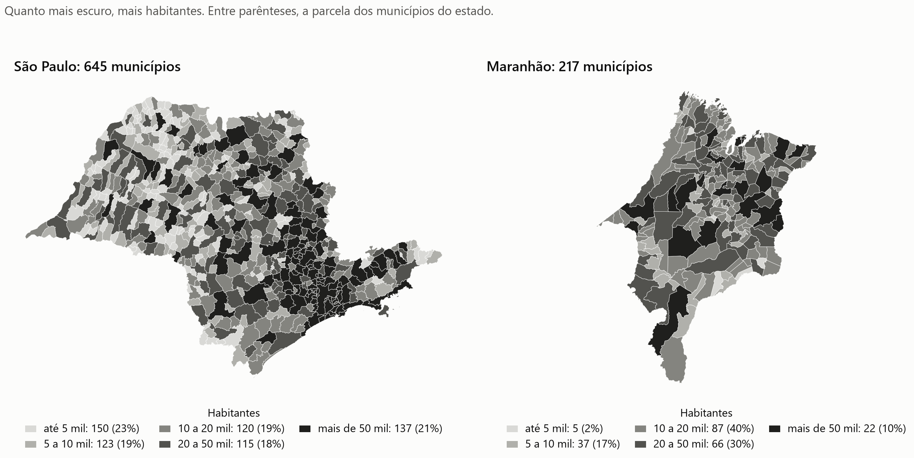

O peso econômico dos pequenos é menor ainda que o peso em população. Nos municípios paulistas de até 50 mil habitantes entra 14,9% da receita municipal do estado e só 5,5% dos tributos próprios. A {fig:03_peso_dos_pequenos_SP_MA} põe lado a lado, para três cortes de população (10.188, 20 mil e 50 mil habitantes), a parcela dos municípios, da população, da receita e dos tributos próprios. Ela usa só os municípios com contas utilizáveis, e por isso mostra 41% dos municípios paulistas na faixa de até 10.188 habitantes, e não os 42,6% da contagem de todos os municípios. Repare, no quadro de até 50 mil habitantes, que em São Paulo as barras encolhem muito da primeira linha para a última, e no Maranhão bem menos.

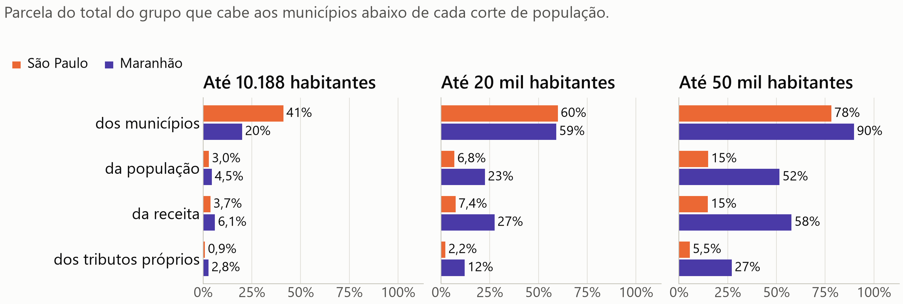

### 1.1 O precedente: o gráfico de 2023 refeito

Esta conta tem um precedente do próprio autor. O relatório final de sua iniciação científica, orientado por Marcel Fantin (MENEZES, 2023, p. 8-9), traz na página 9 o "Gráfico 1 - Percentual acumulado por faixa populacional dos municípios do Estado de São Paulo" e, na página 8, a frase: "89% dos municípios possui menos de 50.000 habitantes, administrando 3/4 do território e somando apenas 10% do PIB e 15% da população estadual". O gráfico tinha seis curvas: municípios, população, PIB, área municipal, área com cobertura vegetal e área urbana.

A {fig:61_precedente_acumulado_SP} refaz o gráfico com o Censo 2022, o PIB dos municípios de 2023 e as contas de 2024. Saem as duas curvas de cobertura do solo, que este estudo não tem, e entram a receita e os tributos próprios. Olhe a marca de 50 mil habitantes: as curvas de municípios e de área estão no alto, e as outras quatro, embaixo.

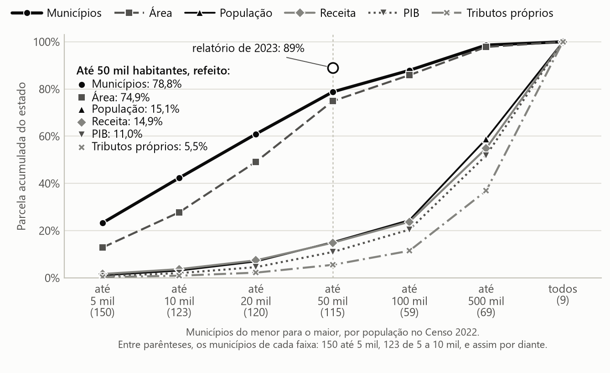

Tabela. Parcela acumulada até 50 mil habitantes, por grupo

| Grupo | Municípios | Área | População | Receita | PIB | Tributos próprios |
|---|---:|---:|---:|---:|---:|---:|
| Sudeste e Nordeste | 87,5% | 81,5% | 30,1% | 31,0% | 18,2% | 10,3% |
| Sudeste | 84,6% | 79,1% | 20,8% | 21,4% | 14,2% | 7,9% |
| Nordeste | 90,2% | 82,9% | 44,5% | 50,1% | 33,5% | 20,8% |
| São Paulo | 78,8% | 74,9% | 15,1% | 14,9% | 11,0% | 5,5% |
| Maranhão | 89,9% | 78,6% | 51,7% | 57,8% | 39,6% | 27,1% |

Municípios, área, população e PIB contam todos os municípios. Receita e tributos próprios contam os municípios com contas utilizáveis, sobre o total deles (docs/tabelas/r5_pibic_acumulado.csv).

Dos quatro números da frase de 2023, três se confirmam e um cai. O território dá 74,9%, contra os 3/4 escritos. A população dá 15,1%, contra 15%. O PIB dá 11,0%, contra 10%, com a diferença de que o relatório usou o PIB de um ano anterior. Os municípios dão 78,8% (508 de 645), e não 89%. A base não reproduz o 89% em nenhum corte: até 100 mil habitantes são 87,9% (567 de 645). As barras do gráfico de 2023 marcavam 150, 123, 120, 116, 69, 58 e 9 municípios por faixa; a base dá 150, 123, 120, 115, 59, 69 e 9. A diferença de 116 para 115 é Mairinque, que ficou com 50.027 habitantes no resultado final do Censo. Duas barras diferem mais: de 50 a 100 mil habitantes, 69 no gráfico de 2023 e 59 na base; de 100 a 500 mil, 58 e 69. São dez municípios a mais numa faixa e a menos na outra, e a causa dessa diferença não foi apurada.

### 1.2 Os municípios de até 10 mil habitantes

A diferença entre os dois estados está na ponta de baixo. Estão na menor faixa do Fundo de Participação dos Municípios (FPM), de até 10.188 habitantes, 275 municípios paulistas (42,6%) e 44 maranhenses (20,3%). Têm até 5 mil habitantes 150 paulistas (23,3%) e 5 maranhenses (2,3%). Entre as regiões a distância é menor: até 5 mil habitantes, 397 municípios no Sudeste (23,8%) e 248 no Nordeste (13,8%); até 10.188, 776 (46,5%) e 630 (35,1%).

Na {fig:02_acumulado_populacao_SP_MA}, cada curva conta os municípios do menor para o maior: em cima, como parcela dos municípios do estado; embaixo, em número. Até perto de 20 mil habitantes a curva paulista corre acima da maranhense, porque São Paulo tem em proporção mais municípios minúsculos. Daí em diante a maranhense passa à frente e chega à marca de 50 mil habitantes com 89,9% dos municípios, contra 78,8% da paulista. A curva é de municípios, não de moradores.

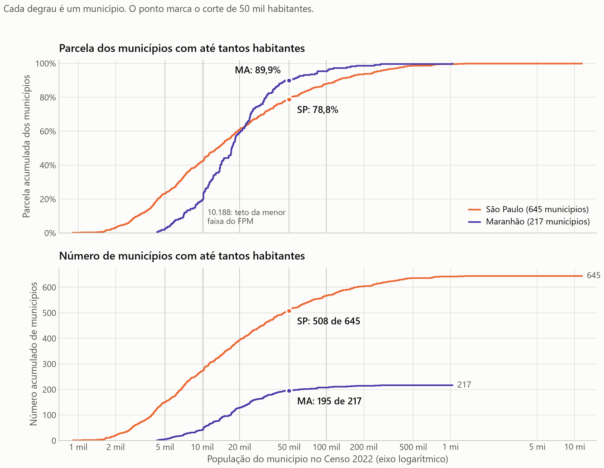

> **Ressalva.** O Maranhão tem cinco municípios de até 5 mil habitantes. Toda comparação entre os dois estados nessa faixa é frágil. Nela, a comparação que se sustenta é Sudeste contra Nordeste.

Esta seção descreve a malha de municípios, não a dependência. Contar prefeituras dependentes exige escolher um corte, e a resposta muda com ele, como mostra a seção 3.

> **O que o dado diz à pergunta.** O ponto de partida se confirma: São Paulo tem trinta vezes mais municípios de até 5 mil habitantes que o Maranhão. Mas esses municípios abrigam uma fração pequena dos paulistas, e isso pesa em todas as leituras seguintes.

## 2. O FPM é a maior fonte em metade das prefeituras paulistas; no Maranhão, é o FUNDEB

A pergunta desta seção é qual fonte responde pela maior fatia da receita de cada prefeitura. A conta principal usa o que entrou no caixa, já sem os 20% do FPM e do ICMS que cada município aporta ao FUNDEB, o fundo da educação básica. A conta alternativa usa o FPM e o ICMS brutos e conta o FUNDEB só pelo saldo entre o recebido e o aportado.

Tabela. Parcela dos municípios em que cada fonte é a maior fatia da receita, contas de 2024

| Maior fatia | SP | MA | Sudeste | Nordeste |
|---|---:|---:|---:|---:|
| FPM, conta principal | 53,2% | 7,0% | 65,0% | 46,6% |
| FUNDEB, conta principal | 1,3% | 89,3% | 1,7% | 46,5% |
| ICMS e IPVA, conta principal | 23,4% | 2,3% | 14,1% | 2,6% |
| Tributos próprios, conta principal | 21,2% | 0,5% | 10,8% | 1,7% |
| Royalties, conta principal | 0,3% | 0,0% | 3,2% | 0,3% |
| FPM, conta alternativa | 55,3% | 35,3% | 67,9% | 75,3% |
| FUNDEB, conta alternativa | 0,0% | 60,0% | 0,1% | 17,5% |

No mapa da {fig:05_mapa_maior_fatia_SP_MA}, São Paulo aparece em mosaico: FPM, em azul, no interior profundo (o oeste do estado e o Vale do Ribeira) e em boa parte do litoral; ICMS, em laranja, onde há usina, indústria ou refinaria; tributos próprios, em verde, na Grande São Paulo e no entorno de Campinas. O Maranhão fica quase todo de uma cor, o roxo do FUNDEB, com ICMS no sul da soja, em Balsas e Tasso Fragoso.

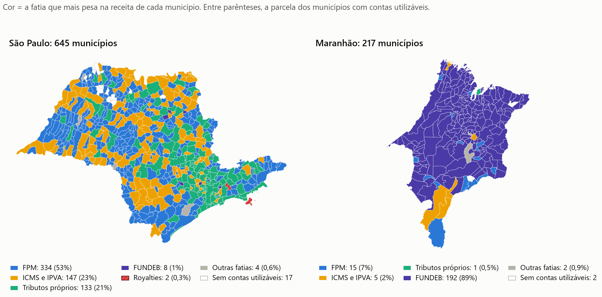

Ampliando para os 13 estados, o mapa da {fig:11_mapa_maior_fatia_SE_NE} mostra onde a cor do FPM domina. Procure as manchas contínuas de FPM em Minas Gerais e na faixa que vai do Piauí à Paraíba, e a mancha de FUNDEB que cobre o Maranhão e parte do Ceará e da Bahia. Por estado, o FPM é a maior fonte em 82% dos municípios de Minas Gerais, 78% do Rio Grande do Norte, 74% da Paraíba, 63% de Pernambuco e de Sergipe, 53% de São Paulo, 51% do Piauí, 45% do Espírito Santo, 44% da Bahia, 28% do Ceará, 17% de Alagoas, 7% do Maranhão e 5% do Rio de Janeiro, onde os royalties lideram em 46%.

O placar da {fig:12_placar_maior_fatia_por_uf} traz os estados em dois blocos, Sudeste em cima e Nordeste embaixo. No primeiro trecho de cada barra, o do FPM, São Paulo fica entre os 82% de Minas Gerais e os 7% do Maranhão.

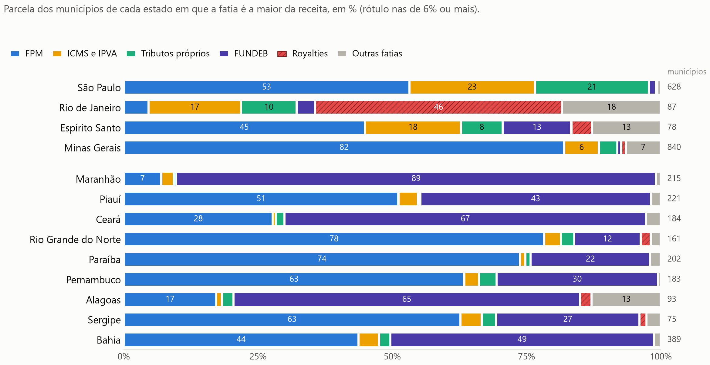

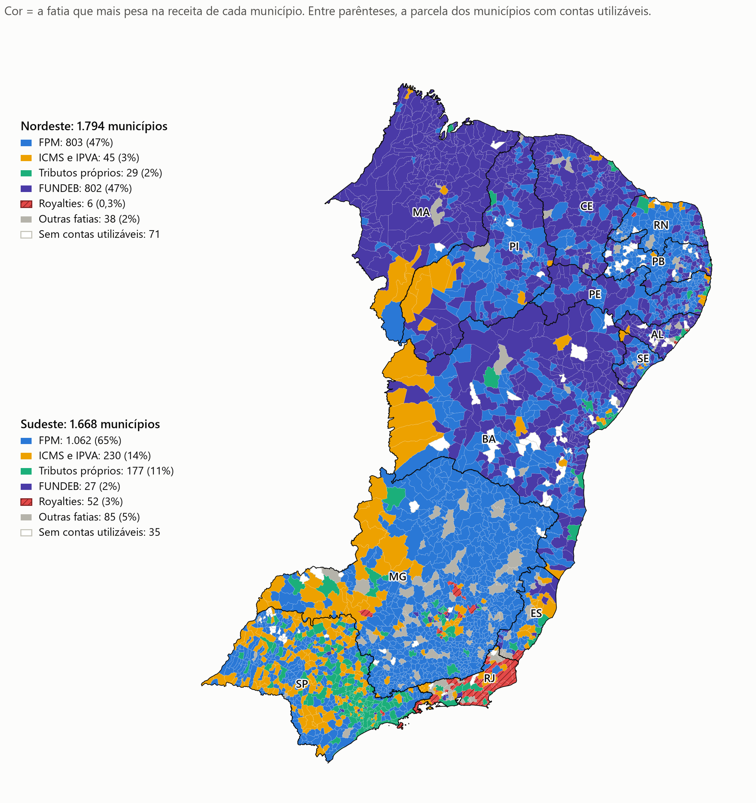

O resultado pouco intuitivo é este: na conta principal, quem se parece com o interior paulista é Minas Gerais, o Rio Grande do Norte, a Paraíba e o Piauí, estados de muito município minúsculo vivendo de FPM. O Maranhão é um caso à parte dentro do próprio Nordeste, com quase tudo vindo do FUNDEB e quase nenhum município minúsculo.

### 2.1 O que muda na conta alternativa

A ordem entre as regiões depende da contabilidade. Na conta principal, o FPM lidera em 18,4 pontos percentuais a mais de municípios no Sudeste que no Nordeste. Com o FUNDEB pelo saldo, lidera em 7,5 pontos a mais no Nordeste. A razão é mecânica: o município nordestino recebe do FUNDEB bem mais do que aporta, e quando só o saldo conta, o FPM bruto volta ao primeiro lugar em 75,3% deles.

Duas coisas não mudam. Em São Paulo o FUNDEB quase nunca lidera: 1,3% dos municípios numa conta e 0,0% na outra. No Maranhão lidera na maioria: 89,3% e 60,0%. A semelhança de Minas, Rio Grande do Norte, Paraíba e Piauí com o interior paulista pertence à conta principal.

O resultado também não depende do ano. Na média de 2023 a 2025, no painel de 830 municípios de São Paulo e do Maranhão com contas utilizáveis nos três anos, o FPM é a maior fatia em 52,2% dos paulistas e o FUNDEB em 90,1% dos maranhenses. Entre as regiões, no painel de 3.261 municípios dos 13 estados, o FPM lidera em 65,1% dos municípios do Sudeste e 46,8% dos do Nordeste no triênio, contra 65,0% e 46,6% em 2024.

> **Como ler.** O mapa mostra só a maior fatia e joga fora mais da metade da receita. Onde a maior fatia tem 31% e a segunda 30%, o município aparece de uma cor só.

Receitas de uma vez só mexem em casos isolados: o precatório do antigo FUNDEF, de R$ 1,4 bi em 159 municípios, quase todos do Nordeste; a outorga de concessão de saneamento em Alagoas e no Rio de Janeiro; e transferência de capital fora do comum, como em Biquinhas, em Minas Gerais, que recebeu do estado 59% da sua receita de 2024. A fatia "SUS" é só o repasse corrente de fundo a fundo; o SUS de convênio e de capital, R$ 3,493 bi em 2.339 municípios, fica em "outras transferências".

> **O que o dado diz à pergunta.** Confirma que metade das prefeituras paulistas vive antes de tudo do FPM, contra 7% das maranhenses. Mas o dinheiro de fora do Maranhão vem por outro canal, o FUNDEB, e a comparação entre as regiões se inverte quando a contabilidade muda.

## 3. Em parcela da receita, o município maranhense depende mais em toda faixa de tamanho

Dependência, aqui, é a parcela da receita que vem de transferências: a soma das seis fontes externas (FPM, FUNDEB, cota do ICMS e do IPVA, SUS, royalties e outras transferências) sobre a receita. Parte dessa receita externa tem destino obrigatório: o FUNDEB só paga escola e o SUS só paga saúde. Um município acima de 80% de dependência pode ter boa parte disso em verba carimbada, e não em dinheiro livre. A seção 3.4 mede quanto. A receita é líquida das deduções do FUNDEB e não inclui a previdência própria dos servidores.

Primeiro o conjunto. Nos 3.356 municípios dos 13 estados, a mediana da dependência é 90,5% (média 87,1% ± 9,9)\*. Nos 843 de São Paulo e do Maranhão juntos, 85,5% (média 82,0% ± 12,7)\*. Separando: 86,3% no Sudeste (média 83,1% ± 11,0)\* e 92,9% no Nordeste (média 90,8% ± 6,7)\*; 81,2% em São Paulo (média 78,2% ± 12,4)\* e 94,1% no Maranhão (média 93,1% ± 4,4)\*. A média fica abaixo da mediana em todos os grupos: poucos municípios de receita própria alta a puxam para baixo. O Sudeste é mais espalhado que o Nordeste.

Tabela. Mediana da parcela da receita que vem de transferências, por faixa de população, contas de 2024

| Habitantes | SP | MA | Sudeste | Nordeste |
|---|---:|---:|---:|---:|
| até 5 mil | 90,2% | 96,5% | 92,2% | 94,6% |
| 5 a 10 mil | 85,9% | 95,4% | 88,7% | 94,2% |
| 10 a 20 mil | 81,5% | 94,4% | 86,0% | 93,3% |
| 20 a 50 mil | 76,7% | 93,8% | 79,5% | 91,7% |
| 50 a 100 mil | 68,2% | 89,8% | 70,7% | 86,5% |
| todos os tamanhos | 81,2% | 94,1% | 86,3% | 92,9% |

O valor maranhense da primeira linha é a mediana de cinco municípios.

Tabela. Média e desvio-padrão\* da mesma parcela, por faixa de população, contas de 2024

| Habitantes | SP | MA | Sudeste | Nordeste |
|---|---:|---:|---:|---:|
| até 5 mil | 89,5% ± 4,5 | 95,5% ± 2,8 | 91,0% ± 4,4 | 93,9% ± 3,4 |
| 5 a 10 mil | 84,7% ± 5,1 | 94,8% ± 2,9 | 87,8% ± 5,7 | 92,8% ± 5,3 |
| 10 a 20 mil | 81,1% ± 6,4 | 93,8% ± 3,5 | 85,0% ± 6,6 | 92,0% ± 5,0 |
| 20 a 50 mil | 75,6% ± 7,2 | 93,3% ± 3,1 | 79,3% ± 7,6 | 90,1% ± 5,4 |
| 50 a 100 mil | 66,1% ± 7,9 | 89,4% ± 3,4 | 70,1% ± 8,6 | 84,5% ± 7,1 |
| todos os tamanhos | 78,2% ± 12,4 | 93,1% ± 4,4 | 83,1% ± 11,0 | 90,8% ± 6,7 |

Dentro de cada faixa, o desvio paulista vai de uma vez e meia a mais de duas vezes o maranhense, e a média fica a no máximo 2,1 pontos da mediana (docs/tabelas/r5_j1_media_desvio_faixas.csv).

### 3.1 A tamanho igual, 13,5 pontos separam os dois estados

Comparando municípios do mesmo tamanho, o maranhense de até 50 mil habitantes depende 13,5 pontos percentuais a mais que o paulista, com intervalo de 95% de 12,6 a 14,3 pontos. Essa comparação entre os dois estados é exploratória, porque a hipótese foi ajustada depois de ver o dado deles. O teste que vale como confirmação é o regional: o Nordeste depende 6,7 pontos a mais que o Sudeste, com intervalo de 6,3 a 7,1.

O resultado regional resiste a todas as variações tentadas. Vale nas duas contabilidades da seção 2, vale quando se leva em conta que municípios de um mesmo estado se parecem, vale sem Minas Gerais, vale na mediana e vale sem os 100 municípios com alerta de FPM ou de FUNDEB, caso em que as diferenças ficam em 13,4 e 6,7 pontos. Na média de 2023 a 2025, São Paulo contra Maranhão dá 13,6 pontos, com intervalo de 12,8 a 14,5; nos mesmos 671 municípios em 2024, 13,5. Entre as regiões, o triênio dá 7,1 pontos, com intervalo de 6,7 a 7,5; a seção 9.5 traz a conta.

Na {fig:09_dispersao_dependencia_SP_MA}, cada faixa de população tem duas caixas. A caixa cobre a metade central dos municípios, o traço é a mediana e os pontos soltos são os municípios fora da curva. As caixas maranhenses ficam estreitas e no alto em todas as faixas, e as paulistas descem e se alargam à medida que a população cresce.

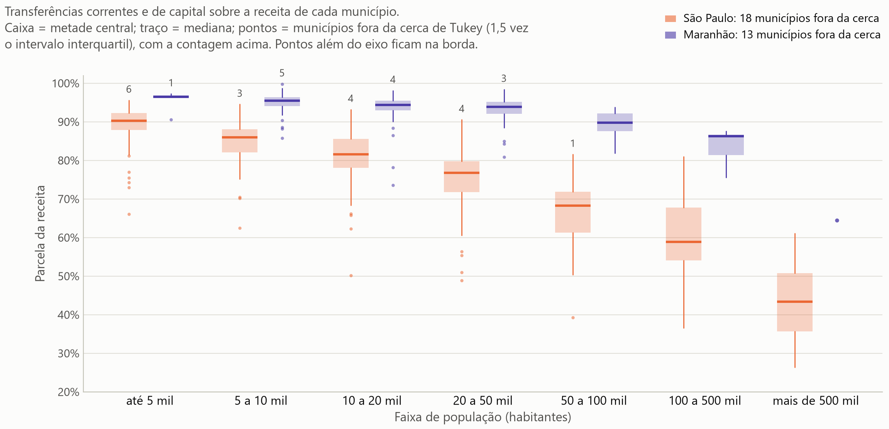

A distância cresce com o tamanho. No município de até 5 mil habitantes as duas regiões quase se encontram, com 92,2% no Sudeste e 94,6% no Nordeste. Entre as regiões a distância é de 4,9 pontos de 5 a 10 mil habitantes, 6,6 de 10 a 20 mil e 10,9 de 20 a 50 mil. O município do Sudeste ganha base própria quando cresce. O do Nordeste ganha bem menos.

A {fig:13_dependencia_por_uf} repete a medida para os municípios de até 20 mil habitantes dos 13 estados, da maior para a menor mediana. Oito estados do Nordeste vêm primeiro, com mediana acima de 93%. Os quatro do Sudeste vêm depois, com São Paulo por último entre eles. Sergipe fecha a lista, abaixo de São Paulo.

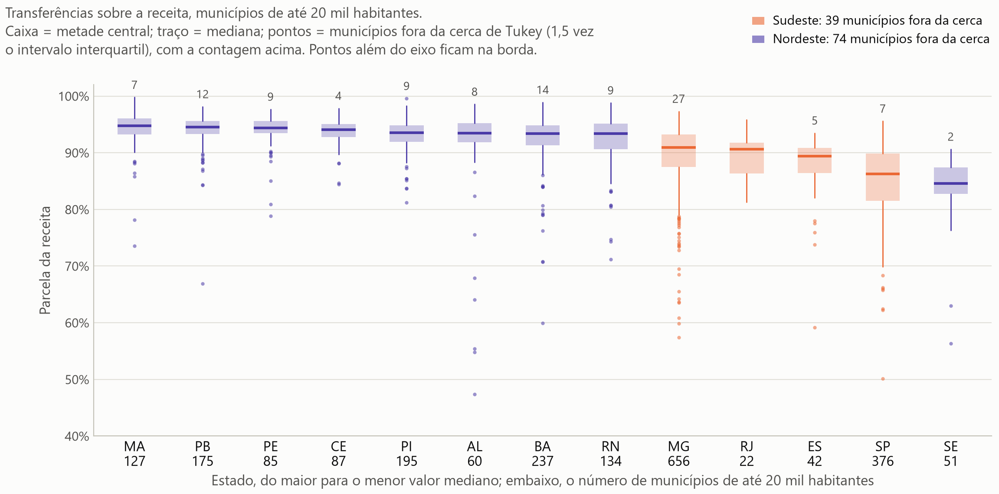

O tributo próprio explica o encontro na ponta de baixo. Na mediana, ele responde por 7,4% da receita no município paulista de até 5 mil habitantes e por 3,6% no nordestino. Tirando o imposto de renda retido da folha da própria prefeitura, que a contabilidade oficial conta como tributo próprio, sobram 5,4% e 1,6%. Na mediana dos municípios pequenos do Nordeste, metade do tributo próprio é esse imposto retido.

A diferença entre São Paulo e Maranhão não é efeito de tamanho. Dando a São Paulo a mistura de tamanhos do Maranhão, a média paulista vai de 78,2% para 78,3%. Os 15 pontos de distância entre as médias vêm de dentro de cada faixa. Até 50 mil habitantes, a mistura de tamanhos até esconde parte da distância: a diferença observada entre as médias é de 10,8 pontos e, a tamanho igual, de 13,5.

Parte da distância acompanha a economia local. Pondo o PIB por habitante na conta, a diferença cai de 13,5 para 10,3 pontos entre os dois estados e de 6,7 para 3,2 entre as regiões. Isso descreve o mecanismo, já que receita própria nasce da atividade econômica do lugar. Não é um viés a descontar do resultado.

### 3.2 Por município, mais da metade de São Paulo; por morador, um em cada catorze

Com o corte em 80% da receita vinda de transferências, estão acima dele 2.751 das 3.356 prefeituras dos 13 estados com contas utilizáveis, ou 82,0%. Em São Paulo e no Maranhão juntos são 548 de 843, ou 65,0%. Separando: 338 das 628 paulistas, ou 53,8%, e 210 das 215 maranhenses, ou 97,7%; 1.145 das 1.633 do Sudeste, ou 70,1%, e 1.606 das 1.723 do Nordeste, ou 93,2%. Em número absoluto, São Paulo tem mais prefeituras nessa condição que o Maranhão.

Tabela. Prefeituras acima de 80% e de 90% de dependência e a população que mora nelas, contas de 2024

| Grupo | Com contas | Acima de 80% | População nelas | Acima de 90% | População nelas |
|---|---:|---:|---:|---:|---:|
| Sudeste e Nordeste | 3.356 | 2.751 (82,0%) | 32,2% | 1.763 (52,5%) | 15,5% |
| Sudeste | 1.633 | 1.145 (70,1%) | 16,5% | 518 (31,7%) | 4,0% |
| Nordeste | 1.723 | 1.606 (93,2%) | 56,5% | 1.245 (72,3%) | 33,4% |
| São Paulo e Maranhão | 843 | 548 (65,0%) | 16,6% | 276 (32,7%) | 7,7% |
| São Paulo | 628 | 338 (53,8%) | 7,1% | 92 (14,6%) | 0,9% |
| Maranhão | 215 | 210 (97,7%) | 78,5% | 184 (85,6%) | 52,4% |

A contagem por morador dá outra figura. Nas 2.751 prefeituras dos 13 estados mora 32,2% da população, e nas 548 dos dois estados, 16,6%. Nas 338 paulistas mora 7,1% da população do estado, um paulista em cada catorze. Nas 210 maranhenses mora 78,5%, quase quatro em cada cinco moradores. No Sudeste a parcela é de 16,5% e no Nordeste, de 56,5%. O denominador é toda a população do estado ou da região, com ou sem contas utilizáveis. Somando todas as prefeituras, as transferências são 49% da receita dos municípios paulistas e 87% da dos maranhenses.

Os municípios sem contas utilizáveis não mudam o quadro. Supondo todos abaixo ou todos acima do corte, a parcela fica entre 52,4% e 55,0% dos 645 paulistas e entre 96,8% e 97,7% dos 217 maranhenses.

É aqui que mora o mal-entendido. Quem percorre o interior paulista vê prefeitura dependente em mais da metade dos municípios e está certo. Quem olha onde as pessoas moram vê um estado em que a dependência alta alcança pouca gente e também está certo. As duas contagens medem coisas diferentes.

### 3.3 Como classe única, as curvas só se igualam onde todos estão dentro

O autor perguntou se, tratando a dependência como classe única, em que o município depende ou não depende, existe um corte em que a parcela de municípios dependentes se iguala entre os estados.

Tabela. Parcela dos municípios em que as transferências passam de cada corte, contas de 2024

| Corte | SP, todos | MA, todos | SP, até 20 mil hab. | MA, até 20 mil hab. |
|---|---:|---:|---:|---:|
| 50% | 96,8% | 100,0% | 100,0% | 100,0% |
| 60% | 90,1% | 100,0% | 99,7% | 100,0% |
| 70% | 78,0% | 99,5% | 97,9% | 100,0% |
| 80% | 53,8% | 97,7% | 82,2% | 98,4% |
| 90% | 14,6% | 85,6% | 24,2% | 94,5% |
| 95% | 0,6% | 36,3% | 1,1% | 46,5% |

A resposta é que a igualdade existe, mas só nas pontas da curva. No conjunto de todos os municípios, nos cortes de 50% a 100%, as parcelas de São Paulo e do Maranhão só se igualam em zero, com corte acima de 99,8%. Entre os municípios de até 20 mil habitantes, as duas são 100% com qualquer corte até 50,1%; até 10.188 habitantes, com qualquer corte até 62,5%; até 5 mil, com qualquer corte até 66,0%. Esses limites são a menor dependência encontrada entre os paulistas de cada recorte. Daí para cima a parcela paulista cai, a maranhense se mantém, e as curvas não se cruzam de novo antes de zerar.

Na {fig:19_corte_dependencia_SP_MA}, cada quadro é um recorte de tamanho (todos os municípios, até 20 mil, até 10.188 e até 5 mil habitantes) e percorre os cortes de 50% a 100%. Olhe o vão entre as duas linhas: no quadro de todos os municípios ele já existe em 50%; nos outros três abre entre 65% e 75%, é largo em 90% e só fecha quando quase nenhum município passa do corte.

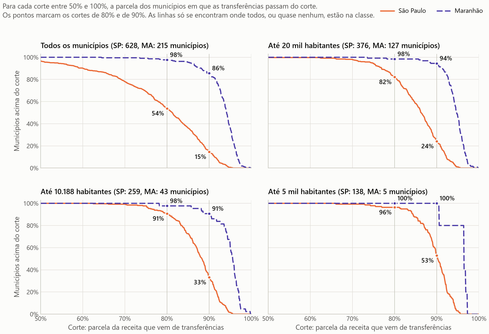

Essa igualdade não informa nada. Ela diz que todo município pequeno dos dois estados recebe de fora mais da metade da receita. Isso vale para quase todo município pequeno do país e decorre do desenho do federalismo fiscal brasileiro, em que o imposto se arrecada onde está a atividade econômica e se redistribui por fórmula. Uma classe em que cabem todos não separa ninguém.

Assim que o corte passa a separar, quem depende mais é o Maranhão. Nos municípios de até 20 mil habitantes, passam de 80% de dependência 82,2% dos paulistas e 98,4% dos maranhenses; passam de 90%, 24,2% e 94,5%. Até 5 mil habitantes, passam de 90% 52,9% dos paulistas e os cinco maranhenses. Em número de prefeituras a ordem também vira: acima de 80%, 338 em São Paulo e 210 no Maranhão; acima de 90%, 92 e 184.

Entre as regiões o quadro é o mesmo: nos municípios de até 20 mil habitantes, passam de 90% de dependência 45,9% dos do Sudeste e 83,7% dos do Nordeste. Nos cortes mais baixos, de 50% a 61%, as duas regiões ficam praticamente iguais, perto de 100%: a diferença alterna de -0,02 a +0,26 ponto.

A classe única descarta a informação que distingue os dois estados, que é a distância dentro da classe: um município com 81% e outro com 97% ficam do mesmo lado do corte de 80%. Por isso o estudo trabalha com a parcela contínua, com reais por habitante e com a população que mora nos municípios dependentes.

### 3.4 Quanto da receita tem destino obrigatório

A dependência conta de onde o dinheiro vem. Esta seção conta quanto dele já chega com destino. O autor pediu a conta de quanto da receita é travado por destinações, para saber se a dependência de receita externa se explica por essa receita não ser vinculada. A conta é sobre a mesma receita da seção 3, que já vem sem os 20% aportados ao FUNDEB e com o FUNDEB contado pelo que o município recebe.

O destino obrigatório tem duas partes, que não se sobrepõem. A primeira é o destino pela origem, o dinheiro que já chega carimbado: na educação, o FUNDEB recebido, com a complementação da União, os repasses do FNDE (salário-educação, merenda e transporte escolar) e o convênio corrente do estado para educação; na saúde, o SUS, corrente, de convênio e de capital; na assistência, o repasse do fundo nacional. A segunda é o destino pelo mínimo constitucional: 25% dos impostos e das transferências de impostos para a educação, descontado o que o município já aportou ao FUNDEB, e 15% para a saúde. O que sobra é a parcela sem destino obrigatório.

Tabela. Parcela da receita com destino obrigatório, contas de 2024

| Grupo | Municípios | Mediana | Média e desvio\* | Educação | Saúde | Sem destino |
|---|---:|---:|---:|---:|---:|---:|
| Sudeste e Nordeste | 3.356 | 48,8% | 50,2% ± 10,8 | 26,4% | 20,7% | 51,2% |
| Sudeste | 1.633 | 42,3% | 42,4% ± 6,6 | 20,2% | 20,8% | 57,7% |
| Nordeste | 1.723 | 58,2% | 57,6% ± 8,7 | 35,7% | 20,5% | 41,8% |
| São Paulo e Maranhão | 843 | 44,7% | 48,4% ± 12,0 | 25,0% | 19,0% | 55,3% |
| São Paulo | 628 | 42,2% | 42,3% ± 5,0 | 23,1% | 19,0% | 57,8% |
| Maranhão | 215 | 67,4% | 66,3% ± 7,7 | 46,6% | 19,1% | 32,6% |

As colunas de educação, saúde e sem destino são medianas, e por isso não somam exatamente a mediana do total. A assistência fica entre 0,3% e 0,7%. A {fig:60_destino_obrigatorio_grupos} mostra a mesma conta em médias, que somam 100%: o conjunto em cima e a divisão embaixo. Compare o trecho escuro, da educação, e o trecho seguinte, da saúde.

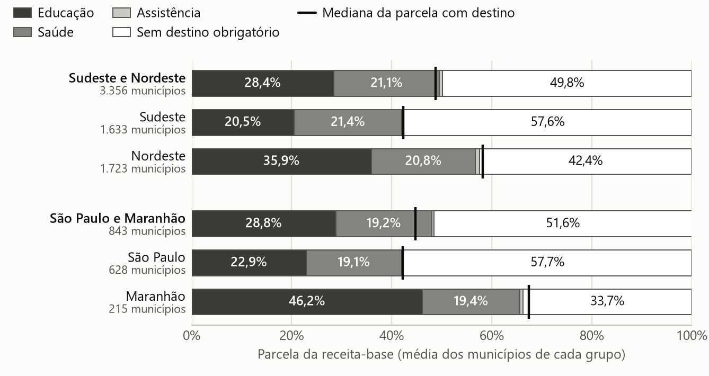

A saúde prende a mesma fatia em todos os grupos, perto de 20% da receita. Onde o SUS pesa menos, o mínimo de 15% pesa mais, e os dois se compensam. A diferença inteira está na educação: 46,6% no Maranhão contra 23,1% em São Paulo. É o FUNDEB recebido, que é 39,9% da receita na mediana maranhense (média 39,5% ± 9,0)\* e 12,6% na paulista (média 12,7% ± 4,2)\*.

O resultado contraria a hipótese. O grupo que mais depende de receita externa é também o que tem mais receita com destino obrigatório. Da receita externa, 61,4% tem destino na mediana do Nordeste (média 61,0% ± 9,0)\* e 46,3% na do Sudeste (média 46,3% ± 8,7)\*; 70,4% no Maranhão (média 69,3% ± 8,0)\* e 47,6% em São Paulo (média 47,2% ± 7,4)\*. No conjunto dos 3.356 municípios, quanto maior a dependência, maior a parcela carimbada: a correlação de postos é de +0,38. Dentro de São Paulo a relação é fraca e de sinal contrário, -0,20, porque o município pequeno paulista depende de FPM, que não tem destino além dos mínimos.

Tabela. Mediana da parcela da receita com destino obrigatório, por faixa de população, contas de 2024

| Habitantes | SP | MA | Sudeste | Nordeste | Conjunto |
|---|---:|---:|---:|---:|---:|
| até 5 mil | 37,0% | 58,7% | 38,2% | 49,2% | 40,8% |
| 5 a 10 mil | 42,5% | 61,4% | 42,2% | 56,8% | 47,6% |
| 10 a 20 mil | 43,4% | 67,1% | 43,5% | 59,0% | 54,0% |
| 20 a 50 mil | 44,6% | 70,4% | 44,8% | 61,6% | 54,3% |
| 50 a 100 mil | 43,6% | 73,8% | 45,6% | 61,0% | 53,1% |
| 100 a 500 mil | 44,7% | 64,0% | 45,7% | 56,2% | 48,1% |
| mais de 500 mil | 41,8% | 44,2% | 44,5% | 44,8% | 44,8% |

O menor município é o que tem mais receita sem destino: até 5 mil habitantes, 63,0% em São Paulo e 50,8% no Nordeste. No Maranhão a parcela presa sobe com o tamanho até 100 mil habitantes, junto com o FUNDEB. Na primeira linha o valor maranhense é de cinco municípios e, na última, de um só. A tabela seguinte traz a média e o desvio das mesmas células.

Tabela. Média e desvio\* da parcela da receita com destino obrigatório, por faixa de população, contas de 2024

| Habitantes | SP | MA | Sudeste | Nordeste | Conjunto |
|---|---:|---:|---:|---:|---:|
| até 5 mil | 37,5% ± 3,4 | 57,3% ± 5,1 | 38,0% ± 4,4 | 49,3% ± 7,0 | 42,4% ± 7,8 |
| 5 a 10 mil | 42,9% ± 3,8 | 61,8% ± 8,1 | 42,3% ± 5,4 | 56,4% ± 8,2 | 49,2% ± 9,9 |
| 10 a 20 mil | 43,6% ± 4,0 | 65,7% ± 6,8 | 43,5% ± 5,8 | 59,0% ± 7,3 | 53,1% ± 10,2 |
| 20 a 50 mil | 44,2% ± 5,2 | 69,6% ± 6,4 | 44,2% ± 7,1 | 61,1% ± 8,0 | 54,2% ± 11,3 |
| 50 a 100 mil | 44,0% ± 4,8 | 72,6% ± 3,5 | 45,3% ± 7,9 | 60,6% ± 8,6 | 53,0% ± 11,3 |
| 100 a 500 mil | 44,0% ± 5,0 | 63,9% ± 8,4 | 45,5% ± 8,4 | 56,9% ± 7,5 | 48,7% ± 9,6 |
| mais de 500 mil | 42,6% ± 2,3 | 44,2% | 46,3% ± 6,5 | 45,5% ± 6,3 | 46,0% ± 6,4 |

Em reais por habitante, na mediana, o município paulista tem R$ 2.834 com destino (média R$ 3.053 ± 930)\* e R$ 3.754 sem destino (média R$ 4.393 ± 2.162)\*; o maranhense, R$ 3.736 (média R$ 3.988 ± 1.000)\* e R$ 1.885 (média R$ 2.065 ± 810)\*. Sem destino, a mediana é de R$ 3.626 no Sudeste (média R$ 4.417 ± 2.761)\* e de R$ 2.381 no Nordeste (média R$ 2.793 ± 1.449)\*. A conta é estável: nos quatro anos de 2022 a 2025 a mediana fica entre 41% e 43% em São Paulo e entre 66% e 67% no Maranhão.

> **Ressalva.** Destino obrigatório é vinculação de receita, pela origem ou pelo mínimo. Não é gasto obrigatório. O mínimo é piso, e quem gasta mais que 25% e 15% por escolha não aparece. Folha de pessoal, dívida, precatório e repasse à Câmara são obrigação de gasto e ficam fora. Ficam fora também as regras de dentro do carimbo, como os 70% do FUNDEB para remuneração, e as restrições parciais de royalties, CIDE e multas de trânsito. A transferência especial, a emenda Pix, entra como livre, embora 70% dela tenha de ir para investimento. Sem destino obrigatório não quer dizer dinheiro solto: é o que paga a administração, a limpeza, a Câmara e a dívida. Numa variante ampla, que soma os demais convênios, as demais transferências de capital e a iluminação pública, a ordem não muda: 46,2% em São Paulo, 69,6% no Maranhão, 47,2% no Sudeste e 61,8% no Nordeste. O desvio desta seção é o populacional; os números, a definição e os scripts estão em docs/pesquisa/r5-numeros-2.md.

> **O que o dado diz à pergunta.** Em parcela da receita a resposta é não: o município maranhense depende mais em toda faixa de tamanho e em todo corte de 50% a 95%. A resposta só é sim na contagem de prefeituras acima de 80%, que é maior em São Paulo porque o estado tem mais municípios. E a receita que mais depende de fora é também a mais carimbada: 67,4% com destino obrigatório no município maranhense mediano, 42,2% no paulista.

## 4. Em reais por habitante, o município minúsculo recebe o mesmo nas duas regiões

A parcela da receita esconde o tamanho do cheque. Um município pode ter 90% da receita vinda de fora e receber pouco por habitante, ou o contrário. Esta seção mede as transferências em reais por habitante. O valor por habitante usa a estimativa de população de 2024; o Censo 2022 define só a faixa de tamanho.

Primeiro o conjunto. Nos 3.356 municípios dos 13 estados, a mediana é de R$ 5.362 por habitante (média R$ 6.004 ± 2.653)\*. Nos 843 de São Paulo e do Maranhão juntos, R$ 5.217 (média R$ 5.853 ± 2.564)\*. No município de até 5 mil habitantes, R$ 8.729 nos 13 estados (média R$ 9.399 ± 3.014)\* e R$ 9.165 nos dois estados (média R$ 9.838 ± 2.794)\*. Em reais por habitante a média fica acima da mediana nos quatro casos: poucos municípios recebem muito por habitante.

Tabela. Mediana das transferências por habitante, por faixa de população, contas de 2024

| Habitantes | SP | MA | Sudeste | Nordeste |
|---|---:|---:|---:|---:|
| até 5 mil | R$ 9.236 | R$ 8.782 | R$ 8.859 | R$ 8.457 |
| 5 a 10 mil | R$ 5.913 | R$ 6.542 | R$ 5.785 | R$ 6.028 |
| 10 a 20 mil | R$ 5.047 | R$ 5.661 | R$ 4.881 | R$ 5.387 |
| 20 a 50 mil | R$ 4.265 | R$ 4.835 | R$ 4.314 | R$ 4.553 |

Tabela. Média e desvio-padrão\* das transferências por habitante, por faixa de população, contas de 2024, em reais

| Habitantes | SP | MA | Sudeste | Nordeste |
|---|---:|---:|---:|---:|
| até 5 mil | 9.905 ± 2.812 | 7.972 ± 1.375 | 9.635 ± 3.406 | 9.022 ± 2.206 |
| 5 a 10 mil | 6.089 ± 1.185 | 6.672 ± 1.276 | 6.029 ± 1.595 | 6.306 ± 1.402 |
| 10 a 20 mil | 5.166 ± 837 | 5.935 ± 1.252 | 5.251 ± 1.987 | 5.572 ± 1.121 |
| 20 a 50 mil | 4.495 ± 1.429 | 5.123 ± 925 | 4.898 ± 2.331 | 4.761 ± 1.076 |

Entre São Paulo e Maranhão, de 5 a 50 mil habitantes, a ordem das médias é a das medianas. Até 5 mil, a média maranhense, de cinco municípios, cai abaixo da mediana. Entre as regiões, de 20 a 50 mil habitantes a média do Sudeste passa a do Nordeste, ao contrário da mediana. O Sudeste é mais espalhado que o Nordeste em toda faixa.

O efeito muda com o tamanho, e cada faixa tem um veredito próprio.

Até 5 mil habitantes, Sudeste e Nordeste empatam. A tamanho igual, a diferença é de -0,6%, com intervalo de 95% de -3,2% a +2,1%, que inclui o zero.

Até 5 mil habitantes, São Paulo contra Maranhão não dá para dizer. São cinco municípios maranhenses. A diferença é de -3,1% em 2024, com intervalo de -18% a +15%, e de -1,5% na média de 2023 a 2025, com intervalo de -17% a +16%. A mediana dos cinco balança de um recorte para outro: no triênio, em reais de 2025, R$ 9.781 em São Paulo e R$ 8.426 no Maranhão.

De 5 a 50 mil habitantes, o município paulista recebe de 9% a 12% a menos que o maranhense do mesmo tamanho. O teste registrado antes de ver o dado, único para todos os municípios de até 50 mil habitantes, dá -9,3%, com intervalo de -12,3% a -6,1%. O teste só de 5 a 50 mil dá -11,6%, com intervalo de -14,4% a -8,7%, mas foi escrito depois de ver o dado e vale menos como prova. Na média de 2023 a 2025 a diferença é de -9,5%, com intervalo de -12,2% a -6,7%. Faixa por faixa, a diferença de 5 a 10 mil habitantes, de R$ 546, deixa de se distinguir de zero depois da correção para comparações múltiplas.

Entre as duas regiões, a diferença de 5 a 50 mil habitantes é de 5% a favor do Nordeste e não se distingue de zero quando se leva em conta que municípios do mesmo estado se parecem. Ela depende de Minas Gerais. Na média de 2023 a 2025 a diferença é de 3,5% a favor do Nordeste, com intervalo de -13,3% a +7,4% quando o erro é agrupado por estado. Até 5 mil habitantes o triênio dá +0,8%, também com o zero dentro do intervalo. O empate entre as regiões se mantém.

A {fig:14_transferencias_por_habitante_por_uf} mostra a distribuição nos municípios de até 20 mil habitantes de cada estado, da maior para a menor mediana. São Paulo fica no meio da lista, junto de outros estados de muito município minúsculo, como Piauí, Paraíba e Minas Gerais, e à frente do Maranhão.

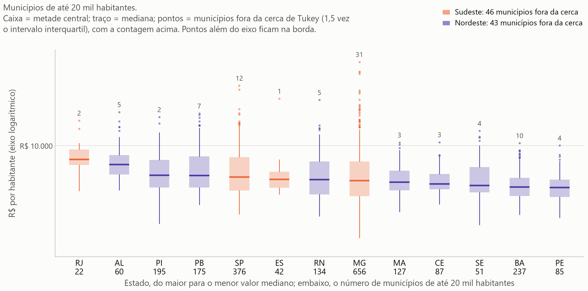

A resposta para o estado inteiro depende de como se conta. Na média dos municípios, São Paulo recebe R$ 5.925 por habitante (desvio de R$ 2.851)\* e o Maranhão, R$ 5.642 (desvio de R$ 1.411)\*. Na mediana dos municípios, R$ 5.123 e R$ 5.375. Por morador, dividindo a soma das transferências pela soma da população, R$ 3.194 e R$ 4.527. São Paulo fica à frente na média por município porque tem muito município minúsculo, e fica atrás na mediana e por morador.

O tamanho pesa mais que a região. O município do Sudeste de até 5 mil habitantes recebe cerca de R$ 3,5 mil a mais por habitante que o nordestino de 10 a 20 mil, que é o tamanho mais comum no Nordeste. É nessa comparação, entre o município típico de cada lugar, que a resposta é sim: o paulista de até 5 mil habitantes recebe em torno de R$ 9,2 mil por habitante, 72% a mais que o município maranhense mediano, com R$ 5,4 mil.

O mecanismo provável é a regra do FPM, que paga um piso igual a todo município de até 10.188 habitantes. Na seção 12, a conta com um FPM proporcional à população atribui à escada do fundo 67% da distância, em reais por habitante, entre o município de até 5 mil habitantes e o de 20 a 50 mil. O FPM líquido por habitante vai de R$ 4.137 no município paulista de até 5 mil habitantes a R$ 1.177 no de 20 a 50 mil. Borá, com 907 habitantes no Censo e 928 na estimativa de 2024, recebeu R$ 17,5 milhões de FPM bruto em 2024, ou R$ 18,8 mil por habitante. A cota mínima do FPM vale 10% a mais em São Paulo que no Maranhão, porque a fatia de cada estado no fundo está congelada desde 1990.

> **O que o dado diz à pergunta.** Em reais por habitante, no município minúsculo, a resposta é empate: o do Sudeste recebe o mesmo que o do Nordeste, e muito mais que o município nordestino típico. De 5 mil habitantes para cima a resposta é não: o paulista recebe de 9% a 12% a menos que o maranhense do mesmo tamanho.

## 5. A emenda federal é a menor do grupo em São Paulo; o que o estado tem a mais é convênio estadual

A versão "verba de deputado" da pergunta pede uma medida do dinheiro que depende de negociação. O estudo usa duas. A medida restrita, que é a principal, soma convênios e transferências de capital lançados nas contas da prefeitura, sem o SUS (convênio corrente, convênio de capital e capital fundo a fundo) e sem o convênio corrente estadual de educação, que pode ser repasse regular. A medida ampla inclui essas duas parcelas e fica como teste de sensibilidade.

> **Ressalva.** A medida ampla tem R$ 3,493 bi do SUS dentro, em 2.339 municípios, e a Lei de Responsabilidade Fiscal tira o SUS da categoria das transferências voluntárias (BRASIL, 2000, art. 25). A medida restrita deixa de fora também os convênios de capital da saúde, R$ 435 milhões entre os municípios com contas utilizáveis. Nenhuma das duas medidas é a transferência voluntária da lei. A seção 19.5 conta como as duas medidas mudaram ao longo da revisão.

### 5.1 Emenda federal

As emendas parlamentares federais pagas em 2025 a prefeituras e fundos municipais vêm do Portal da Transparência (BRASIL, 2026a). O valor pago inclui restos a pagar de anos anteriores. Nos 2.247 municípios de até 20 mil habitantes dos 13 estados, a mediana é de R$ 322 por habitante (média R$ 411 ± 349)\*.

Tabela. Emenda federal paga em 2025 por habitante, municípios de até 20 mil habitantes, em reais

| Grupo | Municípios | Mediana | Média e desvio\* |
|---|---:|---:|---:|
| Sudeste e Nordeste | 2.247 | 322 | 411 ± 349 |
| Sudeste | 1.096 | 237 | 297 ± 251 |
| Nordeste | 1.151 | 442 | 520 ± 391 |
| Sergipe | 51 | 670 | 701 ± 344 |
| Piauí | 195 | 622 | 718 ± 369 |
| Paraíba | 175 | 586 | 715 ± 521 |
| Rio de Janeiro | 22 | 518 | 521 ± 251 |
| Rio Grande do Norte | 134 | 493 | 530 ± 268 |
| Pernambuco | 85 | 462 | 508 ± 266 |
| Alagoas | 60 | 454 | 565 ± 534 |
| Espírito Santo | 42 | 378 | 409 ± 228 |
| Maranhão | 127 | 357 | 411 ± 268 |
| Ceará | 87 | 294 | 349 ± 236 |
| Minas Gerais | 656 | 274 | 340 ± 268 |
| Bahia | 237 | 233 | 284 ± 268 |
| São Paulo | 376 | 149 | 195 ± 176 |

São Paulo é o último na mediana, na média e ponderando por população. Em todo estado a média fica acima da mediana, e o desvio vai de cerca de metade da média a quase a média inteira: poucos municípios recebem muito. No pequeno município paulista o desvio, de R$ 176, passa a mediana.

Na {fig:16_emendas_por_habitante_por_uf}, os estados vão da maior para a menor mediana: São Paulo é o último, à direita, e o Maranhão, o nono dos 13.

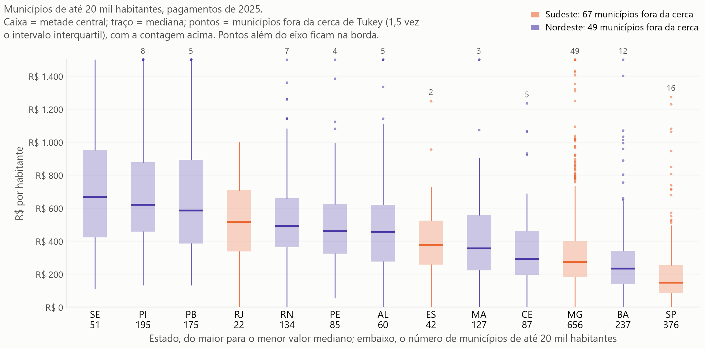

Em parcela da receita de 2025, a emenda federal equivale a 1,8% em São Paulo, 5,2% no Maranhão e 7,9% no Piauí. A base de 2025 cobre os 13 estados, e São Paulo é o último também nessa conta. Na mediana das regiões, 6,0% no Nordeste e 2,9% no Sudeste.

Tabela. Emenda federal paga em 2025 sobre a receita do município, mediana dos municípios de até 20 mil habitantes {quebra}

| Estado | Sobre a receita de 2025 | Média e desvio\*, 2025 | Sobre a receita de 2024 |
|---|---:|---:|---:|
| Nordeste | 6,0% | 6,4% ± 3,6 | 6,7% |
| Sudeste | 2,9% | 3,4% ± 2,4 | 3,2% |
| Sergipe | 8,5% | 8,3% ± 3,3 | 9,3% |
| Piauí | 7,9% | 8,4% ± 3,4 | 9,0% |
| Paraíba | 7,5% | 8,1% ± 3,7 | 8,4% |
| Pernambuco | 7,2% | 7,5% ± 3,2 | 8,0% |
| Rio Grande do Norte | 6,5% | 6,7% ± 3,0 | 7,2% |
| Maranhão | 5,2% | 5,5% ± 3,1 | 5,5% |
| Rio de Janeiro | 5,1% | 4,7% ± 2,2 | 5,8% |
| Espírito Santo | 5,0% | 5,0% ± 2,6 | 5,6% |
| Alagoas | 4,8% | 5,6% ± 3,8 | 5,3% |
| Ceará | 4,3% | 4,7% ± 2,7 | 4,8% |
| Minas Gerais | 3,5% | 4,0% ± 2,5 | 4,0% |
| Bahia | 3,3% | 4,0% ± 2,9 | 3,8% |
| São Paulo | 1,8% | 2,1% ± 1,7 | 2,0% |

As regiões vêm primeiro e os estados depois. A coluna sobre a receita de 2024 fica para comparação. O recorte é o dos municípios de até 20 mil habitantes com contas utilizáveis em 2024; a coluna de 2025 usa os que também têm a receita de 2025 (2.213 de 2.247).

A tamanho igual, o município maranhense recebe R$ 240 a mais de emenda federal por habitante que o paulista, e o do Nordeste, R$ 235 a mais que o do Sudeste. É o que a regra produz. A cota de emenda é por parlamentar e por bancada, e São Paulo tem um deputado federal para cada 634 mil habitantes, contra um para cada 376 mil no Maranhão.

A conta da regra da cadeira mostra o tamanho disso. Pelos valores de 2025 usados no estudo, cada deputado indica R$ 37,3 milhões e cada senador R$ 68,5 milhões em emendas individuais, e a emenda de bancada soma R$ 11,55 bi, repartidos por igual entre as 27 bancadas, R$ 427,8 milhões para cada uma. No país, a regra dá R$ 36,2 bi, ou R$ 178 por habitante. A emenda de comissão fica fora, porque não tem cota por estado. A tabela compara o que a regra dá a cada estado com o que ele teria se o mesmo total fosse repartido por habitante.

Tabela. Emenda federal pela regra de 2025 e a mesma soma repartida por habitante

| Estado | Deputados por milhão de hab. | Deputados e senadores por milhão de hab. | Pela regra (R$ milhões) | Por habitante (R$) | Repartida por habitante (R$ milhões) | Diferença |
|---|---:|---:|---:|---:|---:|---:|
| Brasil | 2,5 | 2,9 | 36.233 | 178 | 36.233 | 0% |
| Roraima | 12,6 | 17,3 | 932 | 1.463 | 114 | -88% |
| Sergipe | 3,6 | 5,0 | 932 | 422 | 394 | -58% |
| Piauí | 3,1 | 4,0 | 1.006 | 308 | 584 | -42% |
| Maranhão | 2,7 | 3,1 | 1.305 | 193 | 1.209 | -7% |
| Pernambuco | 2,8 | 3,1 | 1.566 | 173 | 1.616 | +3% |
| Ceará | 2,5 | 2,8 | 1.454 | 165 | 1.569 | +8% |
| Bahia | 2,8 | 3,0 | 2.088 | 148 | 2.523 | +21% |
| Rio de Janeiro | 2,9 | 3,1 | 2.349 | 146 | 2.865 | +22% |
| Minas Gerais | 2,6 | 2,7 | 2.610 | 127 | 3.665 | +40% |
| São Paulo | 1,6 | 1,6 | 3.244 | 73 | 7.924 | +144% |

Roraima entra como o extremo do país; os outros são estados do estudo. A tabela traz as duas medidas da cadeira: só os deputados e, ao lado, deputados mais os três senadores. Roraima tem 12,6 deputados e 17,3 cadeiras no Congresso por milhão de habitantes; São Paulo, 1,6 nas duas. De Roraima a São Paulo, a regra dá 20 vezes mais por habitante: R$ 1.463 contra R$ 73. Repartida por habitante, a emenda de São Paulo iria de R$ 3,2 bi para R$ 7,9 bi. Ganhariam 10 estados (Pernambuco, Ceará, Rio Grande do Sul, Santa Catarina, Pará, Paraná, Bahia, Rio de Janeiro, Minas Gerais e São Paulo) e perderiam 17 unidades da federação. Por região, a regra dá R$ 395 por habitante no Norte, R$ 249 no Centro-Oeste, R$ 207 no Nordeste, R$ 159 no Sul e R$ 109 no Sudeste. Com a repartição por habitante, o Norte perderia 55%, o Centro-Oeste 29% e o Nordeste 14%; o Sul ganharia 12% e o Sudeste, 64%.

O piso pesa mais que a Câmara. A parte fixa, de senadores e bancada, é 68% da emenda de um estado de 8 deputados e 19,5% da de São Paulo. Mesmo com a Câmara proporcional à população, com 112 cadeiras, São Paulo iria só de R$ 73 para R$ 108 por habitante, ainda abaixo dos R$ 178 do país. O Nordeste não é um bloco: quatro dos nove estados ficam perto ou abaixo da média do país (Maranhão R$ 193, Pernambuco R$ 173, Ceará R$ 165 e Bahia R$ 148), e a Bahia ganharia 21% com a repartição por habitante.

Nos 13 estados a regra acompanha o pago: a correlação entre o valor por habitante pela regra e o pago de fato às prefeituras em 2025 é de 0,86. São 13 pontos; é associação, não prova de causa. A tabela das 27 unidades está em docs/tabelas/r5_emenda_regra_por_uf.csv. Os valores da regra vêm de docs/pesquisa/emendas.md; a norma que os fixa não foi reaberta nesta etapa.

O arquivo só cobre prefeitura e fundo municipal. Em São Paulo, um terço da emenda paga em 2025 a favorecidos do estado vai para o governo estadual, para entidades e para empresas, e essa parte fica fora da conta.

### 5.2 Convênio e transferência de capital

Na medida restrita, mediana dos municípios de até 20 mil habitantes, a verba negociada que vem da União equivale a 0,66% da receita em São Paulo e 0,75% no Maranhão, contra 3,3% no Piauí e 3,9% na Paraíba. Na medida ampla, 0,74% e 0,90%. O convênio federal de 2024 ficou abaixo do de 2023 e perto do de 2025: as medianas de 2023, 2024 e 2025 são 0,94%, 0,66% e 0,59% em São Paulo e 1,21%, 0,75% e 0,95% no Maranhão. A mediana da média dos três anos é 0,87% e 1,45%. Ela fica acima da mediana de cada ano porque convênio entra em pacote, num ano sim e noutro não, e a média tira os zeros. Não indica que 2024 foi baixo.

A verba negociada que vem do governo do estado equivale a 2,5% da receita em São Paulo (2,45%; média 3,1% ± 2,5)\* e 0,0% no Maranhão (média 0,2% ± 0,8)\*, na medida restrita. Na ampla, 4,2% e 0,0%. Os vizinhos de São Paulo divergem: 6,0% no Espírito Santo (média 6,3% ± 4,6)\*, 2,3% em Minas Gerais (média 3,3% ± 4,5)\* e 0,0% no Rio de Janeiro (média 0,03% ± 0,08)\*, na restrita.

A {fig:18_voluntarias_do_estado_por_uf} mostra a verba estadual por estado, na medida restrita, da maior para a menor mediana. Espírito Santo, São Paulo e Minas Gerais vêm na frente, e o Rio de Janeiro é o último. Em oito dos nove estados do Nordeste a mediana fica abaixo de 1% da receita.

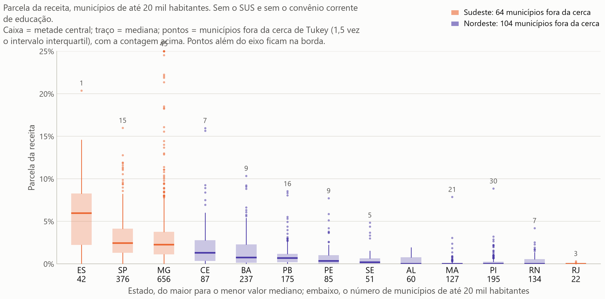

A tamanho igual, na medida restrita, o município paulista tem 2,2 pontos percentuais a mais de verba estadual que o maranhense, com intervalo de 95% de 2,0 a 2,5, e 0,9 ponto a menos de verba federal, com intervalo de 0,5 a 1,3. Na ampla, 4,4 pontos a mais e 1,0 a menos. Entre as regiões, o Sudeste tem 2,1 pontos a mais de verba estadual na restrita, com intervalo de 1,9 a 2,3. A diferença federal, de 1,2 ponto a favor do Nordeste, com intervalo de 1,0 a 1,4, não se distingue de zero quando se leva em conta a semelhança entre municípios do mesmo estado e a correção para vários testes (p = 0,058).

Na média de 2023 a 2025, nos 671 municípios de até 50 mil habitantes dos dois estados, o resultado se mantém: 2,0 pontos a mais de verba estadual em São Paulo, com intervalo de 1,9 a 2,2, e 1,0 ponto a menos de verba federal, com intervalo de 0,7 a 1,3. Entre as regiões o triênio dá o mesmo que 2024: 2,1 pontos a mais de verba estadual no Sudeste e 1,2 ponto a mais de verba federal no Nordeste.

> **Ressalva.** O 0,0% do Maranhão é mediana de lançamento contábil, não prova de que o estado não repassa. Das 127 prefeituras maranhenses de até 20 mil habitantes, 90 lançaram zero nessas contas, ou 68 na medida ampla. Na média, a verba estadual é 0,22% da receita no Maranhão e 3,07% em São Paulo; na ampla, 0,36% e 5,22%.

O que São Paulo tem de diferente é o governo do estado como fonte de verba negociada, e o tamanho disso depende da medida: 4,2% da receita na ampla e 2,5% na restrita. No município paulista de até 5 mil habitantes, a verba negociada federal e estadual equivale a 49% do investimento, e só a estadual, a 35%. Na medida ampla são 74% e 56%. Toda razão sobre o investimento oscila com o ano: em São Paulo o investimento de 2025 caiu um terço em relação a 2024.

### 5.3 O que estas medidas não enxergam

As contas da prefeitura não servem para medir emenda. Cerca de dois terços da emenda paga a prefeituras e fundos municipais vão para o fundo municipal de saúde (seis em cada dez reais nos municípios de até 20 mil habitantes) e entram na conta do SUS. A conta própria da emenda de transferência especial, a emenda Pix, registra 68% do valor pago em São Paulo e 24% no Maranhão, onde o dinheiro aparece em "outras transferências da União". Por isso a emenda foi medida só pelo Portal da Transparência.

Ficam de fora também os consórcios intermunicipais e o gasto que o estado faz direto no município.

Falta a peça que decide esta versão da pergunta: emenda de deputado estadual e convênio estadual por município e por programa. O estudo não tem esse dado.

> **O que o dado diz à pergunta.** Na verba de deputado federal a resposta é não: São Paulo recebe a menor emenda por habitante dos 13 estados. Em um ponto a resposta é sim: o convênio com o governo do estado, que pesa 2,5% da receita do município paulista pequeno e não aparece na mediana maranhense. Se esse dinheiro passa por deputado estadual, o estudo não sabe dizer.

## 6. A máquina custa quase o triplo por habitante no município minúsculo, e em São Paulo ele ainda aporta mais ao FUNDEB do que recebe

### 6.1 Câmara e administração

O custo da máquina é medido pelo gasto nas funções legislativa e de administração. Por habitante, ele é de duas a três vezes maior no município de até 5 mil habitantes que no de 20 a 50 mil. Nas duas regiões juntas, a mediana é de R$ 1.606 (média R$ 1.851 ± 988)\* contra R$ 624 (média R$ 775 ± 562)\*. Separando: R$ 1.764 (média R$ 1.997 ± 955)\* contra R$ 618 (média R$ 743 ± 541)\* em São Paulo, R$ 1.520 (média R$ 1.777 ± 957)\* contra R$ 648 (média R$ 876 ± 754)\* no Sudeste e R$ 1.788 (média R$ 1.971 ± 1.026)\* contra R$ 613 (média R$ 704 ± 359)\* no Nordeste.

Na {fig:07_custo_da_maquina_SP_MA}, o quadro da esquerda traz o gasto por habitante. Olhe a forma da curva: ela despenca até perto de 20 mil habitantes e depois fica plana. O quadro da direita divide os tributos próprios por esse gasto: a linha paulista só chega a 1, ponto em que os tributos pagam a máquina, perto de 10 mil habitantes, e a maranhense fica abaixo de 1 em todas as faixas.

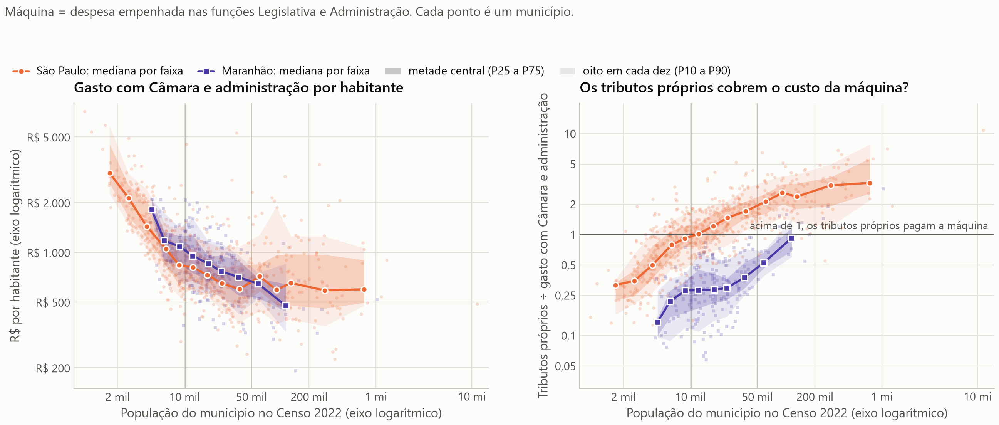

A economia de escala é forte no município minúsculo e se esgota perto de 20 mil habitantes. Até 5 mil habitantes, dobrar a população corta o gasto por habitante quase pela metade. De 5 a 20 mil, o corte é bem menor. De 20 a 100 mil, o efeito não se distingue de zero. Essas estimativas por trecho são das duas regiões juntas e foram feitas depois de ver a curva. O número único registrado antes, uma queda média de 0,28% no gasto por habitante para cada 1% a mais de população, esconde a curva.

Entre as regiões não há diferença estável a tamanho igual: -2% na média, indistinguível de zero, e -7% na mediana, com o Sudeste abaixo.

> **Ressalva.** A medida não é comparável entre estados. Em São Paulo quase toda a administração geral está na função de administração. Fora de São Paulo, a administração da saúde e da educação costuma ser lançada dentro dessas duas funções. A medida usada é um piso. Somando a administração geral de todas as funções chega-se a um teto, que no município mediano do Maranhão é 59% maior que o piso e no de São Paulo é igual a ele.

Os tributos próprios não pagam a Câmara e a administração em 91% dos municípios paulistas de até 5 mil habitantes, em 64% dos de 5 a 10 mil e em 13% dos de 20 a 50 mil. No Maranhão, não pagam em 96% de todos os municípios, e ainda em 83% dos de 50 a 100 mil habitantes. Essa conta inclui o imposto de renda retido na fonte como tributo próprio. Sem ele, os percentuais sobem para 96%, 77% e 25% em São Paulo e para 98% e 92% no Maranhão.

### 6.2 A simulação do critério da PEC 188

A PEC 188/2019 previa que o município de até 5 mil habitantes que não comprovasse, até 30/06/2023, impostos próprios de ao menos 10% da receita fosse incorporado a um vizinho a partir de 1º/01/2025. O texto dizia "incorporado"; os títulos da imprensa de novembro de 2019 disseram "extinguir". O estudo simulou o critério sobre as contas de 2024, na leitura da Confederação Nacional de Municípios (CNM), que usou a receita corrente líquida como denominador (CONFEDERAÇÃO NACIONAL DE MUNICÍPIOS, [2019?]). Cairiam no critério 242 municípios em Minas Gerais, 133 em São Paulo, 83 no Piauí, 68 na Paraíba, 49 no Rio Grande do Norte e 5 no Maranhão. O resultado fica perto da lista da CNM: 223, 135, 75, 68, 48 e 4.

A contagem usa todas as contas em que o critério é calculável, e não só as dos municípios com contas utilizáveis: 616 municípios nos 13 estados, 594 deles entre os utilizáveis. Em São Paulo, 133 e 121.

Na {fig:15_criterio_pec188_por_uf}, a ordem dos estados é a da malha de municípios minúsculos da seção 1, com Minas Gerais e São Paulo no topo.

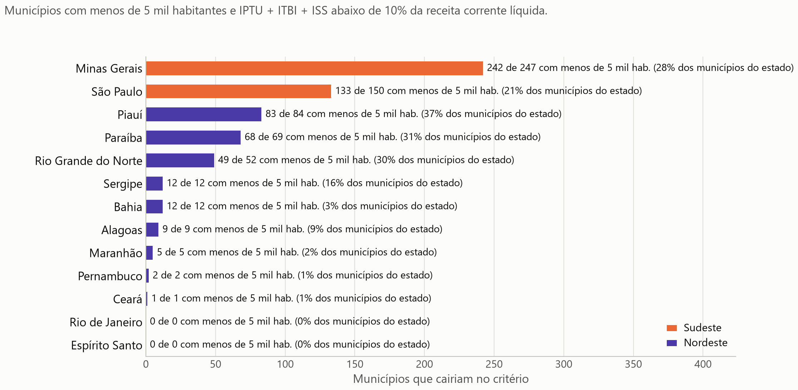

A PEC foi arquivada em 22/12/2022, sem votação, e não há proposta em tramitação com esse critério. O texto do artigo foi lido em duas transcrições secundárias iguais, e não na proposta protocolada; a simulação segue a leitura da CNM, entidade que representa as prefeituras e se opôs à proposta (CONFEDERAÇÃO NACIONAL DE MUNICÍPIOS, [2019]).

### 6.3 FUNDEB (intraestadual): quem aporta e quem recebe

Dos municípios paulistas de até 5 mil habitantes, 93% são doadores líquidos do FUNDEB: aportam 20% de um FPM e de um ICMS grandes para o tamanho deles e têm poucos alunos. No Sudeste são 91%. No Nordeste, 21% na mesma faixa e 1% de 5 a 50 mil habitantes. No Maranhão, nenhum dos cinco. O resultado resiste a tirar os 62 municípios com aporte suspeito, 27 deles no Piauí: 93% em São Paulo, 91% no Sudeste e 22% no Nordeste.

Esse dinheiro não sai de São Paulo para o Maranhão. O FUNDEB não é um fundo nacional: são 27 fundos independentes, um por estado e um do Distrito Federal. Cada fundo reparte, dentro do próprio estado, o que o governo estadual e as prefeituras dali aportaram, conforme as matrículas. Só a complementação da União cruza a divisa.

Nas contas de 2024 dos 3.356 municípios, as prefeituras aportaram R$ 57,2 bi, receberam dos fundos dos seus estados R$ 105,0 bi e receberam R$ 30,0 bi de complementação da União, que é 22,2% do FUNDEB recebido. Separando: a complementação é 3,8% do FUNDEB recebido no Sudeste e 38,4% no Nordeste. Em São Paulo as prefeituras aportaram R$ 19,3 bi e receberam do fundo paulista R$ 32,1 bi; a complementação foi de R$ 0,35 bi, ou 1,1% do FUNDEB recebido, e 244 das 628 prefeituras aportam mais do que recebem. No Maranhão as prefeituras aportaram R$ 2,6 bi e receberam do fundo maranhense R$ 5,8 bi; a complementação foi de R$ 7,4 bi, ou 56,0% do FUNDEB recebido. Todas as 215 recebem complementação e só 1 aporta mais do que recebe. Por habitante, a mediana do FUNDEB recebido é de R$ 843 em São Paulo e de R$ 2.206 no Maranhão (tabela docs/tabelas/r5_n2_fundeb_intraestadual.csv). A base vê só as prefeituras: o aporte do governo de cada estado ao seu fundo não está nela.

Dentro do fundo paulista, o município minúsculo perde para os que têm mais alunos. Dentro do maranhense, quase todos os municípios ganham, do governo do estado e da complementação da União. O resultado é uma diferença de natureza: o dinheiro de fora do município pequeno paulista é livre, vindo de FPM e ICMS, e o do maranhense é carimbado para a educação. A seção 3.4 mede essa diferença. As contas anuais não separam os três tipos de complementação da União.

> **O que o dado diz à pergunta.** O município minúsculo paulista não paga a própria Câmara e a própria administração com o que arrecada, e nisso se parece com o maranhense. A diferença está no tipo de dinheiro que recebe: livre em São Paulo, vinculado à educação no Maranhão.

## 7. A nota C da CAPAG aparece na mesma proporção nos dois estados

A CAPAG é a nota de capacidade de pagamento do Tesouro Nacional. Ela mede endividamento, poupança corrente e liquidez. Não mede autonomia: um município pode viver de transferência e ter nota A.

Tabela. Distribuição das notas da CAPAG sobre todos os municípios de cada grupo, posição de 01/09/2026

| Nota | SP | MA | Sudeste | Nordeste |
|---|---:|---:|---:|---:|
| A ou A+ | 22,0% | 14,3% | 25,1% | 9,6% |
| B ou B+ | 13,5% | 18,4% | 18,8% | 21,6% |
| C | 60,2% | 56,7% | 47,9% | 55,6% |
| D | 0,2% | 0,0% | 0,1% | 1,0% |
| Sem nota | 4,2% | 10,6% | 8,2% | 12,2% |

Entre os municípios que têm nota, a C aparece em 63% dos paulistas e em 63% dos maranhenses. No Nordeste também são 63%, e no Sudeste, 52%, puxado pelo Espírito Santo, com 19%, e por Minas Gerais, com 45%. Na nota C os dois estados empatam. No topo São Paulo está melhor: A ou A+ em 23% dos que têm nota, contra 16% no Maranhão (BRASIL, 2026b).

O índice IFGF Autonomia, da Firjan, mede outra coisa e dá o resultado oposto. Ele conta a cota-parte do ICMS como receita local, o que favorece o município com indústria ou usina. A mediana paulista bate no teto do índice, 1,00, e a maranhense no piso, 0,00. Nos municípios paulistas de até 10 mil habitantes a mediana é 0,7, e nos do Sudeste, 0,3. A Firjan é uma federação de indústrias, e a escolha de tratar o ICMS como receita local é dela.

> **O que o dado diz à pergunta.** A nota de capacidade de pagamento não separa os dois estados na faixa de baixo: nessa medida, empate. Mas ela não mede dependência, e o índice que tenta medi-la põe São Paulo no teto e o Maranhão no piso.

## 8. A população publicada se concentra logo acima dos degraus do FPM

O FPM divide os municípios do interior em faixas de população, e cada degrau para cima aumenta a cota. Se a população publicada fosse indiferente à regra, haveria tantos municípios logo abaixo de um degrau quanto logo acima.

Tabela. Municípios do país com população até 2% acima e até 2% abaixo dos degraus do FPM

| Recorte | Até 2% acima | Até 2% abaixo |
|---|---:|---:|
| Censo 2022, soma dos 17 degraus | 546 | 189 |
| Censo 2022, degrau de 10.188 habitantes | 104 | 20 |
| Censo 2010, soma dos 17 degraus | 479 | 157 |

Há mais municípios logo acima do degrau do que logo abaixo. No Censo 2022, 74% dos municípios vizinhos de um degrau estão acima dele; o acaso daria perto de 50% (IBGE, 2023). A diferença resiste a trocar a janela de 2% por uma janela fixa em habitantes, não aparece em degraus falsos deslocados e existe nas cinco Grandes Regiões do país.

A soma não quer dizer que a diferença exista em cada degrau. Um teste de densidade degrau a degrau, pelo método de Cattaneo, Jansson e Ma, foi rodado pela revisão cruzada e não foi refeito pelo autor. Com correção para 17 comparações, ele aponta quebra em quatro degraus no Censo 2022, os de 10.188, 13.584, 16.980 e 23.772 habitantes, e em cinco no Censo 2010, os mesmos e o de 30.564. Em 10.188 habitantes, a densidade logo acima é 4,82 vezes a de logo abaixo em 2022 e 7,45 vezes em 2010. Cinco degraus têm municípios de menos para testar.

Nas estimativas de 2024 a 2026 a concentração não some, ela se desloca. A estimativa é o Censo multiplicado por um fator de crescimento, então quem estava até 2% acima do degrau em 2022 aparece de 2% a 5% acima em 2024.

O autor esperava não achar esse padrão no Censo 2022 e estava errado. O dado mostra a concentração e não mede a causa. O estudo não afirma nenhuma. As causas possíveis são quatro, sem ordem de importância:

- esforço de coleta e contestação por parte de quem ficaria logo abaixo do degrau;
- decisão judicial que fixa população acima da do Censo, noticiada em reportagem do Valor de 22/02/2026 que a revisão cruzada citou e o autor não abriu;
- população usada pelo Tribunal de Contas da União diferente da do Censo final, caso de 111 municípios do estudo, 13 deles perto do primeiro degrau, segundo conta da revisão cruzada que não atribuiu a diferença a decisão judicial sem olhar caso a caso;
- um padrão antigo, já apontado na literatura para o Censo 2010 (MONASTERIO, 2013).

A literatura dos degraus do FPM já registra a quebra nos anos de Censo e a contorna com as estimativas anuais de população. Corbi, Papaioannou e Surico (2019) acham nos gráficos de densidade o que chamam de manipulação nos anos de Censo, refazem as contas sem esses anos, e o resultado quase não muda. Litschig (2012) documenta a quebra nas estimativas usadas no FPM de 1991. O achado desta seção é de Censo e é coerente com os dois. O primeiro artigo estima ainda um multiplicador local das transferências perto de 2: cada real de FPM a mais gera cerca de dois reais de renda no município. A conta da seção 12 com um FPM proporcional não mede esse efeito.

Falta medir quanto pesa cada causa. Há um complicador, a Lei Complementar 198/2023, que protege o coeficiente de quem perdeu população (BRASIL, 2023). Nos 13 estados deste estudo, dos 15 municípios com população até 2% abaixo do primeiro degrau, de 10.188 habitantes, 13 têm o coeficiente protegido (87%); dos 77 até 2% acima, 3 (4%). A revisão cruzada deu 53,6% e 4,5% para o país, sem dizer a janela, e essa conta não foi refeita. A lei reduz aos poucos o coeficiente de quem perdeu população: corta 10% do ganho no primeiro exercício, 20% no segundo, até 90% no nono, e no décimo vale só a população. Subir de faixa hoje muda pouco o coeficiente efetivo desses municípios.

> **O que o dado diz à pergunta.** Nada diretamente. O recado é de método: perto dos degraus do FPM a população publicada não é uma medida neutra do tamanho, e toda comparação "a tamanho igual" deste relatório carrega essa imprecisão.

## 9. Em 23 anos a dependência caiu três pontos e a distância entre os dois estados ficou igual

A série longa vem do IPEADATA, que publica as séries municipais da Secretaria do Tesouro Nacional (IPEA, 2026). É receita bruta, com os mesmos totais das contas anuais. A dependência desta seção é transferência corrente sobre receita corrente bruta. Não é a mesma medida da seção 3, e os níveis das duas não se comparam: os da série longa ficam alguns pontos acima. A série serve para ver tendência.

As comparações começam em 2002 de propósito. Até 2001 o imposto de renda retido na fonte entrava como transferência e a função de administração tinha outra classificação. Comparar com 2000 fabrica uma queda que não existiu. As figuras mostram a série desde 2000, sem 2008, ano em que a cobertura do Nordeste ficou abaixo de 85%.

> **Como ler.** Em cada quadro das figuras desta seção, a linha é a mediana do grupo. A mancha escura cobre a metade central dos municípios e a mancha clara, oito em cada dez. Os pontos soltos são os municípios fora da curva, além do limite convencional de afastamento em relação à metade central. O número no alto de cada ano conta quantos são, e o triângulo avisa que há algum além do eixo.

A {fig:41_longo_dep_corrente_SP_MA} separa os municípios em três tamanhos: até 10 mil, de 10 a 50 mil e mais de 50 mil habitantes. É um recorte diferente do da tabela de quatro indicadores desta seção, que é de até 20 mil habitantes. Nos quadros de até 50 mil habitantes, olhe a inclinação da linha, quase plana até 2021, e a largura da mancha, estreita no Maranhão e larga em São Paulo. Os rótulos da figura marcam 2000 e 2025; as comparações do texto partem de 2002.

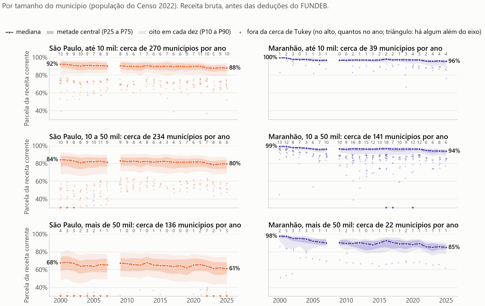

Tabela. Mediana de quatro indicadores nos municípios de até 20 mil habitantes de São Paulo e do Maranhão, em parcela da receita corrente

| Indicador | 2002 | 2025 | Mudança em pontos | Intervalo de 95% |
|---|---:|---:|---:|---:|
| Transferências correntes, SP | 89,1% | 86,3% | -2,7 | -3,2 a -2,2 |
| Transferências correntes, MA | 97,7% | 94,7% | -3,2 | -4,2 a -2,8 |
| FPM, SP | 37,5% | 35,5% | -1,6 | -2,1 a -0,9 |
| FPM, MA | 52,5% | 29,0% | -23,2 | -24,9 a -21,3 |
| Cota-parte do ICMS, SP | 26,2% | 20,9% | -5,4 | -5,9 a -4,9 |
| Cota-parte do ICMS, MA | 4,6% | 9,2% | +4,9 | 4,1 a 6,0 |
| Câmara e administração, SP | 18,3% | 13,1% | -4,6 | -5,2 a -4,1 |
| Câmara e administração, MA | 20,7% | 14,4% | -6,7 | -8,2 a -4,5 |

As colunas de 2002 e de 2025 trazem a mediana dos municípios de cada ano, a mesma do deck e do Apêndice A. A mudança é a mediana da variação dentro de cada município presente nos dois anos, e por isso não é a subtração exata das duas colunas.

Média e desvio\* das linhas que os têm calculados, em 2002 e em 2025: transferências correntes em São Paulo, 87,7% ± 8,1 e 85,2% ± 6,5; no Maranhão, 97,5% ± 1,7 e 93,8% ± 3,1; FPM em São Paulo, 38,7% ± 13,0 e 37,5% ± 10,8; cota-parte do ICMS em São Paulo, 27,5% ± 8,4 e 21,7% ± 6,6. Em São Paulo o desvio da dependência encolheu, de 8,1 para 6,5 pontos; no Maranhão quase dobrou, de 1,7 para 3,1.

### 9.1 O que tem teste e o que não tem

Três tipos de afirmação desta seção passaram por teste, todos com municípios de até 20 mil habitantes. O primeiro é a mudança de 2002 a 2025 dentro do mesmo município, que está na tabela de quatro indicadores. O segundo é a tendência por década. O terceiro é a comparação entre a mudança do Sudeste e a do Nordeste. Todas as mudanças da tabela resistem à correção para comparações múltiplas. A exceção, fora da tabela, é a cota-parte do ICMS no Nordeste, que ficou parada: de 7,9% para 7,8% da receita corrente, variação que não se distingue de zero.

Entre as regiões, a mediana da dependência foi de 92,3% em 2002 para 88,7% em 2025 no Sudeste e de 96,7% para 93,0% no Nordeste. Dentro de cada município presente nos dois anos, a queda mediana foi de 3,1 pontos percentuais no Sudeste e de 3,4 no Nordeste; ela não é a subtração das duas medianas. A diferença entre as duas quedas, medida pela mediana das diferenças entre pares de municípios, um de cada região, é de 0,6 ponto, com intervalo de 0,3 a 1,0. No peso do FPM, a mediana foi de 49,7% (média 46,4% ± 15,7)\* para 40,9% (média 40,6% ± 11,5)\* no Sudeste e de 52,5% (média 52,3% ± 12,3)\* para 36,1% (média 37,0% ± 9,0)\* no Nordeste. Dentro de cada município, a queda mediana foi de 6,5 pontos no Sudeste e de 16,1 no Nordeste; a diferença, de 9,4 pontos, tem intervalo de 8,7 a 10,2.

Não têm teste as afirmações sobre quando a mudança ocorreu, sobre a causa dela e sobre a ordem dos estados. Elas vêm da leitura das curvas e de contas auxiliares, e estão marcadas como tal a seguir.

### 9.2 A dependência ficou parada até 2021

De 2002 a 2021 a mediana da dependência caiu cerca de um ponto. Os outros dois ou três pontos vieram depois de 2021, e a maior parte não é imposto próprio. Segundo conta da revisão cruzada, não refeita pelo autor, de 2021 para 2022, nos municípios de até 10 mil habitantes, a dependência caiu 1,4 ponto nos dois estados e o rendimento de aplicações financeiras subiu 1,4 ponto da receita em São Paulo e 0,6 no Maranhão. O rendimento explica a queda em São Paulo e menos da metade no Maranhão. Que a causa seja o juro alto continua hipótese.

A distância entre São Paulo e o Maranhão é a de 2002, cerca de 8,5 pontos (8,6 em 2002 e 8,5 em 2025). Por estado, a ordem da dependência quase não mudou em 23 anos: Maranhão, Paraíba, Bahia e Piauí no topo, São Paulo e Rio de Janeiro no fim. Na {fig:47_longo_dep_corrente_por_uf}, cada estado tem um quadro, do mais dependente para o menos dependente em 2025. Em todos a mediana desce poucos pontos entre 2000 e 2025, sem mudar de patamar.

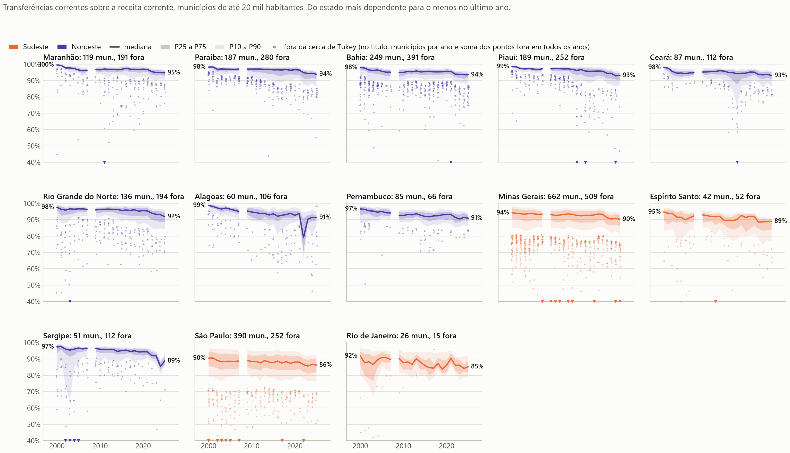

O ano de 2024 não é exceção. No painel de 2022 a 2025, com a mesma receita líquida da seção 3, a dependência do município de até 10 mil habitantes ficou entre 87,1% e 88,3% em São Paulo e entre 95,2% e 95,7% no Maranhão. Nos 13 estados é igual: entre 90,0% e 90,9% no Sudeste e entre 94,0% e 94,9% no Nordeste.

### 9.3 O FPM perdeu peso no Nordeste e o ICMS, no interior paulista

O peso do FPM caiu muito mais no Nordeste que no Sudeste. No Maranhão caiu quase à metade, com o FUNDEB e o ICMS ocupando o lugar. É troca de uma transferência por outra, sem ganho de base própria.

Na {fig:43_longo_pct_fpm_rc_SE_NE}, o Sudeste está na coluna da esquerda e o Nordeste na da direita, em três tamanhos de município. Compare os rótulos de 2000 e de 2025: nos municípios de até 10 mil habitantes, o Nordeste começa acima do Sudeste, com 58% contra 50%, e termina abaixo, com 40% contra 44%. O recorte da figura não é o de até 20 mil habitantes dos testes, que partem de 2002.

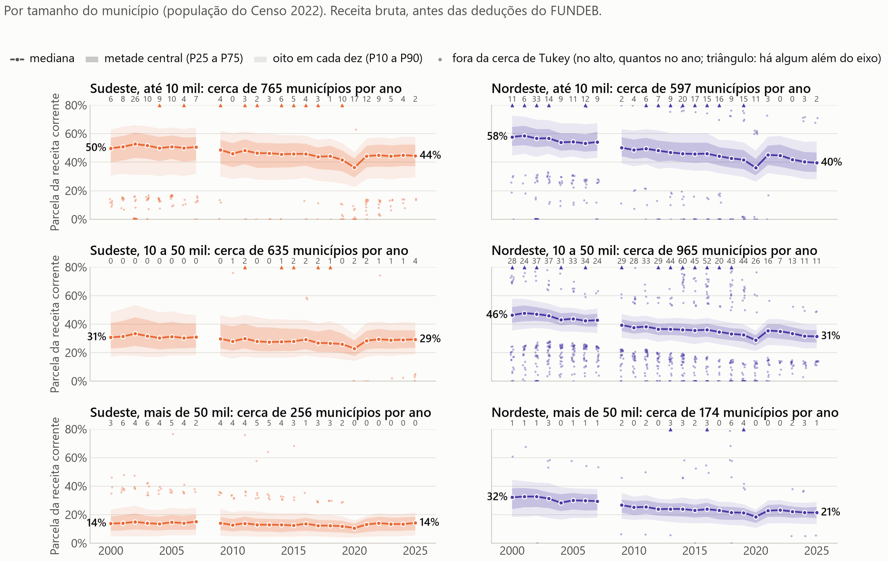

Em São Paulo o FPM desceu até 2020 e voltou; hoje pesa quase o mesmo que em 2002 (37,5% em 2002, 27,5% em 2020, 35,5% em 2025). Parte da volta é regra. A Emenda Constitucional 112/2021 acrescentou ao fundo 0,25% da arrecadação do imposto de renda e do IPI em 2022 e 2023, 0,5% em 2024 e 1% a partir de 2025 (Constituição, art. 159, I, "f"; os anos saem da contagem dos exercícios prevista na emenda). O fundo passou de 24,75% dessa arrecadação em 2022 para 25,5% em 2025, cerca de 3% a mais só pela regra. No painel de 2022 a 2025, o peso do FPM no município de até 10 mil habitantes subiu de 33,6% para 36,0% no paulista e caiu de 30,3% para 27,3% no maranhense.

A {fig:23_evolucao_pct_fpm_SE_NE} traz o mesmo painel para as duas regiões, com o Sudeste à esquerda e o Nordeste à direita, em três tamanhos de município. No quadro de até 10 mil habitantes, a linha do Sudeste fica parada: o FPM era 38,1% da receita em 2022 e 38,6% em 2025. A do Nordeste desce todo ano, de 39,2% para 34,1%. De 10 a 50 mil habitantes o desenho se repete, com 26% nos dois anos no Sudeste e queda de 31% para 27% no Nordeste. O Sudeste pequeno só passou à frente do Nordeste a partir de 2023. O município pequeno paulista, com 36,0%, está perto do nordestino.

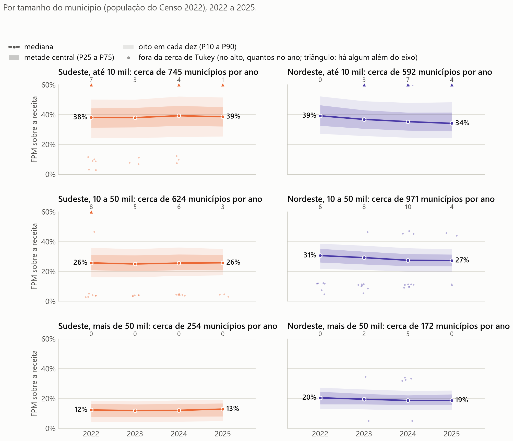

A cota-parte do ICMS perdeu um quinto do peso no município pequeno paulista e dobrou no maranhense. É a fonte que mais distingue o interior paulista do nordestino, e a distância está encolhendo. A regra de rateio mudou dentro do período nos dois estados; no Maranhão, por lei estadual de 2022 com repasse pela regra nova desde 2024, segundo a revisão cruzada, em informação que o autor não conferiu na lei.

O peso da Câmara e da administração na receita corrente caiu em todo lugar, de 5 a 7 pontos, sem diferença entre Sudeste e Nordeste. No Maranhão a série oscila muito, com mínimo de 13% em 2012 (13,1%).

### 9.4 A média de três anos confirma o retrato de 2024

As comparações entre São Paulo e Maranhão foram refeitas com a média de 2023 a 2025, em reais de 2025, no painel de 830 municípios com contas utilizáveis nos três anos, 617 paulistas e 213 maranhenses. Os resultados já apareceram em cada seção e batem com os de 2024. As conclusões entre os dois estados não dependem do ano. O triênio serve como faixa, não como número novo, porque 2023 e 2025 não passaram pela mesma conferência de 2024. O investimento mediano por habitante em São Paulo, em reais de 2025, foi de R$ 640 em 2023, R$ 565 em 2024 e R$ 376 em 2025, de modo que 2024 não aparece como pico.

### 9.5 Nos 13 estados, 2024 não distorce o retrato; a exceção é o investimento

O ano de 2024 teve eleição municipal. A média de 2023 a 2025 mostra se isso distorce o retrato. A base tem 2022 a 2025 dos 13 estados. O painel do triênio reúne 3.261 municípios com contas utilizáveis em 2023, 2024 e 2025: 1.594 no Sudeste e 1.667 no Nordeste. Ficam fora 95 dos 3.356 de 2024.

Tabela. Sudeste contra Nordeste a tamanho igual, só 2024 e média de 2023 a 2025

| Comparação | Só 2024 | Média de 2023 a 2025 | Intervalo do triênio com erro agrupado por estado |
|---|---:|---:|---:|
| Dependência do Nordeste a mais, até 50 mil hab. (pontos) | 6,7 | 7,1 | 3,5 a 10,8 |
| Transferências por habitante no Sudeste, até 5 mil hab. | -0,6% | +0,8% | -3,4% a +5,3% |
| Transferências por habitante no Sudeste, 5 a 50 mil hab. | -5,0% | -3,5% | -13,3% a +7,4% |
| Verba federal restrita no Sudeste (pontos) | -1,2 | -1,2 | -2,4 a 0,0 |
| Verba estadual restrita no Sudeste (pontos) | +2,1 | +2,1 | +1,4 a +2,9 |
| Custo da máquina por habitante no Sudeste, até 5 mil hab. | -16,9% | -15,5% | -29,6% a +1,4% |
| FPM como maior fatia, Sudeste e Nordeste (% dos municípios) | 65,0 e 46,6 | 65,1 e 46,8 | não se aplica |

A resposta é que não distorce, no que o estudo afirma. A dependência a tamanho igual vai de 6,7 para 7,1 pontos, e 2024 dá a menor diferença dos três anos (7,7 em 2023 e 7,0 em 2025): o retrato publicado é o lado conservador. As transferências por habitante empatam nos dois recortes. A verba negociada e o custo da máquina ficam iguais; a queda do custo por habitante com a população vai de 0,275% para 0,278% a cada 1% a mais de população.

No FPM como maior fatia, o triênio repete 2024, mas há tendência: a distância entre as regiões foi de 11,6 pontos em 2023, 19,0 em 2024 e 22,2 em 2025, porque no Nordeste o FUNDEB vem passando o FPM. Por estado, 2024 fica a até 2 pontos do triênio em dez dos treze. Fogem Sergipe (62,7% em 2024 e 54,7% no triênio), Pernambuco (63,4% e 68,1%) e Espírito Santo (44,9% e 48,7%).

O ano de 2024 pesa no investimento. No Nordeste ele é o pico dos três anos: na faixa de 10 a 20 mil habitantes, R$ 347 por habitante em 2023 (média R$ 441 ± 348)\*, R$ 507 em 2024 (média R$ 643 ± 497)\* e R$ 421 em 2025 (média R$ 530 ± 398)\*, em reais de 2025. No Sudeste, 2024 repete 2023 e 2025 cai um terço: R$ 1.243, R$ 1.292 e R$ 864 na faixa de até 5 mil habitantes. O estudo não tem achado apoiado no investimento, mas toda razão "sobre o investimento" da seção 5 herda essa oscilação.

Sergipe é o estado em que 2024 foge por outro motivo. A dependência mediana até 20 mil habitantes foi de 91,3% em 2023 (média 90,0% ± 7,4)\*, 84,6% em 2024 (média 83,9% ± 6,0)\* e 88,7% em 2025 (média 87,8% ± 4,1)\*. Em 2024 as demais receitas próprias dos municípios sergipanos saltaram de R$ 94 para R$ 584 por habitante. É receita de uma vez só. A causa provável é a outorga da concessão de saneamento; a seção 9.6 traz o que se sabe dela.

> **Ressalva.** Entre regiões, o intervalo que vale é o de erro agrupado por estado, e ele é largo: são 13 estados. Com ele, a diferença de dependência continua longe de zero (3,5 a 10,8 pontos), a de verba estadual também, a de verba federal encosta no zero e a do custo da máquina até 5 mil habitantes passa por ele. Os anos de 2023 e 2025 não passaram pela conferência de 2024: os alertas de FPM e de FUNDEB só existem para 2024. As transferências por habitante no Nordeste sobem 17% em termos reais de 2023 para 2024, na mediana dos municípios utilizáveis de cada ano até 20 mil habitantes (16,5% no painel dos três anos); essa alta não foi conferida em fonte externa.

### 9.6 O que mexeu nos anos de salto

As curvas desta seção têm degraus em alguns anos. Esta conta abre cada degrau em numerador e denominador. Ela usa os valores brutos da série longa, os municípios de até 20 mil habitantes presentes nos dois anos de cada par e a variação nominal mediana, município a município. A série mostra o que mexeu. Não mostra a causa.

Tabela. FPM sobre a receita corrente nos anos de salto, municípios de até 20 mil habitantes

| De um ano ao outro | Sudeste: peso do FPM | FPM | Receita corrente | Nordeste: peso do FPM | FPM | Receita corrente |
|---|---:|---:|---:|---:|---:|---:|
| 2018 a 2019 | 40,2% para 37,9% | +8,9% | +13,4% | 38,2% para 37,3% | +8,8% | +8,5% |
| 2019 a 2020 | 37,9% para 32,6% | -4,6% | +9,0% | 37,2% para 32,8% | -4,5% | +8,4% |
| 2020 a 2021 | 32,6% para 40,2% | +45,7% | +19,0% | 32,8% para 40,6% | +45,6% | +16,4% |
| 2021 a 2022 | 40,2% para 41,3% | +25,8% | +22,1% | 40,6% para 40,3% | +25,8% | +27,2% |

Cada linha conta só os municípios presentes nos dois anos do par. Por isso o Nordeste termina 2019 em 37,3% numa linha e começa em 37,2% na seguinte.

O desenho é o mesmo nas duas regiões. Em 2020 mexeram os dois lados: o FPM caiu 4,6% em valor nominal e a receita corrente subiu 9%, puxada pelas transferências que não são FPM, que cresceram 20,6% no Sudeste e 17,9% no Nordeste. O peso do FPM caiu em 95% dos municípios do Sudeste e em 89% dos do Nordeste. Em 2021 a volta foi do numerador: o FPM subiu 46% em valor nominal, e as demais transferências ficaram paradas, com +3,5% no Sudeste e +0,1% no Nordeste. Em 2022 o FPM e a receita corrente cresceram juntos, perto de 25%, e a razão ficou. Depois de 2022 as regiões se separam pelo denominador: de 2023 a 2024 o FPM cresceu 16,2% nas duas, mas a receita corrente cresceu 13,5% no Sudeste e 20,9% no Nordeste, com as outras transferências a +24,0% no Nordeste.

A regra de 2020 é compatível com esses números. A Lei Complementar 173 mandou a União entregar R$ 23 bi aos municípios em quatro parcelas naquele ano (BRASIL, 2020a), e a Lei 14.041 cobriu a queda nominal do FPM de março a novembro contra 2019, com dinheiro que não é FPM (BRASIL, 2020b). As duas leis foram lidas; o tamanho do efeito de cada uma na série não foi medido.

Nos tributos próprios do Sudeste o degrau é de 2016 a 2018. O peso na receita corrente foi de 4,13% em 2015 para 3,62% em 2016, voltou a 4,30% em 2017 e chegou a 4,82% em 2018. A queda de 2016 foi do denominador: os tributos subiram 5,7% e a receita corrente, 12,5%, com o FPM a +14,5%. Em 2017 o denominador parou, com +1,0%. A alta de 2018 foi do numerador: os tributos subiram 20,2% em um ano, contra 5,2% da receita corrente, e o peso subiu em 75% dos municípios. No Nordeste o desenho é o mesmo e menor: 2,08% em 2016, 2,28% em 2017 e 2,55% em 2018.

Tabela. Dependência nos estados com salto, municípios de até 20 mil habitantes, série longa

| Estado e anos | Mediana da dependência | Transferências | Receita corrente | Resto da receita corrente, soma |
|---|---:|---:|---:|---:|
| Alagoas, 2021 a 2022 | 93,8% para 80,3% | +28,2% | +49,5% | R$ 152 milhões para R$ 764 milhões |
| Alagoas, 2022 a 2023 | 80,3% para 90,4% | +6,6% | -4,8% | R$ 759 milhões para R$ 287 milhões |
| Sergipe, 2023 a 2024 | 91,9% para 85,5% | +16,4% | +22,5% | R$ 170 milhões para R$ 321 milhões |
| Sergipe, 2024 a 2025 | 85,5% para 88,8% | +14,8% | +11,0% | R$ 321 milhões para R$ 213 milhões |
| Ceará, 2016 a 2017 | 95,0% para 94,4% | -1,7% | -0,1% | R$ 156 milhões para R$ 228 milhões |

O resto é a receita corrente que não é transferência nem tributo: patrimonial, contribuições, serviços e outras receitas correntes. A soma muda de um par para o outro porque cada par conta só os municípios presentes nos seus dois anos. Os níveis são os da série longa, bruta, e por isso diferem dos da seção 9.5. Na série anual, com todos os municípios de cada ano, a média e o desvio\* da dependência são: em Alagoas, 92,8% ± 5,4 em 2021, 80,6% ± 10,8 em 2022 e 89,9% ± 4,9 em 2023; em Sergipe, 90,4% ± 7,1 em 2023, 85,3% ± 4,3 em 2024 e 88,4% ± 3,8 em 2025; no Ceará, 92,3% ± 6,0 em 2016 e 88,4% ± 14,7 em 2017. As variações de transferências e de receita corrente são medianas das variações de cada município; a média e o desvio delas não foram calculados.

Em Alagoas, 2022 é o maior salto da série, de 13,5 pontos, e é do denominador. As transferências cresceram como nos outros estados, e o resto da receita corrente foi multiplicado por cinco: de 4,7% para 16,1% da receita corrente do grupo. A dependência caiu em 88% dos municípios, e em 31 de 60 a queda passou de 10 pontos. Em 2023 o resto voltou a 6,4% e a mediana voltou a 90%. Em Sergipe, 2024 tem o mesmo desenho, menor: queda de 6,4 pontos em 96% dos municípios, com o resto da receita corrente ao menos dobrando em 44 de 51, e devolução de metade em 2025.

No Ceará de 2017 a mediana quase não mexe. O que aparece no gráfico é a mancha: o décimo inferior cai de 84,1% para 74,6% e o desvio vai de 6,0 para 14,7 pontos. São 11 de 82 municípios com queda de mais de 10 pontos. Em 9 deles o resto da receita corrente foi multiplicado por 3 a 52. Os outros 2, Umari e Granjeiro, têm receita corrente quase zerada naquele ano: é declaração quebrada que passa pelo crivo da série.

> **Ressalva.** A série do IPEADATA não abre a conta que cresceu. Os números de Alagoas em 2022 e de Sergipe em 2024 são compatíveis com outorga de concessão de saneamento. Para Alagoas há notícia oficial: os blocos B e C do saneamento foram leiloados em 13/12/2021 por R$ 1,645 bi (GANDRA, 2021), e a Secretaria da Fazenda do estado informou, em 08/03/2022, que 61 municípios tinham recebido R$ 1,050 bi entre outorga e indenização (ALAGOAS, 2022).

> **Ressalva.** Para Sergipe há notícia de imprensa do leilão da concessão da Deso, em 04/09/2024, com outorga de R$ 4,5 bi para 74 municípios (CAMPOS JR., 2024); a divisão entre estado e municípios não tem fonte oficial conferida. Para o Ceará de 2017 a série não diz o que é, e a hipótese do precatório do antigo FUNDEF não tem fonte que a confirme. Os números desta seção estão nas tabelas r5_n2_saltos de docs/tabelas.

> **O que o dado diz à pergunta.** A distância entre o interior paulista e o maranhense é antiga e estável: cerca de 8,5 pontos em 2002 e em 2025. O que mudou aproxima os dois em um ponto só, o ICMS, que pesa menos em São Paulo e mais no Maranhão do que há 23 anos.

## 10. O oeste paulista concentra os municípios pequenos, mas a tamanho igual não depende mais que o resto do estado

São Paulo tem 11 regiões geográficas intermediárias, a divisão do IBGE de 2017 dentro de cada estado. Ordenadas pela mediana da parcela da receita que vem de transferências em 2024, as quatro primeiras são as do oeste: Presidente Prudente, com 87,3% (média 85,0% ± 8,5)\* em 55 municípios; Marília, com 87,1% (média 84,1% ± 9,9)\* em 54; Araçatuba, com 85,6% (média 83,6% ± 8,1)\* em 41; e São José do Rio Preto, com 85,4% (média 83,1% ± 9,3)\* em 87. São também as de município menor. O município mediano tem 7.085 habitantes na região intermediária de Presidente Prudente, 6.383 na de Marília, 5.519 na de Araçatuba e 6.867 na de São José do Rio Preto. O FPM é a maior fatia da receita em 76,4%, 64,8%, 68,3% e 67,8% dos municípios dessas quatro regiões intermediárias.

No meio da lista ficam Sorocaba, com 83,1% (média 80,6% ± 10,5)\*, Bauru, com 82,9% (média 80,5% ± 9,1)\*, Ribeirão Preto, com 80,0% (média 78,3% ± 10,2)\*, Araraquara, com 77,3% (média 76,3% ± 10,6)\*, e São José dos Campos, com 76,5% (média 76,4% ± 13,3)\*. No fim, Campinas, com 72,3% (média 70,3% ± 11,4)\* e município mediano de 31.328 habitantes, e São Paulo, com 65,6% (média 62,1% ± 15,1)\* e município mediano de 149.477. Na região intermediária de Campinas o FPM é a maior fatia em 35,6% dos municípios, e na de São Paulo, em 14,0%. Nenhuma região intermediária do Maranhão fica abaixo de 92%.

A {fig:49_longo_dep_corrente_SP_regioes_1} mostra as quatro regiões intermediárias do oeste na série longa, com a medida bruta da seção 9, um quadro para cada uma. Os quatro quadros se parecem: mediana perto de 90% em 2000 e entre 85% e 88% em 2025.

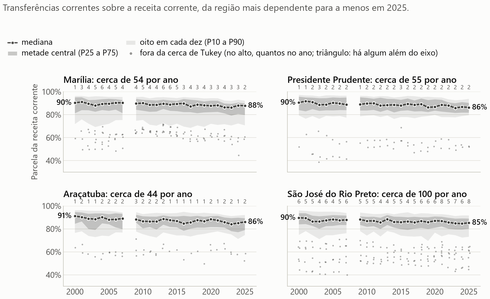

A tamanho igual, o oeste não se separa do resto do estado. Olhando só os municípios de 5 a 10 mil habitantes, nove das dez regiões intermediárias que têm município nessa faixa ficam entre 83% e 88%: de 83,5% em Araraquara, com 5 municípios, a 87,8% em Presidente Prudente, com 10. São José dos Campos, fora do oeste, tem 87,4% em 8 municípios. Só Campinas fica abaixo, com 76,9% em 11 municípios.

O teste confirma a leitura. Comparando municípios do mesmo tamanho, as quatro regiões intermediárias do oeste dependem 0,9 ponto percentual a mais que o resto do estado, com intervalo de 95% de -0,2 a +2,0, que inclui o zero. O interior profundo paulista tem endereço porque é no oeste que estão os municípios pequenos. Um município do oeste não depende mais que outro do mesmo tamanho no Vale do Paraíba ou na região intermediária de Sorocaba.

### 10.1 Nas regiões geográficas imediatas, quatro de São Paulo alcançam a menor do Maranhão

A região geográfica imediata é a divisão mais fina do IBGE de 2017, abaixo da intermediária. São Paulo tem 53 e o Maranhão, 22. A medida é a da seção 3, a parcela da receita que vem de transferências em 2024, nos municípios com contas utilizáveis.

Tabela. Dependência por região geográfica imediata em São Paulo e no Maranhão, contas de 2024

| Medida | São Paulo | Maranhão |
|---|---:|---:|
| Regiões imediatas | 53 | 22 |
| Municípios com contas utilizáveis | 628 | 215 |
| Dependência dos municípios, mediana | 81,2% | 94,1% |
| Dependência dos municípios, média e desvio\* | 78,2% ± 12,4 | 93,1% ± 4,4 |
| Menor mediana regional | 54,9% (Santos) | 89,4% (Açailândia) |
| Maior mediana regional | 92,2% (Piraju) | 96,1% (Pinheiro) |
| Regiões com mediana acima de 80% | 32 de 53 | 22 de 22 |
| Regiões com mediana acima de 90% | 3 de 53 | 21 de 22 |
| Desvio entre as medianas regionais | 8,6 | 1,4 |
| Variação entre municípios explicada pela região | 39% | 12% |

Três regiões imediatas paulistas passam de 90%: Piraju, com 92,2% (média 87,9% ± 6,2)\* em 5 municípios; Jales, com 91,1% (média 88,9% ± 5,8)\* em 13; e Itapeva, com 90,5% (média 88,4% ± 5,0)\* em 19. Logo abaixo vêm Araçatuba, com 89,5% (média 84,5% ± 8,9)\*; Marília, com 89,2% (média 85,7% ± 9,2)\*; Fernandópolis, com 88,9% (média 86,4% ± 7,5)\*; e Santa Fé do Sul, com 88,6% (média 84,0% ± 13,3)\*. As menos dependentes são Santos, com 54,9% (média 55,9% ± 16,4)\*; Caraguatatuba - Ubatuba - São Sebastião, com 59,9% (média 59,5% ± 7,4)\*; Campinas, com 64,9% (média 62,4% ± 11,5)\*; Amparo, com 66,0% (média 65,6% ± 9,6)\*; e São Paulo, com 67,0% (média 63,9% ± 14,0)\*.

Na escala fina as duas distribuições se tocam. Quatro regiões imediatas de São Paulo têm mediana igual ou acima da menor do Maranhão, a de Açailândia, com 89,4% (média 88,4% ± 4,3)\*: Piraju, Jales, Itapeva e Araçatuba. Duas do Maranhão ficam abaixo da maior de São Paulo: Açailândia e Balsas, com 92,0% (média 90,3% ± 4,9)\*. Na escala das regiões intermediárias isso não acontece.

No Maranhão a região quase não separa os municípios: as 22 medianas ficam entre 89,4% e 96,1%, e 20 delas acima de 92%. Em São Paulo a região separa bastante, e ainda assim há mais diferença dentro de cada região que entre elas: a região explica 39% da variação entre os municípios paulistas e 12% entre os maranhenses.

> **Ressalva.** Região imediata com 4 ou 5 municípios tem mediana instável, e Piraju tem 5. A mediana da região conta municípios; o agregado conta reais. Na região de São Luís a mediana é 93,4% e o agregado é 72,5%, por causa da capital; na de Marília, 89,2% e 67,6%. As 75 regiões estão em docs/tabelas/r5_n2_imediatas.csv, com mediana, média, desvio, mínimo, máximo e agregado.

> **O que o dado diz à pergunta.** O lugar se confirma, a causa não. A dependência alta do oeste paulista vem do tamanho dos municípios, não da região intermediária, e mesmo a região intermediária paulista mais dependente fica mais de quatro pontos abaixo da maranhense menos dependente. Só na escala mais fina, a das regiões imediatas, quatro paulistas alcançam a menos dependente do Maranhão.

<!-- parte: 20-regra.md -->

# Parte II. A regra, a escala e a representação

A Parte I mediu quanto da receita de cada município vem de fora. Esta parte trata das regras que produzem esse resultado: a que deixou criar município, a que reparte o Fundo de Participação dos Municípios (FPM), a que reparte as cadeiras do Congresso e a que reparte as emendas ao orçamento. O texto separa o que foi medido neste estudo, o que foi lido em outro autor e o que ficou sem conferir. A teoria de escala das cidades entra como teste do que o tamanho explicaria sem a regra.

## 11. São Paulo já tinha município minúsculo antes de 1988 e criou mais 51 depois

São Paulo tem 150 municípios de até 5 mil habitantes, 23,3% dos seus 645. O Maranhão tem 5, 2,3% dos seus 217 (IBGE, 2023). O Maranhão não criou poucos municípios. A diferença está no tamanho dos que cada estado criou e no que já existia antes.

### 11.1 O que a contagem de Tomio mostra

Tomio (2002, p. 64) contou os municípios criados de 1988 a 2000. No país foram 1.438, aumento de 35%; 765 (53%) nasceram com menos de 5 mil habitantes. São Paulo passou de 572 para 645 municípios: 73 novos, aumento de 13%, dos quais 51 (70%) com menos de 5 mil habitantes. O Maranhão passou de 132 para 217: 85 novos, aumento de 64%, dos quais 12 (14%) com menos de 5 mil e 35 (41%) com mais de 10 mil.

O Maranhão emancipou mais que São Paulo, em número e em proporção, e emancipou município médio. São Paulo emancipou pouco e quase só município minúsculo.

A explicação de Tomio para a quantidade é institucional: a lei complementar de cada estado, a posição do governador e o tamanho da coalizão na Assembleia. Em São Paulo, a primeira lei estadual, de 1990, foi "extremamente permissiva"; depois o governo se opôs e não teve maioria para endurecer a regra (TOMIO, 2002, p. 82-83). O FPM entra como incentivo: "garante a sobrevivência da maior parte das unidades emancipadas", e a perda de quem cede se dilui entre os municípios do mesmo estado (p. 70). O artigo é de ciência política. Explica a quantidade de emancipações e não mede o efeito fiscal.

### 11.2 O que Brandt mede: quem pagou a conta dentro de cada estado

Brandt (2010), consultora legislativa do Senado, estimou quanto do FPM de cada estado foi para os municípios pequenos criados depois de 1988. Há uma primeira versão, de 2008. O texto defende a exigência de estudo de viabilidade para novas emancipações, e a conta deve ser lida com isso em vista.

Em São Paulo, 62 municípios pequenos novos ficam com 4,4% do FPM do interior do estado. No Maranhão, 37 ficam com 8,7%; no Piauí, 104 com 36,5%; no Tocantins, 95 com 53,2% (BRANDT, 2010, p. 67). O município que cede população quase nunca muda de faixa. Quem paga são os outros municípios do estado.

Os dois estados exigiam o mesmo mínimo, 1.000 eleitores. Em São Paulo, a Lei Complementar 651/1990 pedia distrito criado há mais de dois anos, pelo menos 1.000 eleitores, centro urbano constituído e 3 km de descontinuidade do perímetro urbano (SÃO PAULO, 1990, art. 2º). No Maranhão o mínimo também era de 1.000 eleitores (BRANDT, 2010, p. 63-64; TOMIO, 2002, p. 78-79). O piso legal não explica por que os novos municípios maranhenses nasceram maiores, e a pergunta segue aberta. A tabela de Brandt conta 81 municípios novos no Maranhão, e a de Tomio, 85; as fontes diferem.

### 11.3 O que vem de antes de 1988

Se 51 dos municípios paulistas minúsculos nasceram depois de 1988 e hoje há 150 de até 5 mil habitantes, cerca de dois terços são anteriores. A conta é grosseira, porque compara população de datas diferentes. Borá, o menor do estado, é de 1965. Os 4,4% de Brandt apontam na mesma direção.

A única obra da lista sobre o interior paulista é a dissertação de Siqueira (2003), da Unicamp. A hipótese: até 1985, a criação de municípios acompanhou a ocupação do território, onde havia mais gente e mais economia; nos anos 1990, concentrou-se nas áreas de menores índices demográficos e econômicos. Nos casos estudados, 67 municípios em que predominavam os médios viraram 140 em que predominam os minúsculos (SIQUEIRA, 2003, p. 148-149). A hipótese se confirmou em 60% dos casos. A conclusão da autora: "uma única hipótese sobre o processo emancipatório não comporta satisfatoriamente a heterogeneidade do interior paulista" (p. 202).

A dissertação traz um ponto de 1990, de segunda mão: nos municípios paulistas de até 10 mil habitantes, o FPM era 39% da receita e a cota do ICMS, 29% (p. 149). A tese de doutorado da autora, sobre Campinas, serve por um ponto: desmembramento também acontece em região metropolitana rica (SIQUEIRA, 2008).

> **Ressalva.** Este estudo não datou a criação de cada município. Os dois terços anteriores a 1988 são estimativa. O motivo de o Maranhão ter criado municípios maiores também não está medido: as fontes mostram o fato e o mesmo piso legal nos dois estados.

### 11.4 O que a literatura fiscal tira disso

Gomes e Mac Dowell (2000), do IPEA, são a origem de boa parte do que se repete desde então. Com dados de 1996, mostram a receita própria dos municípios de até 5 mil habitantes em 10,1% da receita corrente no Sudeste e 2,9% no Nordeste (p. 12), e o Legislativo custando R$ 20,6 por habitante até 5 mil habitantes contra R$ 10,5 de 20 a 50 mil, em valores da época (p. 21). Usam o dado contra o município pequeno. O mesmo texto sustenta que os municípios pequenos não são sempre os de população mais pobre.

Mendes, Miranda e Cosio (2008), da Consultoria Legislativa do Senado, localizam a causa: o FPM por habitante cai de forma abrupta com a população por causa da cota mínima dos municípios de até 10.188 habitantes (p. 35-36). A correlação entre FPM por habitante e IDH é quase nula, com R² de 0,03 (p. 36-37). O texto não mede a demanda por serviço que usa como critério, e o custo fixo de existir como município não entra na conta.

## 12. A população não substitui as outras medidas: a economia urbana explica a base própria e a regra explica o repasse

O autor perguntou se a população é uma variável substituta da dependência, do custo da máquina e da saúde fiscal. São coisas separadas, ligadas por dois mecanismos. A teoria de escala das cidades descreve um. A tabela do FPM e o custo fixo da prefeitura descrevem o outro.

### 12.1 O que a teoria mede

A teoria de escala mede isso em cidades grandes de outros países. Em sistemas de cidades, uma grandeza total Y costuma seguir Y = Y0 · N^β, em que N é a população. Com β acima de 1, a grandeza cresce mais que a população; abaixo de 1, menos. Bettencourt et al. (2007) mediram três famílias. Riqueza e inovação crescem mais: patentes novas com expoente 1,27 (Estados Unidos, 2001), PIB 1,15 (China, 2002). Necessidades individuais acompanham a população: moradias 1,00. Infraestrutura cresce menos: área de vias 0,83 (Alemanha). Geoffrey West, coautor do artigo, popularizou a ideia como "regra dos 15%". Em palestra de 2011, ele diz que, quando a cidade dobra, salários, riqueza, casos de aids e número de policiais sobem **15%** por habitante, e a infraestrutura rende uma economia de **15%** (WEST, 2011). O livro dele não foi consultado. A subseção 12.7 diz o que essa regra alcança e onde ela para.

Dois críticos foram lidos pelo resumo. Um grupo liderado por Elsa Arcaute variou o recorte de "cidade" na Inglaterra e no País de Gales e achou expoentes que mudam muito com o recorte; só a versão de pré-publicação do artigo foi consultada, e a referência da publicação não foi conferida. Leitão et al. (2016) concluem que a evidência de não linearidade depende do modelo estatístico. No Brasil, Meirelles et al. (2018) acharam arrecadação de tributos crescendo mais que a população e serviços de investimento centralizado fora do previsto, o que atribuem a "decisões políticas de cima para baixo".

A teoria trata de grandezas produzidas pela interação entre pessoas. Transferência definida em lei não é produto de interação, e não há motivo para esperar que siga a curva.

### 12.2 O que os expoentes deste estudo mostram

A tabela a seguir traz o expoente de cada grandeza total contra a população, nos 3.356 municípios com contas utilizáveis (BRASIL, [2026]c; IBGE, 2023). As duas últimas colunas vêm de um ajuste por trechos de população.

Tabela. Expoente de cada grandeza contra a população, municípios do Nordeste e do Sudeste, 2024

| Grandeza total | Conjunto, com intervalo de 95% | São Paulo | Maranhão | Até 5 mil hab. | Acima de 50 mil hab. |
|---|---:|---:|---:|---:|---:|
| PIB | 1,14 (1,12 a 1,16) | 1,11 | 1,05 | 0,70 | 1,19 |
| Tributos próprios | 1,22 (1,20 a 1,24) | 1,20 | 1,20 | 0,54 | 1,35 |
| ISS | 1,27 (1,25 a 1,30) | 1,25 | 1,22 | 0,70 | 1,43 |
| IPTU | 1,68 (1,63 a 1,73) | 1,44 | 2,09 | 0,22 | 1,76 |
| FPM | 0,52 (0,51 a 0,53) | 0,48 | 0,66 | ver texto | ver texto |
| Transferências, total | 0,77 (0,76 a 0,78) | 0,75 | 0,80 | 0,30 | 0,84 |
| Receita total | 0,84 (0,83 a 0,85) | 0,86 | 0,84 | 0,32 | 0,98 |
| Câmara e administração | 0,75 (0,74 a 0,77) | 0,78 | 0,70 | 0,14 | 0,98 |

> **Como ler.** Expoente 1,00: a grandeza cresce na proporção da população. Acima de 1, o município maior tem mais por habitante; abaixo de 1, menos. O intervalo é estreito pelo tamanho da amostra e não garante que a forma da curva esteja certa.

Na coluna do conjunto aparece o quadro da teoria: PIB com 1,14, quase o 1,15 da China, base própria acima de 1, transferências e máquina abaixo. As emendas federais de 2025 têm expoente 0,57 (0,54 a 0,59), com ajuste fraco (R² de 0,39). As duas últimas colunas mostram que a relação não é uma reta.

### 12.3 Onde o padrão da teoria aparece

O padrão aparece nos municípios grandes. Só com os de até 50 mil habitantes, o PIB tem expoente 1,01 (0,98 a 1,04) e os tributos próprios, 1,04. Acima de 50 mil, 1,17 e 1,32. A mediana do ISS por habitante nos cinco trechos de população é R$ 115, R$ 106, R$ 110, R$ 136 e R$ 337: igual até 20 mil habitantes, com o salto depois de 50 mil. No município de até 20 mil habitantes, onde a pergunta do autor se passa, o ganho de aglomeração não aparece.

O FPM tem expoente 0,52 e R² de 0,91 contra a população. Parece lei de escala e é a tabela de coeficientes lida em logaritmo. Ajustado pelo coeficiente legal e pelo estado, o R² vai a 0,989, e o expoente da população passa a 0,04 (0,03 a 0,05). Dentro da menor faixa, até 10.188 habitantes (1.354 municípios), um município de 2 mil habitantes e um de 10 mil recebem o mesmo FPM total. Na janela de 8.000 a 13.584 habitantes, o município acima do degrau de 10.188 recebe 28% mais FPM que o de baixo. Descontada a tendência da população de cada lado, o salto no degrau cai para 8% (4% a 12%), e nenhuma outra grandeza salta ali de forma distinguível de zero. Logo abaixo do degrau, 13 de 15 municípios têm o coeficiente protegido pela Lei Complementar 198/2023 (seção 8).

A máquina segue custo fixo. O expoente de Câmara e administração vai de 0,14 até 5 mil habitantes a 0,98 acima de 50 mil: um piso mais uma parte proporcional. O 0,83 de Bettencourt et al. (2007) é da área de vias na Alemanha, e não uma previsão para a máquina municipal. A comparação é analogia do autor: uma economia de escala desse tipo valeria em todos os tamanhos, e aqui ela se esgota. A mediana por habitante nos cinco trechos (até 5 mil, de 5 mil a 10.188, de 10.188 a 20 mil, de 20 a 50 mil e acima de 50 mil habitantes) é R$ 1.606, R$ 950, R$ 748, R$ 624 e R$ 592. A Parte I chega ao mesmo ponto: elasticidade de -0,91 até 5 mil habitantes e de -0,07, indistinguível de zero, de 20 a 100 mil.

A receita total quase não cresce no município minúsculo. Até 5 mil habitantes, dobrar a população aumenta a receita em 25% (expoente 0,32).

### 12.4 O FPM proporcional: quanto da queda é regra

Uma conta separa a economia da regra. O FPM de cada município foi trocado por um FPM proporcional à população, mantido o total de cada estado, e a dependência foi recalculada. O exercício é mecânico: nada mais reage. Serve para ordem de grandeza.

Tabela. Dependência de transferências com o FPM real e com um FPM proporcional à população, 2024

| Recorte | Inclinação por unidade de log da população | Mediana até 5 mil hab. | Mediana de 20 a 50 mil hab. |
|---|---:|---:|---:|
| Conjunto, real | -5,42 | 93,2% | 88,0% |
| Conjunto, FPM proporcional | -4,28 | 89,4% | 87,4% |
| São Paulo, real | -7,42 | 90,2% | 76,7% |
| São Paulo, FPM proporcional | -6,03 | 84,1% | 73,4% |
| Maranhão, real | -3,03 | 96,5% | 93,8% |
| Maranhão, FPM proporcional | -2,45 | 95,7% | 93,9% |

A inclinação está em pontos percentuais. Em parcela da receita, a escada do FPM responde por cerca de um quinto da queda com o tamanho: 21% no conjunto e 19% em São Paulo. O resto vem do tributo próprio e das outras transferências. A queda é mais forte em São Paulo (-7,42) que no Maranhão (-3,03): o município maranhense cresce sem ganhar base própria. A mediana maranhense até 5 mil habitantes é de cinco municípios.

Em reais por habitante, é quase tudo regra. Com o FPM proporcional, a mediana das transferências por habitante do município de até 5 mil cairia de R$ 8.729 para R$ 5.554 no conjunto. Da distância para a faixa de 20 a 50 mil, a escada do FPM responde por 67% no conjunto e 64% em São Paulo. A conta redistribui o FPM líquido de cada estado pela população do Censo 2022, e a faixa de tamanho é a do Censo.

### 12.5 População, PIB e máquina não medem a mesma coisa

Para a dependência em parcela da receita, a população sozinha explica 41% da variação e o PIB por habitante, 37%. As duas são quase independentes entre si (correlação de postos de 0,17) e juntas explicam 63%. O custo da máquina por habitante não explica: R² de 0,01.

Para as transferências em reais por habitante do Censo 2022, população e máquina explicam o mesmo tanto (0,53 e 0,52), por motivos diferentes. Com a população e as transferências por habitante na mesma regressão, o coeficiente da população sobre a máquina vai a 0,02 e o das transferências fica em 1,15. O município pequeno gasta mais com Câmara e administração por habitante porque recebe mais, e recebe mais pelo piso do FPM. A regressão não distingue "gasta porque tem" de "precisa, e por isso a regra dá".

O tamanho não fecha a conta entre São Paulo e Maranhão. A Parte I mede 13,5 pontos a tamanho igual nos municípios de até 50 mil habitantes; aqui a conta usa os 843 municípios dos dois estados, de todos os tamanhos. A distância bruta de dependência é de 14,8 pontos (13,7 a 16,0). Com a população como controle, 15,5. Com população e PIB por habitante, sobram 11,9 (10,6 a 13,1). O que sobra é a composição da receita: FUNDEB no Maranhão, ICMS e tributo próprio em São Paulo.

> **O que o dado diz à pergunta.** A tamanho e PIB por habitante iguais, o município maranhense continua 11,9 pontos mais dependente que o paulista. Os dois estados se igualam em outro ponto: no município minúsculo, o repasse por habitante é produto da regra do FPM, a mesma nos dois estados.

### 12.6 Limites

- Município não é cidade. A teoria usa a área urbana funcional; aqui a unidade é a da regra fiscal. São Paulo e Guarulhos entram como dois pontos. Os expoentes descrevem prefeituras e não confirmam nem refutam a teoria.
- Expoente de corte transversal não é lei. Tudo é o ano de 2024. Nada diz que um município pequeno que cresça seguirá a curva.
- O expoente depende do corte: o PIB dá 1,14 no conjunto, 1,01 até 50 mil habitantes e 1,17 acima.
- Bom ajuste não é mecanismo. O FPM tem R² de 0,91 sem economia urbana por trás, e o ISS acima de 1 pode ser regra de incidência e capacidade de cobrar.
- São Paulo e Maranhão quase não se sobrepõem em PIB por habitante (mediana maranhense de R$ 12,6 mil; percentil 5 paulista de R$ 21,5 mil). O resíduo de 11,9 pontos é descrição, sem leitura causal.

### 12.7 A escala das cidades diz que o município pequeno custa mais?

> **Posição do autor.** Juntar-se em cidades é uma dinâmica espontânea, que age por baixo das regras fiscais. A mesma regra de escala aparece em países de sistemas e tributos diferentes. Ela pesa também no custo da saúde, e não só na receita e no PIB.

**O que os dados dizem.** Nos municípios deste estudo, o que vem da economia cresce mais que a população, e o gasto cresce menos (seção 12.2). O repasse do SUS é receita, não custo de atendimento: o custo da saúde por tamanho de cidade este estudo não mede. A tabela do artigo de 2007 também não traz despesa pública. A teoria ajuda como parentesco de ideia. Não serve de prova, e o resto da seção mostra onde ela não fecha.

A tabela refaz a conta do artigo de 2007 em outra unidade: quanto muda o valor **por habitante** quando a cidade dobra de tamanho. A fórmula é 2 elevado a (β - 1), menos 1. Os expoentes são os da tabela 1 de Bettencourt et al. (2007); a última coluna é conta deste estudo.

Tabela. O que muda por habitante quando a cidade dobra, pelos expoentes de Bettencourt et al. (2007)

| Grandeza | Onde e quando | Expoente | Por habitante, ao dobrar |
|---|---|---:|---:|
| Patentes novas | Estados Unidos, 2001 | 1,27 | +20,6% |
| Crimes graves | Estados Unidos, 2003 | 1,16 | +11,7% |
| Massa de salários | Estados Unidos, 2002 | 1,12 | +8,7% |
| Total de moradias | Estados Unidos, 1990 | 1,00 | 0,0% |
| Comprimento de cabos elétricos | Alemanha, 2002 | 0,87 | -8,6% |
| Área de ruas | Alemanha, 2002 | 0,83 | -11,1% |
| Postos de gasolina | Estados Unidos, 2001 | 0,77 | -14,7% |

**O que a teoria diz.** A rede física por habitante encolhe com o tamanho: de **9% a 15%** a menos de rua, cabo e posto cada vez que a cidade dobra.

**O que ela não mede.** Nenhuma linha da tabela do artigo é despesa pública. Não há gasto de prefeitura, custo de Câmara, escola nem posto de saúde. A frase do artigo sobre serviços sociais está na introdução, como contexto.

**Nem tudo fica mais barato.** Na palestra, West põe o número de policiais entre o que **sobe** 15% por habitante (WEST, 2011), e o crime sobe com expoente 1,16. A teoria não diz "cidade maior, governo mais barato". Diz que a rede física rende mais e que a vida social fica mais intensa.

**A amostra é outra.** São áreas metropolitanas dos Estados Unidos e cidades grandes da Alemanha e da China. Não há município de 2 mil habitantes. E a lei de potência é um ajuste médio, sem custo fixo.

O limite aparece na conta. Com o expoente de 0,83, dobrar a cidade tira 11,1% do valor por habitante. Neste estudo, Câmara e administração têm expoente **0,14** até 5 mil habitantes: dobrar o município tira **45%** do gasto por habitante, quatro vezes a queda da rua alemã. Acima de 50 mil, com expoente 0,98, a queda é de 1%. Uma economia de escala como a de West valeria em todos os tamanhos. Aqui ela é forte embaixo e some em cima: é uma prefeitura, uma Câmara e um mínimo de equipe divididos por pouca gente.

> **O que o dado diz à pergunta.** West explica por que a cidade grande arrecada mais por habitante. O custo alto do município minúsculo tem outra causa, o custo fixo, e é mais forte do que a teoria daria.

## 13. No Congresso, a cadeira a mais é do Norte pequeno e do Senado, e a emenda por habitante acompanha a cadeira por habitante

O autor perguntou se o quadro fiscal tem a ver com o número de representantes, já que se costuma dizer que os estados do Nordeste pesam mais que sua população. O fenômeno existe e tem nome. O endereço que a queixa lhe dá está errado em boa parte.

### 13.1 O nome e a medida

O nome técnico é desproporcionalidade da representação territorial, em inglês *malapportionment*: a diferença entre a fatia de cadeiras e a fatia de população de cada distrito (SAMUELS; SNYDER, 2001). Em português usam-se também sobrerrepresentação e sub-representação dos estados e "distorção da representação" (NICOLAU, 1997). A desproporcionalidade partidária, entre votos e cadeiras por partido, é outra coisa.

A medida usual é o índice de Loosemore-Hanby aplicado a cadeiras e população, o MAL de Samuels e Snyder: metade da soma das diferenças absolutas entre a porcentagem de cadeiras e a de população de cada estado. Lê-se como a porcentagem de cadeiras em estado "errado". A segunda medida é a razão entre as duas fatias: acima de 1, sobrerrepresentado.

A regra: o artigo 45 da Constituição manda repartir os deputados em proporção à população, com piso de 8 e teto de 70 por estado; o artigo 46 dá três senadores a cada estado; a Lei Complementar 78 fixa 513 deputados (BRASIL, 1993). A divisão em vigor é a da eleição de 1994.

### 13.2 Os valores

Com o Censo 2022 (IBGE, 2023), a conta deste estudo dá MAL de 10,4% na Câmara e 37,3% no Senado: uma em cada dez cadeiras da Câmara em estado "errado" e mais de uma em cada três no Senado. Nas duas casas somadas, 11,8%. Redistribuir a Câmara pelo Censo, mantidos piso e teto, baixaria o índice para 8,4%. O resto é o piso e o teto, que estão na Constituição.

Tabela. Representação das Grandes Regiões no Congresso contra a população do Censo 2022

| Região | % da população | Deputados | Razão na Câmara | Razão no Senado | Cadeiras a mais ou a menos na Câmara |
|---|---:|---:|---:|---:|---:|
| Norte | 8,55 | 65 | 1,48 | 3,03 | +21,2 |
| Nordeste | 26,91 | 151 | 1,09 | 1,24 | +12,9 |
| Centro-Oeste | 8,02 | 41 | 1,00 | 1,85 | -0,2 |
| Sul | 14,74 | 77 | 1,02 | 0,75 | +1,4 |
| Sudeste | 41,78 | 179 | 0,84 | 0,35 | -35,3 |

A última coluna compara com a divisão proporcional pura das 513 cadeiras.

As cadeiras por estado foram conferidas na página da Câmara dos Deputados em 06/10/2026: as 27 bancadas batem com as usadas aqui e somam 513 (BRASIL, [2026]d). Os índices são conta própria. Para comparação, Samuels e Snyder (2001, p. 660-662) mediram 0,0913 na Câmara, com dado de 1998, e 0,4039 no Senado, o segundo maior da lista deles, atrás da Argentina.

### 13.3 O caso de São Paulo

São Paulo tem 44,4 milhões de habitantes e 70 deputados: um para cada 634.446 habitantes, contra a média nacional de 395.869. A razão é 0,62 na Câmara e 0,17 no Senado. Pela proporção pura teria 112,2 cadeiras; faltam 42,2. No Sudeste, só São Paulo perde: o Rio de Janeiro tem 5,4 cadeiras a mais. O Maranhão, com 18 deputados e razão de 1,05, está perto da proporção.

Do outro lado estão Roraima, Amapá, Acre, Tocantins e Rondônia: 2,6% da população, 7,8% da Câmara e 18,5% do Senado. Roraima tem um deputado para cada 79.588 habitantes. Um voto ali pesa 8 votos paulistas na Câmara e 70 no Senado.

### 13.4 Quem estudou e o que disse

Samuels e Snyder (2001) criaram o índice para 78 países. Stepan (1999a, 1999b) classifica as federações pelo quanto restringem a maioria e trata o Brasil como caso extremo. Nicolau (1997) mede a distorção da Câmara de 1945 a 1994 e põe o prejuízo em São Paulo e o ganho nos estados pequenos do Norte. Soares e Lourenço (2004) simulam as bancadas sem piso nem teto e acham pouca mudança entre partidos. Sobre dinheiro: Gibson e Calvo (2000) descrevem na Argentina as províncias sobrerrepresentadas como apoio barato para o governo federal; Arretche e Rodden (2004) acham que, no Brasil, a transferência negociada segue a coalizão do presidente e a sobrerrepresentação, e a constitucional não; Hiroi (2019) diz que a sobrerrepresentação traz dinheiro e não traz desenvolvimento.

Dessas obras, a referência foi conferida em base bibliográfica e o texto não foi lido; o resumo é o que se atribui a cada autor. Ficaram de fora, por estarem só de memória, o artigo de origem do índice, de Loosemore e Hanby, e um texto de Wanderley Guilherme dos Santos que defende a desproporção como proteção de minorias territoriais. É a posição contrária à intuição paulista e precisa ser lida antes de entrar no argumento.

### 13.5 A ADO 38 e o que veio depois

Em 25/08/2023, o STF julgou a Ação Direta de Inconstitucionalidade por Omissão 38, movida pelo governo do Pará, e decidiu por unanimidade que o Congresso estava em mora por não redistribuir as cadeiras. Deu prazo até 30/06/2025; sem lei, o TSE faria a conta.

O Congresso respondeu com o Projeto de Lei Complementar 177/2023: 531 deputados, ninguém perde cadeira, 18 novas para os estados que cresceram. O Senado aprovou em 25/06/2025, por 41 a 33. O presidente vetou o projeto inteiro em 16/07/2025, por aumento de despesa sem estimativa completa de impacto. Em 29/09/2025, uma liminar do relator suspendeu os efeitos da decisão de 2023, com base na anualidade eleitoral, e deixou a correção para 2030. Segundo o Congresso em Foco, o plenário referendou a liminar em 01/10/2025 (STF..., 2025); a página do STF não foi conferida. Não foi localizado registro de votação do veto até 05/10/2026.

Na eleição de 04/10/2026 valeu a divisão de 1994: São Paulo 70, Maranhão 18.

Uma redistribuição das 513 cadeiras pelo Censo 2022, feita neste estudo com o piso e o teto atuais, tiraria 7 cadeiras do Nordeste e 4 do Rio de Janeiro e daria 4 ao Pará e 4 a Santa Catarina. Não é o cálculo oficial do TSE. O projeto de 531 cadeiras protegia as bancadas dos estados que encolheram.

### 13.6 A emenda por habitante segue a cadeira por habitante

A ponte com o dinheiro passa pela emenda parlamentar, cuja cota é por parlamentar e por bancada. Pela regra de 2025, cada estado recebe a cota de deputado vezes o número de deputados, mais três cotas de senador, mais uma parte igual da emenda de bancada. Senadores e bancada somam R$ 633,3 milhões por estado, seja qual for a população. A emenda de comissão fica fora, porque não tem estado.

A regra dá R$ 73 por habitante em São Paulo, R$ 193 no Maranhão e R$ 1.463 em Roraima; a média do país é R$ 178. A tabela a seguir compara a regra com o que os municípios pequenos receberam.

Tabela. Emenda pela regra de 2025 e emenda paga aos municípios de até 20 mil habitantes, nove dos 13 estados

| Estado | Razão no Congresso | Regra, R$ por hab. | Mediana municipal paga em 2025, R$ por hab. | Média e desvio\*, R$ por hab. | Emenda sobre a receita de 2024 |
|---|---:|---:|---:|---:|---:|
| Sergipe | 1,70 | 422 | 670 | 701 ± 344 | 9,3% |
| Piauí | 1,36 | 308 | 622 | 718 ± 369 | 9,0% |
| Paraíba | 1,29 | 272 | 586 | 715 ± 521 | 8,4% |
| Rio de Janeiro | 1,04 | 146 | 518 | 521 ± 251 | 5,8% |
| Espírito Santo | 1,16 | 262 | 378 | 409 ± 228 | 5,6% |
| Maranhão | 1,06 | 193 | 357 | 411 ± 268 | 5,5% |
| Minas Gerais | 0,93 | 127 | 274 | 340 ± 268 | 4,0% |
| Bahia | 1,02 | 148 | 233 | 284 ± 268 | 3,8% |
| São Paulo | 0,56 | 73 | 149 | 195 ± 176 | 2,0% |

Cada ponto desta comparação é um estado, não um município. Entre os 13 estados, a correlação entre a emenda pela regra e a mediana municipal é de 0,81 (Pearson) e 0,73 (Spearman); com a razão de representação no Congresso, 0,87. Sem São Paulo, a de Spearman cai para 0,66. A mediana municipal fica perto do dobro da regra, porque dentro de cada estado o município pequeno recebe mais por habitante que o grande.

O teto de 70 explica a menor parte da distância. Com 112 deputados, São Paulo iria de R$ 73 para R$ 108 por habitante, ainda abaixo do Maranhão. O que pesa é a parte igual por estado. Estado pequeno ganha em qualquer região: o Espírito Santo (R$ 262) recebe mais por habitante que a Bahia (R$ 148).

### 13.7 Três leituras erradas

**A sobrerrepresentação é do Nordeste.** O Norte tem 21,2 cadeiras a mais com 8,5% da população; o Nordeste, 12,9 com 26,9%. Dessas 12,9, só 2,1 vêm do piso de 8. As outras 10,9 vêm de a divisão ser de 1993: Bahia, Pernambuco, Paraíba, Piauí e Alagoas perderam fatia da população e mantiveram as cadeiras, como o Rio de Janeiro e o Rio Grande do Sul. Dentro do Norte, Pará (0,83) e Amazonas (0,80) são sub-representados. A desproporção grande está no Senado, e lá o mais favorecido também é o Norte: 25,9% das cadeiras com 8,5% da população. Se o Nordeste voltasse à proporção exata, São Paulo recuperaria menos de um terço do que perde.

**Estado com muitos municípios tem mais cadeira.** O que rende cadeira é ser estado. Minas tem 853 municípios e razão de 1,02 na Câmara; São Paulo, 645 e 0,62; Roraima, 15 e 4,97. Em municípios minúsculos, o Sudeste é mais fragmentado que o Nordeste: 23,8% dos seus municípios têm até 5 mil habitantes, contra 13,8%. O município pequeno ganha no FPM, não na bancada.

**A correlação entre estados explica o que cada prefeitura recebe.** A correlação de 0,81 é de 13 pontos, com São Paulo no extremo. A regra dá o total por estado; a divisão entre municípios é decisão de cada parlamentar, e este estudo não a mede. A representação também não decide o grosso da receita: FPM, FUNDEB e cota do ICMS têm regra própria. Em sentido contrário, a regra do FPM foi votada por um Congresso desproporcional, e a representação pode tê-la moldado.

> **O que o dado diz à pergunta.** Fato medido: São Paulo é o estado mais sub-representado, e seus municípios pequenos recebem a menor emenda federal por habitante entre os 13 estados. Interpretação: que uma coisa cause a outra município a município. A base não cobre o Norte, onde a regra daria o maior efeito.

### 13.8 A Constituição usa as regiões para dividir dinheiro?

Usa, em poucas regras, e nenhuma delas é a que pesa na receita do município deste estudo.

A Constituição não tem a expressão "Grandes Regiões", que é do IBGE. Fala em "Regiões Norte, Nordeste e Centro-Oeste", em "regiões macroeconômicas" e em "desigualdades regionais", e não diz quais estados formam cada região (BRASIL, [2026]e).

Tabela. Onde a Constituição usa a região como critério de dinheiro

| Onde | O que diz | Desde quando |
|---|---|---|
| Art. 3º, III | É objetivo da República "reduzir as desigualdades sociais e regionais" | Texto de 1988 |
| Art. 159, I, "c" | **3%** do imposto de renda e do IPI para programas de financiamento ao setor produtivo do Norte, do Nordeste e do Centro-Oeste, pelos bancos regionais | Texto de 1988 |
| Ato das Disposições Transitórias, art. 34, § 10 | Reparte os 3%: 0,6% para o Norte, **1,8%** para o Nordeste e 0,6% para o Centro-Oeste | Texto de 1988 |
| Art. 165, § 7º, e Ato das Disposições Transitórias, art. 35 | O orçamento federal deve "reduzir desigualdades inter-regionais, segundo critério populacional" | Texto de 1988 |
| Ato das Disposições Transitórias, art. 42 | Da verba federal de irrigação, 20% no Centro-Oeste e 50% no Nordeste | Texto de 1988; prorrogado em 2004 e em 2015 |
| Ato das Disposições Transitórias, art. 97 | Piso menor de pagamento de precatórios para estados e municípios do Norte, do Nordeste e do Centro-Oeste | Emenda Constitucional 62 (BRASIL, 2009) |

No Fundo de Participação dos Estados, a região entrou pela lei, e não pela Constituição. A Lei Complementar 62 dava **85%** do fundo aos estados do Norte, do Nordeste e do Centro-Oeste e **15%** aos do Sul e do Sudeste (BRASIL, 1989). A Lei Complementar 143 tirou os dois percentuais do texto (BRASIL, 2013): de 2016 em diante cada estado recebe o que recebeu em 2015, corrigido, e só o excedente é repartido por população e pelo inverso da renda. Na prática, a divisão regional de 1989 ficou congelada na base. As duas leis foram lidas no texto do Planalto pela pesquisa deste estudo.

O **FPM** não tem região. As alíneas do artigo 159 que tratam dele não citam nenhuma. O que o FPM de um município vale depende da faixa de população e do estado. A região divide dinheiro em três lugares: o crédito dos fundos constitucionais, que não é receita de prefeitura; o fundo dos estados; e a irrigação.

> **Posição do autor.** As regiões são um agrupamento do IBGE, feito para a estatística. Para o autor, não deveriam virar critério político nem fiscal. A regra deveria olhar o município, e não em qual das cinco regiões ele está.

**O que os dados dizem.** A posição tem apoio na regra principal. O FPM, o FUNDEB e a cota do ICMS não têm região. E, a tamanho igual, o repasse empata: até 5 mil habitantes, a mediana da receita externa é de **R$ 8,9 mil** por habitante no Sudeste (média R$ 9,6 mil ± 3,4 mil)\* e de **R$ 8,5 mil** no Nordeste (média R$ 9,0 mil ± 2,2 mil)\*.

**Onde a posição não fecha.** A própria Constituição põe a redução da desigualdade regional entre os objetivos da República. E tirar a região da regra não tira a diferença do dado: a tamanho igual, o município do Nordeste depende **6,7 pontos** a mais que o do Sudeste, e os tributos próprios são 13% da receita no município médio do Sudeste e 7% no do Nordeste (seção 3). Um critério só por município, pela necessidade, mandaria mais por habitante para o Nordeste sem citar a região (seção 15.11).

\* A mediana é o município do meio; a média pesa os extremos; o desvio diz quanto os municípios se espalham.

> **Ressalva.** Não foram abertas a Lei 7.827/1989, que define a área de cada fundo constitucional, nem a ação que discute os critérios do fundo dos estados no STF.

## 14. De 1988 às emendas Pix, mudou a obrigação de pagar e o tamanho da cota; o critério de repartição ficou o mesmo

A emenda parlamentar ao orçamento existe desde 1988. De 2013 a 2022, quatro mudanças tornaram o pagamento obrigatório e aumentaram a cota. A cota continua repartida por parlamentar e por bancada, e quem escolhe o município é o parlamentar.

### 14.1 A linha do tempo

Tabela. Marcos das emendas parlamentares ao orçamento federal, 1988 a 2026 {quebra}

| Ano | Marco | O que mudou | Conferência |
|---|---|---|---|
| 1988 | Constituição, art. 166 | O Congresso volta a emendar o orçamento. O Executivo paga se quiser | Não reaberta |
| 2015 | Emenda Constitucional 86 | Emenda individual obrigatória: 1,2% da receita corrente líquida, metade para saúde | Texto lido |
| 2019 | Emenda Constitucional 100 | Emenda de bancada estadual obrigatória: até 1% da receita corrente líquida | Texto lido |
| 2019 | Emenda Constitucional 105 | Transferência especial: repasse direto a estado e município, sem convênio | Texto lido |
| 2020 | Marcador RP9 | O relator-geral distribui verba por indicação informal, sem registro de quem pediu | Lei não conferida; execução medida |
| 2022 | STF, ADPFs 850, 851, 854 e 1014 | Em 19/12, por 6 a 5, com a ministra Rosa Weber de relatora, o uso do RP9 para criar despesa é declarado inconstitucional | Notícia oficial lida; acórdão não aberto |
| 2022 | Emenda Constitucional 126 | Dois dias depois, a cota individual sobe de 1,2% para 2% | Texto lido |
| 2024 | STF, agosto | Em 1º/08 o relator, ministro Flávio Dino, condiciona as transferências especiais à transparência e manda a CGU auditar; em 14/08 suspende as emendas obrigatórias; em 16/08 o plenário mantém as decisões por 11 a 0 | Notícias oficiais lidas |
| 2024 | Lei Complementar 210 | Regras de objeto, plano de trabalho e limite de crescimento | Texto lido |
| 2025 | Plano homologado no STF | Só se empenha emenda com o nome de quem indicou e de quem recebe | Notícia oficial lida |
| 2026 | STF, ADPF 854 e ação penal | Em 17/03, a primeira condenação por desvio de emenda; em 23/08, ficam nulas as emendas indicadas por quem não tem mandato | Notícias oficiais lidas |

Três marcos ficam fora por estarem só de memória na pesquisa: a CPI mista do Orçamento de 1993 e 1994, a Resolução 1/2006 do Congresso, que restringiu a emenda de relator a correção de erro e omissão, e a lei de diretrizes de 2014, primeira regra de execução obrigatória.

### 14.2 O que é igual e o que é diferente entre os tipos

Tabela. Tipos de emenda ao orçamento federal

| Tipo e marcador | Quem indica | Pagamento obrigatório | Autor identificado | Finalidade definida |
|---|---|---|---|---|
| Individual com finalidade definida (RP6) | Cada deputado e senador | Sim, desde 2015 | Sim | Sim |
| Individual por transferência especial (RP6) | O mesmo parlamentar | Sim | Sim | Não; plano de trabalho desde 2024 |
| Bancada estadual (RP7) | A bancada do estado | Sim, desde 2019 | A bancada | Sim |
| Comissão (RP8) | Comissão permanente | Não | Só desde 2025 | Sim; genérica até a LC 210 |
| Relator-geral (RP9) | O relator, por pedidos informais | Não | Não | Só no papel |

Em todos os tipos, quem decide o município e o valor é um parlamentar ou um grupo de parlamentares, sem fórmula de população, renda ou necessidade. Todos saem da despesa discricionária da União. E um tipo ocupa o lugar do outro: fechado o RP9 em 2022, cresceram a individual e a de comissão em 2023.

Três coisas os separam. Quem assina: na individual o autor sempre foi público; no RP9 e, até 2024, na de comissão, não era. Para quê: só a transferência especial dispensa finalidade; sabia-se quem mandou e para qual prefeitura, e não o que a prefeitura fez. E se o governo pode segurar: individual e bancada são obrigatórias; comissão e relator dependem de liberação, e é ali que cabe negociação de voto.

Juntar tudo em "verba de deputado" está certo para a pergunta deste estudo, que é quem reparte e por qual critério. É impreciso para a pergunta jurídica: o STF derrubou o uso do RP9 para criar despesa, com ou sem autor à mostra, e em 2024 fixou que a obrigação de pagar não é absoluta: só se executa a emenda que cumpre transparência e rastreabilidade (seção 14.5).

### 14.3 Os apelidos e quem usa cada um

"Orçamento secreto" é apelido da emenda de relator-geral, o RP9. Foi cunhado pelo jornal O Estado de S. Paulo em reportagem de Breno Pires de maio de 2021. Uma página da Abraji, de 15/12/2021, dá o dia 8 de maio para a publicação na internet e o título da reportagem, "Bolsonaro cria orçamento secreto em troca de apoio do Congresso"; a edição impressa é do dia 9. A página original do jornal não abriu. O que era secreto era o autor da indicação, não o gasto. Os partidos que foram ao STF são Cidadania, PSB, PSOL e PV, e a decisão de 2022 fala em "esquema do orçamento secreto" (BRASIL, 2025). Quem defendeu o mecanismo no julgamento foi a Advocacia-Geral da União do governo do ex-presidente Jair Bolsonaro, ao lado da advocacia da Câmara, segundo a pesquisa deste estudo sobre notícia da Agência Brasil de 07/12/2022.

"Emenda Pix" é apelido de imprensa da transferência especial, por analogia com o sistema de pagamento do Banco Central: o dinheiro cai direto na conta. A pesquisa não localizou quem usou primeiro. Segundo resumo de busca, a Abraji usa o apelido na ação que moveu no STF.

O apelido passou depois para a emenda de comissão. A Transparência Brasil escreveu, em julho de 2024, que a opacidade nas emendas "perpetua orçamento secreto" (ATOJI; PAVINI, 2024). A pesquisa deste estudo achou o mesmo uso em 2026 na CNN Brasil ("revivem orçamento secreto") e na fala de uma deputada do PSOL, partido autor das ações e da base do governo. O apelido não é só da oposição.

Os apelidos nasceram em jornal. Leitura do autor, sem citação aberta: a oposição tende ao apelido, o governo e o comando do Congresso tendem ao nome técnico, e os papéis se inverteram de 2022 para 2023. A leitura fecha em parte: em 2024 e 2026 o apelido aparece também em organização de controle e em partido da base. Este relatório usa o nome oficial e põe o apelido entre aspas.

### 14.4 Os valores desde 2018

A série é do Portal da Transparência (BRASIL, 2026a). O ano é o do orçamento da emenda, e o valor é o empenhado naquele exercício. As colunas por tipo estão em valores correntes; a última, a preços médios de 2025 pelo IPCA. Começa em 2018 porque o Portal está incompleto em 2014 e 2015 e traz em 2016 e 2017 um "relator" que não é o RP9.

Tabela. Emendas ao orçamento federal por ano do orçamento da emenda, valor empenhado por tipo, em R$ bi

| Ano | Individual | Bancada | Comissão | Relator | Total a preços de 2025 |
|---|---:|---:|---:|---:|---:|
| 2018 | 8,5 | 3,4 | 0,2 | 0,0 | 17,4 |
| 2019 | 8,5 | 4,7 | 0,2 | 0,4 | 19,4 |
| 2020 | 9,2 | 6,5 | 0,6 | 21,2 | 50,9 |
| 2021 | 9,5 | 7,2 | 0,0 | 16,7 | 41,8 |
| 2022 | 10,7 | 5,8 | 0,3 | 8,6 | 29,2 |
| 2023 | 20,9 | 7,6 | 6,9 | 0,0 | 38,8 |
| 2024 | 24,7 | 8,4 | 11,7 | 0,0 | 47,1 |
| 2025 | 24,3 | 11,6 | 11,2 | 0,0 | 47,1 |

De 2018 a 2025, o empenhado real foi de R$ 17,4 bi para R$ 47,1 bi: 2,7 vezes. O pico foi 2020. De 2022 para 2023, o relator foi a zero, a individual quase dobrou e a de comissão foi de R$ 0,3 para R$ 6,9 bi. A transferência especial, dentro da coluna individual, foi de R$ 0,8 bi em 2020 para R$ 8,1 bi em 2024, a preços de 2025. O ano de 2026 está parcial: R$ 38,6 bi empenhados até setembro.

O valor pago leva à mesma conclusão. Somando às emendas de cada orçamento o que foi pago depois, como restos a pagar, o pago vai de R$ 15,6 bi no orçamento de 2018 para R$ 41,4 bi no de 2024, a preços de 2025: 2,7 vezes. Pelo ano em que o dinheiro saiu do caixa, seja qual for o orçamento de origem, foram R$ 18,7 bi em 2018 e R$ 41,2 bi em 2024: 2,2 vezes. O crescimento resiste aos dois critérios. A série por ano do pagamento e por tipo não foi feita.

Para 2026, a Agência Senado noticiou cerca de R$ 61 bi em emendas na lei orçamentária, a Lei 15.346, publicada em 14/01/2026 (ORÇAMENTO..., 2026). São R$ 26,6 bi de emendas individuais, R$ 11,2 bi de bancada, R$ 12,1 bi de comissão e R$ 11,1 bi acolhidos na programação dos ministérios, sob gestão do Executivo. As três primeiras parcelas, as que deputados e senadores direcionam, somam R$ 49,9 bi. O número da lei e os valores vêm da notícia; o anexo da lei não foi aberto. A parcela das emendas na despesa discricionária da União não entra aqui: as duas fontes localizadas não foram abertas e não coincidem.

### 14.5 O que o STF decidiu, quem relatou e como terminou?

São três grupos de ações. Só o primeiro teve o mérito julgado.

Tabela. Ações no STF sobre emendas parlamentares, situação em 6 de outubro de 2026

| Ações | Quem entrou | O que pedem | Relator | Situação |
|---|---|---|---|---|
| ADPFs 850, 851, 854 e 1014 | Cidadania, PSB, PSOL e PV | Derrubar a emenda de relator (RP9) | Rosa Weber; depois, Flávio Dino | Mérito julgado em 19/12/2022, por **6 a 5**. A ADPF 854 continua aberta, para fiscalizar o cumprimento |
| ADIs 7688 e 7695 | Abraji, na primeira | Derrubar a transferência especial | Flávio Dino | Liminar de 1º/08/2024, mantida por **11 a 0**. Mérito não julgado |
| ADI 7697 | PSOL | Derrubar a execução obrigatória | Flávio Dino | Liminar de 14/08/2024, mantida por **11 a 0**. Mérito não julgado |

**O julgamento de 2022.** A relatora foi a ministra Rosa Weber, então presidente do tribunal. Votaram com ela Edson Fachin, Luís Roberto Barroso, Luiz Fux, Cármen Lúcia e Ricardo Lewandowski. Ficaram vencidos Alexandre de Moraes, Dias Toffoli, Nunes Marques, André Mendonça e Gilmar Mendes (VERDÉLIO, 2022). O tribunal declarou incompatíveis com a Constituição "as práticas orçamentárias viabilizadoras do chamado 'esquema do orçamento secreto', consistentes no uso indevido das emendas do Relator-Geral do orçamento para efeito de inclusão de novas despesas públicas ou programações", no trecho que uma nota do Senado transcreve (BRASIL, 2025). A decisão vai além do segredo: proíbe usar a emenda de relator para criar despesa, com ou sem autor à mostra.

**As decisões de 2024.** Em 1º de agosto, o ministro Flávio Dino condicionou as transferências especiais ao registro dos dados antes do pagamento e mandou a Controladoria-Geral da União auditar. Não as suspendeu (RICHTER, 2024b). Em 14 de agosto, suspendeu o pagamento das emendas obrigatórias até haver regras de transparência e rastreabilidade, com exceção para obra em andamento e calamidade (RICHTER, 2024a). Em 16 de agosto, o plenário manteve as decisões por 11 a 0 (RICHTER, 2024c). Segundo a nota do Senado, o tribunal fixou ali que a obrigação de pagar a emenda não é absoluta (BRASIL, 2025).

**A resposta do Congresso e a liberação.** A Lei Complementar 210 (BRASIL, 2024) trouxe regras: emenda de bancada só para projeto estruturante e sem rateio entre os membros; emenda de comissão com objeto preciso; plano de trabalho para a transferência especial; limite de crescimento do total. Em 2 de dezembro de 2024 o relator liberou a execução sob condições, com a emenda de comissão fixada em **R$ 11,5 bi** para 2025 (MINISTRO..., 2024). Em 23 de dezembro, suspendeu cerca de **R$ 4,2 bi** de emendas de comissão sem registro nem aprovação nas comissões e mandou a Polícia Federal investigar (PEDUZZI, 2024). Em 26 de fevereiro de 2025, homologou o plano de trabalho do Congresso e do Executivo.

**Em 2026.** Em 17 de março, a 1ª Turma condenou por corrupção passiva, por 4 a 0, dois deputados federais e um suplente, em caso de emendas de 2020 (RICHTER, 2026). É a única condenação desta lista: bloqueio de bens e investigação não são condenação. Em 23 de agosto, o relator declarou nulas as emendas indicadas por dirigente de partido sem mandato e por ex-parlamentar (MÁXIMO, 2026).

**O desfecho.** Em 6 de outubro de 2026 não havia desfecho. Não foi achada notícia de julgamento do mérito das três ações de 2024. É ausência de notícia, e não prova de que o julgamento não houve.

**O que mudou.** A emenda de relator foi a zero. A regra passou a exigir o nome de quem indica e de quem recebe. O pagamento obrigatório ficou condicionado à transparência. Metade do que era emenda de relator virou emenda individual, que tem autor público.

**O que não mudou.** O dinheiro não saiu do Congresso. Relator e comissão somavam R$ 8,9 bi empenhados em 2022; só a comissão teve **R$ 11,7 bi** em 2024, em valores correntes. O total das emendas foi de R$ 29,2 bi em 2022 para **R$ 47,1 bi** em 2025, a preços de 2025: 61% a mais. Em valores correntes, sem descontar a inflação, foi de R$ 25,5 bi para R$ 47,1 bi: 85% a mais (tabela de 14.4). O critério de repartição é o mesmo: a cadeira, e não o habitante nem a necessidade (seção 13.6). E ainda há autor oculto. Segundo levantamento da Transparência Brasil, em 2025 a Câmara destinou **R$ 1,3 bi** em emendas de comissão em nome da liderança de partido, sem dizer qual deputado escolheu quem recebe: 16% dos R$ 7,9 bi dessa modalidade (NUNES, 2026). O levantamento foi lido pela reportagem, e não no original.

> **Posição do autor.** Para o autor, a disputa para barrar o "orçamento secreto" ficou no discurso. Na prática, o que houve foi troca de nome.

**O que os dados dizem.** A posição se sustenta pela metade.

- A favor: o volume cresceu, quem decide continua sendo o parlamentar, e um sexto da emenda de comissão da Câmara de 2025 saiu sem autor individual.
- Contra: houve efeito medido. O pagamento das emendas obrigatórias ficou suspenso de 14 de agosto a 2 de dezembro de 2024, R$ 4,2 bi foram travados e houve condenação.
- Em parte: o canal já existia. O marcador da emenda de comissão existe no orçamento desde 2020, ao lado do de relator. O dinheiro mudou para um canal que já existia e estava quase vazio (R$ 0,3 bi em 2022). O apelido é que passou de um para o outro.
- Contra: o segredo diminuiu. De 2020 a 2022, o autor não aparecia em nenhuma emenda de relator. Em 2025, 84% da emenda de comissão da Câmara não saiu em nome de liderança (conta sobre o número da reportagem).

A frase que os dados aguentam: o STF fechou um canal e o dinheiro passou para outros dois. Mudou o caminho e diminuiu o segredo. O volume e quem decide, não.

> **Ressalva.** As páginas do STF bloquearam a leitura, e nenhum acórdão foi lido no original. As decisões vêm da Agência Brasil, que é agência pública federal, da Agência Câmara e de uma nota do Senado, órgãos do Congresso, que é parte nos processos. A homologação de 26/02/2025 vem de notícia oficial. Quem entrou com a ADI 7695 não foi lido. Estão conferidas no texto oficial as quatro emendas constitucionais e a Lei Complementar 210.

### 14.6 A ponte com o estudo: quanto a emenda pesa no município pequeno

A emenda federal paga em 2025 equivale a 1,77% da receita de 2025 na mediana dos municípios paulistas de até 20 mil habitantes e a 5,19% na dos maranhenses. Por habitante, R$ 149 em São Paulo, a menor mediana entre os 13 estados, e R$ 357 no Maranhão (BRASIL, 2026a, [2026]c).

Tabela. Emenda federal paga em 2025 a prefeituras e fundos municipais, mediana por faixa de população, com a parcela calculada sobre a receita de 2024

| Faixa de população | SP, R$ por hab. | SP, % da receita de 2024 | MA, R$ por hab. | MA, % da receita de 2024 |
|---|---:|---:|---:|---:|
| Até 5 mil | 194 | 2,0 | 573 | 6,3 |
| 5 a 10 mil | 147 | 2,2 | 458 | 6,8 |
| 10 a 20 mil | 114 | 1,7 | 318 | 5,1 |
| 20 a 50 mil | 91 | 1,6 | 261 | 4,9 |
| 50 a 100 mil | 71 | 1,2 | 190 | 4,2 |
| 100 a 500 mil | 57 | 1,0 | 211 | 3,9 |

A parcela nesta tabela usa a receita de 2024, e por isso fica acima do 1,77% e do 5,19% do parágrafo anterior, que usam a receita de 2025. A linha maranhense até 5 mil habitantes tem cinco municípios.

Quatro resultados saem daí e da Parte I.

A emenda é fração pequena da receita. No município paulista de até 5 mil habitantes, o FPM é R$ 4.137 por habitante e a emenda federal, R$ 194: 21 vezes. No nordestino da mesma faixa, R$ 3.698 contra R$ 794.

A tamanho igual, o Maranhão recebe R$ 240 a mais de emenda federal por habitante que São Paulo, e o Nordeste R$ 235 a mais que o Sudeste. É o que a cota produz.

A emenda reforça o viés do FPM. Entre os 3.356 municípios, a emenda por habitante sobe com o FPM por habitante (correlação de Spearman de +0,46) e cai com a população (-0,49). As duas regras favorecem o município minúsculo e o estado pequeno: o FPM pelo piso do coeficiente, a emenda pelo piso de representação.

O que São Paulo tem a mais é verba negociada com o governo do estado. Na medida restrita, sem o SUS, ela é 2,45% da receita na mediana dos municípios paulistas de até 20 mil habitantes e 0,0% na dos maranhenses; na ampla, que inclui o SUS, 4,24%. O zero maranhense é mediana de lançamento contábil: 90 das 127 prefeituras lançaram zero nessas contas. No município paulista de até 5 mil habitantes, a verba negociada federal e estadual equivale a 49% do investimento.

> **O que o dado diz à pergunta.** Na verba de deputado federal a resposta é não: o município pequeno paulista recebe menos emenda federal, por habitante e em parcela da receita, que o de qualquer outro dos 13 estados. Em São Paulo, a verba negociada vem sobretudo do governo do estado. A emenda de deputado estadual e o convênio estadual por programa não foram medidos, e é essa a peça que decide a versão "verba de deputado" da pergunta.

Dois limites. O arquivo de emendas só cobre prefeitura e fundo municipal; em São Paulo, um terço da emenda paga em 2025 a favorecidos do estado vai para o governo estadual, para entidades e para empresas. E a base não tem voto de parlamentar nem data de liberação: não testa se a emenda compra apoio.

<!-- parte: 30-debate.md -->

# Parte III. O debate público e as saídas

Esta parte sai das contas e entra na conversa sobre elas. Primeiro lê a nota técnica do Centro de Estudos da Metrópole, de 2025, e a confronta com a base de 2024. Depois separa sete interlocutores do debate e lê todos com o mesmo critério: quem fala, de onde, o que prova e o que deixa de fora. Registra também as vozes que faltavam. Em seguida lista as saídas em discussão e o que a evidência diz de cada uma. Fecha com o que continua sem resposta.

## 15. A nota do Centro de Estudos da Metrópole acerta a direção; o tamanho muda com o universo e a definição

### 15.1 O que a nota é

A Nota Técnica 23, "Municípios e a questão fiscal no Brasil: mais do que heterogêneos?", saiu em 11 de agosto de 2025, com 34 páginas. Os autores são Ursula Peres, economista da EACH-USP, Eduardo Marques, do Departamento de Ciência Política da FFLCH-USP e diretor do centro, e Gabriela Armani, doutoranda em Harvard (PERES; MARQUES; ARMANI, 2025, p. 1 e 33). O Centro de Estudos da Metrópole (CEM) tem sede na USP e no Cebrap, na cidade de São Paulo, e é financiado pela FAPESP. O objeto de pesquisa da casa é a cidade grande.

O formato é o de nota técnica: sem parecer de pares, sem base nem código publicados. A própria nota diz que os resultados "não apresentam especial novidade" diante da literatura (p. 27).

### 15.2 O que ela mede e com que tipologia

A pergunta é se "município" serve como categoria única ou se há tipos distintos. A nota responde com três grupos montados sobre a hierarquia urbana da pesquisa Regiões de Influência das Cidades de 2018, do IBGE: "aldeias e centros locais", "vilas" e "metrópoles e centros regionais". Os 627 municípios sem classe na pesquisa foram distribuídos pela população: acima de 175 mil habitantes no grupo maior, de 31 mil a 175 mil nas vilas, abaixo de 31 mil nas aldeias (p. 11 e 12). São 4.377 aldeias, 659 vilas e 179 metrópoles e centros regionais. As aldeias são 83,9% dos municípios e 28,0% da população (p. 12).

O dado é um painel de 2005 a 2022. A parte fiscal é descritiva: média por tipo, sem teste, intervalo ou controle (p. 20 a 27). A nota não informa se a média é ponderada pela população nem se os valores estão corrigidos pela inflação. A receita aparece em quatro grupos.

Tabela. Receitas e gastos por habitante na NT 23, média de 2005 a 2022, em reais

| Item, na definição da nota | Aldeias | Vilas | Metrópoles |
|---|---:|---:|---:|
| "Transferências federais": FPM e FUNDEB | 1.816 | 686 | 393 |
| Transferências estaduais: cota do ICMS e do IPVA | 964 | 920 | 913 |
| "Receitas próprias": IPTU e ISS | 181 | 400 | 664 |
| Receitas de capital | 230 | 127 | 127 |
| Gasto social: educação, saúde e assistência | 2.505 | 2.034 | 1.973 |
| Gasto urbano | 680 | 590 | 703 |

Fonte dos valores: Peres, Marques e Armani (2025, p. 20 e 25).

### 15.3 Os números que correram e o que cada um soma

O par que foi para a imprensa é R$ 1.816 contra R$ 393 por habitante, apresentado como "transferência federal". Ele soma duas coisas: o FPM e o FUNDEB. O FUNDEB é um fundo de cada estado, formado por 20% de ICMS, FPM, FPE, IPVA e outros impostos, e repartido por matrícula. A União entra só com a complementação, que vai aos estados mais pobres. Em São Paulo, o FUNDEB é quase todo ICMS paulista. Ficam fora do grupo "federal" da nota o SUS, o FNDE, a assistência social, os convênios e os royalties.

A "receita própria" da nota é só IPTU e ISS. Ficam de fora ITBI, taxas e imposto de renda retido na folha. Na base deste estudo, as quatro receitas da tabela cobrem cerca de 85% da receita do município pequeno e 74% da do grande (por morador, Nordeste e Sudeste, 2024).

A nota não soma as quatro receitas. Somadas, dão R$ 3.191 nas aldeias, R$ 2.133 nas vilas e R$ 2.097 nas metrópoles: a aldeia fica 52% acima da metrópole, e a vila e a metrópole empatam.

### 15.4 O que a nota não tem

**Dado de emenda.** A palavra aparece três vezes, sempre como hipótese para a receita de capital: "ligadas, entre outros recursos, às emendas" (p. 2) e "provavelmente via emendas parlamentares" (p. 25). Receita de capital mistura operação de crédito, venda de bens e convênio de obra, e a maior parte da emenda entra como receita corrente da saúde.

**Medida de demanda.** A nota diz isso três vezes, por exemplo: "não explora as necessidades municipais" (p. 22). A frase central, de que os pequenos "recebem muito mais do que deveriam" (p. 22), apoia-se num pressuposto: o custo por habitante cresce com a escala urbana. A tabela 2 da nota aponta para o outro lado no gasto social: a pobreza é de 45,9% nas aldeias e de 23,6% nas metrópoles (p. 13).

**Proposta de fusão.** A nota nega de forma expressa: "Não pretendemos sugerir aqui qualquer reforma política [...], tampouco a fusão ou extinção de municípios, a redução de cargos de prefeitos ou qualquer coisa do gênero" (p. 4).

**Comparação entre regiões.** A nota chama a distribuição regional dos tipos de "bastante equânime" (p. 12), com 88,6% de aldeias no Nordeste e 79,3% no Sudeste.

### 15.5 Como a cobertura mudou o enunciado

As cinco matérias lidas têm uma fonte só, a assessoria do CEM. Nenhuma ouviu um prefeito ou outro pesquisador. Concordância entre elas não vale como confirmação.

A nota de imprensa do CEM pôs "emendas parlamentares" no título (CENTRO DE ESTUDOS DA METRÓPOLE, 2025). A Agência FAPESP, braço de divulgação da financiadora do centro, publicou em 29 de setembro de 2025 texto feito com informações da assessoria do centro, com um título mais forte: "Padrão de distribuição de emendas parlamentares prejudica cidades grandes" (PADRÃO..., 2025). São dois saltos: a emenda e o prejuízo, que a nota não mediu. No Jornal da USP, o texto que resume a entrevista de rádio de 25 de agosto de 2025 com uma das autoras fala em "explosão recente das emendas parlamentares" e diz, em discurso indireto, que os recursos "muitas vezes são aplicados sem planejamento" (MUNICÍPIOS..., 2025). Nenhuma das duas afirmações está na nota. O Poder360 de 11 de agosto foi o único a registrar que a nota não analisa necessidades (BARBOSA, 2025).

A frase "nem deveriam existir" não aparece na nota nem em nenhuma das cinco matérias. Fórmulas próximas vêm de outros autores, de 2019 e 2020, e estão em 16.12.

### 15.6 Onde os dados concordam com a nota

A base deste estudo não tem a classificação do IBGE. O confronto usa os mesmos cortes de população que a nota aplicou aos não classificados: até 31 mil habitantes, de 31 a 175 mil e acima de 175 mil. O território é outro e o ano é 2024. Os níveis em reais não se comparam; as razões entre grupos, sim.

Três resultados da nota se repetem. A União manda ao município pequeno 3,3 vezes o que manda ao grande, por morador. O gasto com saúde e educação por habitante é maior no pequeno (1,4 vez na média dos municípios; 1,3 na nota). E a emenda federal, que a nota não mediu, é ainda mais concentrada que o FPM: 6,5 vezes. O grupo pequeno tem 20,7% da população e 48,9% das emendas pagas a prefeituras em 2025.

Tabela. Receita por morador em três grupos de população, Nordeste e Sudeste, 2024, em reais

| Item | Até 31 mil | 31 a 175 mil | Acima de 175 mil | Pequeno ÷ grande |
|---|---:|---:|---:|---:|
| Transferências da União, sem o FUNDEB comum | 3.335 | 2.003 | 1.009 | 3,3 |
| das quais FPM | 1.827 | 894 | 331 | 5,5 |
| Emenda federal paga em 2025 | 322 | 159 | 50 | 6,5 |
| Tributos próprios, todos | 519 | 1.060 | 2.408 | 0,22 |
| Receita de capital | 333 | 232 | 340 | 0,98 |
| Receita-base | 6.373 | 5.595 | 5.623 | 1,13 |
| Câmara e administração | 936 | 749 | 625 | 1,5 |

Receita-base é a receita que este estudo usa (seção 19.2). Com a receita líquida inteira, os três valores seriam R$ 6.545, R$ 5.900 e R$ 6.178 por morador, e a razão entre o pequeno e o grande, 1,06.

### 15.7 Onde discordam ou qualificam

**A receita inteira por morador.** Na soma das quatro receitas da nota (país inteiro, média de 2005 a 2022), a aldeia fica 52% acima da metrópole. Em outro universo e com outra definição (Nordeste e Sudeste, 2024, receita-base deste estudo, contada por morador), a vantagem foi de 13% (10% no Sudeste). Os dois números não medem a mesma coisa, e um não refuta o outro. A diferença de tributos próprios a favor do grande, de R$ 1.889 por morador, cobre 81% da diferença nas transferências da União. Com IPTU e ISS e média simples, cobria 34%. A frase da nota, de que a receita própria "não chega perto de compensar" (p. 21), vale para IPTU e ISS; com todos os tributos próprios, a compensação chega a 81%. A receita de capital empata. A demanda continua sem medida, nos dois lados.

**O custo fixo da máquina.** Câmara e administração custam R$ 1.606 por habitante na mediana dos municípios de até 5 mil habitantes das duas regiões e R$ 522 acima de 500 mil. Essa diferença cobre 24% da diferença de receita mediana entre as duas faixas. O argumento existe e explica a menor parte.

**O FUNDEB.** A nota soma o FUNDEB do lado de quem recebe. Em São Paulo, 93% dos municípios de até 5 mil habitantes são doadores líquidos do fundo: aportam 20% de um FPM e de um ICMS grandes para o tamanho deles e têm poucos alunos. No Sudeste são 91%; no Nordeste, 21% na mesma faixa.

**FPM e emenda.** A divulgação pôs os dois sob a mesma manchete. Dos R$ 2.326 por morador de diferença nas transferências da União, 64% são FPM e perto de 12% são emenda. O FPM é regra permanente; a emenda é decisão anual de parlamentar.

**Quem tem menos.** No Sudeste a receita por morador é plana de 10 mil habitantes para cima, entre R$ 6,0 mil e R$ 6,4 mil: a cidade grande troca FPM por tributo próprio. No Nordeste a receita cai com o tamanho, até R$ 4.138 na faixa de 100 a 500 mil habitantes. O grupo grande do Sudeste tem R$ 6.118 por morador; o do Nordeste, R$ 4.300. Essa distância, de 42%, é o triplo da que separa o pequeno do grande. E o município pequeno paulista recebe menos da União (R$ 2.566 contra R$ 4.049 por morador) e menos emenda (R$ 150 contra R$ 361) que o maranhense.

> **O que o dado diz à pergunta.** A diferença que a nota aponta é real e grande no município de até 5 mil habitantes: R$ 9.903 de receita por morador no Sudeste, 58% acima das faixas de 10 a 50 mil habitantes, e a máquina leva 16% dessa receita (R$ 1.629 por morador). O custo fixo não explica essa diferença. São Paulo tem 150 municípios nessa faixa. Chamar a diferença de excesso pede uma medida de demanda, que nem a nota nem este estudo têm.

### 15.8 O que nenhum dos dois mede

Nem a nota nem este estudo medem demanda: custo de um pacote padrão de serviços, cobertura, fila, déficit de infraestrutura. Sem isso, "mais do que deveriam" e "o que lhes cabe" ficam igualmente sem prova. Nenhum mede o gasto direto do estado e da União no território (universidade, hospital estadual, metrô, polícia), que não passa pelo orçamento da prefeitura. Nenhum quantifica a centralidade: a cidade-polo atende o morador da vizinha, e a nota enuncia esse custo sem medi-lo. Este estudo também não tem a matrícula municipal por habitante nem as outras três Grandes Regiões.

### 15.9 A discordância do autor e o que os dados sustentam dela

> **Posição do autor.** O autor deste estudo discorda das conclusões da nota. É posição de quem mora no interior paulista, e pede a mesma desconfiança aplicada ao centro que estuda a metrópole.

**O que os dados sustentam.** Quatro partes da discordância: o rótulo "federal" está errado para o FUNDEB; a vantagem do pequeno muda com o universo e a definição (52% na soma das quatro receitas da nota, 13% na receita-base por morador das duas regiões em 2024); a nota não tem dado de emenda nem medida de demanda; e quem menos tem é a cidade média e grande do Nordeste.

**O que os dados não sustentam.** Outras três. A direção da nota está certa e se repete em 2024. No município de até 5 mil habitantes a diferença é grande (58% acima das faixas de 10 a 50 mil habitantes, no Sudeste), e é a faixa em que São Paulo tem mais prefeituras. E este estudo, como a nota, não mede demanda: não pode afirmar que o pequeno recebe o que deveria.

Tabela. Afirmações que circularam, o que a nota diz e o que este estudo encontra

| Afirmação que circulou | O que a nota diz de fato | O que este estudo encontra |
|---|---|---|
| O pequeno recebe R$ 1.816 de transferência federal contra R$ 393 | O par é FPM mais FUNDEB, média de 2005 a 2022 | União sem o FUNDEB comum: 3,3 vezes por morador em 2024 |
| As emendas favorecem os municípios pequenos | Não há dado de emenda; só receita de capital | Emenda de 2025: 6,5 vezes por morador, e 12% da diferença |
| As cidades grandes são prejudicadas | Não mede demanda nem prejuízo | Grande do Sudeste: R$ 6.118 por morador; do Nordeste: R$ 4.300 |
| A receita própria do grande não compensa | Conta só IPTU e ISS; a nota não diz se pondera pela população | Tributos próprios cobrem 81% da diferença |
| A receita de capital do pequeno é quase o dobro | Sim, na média dos municípios | Por morador, empata: R$ 333 e R$ 340 |
| Municípios pequenos não deveriam existir | Nega propor fusão ou extinção | Frase não localizada na nota nem nas matérias; fórmulas próximas em 16.12 |

### 15.10 O município pequeno deveria receber mais? A posição do autor e os dados

Este relatório resume a tese da nota assim: o município pequeno recebe por habitante mais do que o grande, e **a demanda não justifica**. O resumo é deste estudo. A frase da nota é que eles "recebem muito mais do que deveriam [...] considerando o que seriam suas demandas concretas" (PERES; MARQUES; ARMANI, 2025, p. 22). É juízo de valor, e não medida: a nota não mede demanda, e este estudo também não.

> **Posição do autor.** O Estado pode e deve incentivar os municípios menores e mais atrasados a se desenvolver, porque isso beneficia a todos no futuro, e eles não deveriam ficar desamparados. A parcela deles poderia ser até maior, porque administram a maior parte do território.

**O que os dados dizem.** A conta da área confere: os municípios de até 50 mil habitantes administram 81% do território dos 13 estados, com 30% da população. Ela não decide a questão.

Tabela. Parcela dos municípios, da área e da população em municípios de até 20 mil e de até 50 mil habitantes, 2022

| Recorte | Faixa | Municípios | Área | População |
|---|---|---:|---:|---:|
| Sudeste | até 20 mil | 67,6% | 52,3% | 10,5% |
| Sudeste | até 50 mil | 84,6% | 79,1% | 20,8% |
| Nordeste | até 20 mil | 67,0% | 49,2% | 21,7% |
| Nordeste | até 50 mil | 90,2% | 82,9% | 44,5% |
| São Paulo | até 20 mil | 60,9% | 49,1% | 7,0% |
| São Paulo | até 50 mil | 78,8% | 74,9% | 15,1% |
| Maranhão | até 20 mil | 59,4% | 43,2% | 22,7% |
| Maranhão | até 50 mil | 89,9% | 78,6% | 51,7% |
| 13 estados | até 20 mil | 67,3% | 50,4% | 14,9% |
| 13 estados | até 50 mil | 87,5% | 81,5% | 30,1% |

A conta é deste estudo, com a área e a população do Censo de 2022 (IBGE, 2023). Área administrada não mede serviço prestado nem custo. E o argumento pesa de modo diferente em cada estado: nos municípios de até 50 mil habitantes mora **51,7%** da população do Maranhão e **15,1%** da de São Paulo.

**Onde a posição não fecha.** O município de até 5 mil habitantes já recebe a maior receita por morador de todas as faixas, e parte dela paga custo fixo: Câmara e administração levam 15% da receita no minúsculo do Sudeste e 18% no do Nordeste, contra 12% a 13% de 20 a 50 mil habitantes (seção 16.2). Dar mais sem mudar o desenho paga mais prefeitura antes de pagar mais serviço. E em 23 anos de regra favorável a dependência quase não saiu do lugar (seção 9): o repasse sustentou o município pequeno, e a série não mostra que o tenha tornado menos dependente.

### 15.11 Um plano único para todos os interiores? A posição do autor e a crítica

O autor pediu que a posição dele fosse criticada. Ela vai primeiro, e a crítica logo depois.

> **Posição do autor.** O autor é a favor de desenvolver o interior e torná-lo menos dependente, investindo nele agora mais do que a proporção. Não sabe se concorda com tratar o sofrimento do interior paulista como menor que a do Nordeste. Quer um projeto único de país, em que todos os interiores sejam beneficiados e nenhum estado saia prejudicado na proporção. Ele mesmo avisa: "pode ser meu viés".

**O que os dados sustentam.**

- Na emenda parlamentar, a repartição segue a cadeira, e não a necessidade nem um plano. Pela regra de 2025 são **R$ 73** por habitante em São Paulo, R$ 193 no Maranhão e R$ 1.463 em Roraima. Repartida por habitante, a mesma soma daria a São Paulo **144%** a mais (seção 5.1). O canal favorece o estado de pouca população, pobre ou não: quem mais ganha é o Norte.
- Na regra principal, o FPM, os interiores já são tratados de modo parecido. Até 5 mil habitantes, a receita externa por habitante empata entre Sudeste e Nordeste: mediana de R$ 8,9 mil (média R$ 9,6 mil ± 3,4 mil)\* e de R$ 8,5 mil (média R$ 9,0 mil ± 2,2 mil)\*.

**Onde a posição não fecha.**

- "Investir mais no interior" e "não diferenciar estados" só cabem juntos se o critério for o município: tamanho, capacidade de arrecadar, necessidade. Mas um critério por necessidade manda mais por habitante para o Nordeste, porque a base própria lá é menor. Os tributos próprios são **12,6%** da receita do município médio no Sudeste e **6,6%** no Nordeste. A receita sem destino obrigatório é de **R$ 3.754** por habitante na mediana de São Paulo (média R$ 4.393 ± 2.162)\* e de **R$ 1.885** na do Maranhão (média R$ 2.065 ± 810)\* (seção 3.4). Tratar igual pela necessidade não dá valores iguais por estado.
- "Sem prejudicar estados na proporção" não fecha com fundo de tamanho fixo: o que um ganha, outro deixa de receber. Quem defende uma fórmula nova precisa dizer quem paga a transição.

**O que os dados não dizem.**

- A dificuldade de cada interior não foi medida. O estudo mede o dinheiro que entra, e não o serviço que chega nem o custo de atender. Em recurso por morador o interior paulista está melhor; em verba política, pior. As duas coisas são verdadeiras, e nenhuma responde quem precisa mais.
- O que responderia é uma medida, por município, da distância entre o custo de um pacote padrão de serviços e a capacidade de arrecadar. É a proposta de repartir pelo hiato fiscal, de Mendes, Miranda e Cosio (2008). Este estudo não tem essa medida (seção 18, pergunta 6).

Uma hipótese do autor caiu na conta. Ele perguntou se a dependência viria de a receita não ser vinculada. Deu o contrário: quem mais depende tem mais receita com destino obrigatório. Na mediana, **42,2%** da receita do município paulista e **67,4%** da do maranhense têm destino obrigatório, e a diferença é o FUNDEB recebido (seção 3.4). A definição conta vinculação de receita, e não gasto obrigatório como folha e dívida.

\* A mediana é o município do meio; a média pesa os extremos; o desvio diz quanto os municípios se espalham.

## 16. Cada voz do debate acerta um pedaço e omite a regra do FPM

As fichas seguem a mesma ordem. O viés é dito pelo vínculo, pelo financiamento e pelo interesse declarado.

### 16.1 Gazeta do Povo, vídeo de 2019 sobre a PEC 188

**Quem e quando.** Canal de um jornal de Curitiba. Um colunista da casa descreve o jornal como "um veículo declaradamente à direita em política, de disposição conservadora e com uma visão liberal na economia" (CRUZ, 2026). O resumo de um estudo acadêmico diz que ele "adotou uma perspectiva politicamente alinhada" (TAVARES, 2020). O vídeo, de 3 minutos e 32 segundos, é um levantamento do próprio canal sobre dado do Tesouro. Saiu em 6 de novembro de 2019, um dia depois de a PEC 188 chegar ao Senado (AS CIDADES..., 2019). O texto da proposta e os títulos daquela semana estão em 16.11.

**Tese e prova.** A proposta pode extinguir 872 municípios, e o peso cai no Sudeste (275) e no Sul (245), mais que no Nordeste (203). A prova é um levantamento próprio com contas de 2018.

**Pressuposto e omissão.** Supõe que "arrecadação própria" tem definição única, e não diz quais tributos contou. Ficam de fora a população atingida, a economia esperada e o FPM.

**Vocabulário e público.** "Tirar do mapa", "sumir do mapa", "na mira", "a tesoura do Ministério da Economia". O título põe o ministro como sujeito da ação. O público é o morador que quer saber se a cidade dele está na lista.

**Confronto.** A geografia confere: pelo critério da PEC nas contas de 2024, são 242 municípios em Minas, 133 em São Paulo e 5 no Maranhão. A contagem usa todas as contas em que o critério pode ser calculado: 616 municípios nos 13 estados, 594 deles com contas utilizáveis (em São Paulo, 133 e 121). O total varia com a definição: de 843 (Câmara dos Deputados) a 872 (Gazeta) e 1.217 (CNM). Oliveira e Oliveira (2023, p. 15) acham de 97% a 98% dos municípios de até 5 mil habitantes abaixo do critério em todos os anos de 2015 a 2020.

### 16.2 Ricardo Amorim, vídeo de 2026

**Quem e quando.** Economista, dono de consultoria, palestrante. O vídeo, de 2 de março de 2026, fecha com oferta de palestras (AMORIM, 2026). Não foi localizada candidatura nem filiação partidária dele, em duas buscas na internet em 6 de outubro de 2026; o cadastro do Tribunal Superior Eleitoral não foi consultado. O vídeo saiu em ano de eleição geral, como a reportagem da BBC saiu em véspera de eleição municipal.

**Tese e prova.** Há municípios demais; onde não se sustentam, a prefeitura e a Câmara consomem o dinheiro do hospital e da escola. O único número é "mais de 5.500 municípios". A prova é por cena.

**Pressupostos.** Arrecadar pouco imposto próprio equivale a ser inviável. O dinheiro do município pequeno é curto. O que se gasta com a máquina sai do serviço, real por real.

**Omissão e vocabulário.** Não cita o FPM nem conta de economia. As palavras são de empresa: "o cobertor fica curto", "máquina administrativa". O público é o empresário e o profissional de rede social.

**Confronto.** Confere que milhares não pagam a própria máquina: os tributos próprios ficam abaixo do gasto com Câmara e administração em 2.599 dos 3.356 municípios das duas regiões. Não confere o alcance: neles mora 29,7% da população, e o critério pega 87% dos municípios nordestinos de 20 a 50 mil habitantes. O cobertor curto é outra grandeza. A receita por morador do município de até 5 mil habitantes é a maior de todas as faixas, mas boa parte dela tem destino obrigatório (FUNDEB na escola, SUS no posto de saúde). O que sobra para obra é outra conta, que este estudo não fez. A troca entre prefeito e enfermeira envolve de 3 a 5 pontos percentuais da receita: a máquina leva 15% no minúsculo do Sudeste e 18% no do Nordeste, contra 12% a 13% de 20 a 50 mil habitantes.

### 16.3 Confederação Nacional de Municípios

**Quem e quando.** Entidade de representação das prefeituras. Folheto de mobilização contra a PEC, de 2019 (CONFEDERAÇÃO NACIONAL DE MUNICÍPIOS, [2019]). Esta ficha é do folheto, e não da nota institucional de 6 de novembro de 2019, que não abriu. O público são prefeitos e parlamentares.

**Tese e prova.** A extinção de um município "não pode ser avaliada considerando somente a 'arrecadação própria'": para a entidade, as transferências constitucionais "pertencem aos Municípios e à população local". Dos 1.252 municípios de menos de 5 mil habitantes, 1.217 ficam abaixo de 10% em ISS, IPTU e ITBI. Aplicado a todos os 5.568, o critério reprova 4.585, ou 82%.

**Pressuposto e omissão.** A transferência constitucional pertence ao município tanto quanto o imposto que ele cobra. Ficam de fora o custo da máquina por habitante no município minúsculo e o piso do FPM.

**Vocabulário.** "Extinção", onde a PEC diz incorporação; "entidades municipalistas"; um "bem-estar social, na maioria das vezes, melhor do que nas grandes cidades". O mesmo folheto pede mais 1% de FPM.

**Confronto.** Confere a contagem, feita sobre todas as contas em que o critério pode ser calculado: Minas 242 contra 223 da lista da CNM (CONFEDERAÇÃO NACIONAL DE MUNICÍPIOS, [2019?]), São Paulo 133 contra 135, Maranhão 5 contra 4. Pesa a omissão: Câmara e administração custam R$ 1.764 por habitante na mediana do paulista de até 5 mil e R$ 618 no de 20 a 50 mil. A entidade representa os prefeitos cujos cargos a medida extinguiria.

### 16.4 Frente Nacional de Prefeitas e Prefeitos, na reportagem da BBC

**Quem e quando.** A Frente Nacional de Prefeitas e Prefeitos (FNP) se descreve, na página da entidade, como dirigida só por prefeitas e prefeitos em exercício; diz reunir todas as capitais e os municípios com mais de 80 mil habitantes, 415 cidades médias e grandes, com 61% da população e 74% do PIB do país, em dado de 2021 (página aberta em 6 de outubro de 2026). São cerca de 7% dos municípios. A subseção 16.13 lê a entidade com mais vagar. Fala por dados fornecidos a uma reportagem da BBC News Brasil feita em Borá, de 30 de setembro de 2024, véspera de eleição municipal (ALVIM, 2024).

**Tese e prova.** O município pequeno vive de transferência. Segundo a entidade, o FPM foi 18,5% da receita corrente dos municípios em 2022 e 45,1% nos de até 10.188 habitantes. Em 2023, 94,8% de 5.434 municípios tinham 50% ou mais da receita corrente vinda de fora, e "cerca de 19%" tinham 80% ou mais.

**Pressuposto e omissão.** A matéria define o indicador: receitas correntes transferidas por estados ou pela União, incluídos royalties, SUS e FNDE. Não diz como a FNP tratou o FUNDEB e as deduções. Ilustra a regra com o segundo menor município do país. O público é o leitor geral.

**Confronto.** Borá confere: FPM em 61% da receita, na conta principal deste estudo (65% na alternativa, com o FPM bruto e o FUNDEB pelo saldo), e receita própria feita, na maior parte, de imposto de renda retido na folha. O número de 19% mede outra coisa que os deste estudo, e é tratado em 16.9.

### 16.5 A nota do CEM e sua cobertura

A seção 15 traz a leitura inteira. Em resumo: centro de pesquisa da metrópole, financiado pela FAPESP, em 2025, com as regras das emendas em mudança depois da Lei Complementar 210/2024. A tese: o pequeno recebe por habitante mais do que o grande, e **a demanda não justifica**. O pressuposto: a demanda cresce com o porte. A nota não mede demanda, e este estudo também não. O vocabulário pesa: "aldeia" para um grupo que inclui 75,1% dos municípios de 20 a 50 mil habitantes, "disfuncional". As cinco matérias lidas têm uma fonte só, a assessoria do centro.

### 16.6 Terra e DINO, texto pago de 2020

**Quem e quando.** Texto distribuído por um serviço pago de divulgação e hospedado num portal, em 15 de janeiro de 2020, com a PEC parada no Senado. O cliente é uma empresa de software de processos digitais para prefeituras, e o porta-voz é um executivo dela (MAIS..., 2020). Não é reportagem do portal.

**Tese e prova.** Com a ameaça de extinção, a prefeitura pequena precisa mostrar eficiência, e digitalizar processos é o caminho. Os números são os da CNM.

**Pressuposto e omissão.** O problema seria de gestão interna, mas o critério da PEC é de receita. Só a marca do distribuidor avisa que é publicidade.

**Vocabulário e público.** "Sob ameaça", "a conta precisa fechar". Dirige-se a prefeitos e secretários.

**Confronto.** Os números emprestados conferem: 96% dos municípios de até 5 mil habitantes das duas regiões caem no critério em 2024. O remédio não confere: tributo próprio é 7,4% da receita no paulista de até 5 mil habitantes e 3,6% no nordestino.

### 16.7 Marcos Mendes, coluna na Folha em 2020

**Quem e quando.** Pesquisador associado do Insper e coautor de estudo da Consultoria Legislativa do Senado (MENDES; MIRANDA; COSIO, 2008), em coluna de jornal de São Paulo, durante a tramitação da PEC (MENDES, 2020).

**Tese e prova.** "Mais importante que tentar acabar à força com os pequenos municípios [...] é redirecionar o FPM para onde o dinheiro público é mais necessário." Com dados de 2017, sem fonte declarada na coluna: FPM de R$ 2.300 por habitante até 5 mil habitantes contra R$ 567 de 30 a 50 mil; FPM médio do município de R$ 1.144 no Sudeste e R$ 948 no Nordeste.

**Pressuposto e omissão.** Supõe que a necessidade está no município médio e na periferia populosa. O "perdedor típico" é descrito, não contado. O público é o leitor de economia.

**Confronto.** Confere a queda do FPM com o tamanho: R$ 4.137 por habitante no paulista de até 5 mil e R$ 1.177 no de 20 a 50 mil, em 2024. A vantagem do Sudeste é efeito de contar municípios: a tamanho igual, Sudeste e Nordeste empatam até 5 mil habitantes (diferença de -0,6%, intervalo de -3,2% a +2,1%).

### 16.8 Resumo das sete vozes

Tabela. Sete vozes do debate: lugar de fala, tese, omissão e confronto com os dados de 2024 {quebra}

| Voz | De onde fala | Tese | O que fica de fora | Diante dos dados |
|---|---|---|---|---|
| Gazeta do Povo, 2019 | Jornal descrito por colunista da casa como à direita | 872 municípios podem acabar | População atingida; definição de receita própria | Geografia confere; total depende da definição |
| Amorim, 2026 | Consultor e palestrante | Menos prefeitura, mais serviço | FPM; conta de economia | Máquina cara confere; cobertor curto é outra conta, não feita aqui |
| CNM, folheto de 2019 | Representa prefeitos | O critério é ruim; extinguir fere a federação | Custo da máquina por habitante | Contagem confere; omissão pesa |
| FNP na BBC, 2024 | Entidade de prefeitos em exercício; reúne capitais e cidades com mais de 80 mil habitantes, 7% dos municípios | O pequeno vive de transferência | Tratamento do FUNDEB e das deduções; que a entidade pede a revisão do FPM | Borá confere; os 19% medem outra coisa, e a ficha do indicador não foi localizada |
| CEM e cobertura, 2025 | Centro da metrópole, com verba da FAPESP | O pequeno recebe mais, e a demanda não justifica | Custo fixo; regiões; emenda; demanda | Direção confere; tamanho muda com a definição; demanda sem medida |
| Terra e DINO, 2020 | Empresa de software | A ameaça pede gestão digital | Que é texto pago | Números conferem; remédio não |
| Mendes, 2020 | Pesquisador associado do Insper | Mudar o FPM em vez de extinguir | Custo fixo; contagem do perdedor | Queda do FPM confere; vantagem do Sudeste some a tamanho igual |

Nenhuma das sete separa parcela da receita de reais por habitante, nem município de morador. Quem quer menos município fala em "máquina" e "inviável"; quem quer manter fala em "extinção" e "ente".

### 16.9 O número da FNP e os deste estudo medem coisas diferentes

A matéria define o indicador. Segundo a FNP, em 2023, 94,8% de 5.434 municípios do país tinham 50% ou mais das receitas correntes "transferidas por entes externos, seja Estados ou União", e "cerca de 19%" tinham 80% ou mais. Os repasses incluem a cota dos impostos, royalties, SUS e FNDE (ALVIM, 2024).

Neste estudo, em 2024, passam de 80% de receita externa 53,8% dos municípios paulistas, 97,7% dos maranhenses, 70,1% dos do Sudeste e 93,2% dos do Nordeste. É outra conta: outro ano, duas regiões, transferências correntes e de capital sobre a receita-base.

Para comparar na mesma medida, a conta foi refeita com a definição que a matéria descreve (transferências correntes sobre a receita corrente), no mesmo ano de 2023, com os totais do Tesouro na série do IPEADATA (IPEA, 2026).

Tabela. Municípios por parcela da receita corrente que vem de transferências correntes, 2023

| Recorte | Municípios com dado | 50% ou mais | 80% ou mais | 90% ou mais | 80% ou mais, sem a cota do ICMS e do IPVA |
|---|---:|---:|---:|---:|---:|
| 13 estados | 3.452 | 99,1% | 80,4% | 46,9% | 38,8% |
| Sudeste | 1.665 | 98,4% | 66,8% | 28,7% | 11,1% |
| Nordeste | 1.787 | 99,8% | 93,0% | 63,9% | 64,6% |
| São Paulo | 645 | 96,3% | 52,4% | 13,6% | 0,3% |
| Maranhão | 217 | 100,0% | 96,3% | 77,4% | 82,5% |

O número de "50% ou mais" da FNP (94,8% no país) é compatível com o deste estudo (99,1% nas duas regiões). O de "80% ou mais" não se reproduz com a definição descrita: ela dá 80% nos 13 estados (67% no Sudeste, 93% no Nordeste), e os 2.774 municípios das duas regiões acima do corte já seriam 51% dos 5.434 da conta da FNP. Sem a cota do ICMS e do IPVA no numerador, como a matéria diz que a Firjan faz, as duas regiões dão 39%. A ficha do indicador no anuário da FNP não foi localizada.

> **Ressalva.** Não dá para dizer quem errou. Os dois números medem coisas diferentes, e a definição escrita na matéria não leva aos 19%. Nenhum dos dois deve ser citado contra o outro.

### 16.10 Os comentários mais curtidos pedem menos cargo político

A amostra são os 62 comentários do vídeo da Gazeta no YouTube, todos lidos em 5 de outubro de 2026. Os comentários mais curtidos pedem menos cargo político: menos prefeito, vereador, assessor e cargo comissionado. Uma parte menor critica o enquadramento do vídeo e lembra que a cidade não some, o município é que é incorporado. Outra parte é contra ou faz ressalva. Nenhum comentário cita FPM, estrutura tributária, distância ou consórcio. A leitura é do autor, sobre 62 comentários, e não tem percentual que valha como medida.

No vídeo de 2026, em outra rede, só 18 comentários estavam visíveis, nenhum contrário. A amostra é parcial. Comentário de rede não é pesquisa de opinião.

### 16.11 O texto da PEC dizia "incorporado"; os títulos disseram "extinguir"

A PEC 188/2019 foi assinada pelo senador Fernando Bezerra Coelho (MDB-PE) e por outros 32 senadores. Chegou ao Senado em 5 de novembro de 2019, dentro do Plano Mais Brasil, entregue pelo presidente Jair Bolsonaro e pelo ministro Paulo Guedes. Foi arquivada em 22 de dezembro de 2022, ao fim da legislatura, sem votação (BRASIL, 2019).

O artigo sobre os municípios usava a palavra "incorporado". O município de até 5 mil habitantes que não comprovasse, até 30 de junho de 2023, arrecadação de impostos próprios de ao menos 10% da receita deveria "ser incorporado a algum dos Municípios limítrofes, a partir de 1º de janeiro de 2025". O mesmo artigo afastava a regra da Constituição que exige plebiscito e lei estadual para incorporar município. O texto oficial não foi aberto: a transcrição vem de duas fontes secundárias, iguais entre si, e uma delas é Scaff (2019).

Tabela. Títulos da imprensa sobre a PEC 188, de 5 a 7 de novembro de 2019

| Veículo | Data | Título |
|---|---|---|
| Agência Brasil, republicada pela CartaCapital | 5 nov. 2019 | "Governo propõe extinguir municípios incapazes de se manterem" |
| Correio Braziliense | 5 nov. 2019 | "Após aprovação da PEC, 1.254 cidades brasileiras podem ser extintas" |
| Exame | 5 nov. 2019 | "Governo propõe extinção de um quarto dos municípios brasileiros" |
| Gazeta do Povo, texto | 5 nov. 2019 | "Governo fala em extinguir municípios com menos de 5 mil habitantes" |
| Gazeta do Povo, vídeo | 6 nov. 2019 | "As cidades que Paulo Guedes pode tirar do mapa" |
| Estado de Minas | 6 nov. 2019 | "231 cidades de Minas ficam sujeitas à fusão" |
| Metrópoles | 7 nov. 2019 | "Plano de Guedes tira ao menos 807 municípios do país. Veja quais" |

Fontes: (GOVERNO..., 2019b), (CARDIM, 2019), (GOVERNO..., 2019a), (PEREIRA, 2019), (AS CIDADES..., 2019), (231 CIDADES..., 2019) e (LORRAN; LIMA; MARCHESINI, 2019).

O verbo "extinguir" saiu inclusive no título da agência oficial, lido na republicação da CartaCapital. O Estado de Minas escreveu "fusão". Um mês depois o presidente disse o contrário: "Não vai ser extinto o município, ele vai ser incorporado por outro". Na mesma fala, disse que a medida "não é ponto de honra" e que o Congresso tinha liberdade para decidir (VILELA, 2019). No dia da entrega, o ministro disse que cabia ao Congresso conversar sobre o assunto (CARDIM, 2019). Não foi localizada fala dele com a palavra "fusão".

> **Posição do autor.** "Extinguir" é verbo que assusta: soa como o fim do município de quem lê. Para o autor, a proposta juntava estruturas político-administrativas redundantes; não apagava o lugar. Ele lembrava o vídeo da Gazeta do Povo como parte de um contexto anti-bolsonarista.

**O que se sustenta.** Seis dos sete títulos lidos usaram verbo de fim ("extinguir", "tirar do mapa"), que não é o do texto da proposta. O território e os moradores passariam ao município vizinho.

**Onde não fecha.** Na incorporação, a prefeitura e a Câmara do município incorporado deixam de existir: para quem trabalha nelas ou depende delas, o verbo dos títulos descreve o que aconteceria. A lembrança do contexto não se sustenta para a Gazeta do Povo: as fontes consultadas situam o jornal à direita (CRUZ, 2026; TAVARES, 2020), e o vídeo não faz juízo sobre o governo nem defende ou ataca a medida. Não foi localizado registro publicado de motivação eleitoral ou regional para a medida.

### 16.12 Vozes que faltavam

As sete fichas não têm prefeito de município pequeno, parlamentar que defenda a emenda nem voz do Nordeste. As falas abaixo foram localizadas na revisão e conferidas no endereço em 6 de outubro de 2026. Não passaram pela grade completa das fichas, e os trechos entre aspas pedem uma última conferência na página antes de serem citados adiante.

**Prefeito de município pequeno.** Danilo Caldarele Dias (PP) é prefeito de São Pedro dos Ferros (MG), de cerca de 7 mil habitantes. Em entrevista de 20 de janeiro de 2026, disse que as emendas "ajudaram muito a equipar a prefeitura com maquinários e estrutura" e que "a emenda, para nós, é fundamental" (BERNADETE; MENDES, 2026). Fala quem recebe a verba.

**A prefeitura do segundo menor município do país.** Paulo Paiva, supervisor-geral da prefeitura de Borá (SP), na reportagem da BBC: "Se o município vira distrito, a população padece demais". Para ele, o que é arrecadado dentro do município o sustentaria, mas o ICMS é recolhido pelo estado e os impostos federais pela União (ALVIM, 2024). Fala quem trabalha na prefeitura que uma fusão extinguiria.

**O presidente da CNM.** Paulo Ziulkoski, na mesma reportagem: "É nosso recurso, somos sócios do negócio". E: "Poderíamos inverter, nós administrarmos o ICMS e transferir uma parcela pertencente aos Estados. [...] Eles seriam nossos dependentes?" (ALVIM, 2024). O argumento atinge o vocabulário deste estudo: quem administra o imposto é escolha de desenho, e a palavra "dependência" descreve o caminho do dinheiro, não um favor. A ficha da CNM em 16.3 ficou no folheto de 2019 e não tinha essa fala.

**Um parlamentar do Nordeste que defende a emenda.** Flávio Nogueira (PT-PI), deputado federal e candidato à reeleição, em sabatina de 29 de setembro de 2026: "as emendas são muito importantes. Não sei o porquê de tantas críticas às emendas". Ele fala em "prefeituras pobres que vivem mais dos recursos de Fundo de Participação" (SÃO..., 2026). É candidato em campanha, e a emenda é instrumento do mandato dele.

**A FNP, em 2026.** Em carta aos candidatos a presidente, noticiada em 30 de setembro de 2026, a entidade pede que nenhuma obrigação nova seja passada aos municípios sem o recurso para custeá-la, regra do artigo 167 da Constituição incluída pela Emenda Constitucional 128, e defende mudar os critérios de distribuição do FPM (VIEIRA, 2026). A carta foi depois lida no original (FRENTE NACIONAL DE PREFEITAS E PREFEITOS, 2026a) e é tratada em 16.13.

Marcos Mendes, que defende mudar o FPM em vez de extinguir municípios, já tem ficha em 16.7.

Duas ressalvas de conferência. O endereço da BBC não abriu pela ferramenta em 6 de outubro: as falas de Paiva e de Ziulkoski foram conferidas na cópia da matéria guardada pelo estudo e numa reprodução dela. E a postagem do Ranking dos Políticos de 2 de agosto de 2025, que propõe fundir municípios de menos de 119 mil habitantes, o corte de Dantas Junior e Diniz (2025), não abriu e fica fora desta lista.

**A origem de "nem deveriam existir".** A frase não está na nota do CEM nem nas matérias sobre ela. Foram achadas duas fórmulas próximas, anteriores à nota. Luiz Felipe d'Avila, em artigo do Virtu republicado pelo Instituto Millenium em 6 de novembro de 2020: "Mais de mil municípios brasileiros não deveriam existir" (D'AVILA, 2020). E um artigo de opinião na Gazeta do Povo, de 20 de janeiro de 2019, que fala de "uma prefeitura que sequer deveria existir" (SANT'ANNA, 2019). Nenhuma das duas é a frase exata, e não foi achado um autor único.

### 16.13 A quem a FNP representa, o que ela pede e quem perde com o pedido?

A ficha de 16.4 ficou no número que a entidade deu à BBC. Esta subseção lê a entidade inteira, pelos documentos dela e pelos de quem a contesta.

**Quem é.** A FNP diz reunir as capitais e os municípios com mais de 80 mil habitantes. São 415 cidades em cerca de 5.570: **7%** das prefeituras e, pela conta da própria entidade, **61%** da população. As duas contas são verdadeiras. A FNP usa a da população quando fala em nome "dos municípios", e a Confederação Nacional de Municípios (CNM) usa a outra.

**O que pede.** A carta aos candidatos a presidente, de setembro de 2026, foi lida inteira (FRENTE NACIONAL DE PREFEITAS E PREFEITOS, 2026a). Ela diz que "o dinheiro está indo na contramão da população" e que o subfinanciamento "atinge especialmente os municípios mais populosos". Pede a "revisão dos critérios de partilha" do FPM, "com a adoção de regras de transição". Não traz fórmula. Pede também o cumprimento da Emenda Constitucional 128, "uma representação municipal que considere o peso populacional das cidades" no comitê do novo imposto, a recomposição da tabela do SUS e dinheiro federal permanente para o transporte.

**Com que medida.** Em outubro de 2025 a entidade lançou uma plataforma que ordena os municípios pela receita por habitante. O secretário-executivo, Gilberto Perre, explicou a escolha: "Temos muitos índices, mas e o dinheiro disponível por habitante? Esse nos pareceu um indicador muito fácil para comparar" (FRENTE NACIONAL DE PREFEITAS E PREFEITOS, 2025a). A plataforma não foi aberta.

**O que a CNM responde.** Paulo Ziulkoski, presidente da CNM: "O FPM é hoje a transferência mais distributiva, transparente e segura dos recursos públicos no Brasil". Para ele, mudar o critério privilegiaria os grandes centros (MORAES, 2026). Na mesma reportagem, a FNP dá R$ 10.886 de receita externa por habitante nos municípios de até 5 mil habitantes, contra média de R$ 6.837. Este estudo mede, em 2024, mediana de R$ 8,9 mil no Sudeste (média R$ 9,6 mil ± 3,4 mil)\* e de R$ 8,5 mil no Nordeste (média R$ 9,0 mil ± 2,2 mil)\* na mesma faixa (seção 4). São contas diferentes, no país inteiro e pela média de um lado, em duas regiões e pela mediana do outro. A direção é a mesma.

**O conflito pelo voto.** No comitê que vai gerir o novo imposto sobre bens e serviços, os municípios têm 27 cadeiras. A FNP alegava um acordo, 14 para a CNM e 13 para ela. Ziulkoski negou: "Nunca houve esse acordo. Nunca houve. Mentira de quem está dizendo" (COMITÊ..., 2025). A saída veio por lei. Segundo a FNP, a lei sancionada em janeiro de 2026 fixa "13 assentos baseados no critério populacional (vagas vinculadas à atuação da FNP) e 14 assentos baseados no número de municípios (CNM)" (FRENTE NACIONAL DE PREFEITAS E PREFEITOS, 2026b). O texto da lei não foi aberto.

**O que conseguiu.** Três coisas. As 13 cadeiras. A Emenda Constitucional 136, de 2025, que limitou o pagamento de precatórios a uma faixa de 1% a 5% da receita corrente líquida e alongou dívidas municipais; a descrição é a da notícia da própria FNP, e o texto da emenda não foi aberto (FRENTE NACIONAL DE PREFEITAS E PREFEITOS, 2025b). E a Emenda Constitucional 128, que a FNP e a CNM reivindicam ao mesmo tempo: desde 2022, a lei não pode impor encargo a estado ou município "sem a previsão de fonte orçamentária e financeira necessária à realização da despesa" (BRASIL, 2022). A própria carta de 2026 admite que a regra não vem sendo cumprida: "têm sido recorrentes medidas que obrigam gastos aos municípios, como a instituição de pisos salariais". A emenda proíbe; não prevê sanção nem compensação.

**O que pediu e não levou.** A revisão do FPM segue como pedido. O ISS com os municípios, que a entidade defendia em dezembro de 2022, segundo notícia dela mesma: a Emenda Constitucional 132, de 2023, trocou o imposto pelo IBS. E o cumprimento da Emenda Constitucional 128, pelo que a própria carta admite.

**Quem perde com o pedido.** O FPM é um fundo de tamanho dado. Dar mais por habitante à cidade grande é dar menos ao município pequeno, e a carta não diz quem paga a transição. Um consultor de fora das duas entidades, François de Bremaeker, simulou a versão mais simples, repartir o fundo só pela população: **8,80%** dos municípios do país ganhariam e **91,20%** perderiam; no Nordeste, **96,26%** perderiam (BREMAEKER, 2026). Três cuidados. O próprio autor avisa que simula um "entendimento raso da proposta", e não uma fórmula da FNP. O título do texto, que chama a proposta de absurda, já é opinião. E a conta não foi refeita aqui: foram lidas as 12 primeiras páginas de 112.

Tabela. A pauta da FNP diante dos dados deste estudo

| O que a FNP diz | O que os dados deste estudo mostram | O que fica de fora |
|---|---|---|
| O dinheiro vai na contramão da população | Confere na direção: a receita externa por habitante é a maior na faixa de até 5 mil habitantes | O custo fixo: Câmara e administração custam R$ 1.764 por habitante no paulista de até 5 mil e R$ 618 no de 20 a 50 mil |
| O subfinanciamento atinge a cidade populosa | Quem menos tem por morador é a cidade média e grande do Nordeste (seção 15.9) | A cidade grande do Sudeste arrecada mais tributo próprio; receita por habitante não mede custo nem demanda |
| Rever o FPM, com transição | O FPM é a maior fatia em 65% dos municípios do Sudeste e em 47% dos do Nordeste | Quem paga a transição; a fórmula |

> **O que o dado diz à pergunta.** A FNP e este estudo veem o mesmo fato: o FPM por habitante é muito maior no município minúsculo. Receita por habitante alta não prova sobra, porque o custo fixo se divide por pouca gente. O que fazer com o fato é escolha política, e a FNP é parte interessada, como a CNM.

\* A mediana é o município do meio; a média pesa os extremos; o desvio diz quanto os municípios se espalham.

> **Ressalva.** Não abriram a página da CNM sobre a Emenda Constitucional 128, o texto da Emenda Constitucional 136, o texto da lei do comitê gestor, a lista de filiados da FNP nem a plataforma de indicadores. O artigo publicado no site da FNP em novembro de 2025, que defende a revisão do fundo, foi lido só de segunda mão e não entra. Os números de saúde da carta não trazem fonte.

## 17. Nenhuma das saídas em debate é grande, barata e sem perdedor

Sete opções aparecem no debate. Uma está contratada (a cota do IBS por população, da Emenda Constitucional 132/2023), uma foi arquivada (a PEC 188) e uma andou por decisão do Supremo Tribunal Federal (a transparência das emendas). O texto não recomenda nenhuma.

### 17.1 Fusão ou incorporação

A PEC 188/2019 previa incorporar ao vizinho o município com menos de 5 mil habitantes e IPTU, ITBI e ISS abaixo de 10% da receita. Foi arquivada em 22 de dezembro de 2022, e não há proposta em tramitação com esse critério. A Lei Complementar 230, de 15 de abril de 2026, trata de outra coisa: o desmembramento de parte de um município para incorporação a um vizinho. Proíbe criar município novo e exige plebiscito. Serve para acertar divisa. Fusão e extinção de município inteiro continuam sem lei. A lei foi conferida por um artigo jurídico (SANTOS; SOUZA; BARROS, 2026), e não pelo texto oficial.

A proposta acadêmica mais ampla é a de Dantas Junior e Diniz (2025, p. 12 e 16): fundir municípios vizinhos do mesmo estado até 119.213 habitantes, o que reduziria o país a 1.656 unidades, com 40% a mais de esforço de arrecadação. O ganho é aritmético: juntar esforço baixo com esforço alto sobe a média. O artigo não estima economia de despesa.

O que fusões reais mediram foi conferido no resumo dos artigos ou, em dois casos, no texto. Em Israel, a fusão reduziu em cerca de 9% o gasto dos municípios fundidos, segundo o resumo de Reingewertz (2012). Em Brandemburgo, a queda foi de 8% a 10% do gasto administrativo em média e de cerca de 20% na fusão compulsória; na voluntária, zero (BLESSE; BASKARAN, 2016, lido no texto para discussão). Na Dinamarca e na Holanda o efeito no gasto total foi nulo (BLOM-HANSEN et al., 2016, pelo resumo; ALLERS; GEERTSEMA, 2016, p. 659 e 673).

Este estudo acrescenta a curva. A elasticidade do custo da máquina é de -0,91 até 5 mil habitantes, -0,40 de 5 a 20 mil e perto de zero de 20 a 100 mil. Pela mediana por tamanho, no Sudeste, os municípios de 2,5 a 3,5 mil habitantes gastam R$ 1.691 por habitante e os de 5 a 7 mil, R$ 954 (população estimada de 2024): é a distância que dois municípios de 3 mil percorreriam ao virar um de 6 mil. Os de 25 a 35 mil gastam R$ 651 e os de 50 a 70 mil, R$ 766. Se há ganho, ele está abaixo de 20 mil habitantes.

Tabela. Cenário contábil de um ano: Câmara e administração dos municípios de até 5 mil habitantes ao custo da mediana de 20 a 50 mil, 2024

| Recorte | Municípios | Gasto atual | Diferença no cenário | % da receita deles | % da receita municipal do recorte |
|---|---:|---:|---:|---:|---:|
| São Paulo | 137 | R$ 0,84 bi | R$ 0,56 bi | 11,5% | 0,19% |
| Sudeste | 374 | R$ 2,14 bi | R$ 1,30 bi | 10,0% | 0,24% |
| Nordeste | 226 | R$ 1,56 bi | R$ 1,04 bi | 13,3% | 0,37% |
| As duas regiões | 600 | R$ 3,70 bi | R$ 2,35 bi | 11,3% | 0,28% |

São Paulo tem 150 municípios de até 5 mil habitantes no Censo de 2022. Deles, 138 têm contas utilizáveis; 137 continuam com até 5 mil habitantes na estimativa de 2024, usada nesta conta (Canas passou de 5 mil).

> **Ressalva.** A tabela é um cenário contábil de um ano, não uma previsão. Nenhuma fusão foi observada. O cenário supõe que todo município de até 5 mil habitantes passe a ter o custo por habitante da mediana de 20 a 50 mil do próprio recorte, sem custo de transição. O número que o resume é 0,28% da receita municipal das duas regiões.

Na mesma base das fusões reais, o cenário equivale a 11,3% da receita dos 600 municípios e a 64% do gasto deles com Câmara e administração. Fica acima do que fusão real mediu: de zero a 9% do gasto total e de 8% a 20% do gasto administrativo.

### 17.2 Mudar a fórmula do FPM

Hoje o FPM do interior é repartido em 18 faixas de população, com piso até 10.188 habitantes. Uma família de propostas troca a escada por função contínua. Outra reparte por capacidade e necessidade. Mendes, Miranda e Cosio (2008, p. 105-106) propõem um "Novo FPM" repartido pelo hiato fiscal: de um lado a capacidade de arrecadar, do outro a pressão de demanda, medida por densidade, crescimento, tamanho e população urbana. O mesmo texto mostra que a relação entre FPM por habitante e IDH é quase nula, com R² de 0,03 (p. 36-37). A demanda não é medida no texto.

Pela lógica dessas propostas, perderia o município de até 10.188 habitantes sem base própria, e ganhariam o município de 20 a 100 mil habitantes e a periferia metropolitana populosa. Nenhuma troca de fórmula foi feita no Brasil, e por isso não há avaliação.

O pedido voltou em 2026, na carta da FNP aos candidatos a presidente, sem fórmula (FRENTE NACIONAL DE PREFEITAS E PREFEITOS, 2026a). A única conta localizada é de um crítico da proposta: repartido só pela população, o fundo daria mais a 8,80% dos municípios do país e menos a 91,20%, e no Nordeste perderiam 96,26% (BREMAEKER, 2026). A conta não foi refeita aqui, e a hipótese não é fórmula da entidade (seção 16.13).

Este estudo acrescenta que a mudança não seria "tirar do Nordeste": o FPM é a maior fatia em 65% dos municípios do Sudeste e em 47% dos do Nordeste. E a mesma cota vale 10% a mais em São Paulo que no Maranhão.

### 17.3 As outras cinco opções

**Consórcios e serviços compartilhados.** O consórcio mantém as prefeituras e divide o serviço. Não extingue cargo eletivo. A base deste estudo não identifica gasto por consórcio; mostra o limite: a deseconomia de escala medida está na Câmara e na administração, que o consórcio não compartilha.

**Limite de gasto com Câmara e administração.** O teto da despesa da Câmara é de 7% da receita tributária e de transferências constitucionais para qualquer município de até 100 mil. Como o FPM tem piso, a base do teto por habitante cresce quando a população cai: o limite não aperta onde o custo por habitante é maior. O peso de Câmara e administração na receita já caiu de 5 a 7 pontos percentuais desde 2002, sem reforma.

**Regras para emendas.** O que mudou foi transparência, e não critério. Um critério por habitante daria mais verba ao interior paulista, hoje o último entre os 13 estados (R$ 149 por habitante na mediana dos municípios de até 20 mil, contra R$ 357 no Maranhão e R$ 670 em Sergipe). Um critério por necessidade tiraria.

**Reforma tributária.** A cota municipal do IBS será repartida 80% pela população, 10% por indicadores de educação, 5% por preservação ambiental e 5% em partes iguais (Constituição, artigo 158, § 2º). Hoje, no ICMS, ao menos 65% seguem o valor adicionado. A transição começa em 2029 e só termina em 2077. Gobetti e Monteiro (2023, p. 4 e 13) simularam a troca num cenário estático, com 85% por população, que era a regra em discussão. Nele, 480 dos 645 municípios paulistas ganhariam e 165 perderiam; no Maranhão, 204 de 217 ganhariam. A nota lista 32 cidades com risco de queda, em geral sedes de refinaria ou de hidrelétrica. Uma delas é Sandovalina, no oeste paulista, parte do interior profundo. A simulação não usa a regra aprovada, e não há efeito medido. No município pequeno paulista a cota do ICMS já caiu de 26% para 21% da receita corrente entre 2002 e 2025.

**Transparência e auditoria automática.** A Controladoria-Geral da União declara, para 2024, em página sem data, mais de 161 mil processos de compra analisados por seu sistema de triagem, 212 auditorias sobre compras de R$ 30,57 bi e R$ 1,25 bi de benefício financeiro (BRASIL, [202-]). O número é do órgão que opera a ferramenta, sem comparação com o que o auditor acharia sem ela.

A tabela trata cada saída como hipótese. Quem ganharia e quem perderia depende do desenho, e só a fusão tem efeito medido, em outros países.

Tabela. Sete opções em debate: quem ganharia, quem perderia e o que a evidência diz {quebra}

| Opção | Quem ganharia | Quem perderia | O que a evidência diz | O que este estudo acrescenta |
|---|---|---|---|---|
| Fusão ou incorporação | Contribuinte, de forma difusa | Prefeitos, vereadores e comércio da sede absorvida | Fusão real mediu de zero (Dinamarca, Holanda) a 9% do gasto dos fundidos (Israel) | Ganho, se houver, abaixo de 20 mil habitantes; cenário contábil de 0,28% da receita municipal, sem fusão observada |
| Nova fórmula do FPM | Município de 20 a 100 mil; periferia populosa | Município de até 10.188 habitantes | Nenhuma troca feita; FPM sem relação com IDH | Perderia mais município no Sudeste que no Nordeste |
| Consórcios | Usuário do serviço dividido | Ninguém de forma direta | Literatura brasileira não levantada | Não alcança Câmara e administração |
| Limite para Câmara e administração | Orçamento do próprio município | Vereadores e servidores | Sem avaliação localizada | O teto de 7% não aperta o minúsculo |
| Regras para emendas | Depende do critério | Depende do critério | Mudou a transparência, não o critério | Por habitante, o interior paulista ganharia |
| Reforma tributária | Na simulação de 2023, 480 dos 645 municípios paulistas e 204 dos 217 maranhenses | Na mesma simulação, 165 paulistas; sedes de refinaria e de hidrelétrica | Simulação com regra diferente da aprovada; sem efeito medido; 2026 é ano de teste | ICMS do pequeno paulista já caiu de 26% para 21% |
| Auditoria automática | Órgãos de controle | Fornecedor com sobrepreço | Números declarados pelo operador | Nada medido |

## 18. Doze perguntas continuam sem resposta

A pergunta sobre o ano de eleição saiu desta lista. O triênio de 2023 a 2025 dos 13 estados respondeu: o retrato entre as regiões não muda, e a exceção é o investimento (seção 9.5).

1. **Qual é a ficha do indicador da FNP.** Com a definição que a matéria da BBC descreve, as contas de 2023 dão 80% dos municípios dos 13 estados acima do corte, e não 19% (16.9). Falta a ficha do indicador no anuário da entidade, que não foi localizada.

2. **Por que os municípios criados no Maranhão de 1988 a 2000 nasceram maiores.** O piso legal era o mesmo de São Paulo, 1.000 eleitores (TOMIO, 2002; BRANDT, 2010). A lei não explica a diferença, e não foi achado estudo que explique.

3. **Quanto o estado negocia com cada prefeitura.** A verba estadual negociada é 2,45% da receita na mediana dos municípios paulistas de até 20 mil habitantes, na medida restrita, e 4,24% na ampla. O dado que responderia é a emenda e o convênio estaduais por município. Duas peças já foram localizadas: os PDFs de emendas impositivas da Assembleia Legislativa de São Paulo, de 2019 a 2026 (SÃO PAULO, 2026), e os convênios de saída de Minas Gerais, em arquivo diário (MINAS GERAIS, 2026). Falta extrair e casar com a execução.

4. **Se o estado do Maranhão investe direto nos municípios, sem passar pela conta da prefeitura.** Das 127 prefeituras maranhenses de até 20 mil habitantes, 90 lançaram zero de verba estadual negociada. Obra paga direto pelo estado não aparece nessas contas. É hipótese, sem fonte.

5. **O que a prévia do Censo de dezembro de 2022 mostra nos degraus do FPM, contra o resultado final.** O arquivo por município está no servidor de arquivos do IBGE. Falta confirmar se é a prévia de dezembro ou uma versão atualizada.

6. **Quanto custa atender um morador em cada tipo de município.** É a medida de necessidade de gasto que falta à nota do CEM, a Mendes e a este estudo. Sem ela, "recebe mais do que deveria" não pode ser testado em nenhum dos dois sentidos.

7. **Quantos dos 150 municípios paulistas de até 5 mil habitantes estão em arranjo populacional.** Faixa de população esconde a rede urbana. O cruzamento da base com a pesquisa Regiões de Influência das Cidades de 2018, do IBGE, não foi feito.

8. **Se a emenda por habitante resiste ao controle pelo partido do prefeito e pela margem da eleição.** Pelo resumo de Baião e Couto (2017), a emenda paga a prefeitura rende voto principalmente quando o prefeito é do partido do deputado. Este estudo não tem essas duas variáveis.

9. **Quanto de renda local o município pequeno perderia num FPM proporcional.** Corbi, Papaioannou e Surico (2019) medem um multiplicador local das transferências perto de 2. A simulação contábil deste estudo não conta esse efeito.

10. **Se imposto próprio rende mais serviço que transferência.** Pelo resumo de Gadenne (2017), em municípios brasileiros a receita de imposto próprio a mais vira escola, e a transferência a mais, não. Se valer, "depender" passa a dizer também como o dinheiro é gasto, além de onde ele vem. O artigo não foi lido; fica como leitura a fazer.

11. **Como fica a série de emendas pelo ano do pagamento, por tipo.** Aqui a série segue o ano do orçamento de cada emenda, com o que foi pago depois.

12. **Como era a composição da receita conta a conta antes de 2022.** Os dados de 2019 a 2021 dos 13 estados já estão em disco. Faltam os planos de contas daqueles anos para montar um painel desde 2013.

<!-- parte: 40-metodo.md -->

# Parte IV. Método, divisão do trabalho e uma reflexão

Esta parte diz como os números foram feitos, quem fez o quê e o que esse jeito de trabalhar permite afirmar. A
última seção é opinião, e está marcada como tal.

## 19. Os números saem de dado público e de código que roda de novo

### 19.1 Fontes

Tabela. Fontes de dado do estudo {quebra}

| Fonte | O que traz | Uso |
|---|---|---|
| Tesouro Nacional, SICONFI | Declaração de Contas Anuais de cada município, conta a conta, de 2013 a 2025 | receita, despesa por função, retrato de 2024 |
| IPEADATA | Séries municipais da Secretaria do Tesouro, de 2000 a 2025 | evolução de 2002 a 2025 |
| IBGE | Malha municipal, Censos de 2010 e 2022, estimativas de população, PIB dos municípios, IPCA | tamanho, mapas, valores por habitante e corrigidos |
| Portal da Transparência | Emendas parlamentares por favorecido | emenda federal paga em 2025 a prefeituras e fundos municipais |
| Tesouro Nacional, CAPAG | Nota de capacidade de pagamento | saúde fiscal |
| Firjan, IFGF | Índice de gestão fiscal, de 2013 a 2024 | conferência da evolução |
| TCU | Coeficientes do FPM | degraus de população |

### 19.2 A receita que entra na conta

A receita de cada município é a líquida das deduções, sem as operações entre órgãos da própria prefeitura, sem a
previdência dos servidores, sem empréstimo e sem venda de bens. O texto a chama de receita-base. Ela é dividida em
oito fatias. Duas são receita interna, ou própria: tributos próprios e demais receitas próprias. Seis são receita
externa, o que a União e o estado repassam: FPM, FUNDEB, cota do ICMS e do IPVA, SUS, royalties e outras
transferências. "Dependência" é a soma das seis fontes externas sobre a receita. Parte da receita externa tem
destino obrigatório: o FUNDEB vai para a escola e o SUS para a saúde.

Toda conclusão é refeita numa segunda especificação, com FPM e ICMS brutos e o FUNDEB contado pelo saldo entre
o que o município recebe e o que aporta. Onde a resposta muda com a contabilidade, o texto diz.

Ficaram fora 106 dos 3.462 municípios: 93 com dedução do FUNDEB incoerente com a própria receita, 8 sem
declaração, 3 com receita nula, 1 com declaração incompleta e 1 sem a cesta do FUNDEB declarada.

### 19.3 Os testes

As hipóteses foram escritas antes de rodar os testes, e cada uma diz de antemão que resultado responderia não à
pergunta de partida. Dois
grupos são comparados pela diferença de medianas, com intervalo de 95%. "A tamanho igual" quer dizer regressão
com o logaritmo da população e erro-padrão robusto. Dentro de cada família de hipóteses o nível de 5% é corrigido
para o número de testes. Nas comparações entre regiões vale o resultado mais conservador entre o erro robusto e o
agrupado por estado. O que foi decidido depois de ver resultado leva a marca "pós-verificação".

Onde o texto diz uma mediana, a média e o desvio-padrão vão ao lado, com asterisco, quando estão calculados nas tabelas do estudo. Não estão calculados para as variações medianas de um ano para o outro da seção 9.6, e ali só a mediana aparece. Há dois desvios em uso, o amostral e o populacional (este só na seção 3.4); com centenas de municípios por grupo, a diferença não chega à casa decimal mostrada.

Os municípios do estudo são o universo, não uma amostra. O teste responde se a diferença caberia no acaso de um
processo que gera municípios parecidos, e pesa menos que o tamanho do efeito.

### 19.4 Limites

- As contas são declaradas pelas prefeituras. Erro de lançamento existe: 18 municípios lançaram ICMS ou IPI como
  imposto próprio, e a conta de convênio registra parte pequena das emendas.
- O retrato é de um ano, 2024, que foi ano de eleição municipal. Ele foi conferido contra a média de 2023 a 2025
  nos 13 estados, no painel de 3.261 municípios com contas utilizáveis nos três anos, e o retrato entre as regiões
  não muda. A dependência a tamanho igual vai de 6,7 pontos em 2024 para 7,1 no triênio. O FPM é a maior fatia em
  65% dos municípios do Sudeste e 47% dos do Nordeste nos dois recortes. A verba negociada e o custo da máquina
  ficam iguais. A exceção é o investimento: no Nordeste, 2024 é o pico dos três anos. Em Sergipe a dependência
  mediana de 2024 (85%) fica abaixo da de 2023 (91%) e da de 2025 (89%), e a causa não foi verificada. Os anos de
  2023 e 2025 não passaram pela conferência conta a conta feita em 2024.
- Só Nordeste e Sudeste. Norte, Sul e Centro-Oeste ficaram de fora.
- Emenda é só a federal paga a prefeituras e fundos municipais em 2025. Não há dado de emenda estadual por
  município.
- O gasto com Câmara e administração não é comparável entre estados, porque cada um classifica a despesa a seu
  modo. A comparação vale dentro do estado, entre tamanhos.
- Município não é cidade. Um município-dormitório de região metropolitana e uma sede regional do mesmo tamanho
  ficam na mesma faixa.

### 19.5 O que mudou na base desta versão

A auditoria da segunda rodada (seção 20.2) pediu duas correções de classificação. As duas foram feitas, e a base
foi refeita.

**Convênio de capital da saúde.** Os convênios de capital para o SUS, da União e do estado (contas 2.4.1.4.50 e
2.4.2.2.50, R$ 435,4 milhões entre os municípios com contas utilizáveis), estavam dentro da verba negociada na
medida restrita, que por definição não tem SUS. Saíram dela e continuam na medida ampla. Mudou o que depende da
medida restrita:

Tabela. Números que mudaram com a correção da verba negociada restrita

| Número | Versão anterior | Esta versão |
|---|---|---|
| Verba estadual, mediana do município paulista de até 20 mil habitantes | 2,54% da receita | 2,45% |
| Verba estadual a tamanho igual, São Paulo menos Maranhão | 2,3 pontos (2,1 a 2,5) | 2,2 pontos (2,0 a 2,5) |
| Prefeituras maranhenses de até 20 mil habitantes que lançaram zero de verba estadual | 84 de 127 | 90 de 127 |
| Verba negociada sobre o investimento, paulista de até 5 mil habitantes | 53% | 49% |
| SUS dentro da medida ampla | R$ 3,058 bi em 2.142 municípios | R$ 3,493 bi em 2.339 |

Não mudaram os 3.356 municípios utilizáveis, a dependência, a maior fatia, as elasticidades, a medida ampla, a
emenda sobre a receita e a verba federal a tamanho igual (0,9 ponto a menos em São Paulo).

**Receita corrente e poupança corrente.** Duas colunas da base, a receita corrente líquida e a poupança corrente,
contavam como receita corrente a transferência de capital de instituições privadas: R$ 3,346 bi em 107
municípios. Foi corrigido. Nenhum achado usava as duas colunas.

**Precisão no deck.** O deck interativo passou a receber a dependência de cada município com oito casas decimais
e a receita em reais. Com quatro casas, a contagem de municípios acima de um corte errava de 1 a 2 municípios em
13 combinações de corte e recorte, e o peso da composição por faixa era aproximado.

**Mais anos.** A base passou a ter 2022 a 2025 dos 13 estados no mesmo plano de contas, com 3.352, 3.360, 3.356 e
3.371 municípios utilizáveis. Antes, 2022 e 2023 só existiam para São Paulo e Maranhão, e 2025 não tinha Minas
Gerais, Espírito Santo e Rio de Janeiro.

## 20. Uma pessoa perguntou, três modelos executaram e se conferiram

O estudo foi feito por uma pessoa e três modelos de linguagem, entre 5 e 6 de outubro de 2026.

O autor fez as perguntas, e são elas que dão a forma do estudo: a pergunta de partida e o palpite de que cerca de 80%
dos municípios paulistas têm até 50 mil habitantes (são 78,8%); a ideia de pintar cada município pela maior fatia
da receita e de estender a comparação às duas regiões; o pedido de ver a evolução com dispersão, municípios fora
da curva contados e teste das afirmações; a pergunta sobre a dependência como classe única e sobre a teoria de
escala das cidades; a ligação com a representação no Congresso e com as emendas; e as fontes de fora, com o
pedido de ler todas com a mesma desconfiança. Também decidiu a forma (mapa estático, preto e branco onde há uma
variável só, cor onde há comparação) e montou a conferência cruzada, levando os pedidos a cada modelo e trazendo
as respostas.

Tabela. Divisão do trabalho entre os modelos

| Modelo | Papel | O que entregou |
|---|---|---|
| Claude (Anthropic) | executor e conciliador | download e classificação das contas, base por município, figuras, testes, pesquisa documental por agentes, conferência interna, deck e relatório |
| GPT, no Codex (OpenAI) | auditor e replicador | réplica às cegas da receita de 150 municípios, auditoria da classificação contra o ementário oficial, triênio de 2023 a 2025, teste de densidade nos degraus do FPM; na segunda rodada, as contas refeitas e 33 correções |
| Grok (xAI) | contraditor | o melhor argumento contra cada achado, conferência de fatos e datas, o que mudou em 2025 e 2026; na segunda rodada, a leitura do site como leitor hostil |
| Gemini (Google) e ChatGPT (OpenAI), em pesquisa profunda | leitores de literatura, na segunda rodada | leituras e referências, conferidas uma a uma antes de entrar |

O tamanho do trabalho, contado em 6 de outubro de 2026: 31,1 mil declarações de contas de 2017 a 2025
baixadas da API do Tesouro, uma por município e ano (31.149 arquivos; as de 2013 a 2016 ainda estavam sendo
baixadas e não entram no estudo); 50 séries municipais do IPEADATA; 2,0 GB de dado bruto; cerca
de 3 mil linhas de código no pipeline e outras 3,6 mil em scripts de conferência; mais de 130 testes
estatísticos; 69 figuras; 13 frentes de pesquisa documental; 74 fontes baixadas e fichadas. Uma pessoa com
prática em finanças públicas e em programação levaria de quatro a oito semanas para chegar ao mesmo ponto. Aqui
foram dois dias de relógio. A estimativa é grosseira.

O que encolheu foi a execução. Decidir o que perguntar e saber quando desconfiar não encolheu.

### 20.1 O que a conferência derrubou

A primeira versão dos achados tinha erros que só apareceram quando outro agente refez a conta por outro caminho.
A conferência interna derrubou onze frases. Três exemplos: a afirmação de que o município paulista recebe mais
por habitante não vale para o município de até 5 mil habitantes, onde há empate; a frase de que o FUNDEB tira do
paulista para dar ao maranhense estava errada no mecanismo, porque cada fundo é estadual; e uma elasticidade
única do custo da máquina escondia uma curva. Na primeira rodada, a revisão do GPT e do Grok mudou a medida de
verba negociada, que incluía repasse do SUS (R$ 3,493 bi, na classificação desta versão), e a leitura de
três seções. Os erros estavam na leitura.

Dois avisos ficam do processo. Uma análise de vídeo trazida para o estudo, feita por outro modelo, não conferia
com o vídeo: título, números e comentários não existiam. E várias datas e números de literatura vieram de
memória dos modelos e estão marcados assim nos arquivos de pesquisa até alguém abrir a fonte.

### 20.2 A segunda rodada

Depois da primeira versão publicada vieram quatro devolutivas.

O GPT refez as contas e pediu 33 correções. Duas eram de classificação e mexeram na base (seção 19.5). As outras
eram de arredondamento, de rótulo e de denominador. Nenhuma era de aritmética na base, e as conclusões centrais
de 2024 resistiram.

O Grok leu o site como leitor hostil e mudou tom e rótulo em 15 slides. Dois exemplos: o texto dizia que a
definição do número da FNP não tinha sido localizada, e ela estava na matéria citada (seção 16.9); e uma leitura
de 62 comentários viajava com percentuais, como se fosse pesquisa (seção 16.10).

Duas pesquisas profundas, do Gemini e do ChatGPT, trouxeram leituras úteis e muita referência errada. A
conferência abriu cada fonte e barrou o que não batia. Três exemplos. Um artigo sobre receita de petróleo veio
apresentado como estudo de fusão de municípios em Pernambuco, com uma economia de 9% que não está nele. O
multiplicador local das transferências veio como 0,6 a 0,8, e o artigo mede perto de 2. E o piso para criar
município no Maranhão veio como 4 a 5 mil habitantes, quando as duas fontes do estudo dão 1.000 eleitores, o
mesmo de São Paulo. Das duas pesquisas só entrou o que foi aberto na fonte.

A conferência também corrigiu o autor. Ele lembrava o vídeo de 2019 como parte de um contexto anti-bolsonarista,
e as fontes não sustentam isso para o jornal que o publicou (seção 16.11). Mais quatro correções vieram na rodada seguinte. O relatório de iniciação científica dele, de 2023, dizia que 89% dos municípios paulistas têm menos de 50 mil habitantes; a conta refeita dá **78,8%** (seção 1.1). A hipótese de que a dependência viria de receita não vinculada deu o contrário (seção 3.4). A leitura de que a disputa das emendas foi só troca de nome se sustenta pela metade (seção 14.5). E a ideia de que país grande tende a centralizar vai contra a literatura localizada (seção 21.6). As posições dele continuam no texto, em caixa própria, com a crítica logo depois.

### 20.3 O que isso permite afirmar

- Os números saem de dado público e de código que refaz tudo a partir dele. O código e a base por município
  ainda não foram publicados; os achados, as hipóteses, os testes e as tabelas estão no repositório do estudo.
- Conferência entre modelos não é revisão por pares. Modelos que leram os mesmos textos podem errar juntos.
  Nenhum especialista em finanças municipais leu o trabalho.
- Onze frases derrubadas e 33 correções dizem quantos erros foram achados, não quantos sobraram.
- O estudo descreve. As conclusões de política ficam com o leitor.

## 21. Informação aberta ajuda, mas quem decide a regra é o mesmo de antes

> **Como ler.** Esta seção é opinião. O autor perguntou ao modelo que executou o estudo se a inteligência
> artificial e a informação aberta destravam uma revisão do pacto federativo. A resposta vai abaixo, sem revisão
> de especialista.

### 21.1 O que a inteligência artificial mudou aqui

Mudou o custo de perguntar. Baixar 31 mil declarações, classificar conta a conta, testar uma hipótese e tentar
derrubá-la passou a caber em dois dias. O gargalo saiu da execução e foi para a pergunta e para a conferência.
Isso favorece quem tem conhecimento do lugar e desconfiança: a pergunta sobre a classe única de dependência e a
suspeita com o número de R$ 1.816 contra R$ 393 vieram do autor, não do modelo.

Mudou também o custo de conferir o que os outros dizem. O número que correu a imprensa em 2025 pode ser
decomposto por qualquer pessoa numa tarde, com o dado do Tesouro. Um número errado ou mal rotulado fica mais caro
de sustentar em público.

### 21.2 O que já existe no governo

O uso documentado é de triagem, com um auditor no fim. A ferramenta Alice, da Controladoria-Geral da União, lê
editais e aponta risco. A página do órgão publica, para 2024, mais de 161 mil processos analisados, 212
auditorias sobre compras de R$ 30,57 bi e R$ 1,25 bi de benefício financeiro (BRASIL, [202-]). São
números de quem opera a ferramenta, sem comparação com o que o auditor acharia sem ela. Não foi localizado, numa
busca curta, caso documentado em que análise de orçamento feita por modelo de linguagem tenha mudado uma decisão
de gasto.

### 21.3 Por que informação não basta

O diagnóstico é mais velho que a ferramenta. Gomes e Mac Dowell (2000) já mostravam que o município de até 5 mil
habitantes arrecada pouco e gasta mais por habitante com o Legislativo. Mendes, Miranda e Cosio (2008)
propuseram trocar a fórmula por uma baseada na diferença entre necessidade e capacidade de arrecadar. Os dados
são públicos há décadas. Nos 23 anos da série deste estudo a dependência quase não saiu do lugar.

O que segura a regra não é falta de informação. Mudar o FPM, fundir município ou mudar o critério das emendas
exige lei complementar ou emenda constitucional, votada por parlamentares cuja base eleitoral são os prefeitos.
No cenário contábil deste estudo, fundir os municípios de até 5 mil habitantes renderia 0,28% da receita
municipal, espalhado por todos, e nenhuma fusão foi observada. A perda é de centenas de prefeituras, concentrada
e organizada. A proposta de 2019 foi arquivada em dezembro de 2022, ao fim da legislatura, sem ter sido votada em
comissão nem em plenário.

Há também uma razão de mérito, e não só de interesse. A fórmula atual tem defensores: prefeitura pequena entrega
serviço onde o estado não chegaria, e a distribuição por município é uma forma de ocupar o território. O que os
dados deste estudo mostram é o custo e a distribuição. Dizer se o desenho está errado depende do objetivo que se
escolhe, e essa escolha é política.

### 21.4 Onde a regra andou

Nos últimos anos a regra mudou em dois casos. Na transparência das emendas, por decisão do Supremo Tribunal
Federal e depois pela Lei Complementar 210/2024. E na reforma tributária, que reparte a cota municipal do novo
imposto principalmente pela população e empurra as perdas para a transição. Nos dois casos havia um ator com
poder de impor a mudança, ou os perdedores eram poucos e a perda ficou para depois. Nenhum dos dois veio de um
estudo novo.

### 21.5 A psico-história, levada a sério por um parágrafo

Na ficção de Asimov, a psico-história prevê o comportamento de grandes populações sob uma condição: a população
não conhece a previsão. A inércia de 23 anos que a série mostra é o tipo de regularidade que a teoria esperaria.
Informação aberta e barata é o que quebra a condição. Isso não garante mudança. Tira uma das razões da inércia,
que era o custo de saber, e deixa as outras: quem decide, quem perde e quem ganha.

O risco corre no sentido contrário com a mesma facilidade. A mesma ferramenta que confere um número produz, em
volume e com cara de estudo, um texto para qualquer tese. A primeira versão deste relatório tinha onze frases
erradas escritas com a mesma fluência das certas. O que separa as duas coisas é o que fica gravado: o dado bruto,
o código, a hipótese escrita antes, a lista do que caiu e a leitura de quem conhece o assunto.

A resposta honesta à pergunta do autor fica no meio. Não há tendência que torne a revisão do pacto inevitável, e
não há razão para achar que nada muda. Fica mais barato fazer a pergunta certa e mais caro sustentar o número
errado. O resto continua sendo decisão de quem vota.

### 21.6 País grande tende a centralizar? A posição do autor e a literatura

O autor escreveu, como reflexão, o que acha que trava a revisão do pacto federativo. A posição vai na caixa. Depois vem o que uma pesquisa de literatura feita para este estudo achou, inclusive onde o contraria.

> **Posição do autor.** Para o autor, rever o pacto federativo "permeia imposto, mas também leis e autonomia". No caminho ele vê "um Judiciário centralizado e autoritário como tendência de países grandes em termos de extensão e de população", dois fatores que pesam "de forma separada" e "nem sempre ligados como parecem".

**O que a literatura diz, no sentido contrário.**

- País populoso tende a ter governos regionais mais fortes, e não mais fracos. Em 80 países, a correlação entre a população e a autoridade dos governos regionais é de **0,68**, em 2010 (HOOGHE; MARKS, 2016, p. 29 e 60-61 do arquivo consultado). O índice mede estados e províncias; não mede municípios. E os autores testam a própria teoria com o próprio índice.
- País extenso tende a gastar de forma mais descentralizada: em 78 países, a área tem efeito positivo sobre a descentralização fiscal (PICKARD, 2020). Esse estudo não põe a população ao lado da área.
- O Brasil gasta de forma descentralizada. Estados e municípios fizeram **44,4%** do gasto público em 2020, e os municípios sozinhos, **19,2%** (OCDE; CGLU, 2022b). A média dos países federais é de 41,9% (OCDE; CGLU, 2022a). O ano é de pandemia.
- No modelo de Alesina e Spolaore (1997, p. 1046), o que centraliza é o regime, e não o tamanho: aplicado para dentro de um país, o resultado deles implica que ditaduras devem ser mais centralizadas que democracias.
- No volume, o Judiciário brasileiro é estadual: **62,2 milhões** dos 80,6 milhões de processos pendentes em dezembro de 2024 estavam na Justiça Estadual (CONSELHO NACIONAL DE JUSTIÇA, 2025). Os tribunais estaduais aplicam, na maior parte, lei federal.
- Nenhum estudo localizado testa tamanho do país contra centralização do Judiciário. Uma síntese sobre tribunais em federações diz que as cortes supremas tendem a favorecer o centro em federações de qualquer tamanho, e que as exceções mais citadas são países com mais de uma nação dentro, como Bélgica, Canadá e Espanha (POPELIER; BIELEN, 2018).

**O que se sustenta em parte.**

- Área e população pesam de modo diferente, como o autor intuiu. Na autoridade dos governos regionais conta a população, e a área quase some quando as duas entram juntas (HOOGHE; MARKS, 2016, p. 151 do arquivo consultado). Na nota de Estado de direito conta a área: em 127 países, quanto maior o território, pior a nota, e a população não explica (HANSSON; OLSSON, 2006, p. 17-18 do arquivo consultado). Só que nenhum dos dois resultados aponta para mais centralização. O mecanismo de Hansson e Olsson é o centro que não alcança o interior.
- O STF centraliza quando julga lei estadual. Em 4.727 ações diretas de 1988 a 2012, as leis estaduais são o alvo mais frequente e o que mais cai (COSTA; BENVINDO, 2013). Quando a disputa é por dinheiro, é o contrário: nos conflitos diretos entre a União e os estados julgados de 1988 a 2019, os estados venceram cerca de **79%** dos julgamentos de mérito (DANTAS, 2020). Na pandemia, o tribunal reconheceu a competência de estados e municípios em 19 de 24 ações (GODOY; TRANJAN, 2023).
- A regra é centralizada no Brasil, e o caminho é o Congresso mais que o tribunal. Arretche (2013) sustenta que a União tem poder amplo de legislar e que os estados não têm veto no Congresso. É o elo com este estudo: a regra do FPM e a cota das emendas são feitas ali (seção 13).

**Onde a posição não fecha.** A frase junta dinheiro, lei e tribunal e supõe que andam juntos. No Brasil não andam: o gasto é descentralizado, a lei é centralizada e o tribunal decide para os dois lados conforme o assunto. "Autoritário" é juízo. Nenhum dos textos abertos mede isso, e nenhum o liga ao tamanho do país.

> **Ressalva.** Os três artigos brasileiros sobre o STF e o de Arretche foram lidos por resumo automático da página, e os números deles pedem conferência no texto. Vários clássicos do tema não abriram e ficam fora: Oates, Panizza, Arzaghi e Henderson, Aroney e Kincaid. Ficam também fora, por estarem só de memória, Montesquieu, os artigos federalistas de Madison e o livro de Dahl e Tufte sobre tamanho e democracia. A pesquisa foi feita por modelo de linguagem, em um dia.

<!-- parte: 80-apendice-fontes.md -->

# Apêndice A. As 8 fontes de receita de um município

O estudo divide a receita de cada prefeitura em oito fontes. Seis são externas, o que a União e o estado repassam: FPM, FUNDEB, cota do ICMS e do IPVA, SUS, royalties e outras transferências. Duas são internas: tributos próprios e demais receitas próprias. A dependência é a soma das seis externas sobre a receita. Este apêndice diz o que é cada fonte, quem paga, que regra garante o dinheiro, o que mudou e para onde vai a tendência. As regras foram lidas na Constituição e nas leis, em 5 e 6 de outubro de 2026. Onde a leitura foi só de notícia ou de estudo que cita a norma, o texto diz. O que não abriu ficou de fora ou entra como não conferido.

Tabela. As oito fontes de receita do município e o peso médio de cada uma em 2024

| Fonte | Lado | Quem paga | O que garante | Sudeste | Nordeste |
|---|---|---|---|---:|---:|
| FPM, Fundo de Participação dos Municípios | externa | A União, com parte do imposto de renda e do IPI | Constituição, por fórmula | 29,7% | 29,6% |
| FUNDEB, fundo da educação básica | externa | O estado e as prefeituras; a União completa | Constituição, por fórmula | 12,3% | 28,6% |
| Cota do ICMS e do IPVA | externa | O estado, com parte dos seus impostos | Constituição, por fórmula | 17,7% | 9,2% |
| SUS, repasse fundo a fundo | externa | A União e, em menor parte, o estado | Lei; valores por portaria | 10,1% | 12,4% |
| Royalties e compensações | externa | Empresas de petróleo, mineração e energia | Lei comum | 2,7% | 1,0% |
| Outras transferências | externa | A União e o estado | Parte em lei, parte negociada | 10,5% | 10,1% |
| Tributos próprios | interna | Moradores e empresas do município | Constituição, como direito de cobrar | 12,6% | 6,6% |
| Demais receitas próprias | interna | Bancos, concessionárias, usuários | Nenhuma garantia de repasse | 4,4% | 2,6% |

O peso é a média simples da parcela de cada fonte na receita dos municípios com contas utilizáveis: 1.633 no Sudeste e 1.723 no Nordeste. Nos 3.356 municípios juntos, as externas dão 87,1% na média (mediana 90,5%; desvio de 9,9 pontos)\*. Separando, dão 83% no Sudeste e 91% no Nordeste. No FPM, a mediana é 29,5% no Sudeste (média 29,7% ± 13,0)\* e 28,8% no Nordeste (média 29,6% ± 8,9)\*: o peso médio é o mesmo, e o Sudeste é mais espalhado. A média por município não é a soma do dinheiro: em reais, os tributos próprios são a maior fonte, com 28,4% dos R$ 831,7 bi de 2024, porque o imposto próprio se concentra nas cidades grandes.

\*A mediana é o município do meio; a média pesa os extremos; o desvio diz quanto os municípios se espalham. Onde média e mediana se afastam, poucos municípios puxam o conjunto.

### A.1 FPM

É uma fatia fixa do imposto de renda e do IPI que a União é obrigada a dividir entre todas as prefeituras (Constituição, art. 159, I). O dinheiro é livre, salvo os mínimos de saúde e educação: 15% e 25% dele têm destino obrigatório, e a seção 3.4 faz a conta para a receita inteira. A repartição está na explicação "Como funciona o FPM", adiante.

Em 1981, o Decreto-Lei 1.881 fixou as faixas de população, e os limites são os mesmos até hoje. Em 1996 e em 2006, as Emendas Constitucionais 14 e 53 passaram a reter 15% e depois 20% do fundo para a educação. Três emendas acrescentaram 1% cada uma: a 55, de 2007, a 84, de 2014, e a 112, de 2021, esta em escada, com 0,25% em 2022 e 2023, 0,5% em 2024 e 1% desde 2025. Em 2019 e em 2023, as Leis Complementares 165 e 198 protegeram o coeficiente de quem perdeu população; a de 2023 corta a proteção aos poucos, em dez anos. Em 2024 havia 93 municípios paulistas e 51 maranhenses protegidos.

A tendência: o FPM perdeu peso no Nordeste e voltou em São Paulo. A série tem dois degraus. Em 2020 o peso do FPM na receita corrente do município de até 20 mil habitantes caiu de 37,9% para 32,6% no Sudeste e de 37,2% para 32,8% no Nordeste, porque o FPM encolheu cerca de 4,5% e as outras transferências cresceram. Em 2021 voltou a 40,2% e 40,6%, com o FPM 46% maior em valor nominal. A seção 9.6 abre a conta. Em 2024 é a maior fonte em 1.865 dos 3.356 municípios, 53,2% dos paulistas e 7,0% dos maranhenses.

### A.2 FUNDEB (intraestadual)

É o Fundo de Manutenção e Desenvolvimento da Educação Básica e de Valorização dos Profissionais da Educação, que paga a escola pública. Não é um fundo nacional: são 27 fundos, um por estado e um do Distrito Federal, e só a complementação da União entra de fora do estado. O dinheiro é carimbado: só paga educação básica, e no mínimo 70% vai para os profissionais (Constituição, art. 212-A; Lei 14.113/2020, art. 26). A repartição está em "Como funciona o FUNDEB".

Em 1996, a Emenda 14 criou o FUNDEF, com 15% da cesta e só para o ensino fundamental. Em 2006, a Emenda 53 criou o FUNDEB, com 20% e toda a educação básica. Em 2020, a Emenda 108 tornou o fundo permanente e elevou a complementação da União de 10% para 23% do total, em escada: 12% em 2021, 15%, 17%, 19% em 2024, 21% em 2025 e 23% em 2026.

A tendência é de estabilidade nos quatro anos medidos. No município de até 20 mil habitantes, o FUNDEB foi de 11,3% da receita em 2022 para 11,6% em 2025 em São Paulo, e de 39,0% para 37,6% no Maranhão. Em 2024 a complementação da União foi 22,2% do FUNDEB recebido pelas prefeituras dos 13 estados: 3,8% no Sudeste e 38,4% no Nordeste; 1,1% em São Paulo e 56,0% no Maranhão (seção 6.3).

### A.3 Cota do ICMS e do IPVA

É a parte dos impostos estaduais que a Constituição manda o estado entregar às prefeituras: 25% do ICMS e 50% do IPVA dos veículos licenciados no município (art. 158, III e IV). O estado não escolhe se repassa. Escolhe só o critério de até 35% da cota do ICMS; no mínimo 65% seguem o valor adicionado, isto é, voltam para onde a mercadoria gera valor.

Em 2020, a Emenda 108 baixou o piso do valor adicionado de 75% para 65% e reservou 10 pontos a indicadores de educação. Em 2022, a Lei Complementar 194 limitou à alíquota geral o ICMS sobre combustíveis, energia e comunicações; em 2023, a Lei Complementar 201 compensou os estados pela perda, com 25% para os municípios. A Emenda 132, de 2023, extingue o ICMS a partir de 2033. Os municípios terão 25% do novo imposto estadual, o IBS, repartidos 80% por população, 10% por educação, 5% por preservação ambiental e 5% em partes iguais. O valor adicionado sai da fórmula. No Maranhão, uma lei estadual de 2022 destina 20% da cota a indicador de educação, segundo estudo do Todos Pela Educação; a lei não foi aberta, e a regra de rateio de São Paulo também não.

A tendência: desce em São Paulo e sobe no Maranhão. É a maior fonte em 147 municípios paulistas (23,4%) e em 5 maranhenses.

### A.4 SUS

É o dinheiro que o Ministério da Saúde e o estado depositam direto no fundo de saúde do município, para pagar posto, equipe e hospital. A lei obriga o repasse regular e automático, sem convênio (Lei 8.142/1990, art. 3º; Lei Complementar 141/2012, art. 18). Os valores não têm fórmula na Constituição: saem de portarias do ministério, por critérios de necessidade de saúde pactuados entre União, estados e municípios. As portarias não foram conferidas.

Em 2012, a Lei Complementar 141 fixou em 15% dos impostos e cotas o mínimo que o município aplica em saúde. Em 2015, a Emenda 86 mandou metade das emendas individuais para a saúde, e parte do SUS municipal passou a vir por indicação de parlamentar.

A tendência é de alta de 2022 a 2025. No município de até 20 mil habitantes, de 5,2% para 6,8% da receita em São Paulo e de 10,5% para 12,1% no Maranhão. A fatia conta só o repasse corrente; o SUS de convênio e de capital, R$ 3,493 bi, está em outras transferências.

### A.5 Royalties e compensações

É o pagamento que empresas de petróleo, mineração e hidrelétricas fazem pelo uso de um recurso natural, com parte para o município onde a exploração acontece ou causa impacto. A Constituição garante a participação "nos termos da lei" (art. 20, § 1º), e os percentuais estão em lei comum.

Na mineração, a Lei 13.540/2017 dá 60% da compensação ao município produtor e 15% aos municípios afetados. Nas hidrelétricas, a Lei 13.661/2018 dá 65% aos municípios. No petróleo, a Lei 12.734/2012 mudou a divisão em favor de estados e municípios não produtores e, segundo notícia de maio de 2026, está suspensa por liminar desde 2013, com julgamento iniciado naquele mês e parado em pedido de vista. Os percentuais do petróleo por município não foram conferidos.

É a fonte mais concentrada: 3,4% do dinheiro total, mediana municipal de 0,1% no Sudeste e zero no Nordeste, maior fonte em 58 municípios, 52 deles no Sudeste.

### A.6 Outras transferências

É o resto do que a União e o estado repassam: merenda e transporte escolar, assistência social, convênios, emendas parlamentares e repasse para obra. Uma parte é obrigatória por lei, como o salário-educação, repartido pelo número de alunos (Constituição, art. 212, § 6º), a merenda (Lei 11.947/2009) e a assistência social (Lei 8.742/1993). Outra parte é negociada: convênio e transferência de capital. A verba negociada deste estudo sai daqui.

Em 2015, a Emenda 86 tornou obrigatória a execução das emendas individuais. Em 2019, a Emenda 105 criou a transferência especial, depositada direto na conta da prefeitura. Em 2024, a Lei Complementar 210 passou a exigir objeto e valor informados pelo autor.

É a parte menos previsível da receita.

### A.7 Tributos próprios

É o que a prefeitura cobra por conta própria: IPTU, sobre imóvel urbano; ISS, sobre serviços; ITBI, sobre compra e venda de imóvel; taxas; a contribuição de iluminação pública; e o imposto de renda que a prefeitura retém do que paga a servidores, que fica com ela (Constituição, arts. 145, 149-A, 156 e 158, I). A garantia é só o direito de cobrar. O dinheiro fica onde é arrecadado e rende mais onde há imóvel caro, serviço e folha de pagamento grande.

Em 2000, a Emenda 29 permitiu o IPTU progressivo. Em 2002, a Emenda 39 criou a contribuição de iluminação. Em 2016, a Lei Complementar 157 fixou em 2% a alíquota mínima do ISS. A Emenda 132, de 2023, reduz o ISS de 2029 a 2032 e o extingue em 2033, trocado pelo IBS. Uma decisão do STF que estende ao município o imposto de renda retido de fornecedores não foi conferida na fonte.

A tendência é de alta lenta, a partir de base baixa. É a maior fonte em 133 municípios paulistas (21,2%) e em 1 maranhense.

### A.8 Demais receitas próprias

É o que a prefeitura ganha sem ser tributo nem repasse: juros do dinheiro aplicado, aluguéis, concessões, tarifas e multas. É uma classe contábil do estudo, e não uma fonte criada por norma. Soma R$ 52,3 bi em 2024, dos quais R$ 16,7 bi de rendimento de aplicações.

Tabela. Mediana da parcela da receita corrente nos municípios de até 20 mil habitantes, 2002 e 2025

| Fonte | SP | MA | Sudeste | Nordeste |
|---|---:|---:|---:|---:|
| FPM | 37,5% e 35,5% | 52,5% e 29,0% | 49,7% e 40,9% | 52,5% e 36,1% |
| Cota do ICMS | 26,2% e 20,9% | 4,6% e 9,2% | 19,1% e 15,1% | 7,9% e 7,8% |
| Cota do IPVA | 1,5% e 2,6% | 0,1% e 0,4% | 1,0% e 2,2% | 0,1% e 0,4% |
| Receita tributária | 4,4% e 9,1% | 1,9% e 3,4% | 3,5% e 6,4% | 2,1% e 3,8% |

Em cada célula, o primeiro número é de 2002 e o segundo, de 2025. É a mediana simples de cada ano, sobre a receita corrente bruta do IPEADATA (IPEA, 2026). A tabela da seção 9 traz os mesmos valores; a coluna de mudança de lá usa só os municípios presentes nos dois anos. Média e desvio\* do FPM, em 2002 e em 2025: 38,7% ± 13,0 e 37,5% ± 10,8 em São Paulo; 46,4% ± 15,7 e 40,6% ± 11,5 no Sudeste; 52,3% ± 12,3 e 37,0% ± 9,0 no Nordeste. Da cota do ICMS em São Paulo: 27,5% ± 8,4 e 21,7% ± 6,6. As demais células não têm média calculada.

### Como funciona o FPM

A Constituição fixa a fatia: 22,5% do imposto de renda e do IPI, pagos a cada dez dias, mais três parcelas de 1%, pagas em julho, setembro e dezembro. Em 2025 isso soma 25,5% da arrecadação dos dois impostos; em 2024, 25,0%. O dinheiro se divide em três: 10% para as capitais, 3,6% para uma reserva dos municípios grandes do interior e 86,4% para o interior.

A parte do interior é repartida primeiro entre os estados, por percentuais fixos desde 1990: São Paulo fica com 14,26% e o Maranhão com 3,97%. Dentro do estado, cada município recebe conforme um coeficiente que sobe em 18 degraus com a população, de 0,6 a 4,0. O piso de 0,6 vale para todos até 10.188 habitantes. Em 2024, essa cota mínima foi de R$ 17,5 milhões em São Paulo e R$ 15,9 milhões no Maranhão, para 900 ou para 10 mil moradores. Os valores de FPM desta explicação são brutos, antes dos 20% que ficam no FUNDEB.

Por isso o município minúsculo recebe muito por habitante. Borá, em São Paulo, com 928 moradores, recebeu R$ 18,8 mil de FPM bruto por habitante em 2024, pela estimativa de população do ano. Nova Iorque, no Maranhão, com 4.412 moradores, recebeu R$ 3,6 mil. No interior, a regra não olha a renda do município. Olha o estado e a faixa de população.

### Como funciona o FUNDEB

O FUNDEB não é um fundo nacional. São 27, e o dinheiro não passa de um estado para outro. Cada governo estadual e cada prefeitura deixa no fundo do seu estado 20% de uma cesta de receitas. Na prefeitura entram o FPM e as cotas do ICMS, do IPVA, do imposto territorial rural e do IPI das exportações. IPTU, ISS, ITBI e as três parcelas extras do FPM ficam fora. Todo o fundo volta para o estado e para as prefeituras conforme as matrículas de cada rede, com pesos por etapa e jornada.

Quem tem muita receita e poucos alunos põe mais do que recebe. É o caso do município pequeno paulista: Borá deixou R$ 4,2 milhões no fundo em 2024 e recebeu R$ 0,9 milhão, e 93% dos paulistas de até 5 mil habitantes põem mais do que recebem. No estado inteiro, as prefeituras paulistas puseram R$ 19,3 bi e receberam do fundo paulista R$ 32,1 bi em 2024, e 244 das 628 põem mais do que recebem. No Maranhão puseram R$ 2,6 bi e receberam do fundo maranhense R$ 5,8 bi, e só 1 das 215 põe mais do que recebe.

A União completa os fundos e as redes com menos dinheiro por aluno, em três tipos.

Tabela. Os três tipos de complementação da União ao FUNDEB, na regra cheia de 2026

| Tipo | Quanto | Para quem |
|---|---|---|
| VAAF, valor anual por aluno do fundo | 10 pontos | O fundo estadual inteiro, quando o valor por aluno do estado fica abaixo do mínimo nacional |
| VAAT, valor anual total por aluno | no mínimo 10,5 pontos | Rede por rede, olhando toda a receita vinculada à educação; alcança município pobre em estado rico |
| VAAR, valor aluno por resultado | 2,5 pontos | Redes que cumprem condições de gestão e melhoram a aprendizagem |

Os pontos são percentuais do total dos fundos e somam os 23%. É isso que explica o FUNDEB liderar em 1,3% dos municípios paulistas e em 89,3% dos maranhenses. Em 2024 a complementação da União foi 20,4% da receita somada das prefeituras maranhenses e 0,1% da das paulistas. O Maranhão está entre os dez estados que receberam o primeiro tipo em 2024, e São Paulo não, segundo notícia sobre a portaria do ano; a portaria não foi aberta. As contas anuais não separam os três tipos, e quanto do dinheiro maranhense vem de cada um não foi medido.

<!-- parte: 90-referencias.md -->

# Referências

231 CIDADES de Minas ficam sujeitas à fusão. **Estado de Minas**, Belo Horizonte, 6 nov. 2019. Disponível em: https://www.em.com.br/app/noticia/politica/2019/11/06/interna_politica,1098750/231-cidades-de-minas-ficam-sujeitas-a-fusao.shtml. Acesso em: 6 out. 2026.

ALAGOAS. Secretaria de Estado da Fazenda. **61 municípios de Alagoas recebem do Governo do Estado R$ 1,050 bi, entre outorga e indenização, para saneamento básico das regiões do Sertão, Agreste, Litoral e Zona da Mata**. Maceió: Sefaz, 8 mar. 2022. Disponível em: https://www.sefaz.al.gov.br/noticias/item/3104-61-municipios-recebem-do-governo-de-alagoas-r-1-050-bi-entre-outorga-e-indenizacao. Acesso em: 6 out. 2026.

ALESINA, Alberto; SPOLAORE, Enrico. On the number and size of nations. **The Quarterly Journal of Economics**, [*s. l.*], v. 112, n. 4, p. 1027-1056, 1997. Disponível em: https://sites.tufts.edu/enricospolaore/files/2012/08/sizeofnations.pdf. Acesso em: 6 out. 2026.

ALLERS, Maarten A.; GEERTSEMA, J. Bieuwe. The effects of local government amalgamation on public spending, taxation, and service levels: evidence from 15 years of municipal consolidation. **Journal of Regional Science**, [*s. l.*], v. 56, n. 4, p. 659-682, 2016. DOI: 10.1111/jors.12268. Disponível em: https://www.coelo.nl/images/artikelen/The_effects_of_local_government_amalgamation_on_public_spending_taxation_and_service_levels.pdf. Acesso em: 6 out. 2026.

ALVIM, Mariana. Eleições municipais: por que tantos municípios do Brasil não conseguem se sustentar. **BBC News Brasil**, Borá, 30 set. 2024. Disponível em: https://www.bbc.com/portuguese/articles/c62djwz739wo. Acesso em: 5 out. 2026.

AMORIM, Ricardo. **menos prefeiturasV2_REELS.mp4**. [*S. l.*], 2 mar. 2026. 1 vídeo (2 min 13 s). Facebook: ricardo.amorim.ricam. Disponível em: https://www.facebook.com/ricardo.amorim.ricam/videos/menos-prefeiturasv2_reelsmp4/1630069598019298/. Acesso em: 5 out. 2026.

ARRETCHE, Marta. Quando instituições federativas fortalecem o governo central? **Novos Estudos CEBRAP**, São Paulo, n. 95, p. 37-53, mar. 2013. DOI: 10.1590/S0101-33002013000100003. Disponível em: https://www.scielo.br/j/nec/a/GJnGZZNXJ8cTyRHTkcgtCqc/?lang=pt. Acesso em: 6 out. 2026.

ARRETCHE, Marta; RODDEN, Jonathan. Política distributiva na Federação: estratégias eleitorais, barganhas legislativas e coalizões de governo. **Dados**, Rio de Janeiro, v. 47, n. 3, p. 549-576, 2004. DOI: 10.1590/S0011-52582004000300004. Disponível em: https://doi.org/10.1590/S0011-52582004000300004. Acesso em: 5 out. 2026.

AS CIDADES que Paulo Guedes pode tirar do mapa | Gazeta Notícias. Curitiba: Gazeta do Povo, 6 nov. 2019. 1 vídeo (3 min 32 s). Publicado pelo canal Gazeta do Povo. Disponível em: https://www.youtube.com/watch?v=07sAUPw8LLI. Acesso em: 5 out. 2026.

ATOJI, Marina Iemini; PAVINI, Cristiano. **Nota técnica**: opacidade nas emendas parlamentares perpetua orçamento secreto. [*S. l.*]: Transparência Brasil, jul. 2024. 44 p. Disponível em: https://www.transparencia.org.br/downloads/publicacoes/continuidadedoorcamentosecreto.pdf. Acesso em: 6 out. 2026.

BAIÃO, Alexandre Lima; COUTO, Cláudio Gonçalves. A eficácia do pork barrel: a importância de emendas orçamentárias e prefeitos aliados na eleição de deputados. **Opinião Pública**, Campinas, v. 23, n. 3, p. 714-753, 2017. DOI: 10.1590/1807-01912017233714. Disponível em: https://doi.org/10.1590/1807-01912017233714. Acesso em: 6 out. 2026.

BARBOSA, Rafael. Cidades minúsculas são mais beneficiadas com emendas e verbas federais. **Poder360**, Brasília, 11 ago. 2025. Disponível em: https://www.poder360.com.br/poder-brasil/cidades-minusculas-sao-mais-beneficiadas-com-emendas-e-verbas-federais/. Acesso em: 5 out. 2026.

BERNADETE, Leticya; MENDES, Léo. Emendas parlamentares são fundamentais para municípios pequenos, diz prefeito. **O Tempo**, Belo Horizonte, 20 jan. 2026. Disponível em: https://www.otempo.com.br/politica/2026/1/20/emendas-parlamentares-sao-fundamentais-para-municipios-pequenos-diz-prefeito. Acesso em: 6 out. 2026.

BETTENCOURT, Luís M. A.; LOBO, José; HELBING, Dirk; KÜHNERT, Christian; WEST, Geoffrey B. Growth, innovation, scaling, and the pace of life in cities. **Proceedings of the National Academy of Sciences of the United States of America**, Washington, v. 104, n. 17, p. 7301-7306, 2007. DOI: 10.1073/pnas.0610172104. Disponível em: https://pmc.ncbi.nlm.nih.gov/articles/PMC1852329/. Acesso em: 5 out. 2026.

BLESSE, Sebastian; BASKARAN, Thushyanthan. Do municipal mergers reduce costs? Evidence from a German federal state. **Regional Science and Urban Economics**, [*s. l.*], v. 59, p. 54-74, 2016. DOI: 10.1016/j.regsciurbeco.2016.04.003. Versão consultada: ZEW Discussion Paper n. 16-041. Disponível em: https://www.econstor.eu/bitstream/10419/140901/1/859457389.pdf. Acesso em: 6 out. 2026.

BLOM-HANSEN, Jens; HOULBERG, Kurt; SERRITZLEW, Søren; TREISMAN, Daniel. Jurisdiction size and local government policy expenditure: assessing the effect of municipal amalgamation. **American Political Science Review**, [*s. l.*], v. 110, n. 4, p. 812-831, 2016. DOI: 10.1017/S0003055416000320. Disponível em: https://doi.org/10.1017/S0003055416000320. Acesso em: 6 out. 2026.

BRANDT, Cristina Thedim. A criação de municípios após a Constituição de 1988: o impacto sobre a repartição do FPM e a Emenda Constitucional nº 15, de 1996. **Revista de Informação Legislativa**, Brasília, DF, v. 47, n. 187, p. 59-75, jul./set. 2010. Disponível em: https://www12.senado.leg.br/ril/edicoes/47/187/ril_v47_n187_p59.pdf. Acesso em: 5 out. 2026.

BRASIL. Câmara dos Deputados. **Número de deputados por estado**. Brasília, DF: Câmara dos Deputados, [2026]d. Disponível em: https://www2.camara.leg.br/a-camara/conheca/historia/numero-de-deputados-por-estado. Acesso em: 6 out. 2026.

BRASIL. [Constituição (1988)]. **Constituição da República Federativa do Brasil de 1988**. Brasília, DF: Presidência da República, [2026]e. Texto compilado. Disponível em: https://www.planalto.gov.br/ccivil_03/constituicao/constituicao.htm. Acesso em: 6 out. 2026.

BRASIL. Controladoria-Geral da União. **Alice**. Brasília, DF: CGU, [202-]. Disponível em: https://www.gov.br/cgu/pt-br/assuntos/auditoria-e-fiscalizacao/alice. Acesso em: 5 out. 2026.

BRASIL. Controladoria-Geral da União. **Portal da Transparência**: emendas parlamentares. Brasília, DF: CGU, 2026a. Arquivo em lote EmendasParlamentares.zip, com arquivos datados de 1 out. 2026 (emendas de 2014 a 2026). Disponível em: https://portaldatransparencia.gov.br/download-de-dados/emendas-parlamentares. Acesso em: 5 out. 2026.

BRASIL. **Emenda Constitucional nº 62, de 2009**. Brasília, DF: Presidência da República, 2009. Altera o art. 100 da Constituição e acrescenta o art. 97 ao Ato das Disposições Constitucionais Transitórias. Trecho lido pela pesquisa deste estudo no texto do Planalto; endereço não conferido, não aberto nesta rodada.

BRASIL. **Emenda Constitucional nº 128, de 22 de dezembro de 2022**. Brasília, DF: Presidência da República, 2022. Acrescenta o § 7º ao art. 167 da Constituição. Disponível em: https://www.planalto.gov.br/ccivil_03/constituicao/emendas/emc/emc128.htm. Acesso em: 6 out. 2026.

BRASIL. **Lei Complementar nº 62, de 28 de dezembro de 1989**. Brasília, DF: Presidência da República, 1989. Critérios de rateio do Fundo de Participação dos Estados. Lida pela pesquisa deste estudo no texto do Planalto; endereço não conferido, não aberto nesta rodada.

BRASIL. **Lei Complementar nº 78, de 30 de dezembro de 1993**. Disciplina a fixação do número de Deputados, nos termos do art. 45, § 1º, da Constituição Federal. Brasília, DF: Presidência da República, 1993. Disponível em: https://www.planalto.gov.br/ccivil_03/leis/lcp/lcp78.htm. Acesso em: 5 out. 2026.

BRASIL. **Lei Complementar nº 101, de 2000**. Brasília, DF: Presidência da República, 2000. Lei de Responsabilidade Fiscal. Disponível em: https://www.planalto.gov.br/ccivil_03/leis/lcp/lcp101.htm. Acesso em: 5 out. 2026.

BRASIL. **Lei Complementar nº 143, de 2013**. Brasília, DF: Presidência da República, 2013. Altera os critérios de rateio do Fundo de Participação dos Estados. Lida pela pesquisa deste estudo no texto do Planalto; endereço não conferido, não aberto nesta rodada.

BRASIL. **Lei Complementar nº 173, de 27 de maio de 2020**. Brasília, DF: Presidência da República, 2020a. Programa Federativo de Enfrentamento ao Coronavírus SARS-CoV-2 (Covid-19). Disponível em: https://www.planalto.gov.br/ccivil_03/leis/lcp/lcp173.htm. Acesso em: 6 out. 2026.

BRASIL. **Lei Complementar nº 198, de 28 de junho de 2023**. Brasília, DF: Presidência da República, 2023. Disponível em: https://www.planalto.gov.br/ccivil_03/leis/lcp/lcp198.htm. Acesso em: 5 out. 2026.

BRASIL. **Lei Complementar nº 210, de 25 de novembro de 2024**. Dispõe sobre a proposição e a execução de emendas parlamentares na lei orçamentária anual; e dá outras providências. Brasília, DF: Presidência da República, 2024. Disponível em: https://www.planalto.gov.br/ccivil_03/leis/lcp/Lcp210.htm. Acesso em: 5 out. 2026.

BRASIL. **Lei nº 14.041, de 18 de agosto de 2020**. Brasília, DF: Presidência da República, 2020b. Apoio financeiro da União aos entes federativos que recebem recursos do FPE e do FPM. Disponível em: https://www.planalto.gov.br/ccivil_03/_ato2019-2022/2020/lei/l14041.htm. Acesso em: 6 out. 2026.

BRASIL. Secretaria do Tesouro Nacional. **Capag Municípios**: posição de 1 set. 2026. Brasília, DF: STN, 2026b. Planilha publicada no Tesouro Transparente. Disponível em: https://www.tesourotransparente.gov.br/ckan/dataset/capag-municipios. Acesso em: 5 out. 2026.

BRASIL. Secretaria do Tesouro Nacional. **SICONFI**: API de dados abertos: Declaração de Contas Anuais (DCA). Brasília, DF: STN, [2026]c. Disponível em: https://apidatalake.tesouro.gov.br/ords/siconfi/tt/dca. Documentação em: https://apidatalake.tesouro.gov.br/docs/siconfi/. Acesso em: 5 out. 2026.

BRASIL. Senado Federal. **Nota informativa**: decisões do STF sobre emendas parlamentares (ADPF 854, ADI 7688, 7695, 7697): posição em 26/02/2025 e desdobramentos. Brasília, DF: Senado Federal, 27 fev. 2025. 26 p. Disponível em: https://www12.senado.leg.br/orcamento/documentos/estudos/tipos-de-estudos/notas-tecnicas-e-informativos/nota-informativa-decisoes-stf-versao-final.pdf. Acesso em: 6 out. 2026.

BRASIL. Senado Federal. **Proposta de Emenda à Constituição nº 188, de 2019**. PEC do Pacto Federativo. Brasília, DF: Senado Federal, 2019. Ficha de tramitação. Disponível em: https://www25.senado.leg.br/web/atividade/materias/-/materia/139704. Acesso em: 6 out. 2026.

BREMAEKER, François E. J. de. **A proposta absurda de alteração da distribuição da transferência do FPM**. [*S. l.*]: Observatório de Informações Municipais, mar. 2026. 112 p. Disponível em: https://informacoesmunicipais.com.br/wp-content/uploads/2026/03/1002-Proposta-de-alteracao-do-FPM.pdf. Acesso em: 6 out. 2026.

CAMPOS JR., Geraldo. Iguá vence leilão de saneamento de Sergipe com R$ 4,5 bi. **Poder360**, Brasília, DF, 4 set. 2024. Disponível em: https://www.poder360.com.br/poder-infra/igua-vence-leilao-de-saneamento-de-sergipe-com-lance-de-r-45-bi/. Acesso em: 6 out. 2026.

CARDIM, Maria Eduarda. Após aprovação da PEC, 1.254 cidades brasileiras podem ser extintas. **Correio Braziliense**, Brasília, DF, 5 nov. 2019. Disponível em: https://www.correiobraziliense.com.br/app/noticia/economia/2019/11/05/internas_economia,803981/apos-aprovacao-da-pec-1-254-cidades-brasileiras-podem-ser-extintas.shtml. Acesso em: 6 out. 2026.

CENTRO DE ESTUDOS DA METRÓPOLE. **Distribuição de recursos federais e emendas parlamentares favorecem municípios muito pequenos no Brasil**. São Paulo: CEM, 11 ago. 2025. Disponível em: https://centrodametropole.fflch.usp.br/pt-br/noticia/distribuicao-de-recursos-federais-e-emendas-parlamentares-favorecem-municipios-muito. Acesso em: 5 out. 2026.

COMITÊ gestor do IBS: impasse entre municípios vai parar no Congresso. **Congresso em Foco**, Brasília, DF, 11 abr. 2025. Disponível em: https://www.congressoemfoco.com.br/noticia/107665/comite-gestor-do-ibs-impasse-entre-municipios-vai-parar-no-congresso. Acesso em: 6 out. 2026.

CONFEDERAÇÃO NACIONAL DE MUNICÍPIOS. **Municípios que podem ser extintos de acordo com a PEC do pacto federativo**. Brasília, DF: CNM, [2019?]. 45 p. Disponível em: https://cnm.org.br/storage/biblioteca/1217_Munic%C3%83%C2%ADpios_Podem_Ser_Extintos.pdf. Acesso em: 5 out. 2026.

CONFEDERAÇÃO NACIONAL DE MUNICÍPIOS. **PEC 188/2019**: Pacto Federativo e extinção de Municípios. Brasília, DF: CNM, [2019]. Folheto. Disponível em: https://cnm.org.br/storage/biblioteca/documentos/Folder_Mobilizac%CC%A7a%CC%83o.pdf. Acesso em: 5 out. 2026.

CONSELHO NACIONAL DE JUSTIÇA. **Justiça em números 2025**: sumário executivo. Brasília, DF: CNJ, 2025. Disponível em: https://www.cnj.jus.br/wp-content/uploads/2025/10/sumario-executivo-2025.pdf. Acesso em: 6 out. 2026.

CORBI, Raphael; PAPAIOANNOU, Elias; SURICO, Paolo. Regional transfer multipliers. **The Review of Economic Studies**, [*s. l.*], v. 86, n. 5, p. 1901-1934, 2019. DOI: 10.1093/restud/rdy069. Disponível em: https://lbsresearch.london.edu/id/eprint/1037/9/Regional_Transfer_Multipliers_Rev_Econ_Stud_2019_86.pdf. Acesso em: 6 out. 2026.

COSTA, Alexandre Araújo; BENVINDO, Juliano Zaiden. **A quem interessa o controle concentrado de constitucionalidade?** O descompasso entre teoria e prática na defesa dos direitos fundamentais. [*S. l.*]: Arcos, 2013. Disponível em: https://arcos.org.br/a-quem-interessa-o-controle-concentrado-de-constitucionalidade/. Acesso em: 6 out. 2026.

CRUZ, Paulo. Uma "Gazeta do Povo" incomoda muita gente. **Gazeta do Povo**, Curitiba, 12 ago. 2026. Coluna. Disponível em: https://www.gazetadopovo.com.br/vozes/paulo-cruz/gazeta-do-povo-guilherme-cunha-pereira-orientacao-editorial/. Acesso em: 6 out. 2026.

DANTAS, Andrea de Quadros. O STF como árbitro da federação: uma análise empírica dos conflitos federativos em sede de ACO. **Revista Direito GV**, São Paulo, v. 16, n. 2, 2020. DOI: 10.1590/2317-6172201964. Disponível em: https://scielo.br/j/rdgv/a/vjcH8FNWDYMRRWcQRHKC6JJ/?lang=pt. Acesso em: 6 out. 2026.

DANTAS JUNIOR, Amarando Francisco; DINIZ, Josedilton Alves. Arranjos federativos e federalismo fiscal: uma proposta de fusão municipal no Brasil. **Cadernos Gestão Pública e Cidadania**, São Paulo, v. 30, e92857, 2025. DOI: 10.12660/cgpc.v30.92857. Disponível em: https://periodicos.fgv.br/cgpc/article/view/92857. Acesso em: 5 out. 2026.

D'AVILA, Luiz Felipe. **Micromunicípios precisam ser extintos**. [*S. l.*]: Instituto Millenium, 6 nov. 2020. Artigo do Virtu, de 6 nov. 2020, republicado pelo instituto. Disponível em: https://institutomillenium.org.br/micromunicipios-precisam-ser-extintos/. Acesso em: 6 out. 2026.

FRENTE NACIONAL DE PREFEITAS E PREFEITOS. [**Carta aos candidatos à Presidência da República**]. Brasília, DF: FNP, set. 2026a. 6 p. Disponível em: https://multimidia.fnp.org.br/images/Documentos/Carta%20aos%20presenci%C3%A1veis.rev29.9.26.pdf. Acesso em: 6 out. 2026.

FRENTE NACIONAL DE PREFEITAS E PREFEITOS. **Comitê Gestor é sancionado com acordo defendido pela FNP preservado em lei**. Brasília, DF: FNP, 13 jan. 2026b. Disponível em: https://fnp.org.br/noticias/item/3709-comite-gestor-do-ibs-e-sancionado-com-acordo-defendido-pela-fnp-preservado-em-lei. Acesso em: 6 out. 2026.

FRENTE NACIONAL DE PREFEITAS E PREFEITOS. **FNP lança plataforma inédita que mostra a desigualdade de financiamento entre os municípios**. Brasília, DF: FNP, 30 out. 2025a. Disponível em: https://fnp.org.br/noticias/item/3649-fnp-lanca-plataforma-inedita-que-mostra-a-desigualdade-de-financiamento-entre-os-municipios. Acesso em: 6 out. 2026.

FRENTE NACIONAL DE PREFEITAS E PREFEITOS. **PEC 66 é promulgada e presidente do Congresso destaca atuação da FNP**. Brasília, DF: FNP, 9 set. 2025b. Disponível em: https://fnp.org.br/noticias/item/3612-pec-66-e-promulgada-e-presidente-do-congresso-destaca-atuacao-da-fnp. Acesso em: 6 out. 2026.

GADENNE, Lucie. Tax me, but spend wisely? Sources of public finance and government accountability. **American Economic Journal: Applied Economics**, [*s. l.*], v. 9, n. 1, p. 274-314, 2017. DOI: 10.1257/app.20150509. Disponível em: https://doi.org/10.1257/app.20150509. Acesso em: 6 out. 2026.

GANDRA, Alana. Leilão de dois blocos de saneamento de Alagoas arrecada R$ 1,6 bilhão. **Agência Brasil**, Rio de Janeiro, 13 dez. 2021. Disponível em: https://agenciabrasil.ebc.com.br/economia/noticia/2021-12/leilao-de-dois-blocos-de-saneamento-de-alagoas-arrecada-r-16-bilhao. Acesso em: 6 out. 2026.

GIBSON, Edward L.; CALVO, Ernesto. Federalism and low-maintenance constituencies: territorial dimensions of economic reform in Argentina. **Studies in Comparative International Development**, [*s. l.*], v. 35, n. 3, p. 32-55, 2000. DOI: 10.1007/BF02699765. Disponível em: https://doi.org/10.1007/BF02699765. Acesso em: 5 out. 2026.

GOBETTI, Sérgio Wulff; MONTEIRO, Priscila Kaiser. Impactos redistributivos da reforma tributária: estimativas atualizadas. **Carta de Conjuntura**, Brasília, DF: Ipea, n. 60, Nota de Conjuntura 18, 3º trim. 2023. 14 p. Divulgado em 28 ago. 2023. Disponível em: https://repositorio.ipea.gov.br/bitstreams/079492a6-d88a-42ac-bd75-127454c35f23/download. Acesso em: 6 out. 2026.

GODOY, Miguel Gualano de; TRANJAN, Renata Naomi. Supremo Tribunal Federal e federalismo: antes e durante a pandemia. **Revista Direito GV**, São Paulo, v. 19, e2311, 2023. DOI: 10.1590/2317-6172202311. Disponível em: https://www.scielo.br/j/rdgv/a/SZ7NGsLwC9H76m8KrvjhhKg/?lang=pt. Acesso em: 6 out. 2026.

GOMES, Gustavo Maia; MAC DOWELL, Maria Cristina. **Descentralização política, federalismo fiscal e criação de municípios**: o que é mau para o econômico nem sempre é bom para o social. Brasília, DF: Ipea, fev. 2000. (Texto para Discussão, n. 706). Disponível em: https://repositorio.ipea.gov.br/handle/11058/2339. Acesso em: 5 out. 2026.

GOVERNO propõe extinção de um quarto dos municípios brasileiros. **Exame**, São Paulo, 5 nov. 2019a. Disponível em: https://exame.com/economia/governo-propoe-extincao-de-um-quarto-dos-municipios-brasileiros/. Acesso em: 6 out. 2026.

GOVERNO propõe extinguir municípios incapazes de se manterem. **CartaCapital**, São Paulo, 5 nov. 2019b. Texto da Agência Brasil. Disponível em: https://www.cartacapital.com.br/economia/governo-propoe-extinguir-municipios-incapazes-de-se-manterem/. Acesso em: 6 out. 2026.

HANSSON, Gustav; OLSSON, Ola. **Country size and the rule of law**: resuscitating Montesquieu. Gotemburgo: Universidade de Gotemburgo, 2006. (Working Papers in Economics, n. 200). Disponível em: https://gupea.ub.gu.se/handle/2077/2721. Acesso em: 6 out. 2026.

HIROI, Taeko. Paradox of redistribution: legislative overrepresentation and regional development in Brazil. **Publius: The Journal of Federalism**, [*s. l.*], v. 49, n. 4, p. 642-670, 2019. DOI: 10.1093/publius/pjy043. Disponível em: https://doi.org/10.1093/publius/pjy043. Acesso em: 5 out. 2026.

HOOGHE, Liesbet; MARKS, Gary. **Community, scale, and regional governance**. Oxford: Oxford University Press, 2016. Versão consultada: prova de revisão. Disponível em: https://hooghe.web.unc.edu/wp-content/uploads/sites/11492/2021/02/Hooghe-Marks_2016_Community-Scale-and-Regional-Governance.pdf. Acesso em: 6 out. 2026.

IBGE. **Censo Demográfico 2022**: população residente e área territorial. Rio de Janeiro: IBGE, 2023. Tabela 4714 do SIDRA. Disponível em: https://sidra.ibge.gov.br/tabela/4714. Acesso em: 5 out. 2026.

IPEA. **Ipeadata**: séries regionais de finanças públicas municipais (fonte: Ministério da Fazenda/STN), 1985 a 2025. Brasília, DF: Ipea, 2026. Séries atualizadas em 7 jul. 2026. Disponível em: http://www.ipeadata.gov.br/api/odata4/. Acesso em: 5 out. 2026.

LEITÃO, J. C.; MIOTTO, J. M.; GERLACH, M.; ALTMANN, E. G. Is this scaling nonlinear? **Royal Society Open Science**, London, v. 3, 150649, 2016. DOI: 10.1098/rsos.150649. Versão consultada: arXiv:1604.02872. Disponível em: https://arxiv.org/abs/1604.02872. Acesso em: 5 out. 2026.

LITSCHIG, Stephan. Are rules-based government programs shielded from special-interest politics? Evidence from revenue-sharing transfers in Brazil. **Journal of Public Economics**, [*s. l.*], v. 96, n. 11-12, p. 1047-1060, 2012. DOI: 10.1016/j.jpubeco.2012.08.010. Versão consultada: Barcelona Economics Working Paper n. 483, 2010. Disponível em: https://bse.eu/sites/default/files/working_paper_pdfs/483.pdf. Acesso em: 6 out. 2026.

LORRAN, Tácio; LIMA, Rafaela; MARCHESINI, Lucas. Plano de Guedes tira ao menos 807 municípios do país. Veja quais. **Metrópoles**, Brasília, DF, 7 nov. 2019. Disponível em: https://www.metropoles.com/brasil/economia-br/plano-de-guedes-tira-ao-menos-807-municipios-do-pais-veja-quais. Acesso em: 6 out. 2026.

MAIS de 90% dos municípios com menos de 5 mil habitantes estão sob ameaça de serem extintos. **Terra**, [*s. l.*], 15 jan. 2020. Conteúdo distribuído por DINO Divulgador de Notícias. Disponível em: https://www.terra.com.br/noticias/dino/mais-de-90-dos-municipios-com-menos-de-5-mil-habitantes-estao-sob-ameaca-de-serem-extintos,f4e6b789a2f6db4ed7fec776ed5f43bcb2xc4b27.html. Acesso em: 5 out. 2026.

MÁXIMO, Wellton. Dino anula emendas indicadas por dirigentes partidários sem mandato. **Agência Brasil**, Brasília, DF, 23 ago. 2026. Disponível em: https://agenciabrasil.ebc.com.br/justica/noticia/2026-08/dino-anula-emendas-indicadas-por-dirigentes-partidarios-sem-mandato. Acesso em: 6 out. 2026.

MEIRELLES, João; RODRIGUES NETO, Camilo; FERREIRA, Fernando Fagundes; RIBEIRO, Fabiano Lemes; BINDER, Claudia Rebeca. Evolution of urban scaling: evidence from Brazil. **PLoS ONE**, San Francisco, v. 13, n. 10, e0204574, 2018. DOI: 10.1371/journal.pone.0204574. Disponível em: https://journals.plos.org/plosone/article?id=10.1371/journal.pone.0204574. Acesso em: 5 out. 2026.

MENDES, Marcos. Fundo de Participação dos Municípios precisa mudar. **Folha de S.Paulo**, São Paulo, 4 jan. 2020. Disponível em: https://www1.folha.uol.com.br/colunas/marcos-mendes/2020/01/fundo-de-participacao-dos-municipios-precisa-mudar.shtml. Acesso em: 5 out. 2026.

MENDES, Marcos; MIRANDA, Rogério Boueri; COSIO, Fernando Blanco. **Transferências intergovernamentais no Brasil**: diagnóstico e proposta de reforma. Brasília, DF: Senado Federal, Consultoria Legislativa, abr. 2008. (Texto para Discussão, n. 40). Disponível em: https://www12.senado.leg.br/publicacoes/estudos-legislativos/tipos-de-estudos/textos-para-discussao/td-40-transferencias-intergovernamentais-no-brasil-diagnostico-e-proposta-de-reforma/@@download/file/TD40-MarcosMendes_RogerioBoueri_FernandoB.Cosio.pdf. Acesso em: 5 out. 2026.

MENEZES, Gustavo Paixão. **Suporte à decisão para políticas públicas em mudanças climáticas**: construção de coleções anuais de mapas de temperatura de superfície terrestre para os municípios do estado de São Paulo. Orientador: Marcel Fantin. 2023. Relatório final (Iniciação Científica, PIBIC 2022-2023) - Instituto de Arquitetura e Urbanismo, Universidade de São Paulo, São Carlos, 2023. Não publicado; sem endereço público.

MINAS GERAIS. Controladoria-Geral do Estado. **Convênios de saída de recursos**. Belo Horizonte: CGE, 2026. Conjunto de dados. Disponível em: https://dados.mg.gov.br/pt_PT/dataset/convenios-saida. Acesso em: 6 out. 2026.

MINISTRO do STF permite ao governo retomar execução das emendas parlamentares. **Agência Câmara de Notícias**, Brasília, DF, 2 dez. 2024. Disponível em: https://www.camara.leg.br/noticias/1116531-ministro-do-stf-permite-ao-governo-retomar-execucao-das-emendas-parlamentares/. Acesso em: 6 out. 2026.

MONASTERIO, Leonardo Monteiro. **O FPM e a estranha distribuição da população dos pequenos municípios brasileiros**. Brasília, DF: Ipea, mar. 2013. (Texto para Discussão, n. 1818). Disponível em: https://www.econstor.eu/bitstream/10419/91464/1/745123341.pdf. Acesso em: 5 out. 2026.

MORAES, André Fleury. Distribuição de recursos privilegia cidades pequenas e amplia desigualdade. **Diário da Manhã**, Goiânia, 25 abr. 2026. Texto da Folhapress. Disponível em: https://www.dm.com.br/economia/distribuicao-de-recursos-privilegia-cidades-pequenas-e-amplia-desigualdade/. Acesso em: 6 out. 2026.

MUNICÍPIOS pequenos recebem mais recursos "per capita" que metrópoles com maiores desafios urbanos. **Jornal da USP**, São Paulo, 25 ago. 2025. Rádio USP, Jornal da USP no Ar. Disponível em: https://jornal.usp.br/radio-usp/municipios-pequenos-recebem-mais-recursos-per-capita-que-metropoles-com-maiores-desafios-urbanos/. Acesso em: 5 out. 2026.

NICOLAU, Jairo Marconi. As distorções na representação dos estados na Câmara dos Deputados brasileira. **Dados**, Rio de Janeiro, v. 40, n. 3, p. 441-464, 1997. DOI: 10.1590/S0011-52581997000300006. Disponível em: https://doi.org/10.1590/S0011-52581997000300006. Acesso em: 5 out. 2026.

NUNES, Vinícius. Câmara destinou R$ 1,3 bilhão em emendas sem revelar quais deputados escolheram os beneficiários. **CartaCapital**, São Paulo, 13 jul. 2026. Disponível em: https://www.cartacapital.com.br/politica/camara-destinou-r-13-bilhao-em-emendas-sem-revelar-quais-deputados-escolheram-os-beneficiarios/. Acesso em: 6 out. 2026.

OCDE; CGLU. **2022 synthesis report**: World Observatory on Subnational Government Finance and Investment: highlights. [*S. l.*]: OCDE; CGLU, 2022a. Disponível em: https://www.sng-wofi.org/2022%20Highlights.pdf. Acesso em: 6 out. 2026.

OCDE; CGLU. **Brazil**: country and territory profiles. [*S. l.*]: World Observatory on Subnational Government Finance and Investment, 2022b. Página datada de mar. 2022, com dados de 2020. Disponível em: https://www.sng-wofi.org/country_profiles/brazil.html. Acesso em: 6 out. 2026.

OLIVEIRA, Débora Tazinasso de; OLIVEIRA, Antonio Gonçalves de. (In)sustentabilidade financeira municipal: a frágil metodologia proposta pela PEC do Pacto Federativo. **Revista de Administração Pública**, Rio de Janeiro, v. 57, n. 5, e2023-0012, 2023. DOI: 10.1590/0034-761220230012. Disponível em: https://www.scielo.br/j/rap/a/qC49PCkNPfLKqGxsVS4JmkR/?lang=pt. Acesso em: 5 out. 2026.

ORÇAMENTO 2026 é sancionado com previsão de superávit de R$ 34,2 bi. **Agência Senado**, Brasília, DF, 15 jan. 2026. Disponível em: https://www12.senado.leg.br/noticias/materias/2026/01/15/orcamento-2026-e-sancionado-com-previsao-de-superavit-de-rs-34-2-bi. Acesso em: 6 out. 2026.

PADRÃO de distribuição de emendas parlamentares prejudica cidades grandes. **Agência FAPESP**, São Paulo, 29 set. 2025. Disponível em: https://agencia.fapesp.br/padrao-de-distribuicao-de-emendas-parlamentares-prejudica-cidades-grandes/55979. Acesso em: 5 out. 2026.

PEDUZZI, Pedro. Dino suspende o pagamento de R$ 4,2 bilhões em emendas de comissão. **Agência Brasil**, Brasília, DF, 23 dez. 2024. Disponível em: https://agenciabrasil.ebc.com.br/justica/noticia/2024-12/dino-suspende-o-pagamento-de-r-42-bilhoes-em-emendas-de-comissao. Acesso em: 6 out. 2026.

PEREIRA, Roger. Governo fala em extinguir municípios com menos de 5 mil habitantes. **Gazeta do Povo**, Curitiba, 5 nov. 2019. Atualizado em 18 nov. 2019. Disponível em: https://www.gazetadopovo.com.br/republica/governo-fala-em-extinguir-municipios-com-menos-de-5-mil-habitantes/. Acesso em: 6 out. 2026.

PERES, Ursula Dias; MARQUES, Eduardo; ARMANI, Gabriela. **Municípios e a questão fiscal no Brasil**: mais do que heterogêneos? São Paulo: Centro de Estudos da Metrópole, 2025. (Nota Técnica Políticas Públicas, Cidades e Desigualdades, n. 23). Disponível em: https://centrodametropole.fflch.usp.br/sites/centrodametropole.fflch.usp.br/files/inline-files/nt23.pdf. Acesso em: 5 out. 2026.

PICKARD, H. Explaining fiscal decentralization and the role of ethnic diversity. **Scottish Journal of Political Economy**, [*s. l.*], v. 67, n. 5, p. 469-485, 2020. Disponível em: https://eprints.whiterose.ac.uk/id/eprint/159160/15/sjpe.12246.pdf. Acesso em: 6 out. 2026.

POPELIER, P.; BIELEN, S. How courts decide federalism disputes. **Publius: The Journal of Federalism**, [*s. l.*], 2018. Versão consultada: cópia em PDF. Disponível em: https://fiscalfederalism.eu/wp-content/uploads/2020/05/BE-Lit-2018-Popelier-Bielen-How-Courts-Decide-Federalism-Disputes-1.pdf. Acesso em: 6 out. 2026. Volume, número e páginas não conferidos.

REINGEWERTZ, Yaniv. Do municipal amalgamations work? Evidence from municipalities in Israel. **Journal of Urban Economics**, [*s. l.*], v. 72, n. 2-3, p. 240-251, 2012. DOI: 10.1016/j.jue.2012.06.001. Disponível em: https://ideas.repec.org/a/eee/juecon/v72y2012i2p240-251.html. Acesso em: 6 out. 2026.

RICHTER, André. Dino cita existência de "atacadistas de emendas" ao condenar deputados. **Agência Brasil**, Brasília, DF, 17 mar. 2026. Disponível em: https://agenciabrasil.ebc.com.br/justica/noticia/2026-03/dino-cita-existencia-de-atacadistas-de-emendas-ao-condenar-deputados. Acesso em: 6 out. 2026.

RICHTER, André. Dino suspende pagamento de emendas impositivas. **Agência Brasil**, Brasília, DF, 14 ago. 2024a. Disponível em: https://agenciabrasil.ebc.com.br/justica/noticia/2024-08/dino-suspende-pagamento-de-emendas-impositivas. Acesso em: 6 out. 2026.

RICHTER, André. Por decisão de Dino, CGU deverá fazer auditoria nas emendas PIX. **Agência Brasil**, Brasília, DF, 1 ago. 2024b. Disponível em: https://agenciabrasil.ebc.com.br/justica/noticia/2024-08/por-decisao-de-dino-cgu-devera-fazer-auditoria-nas-emendas-pix. Acesso em: 6 out. 2026.

RICHTER, André. Por unanimidade, STF mantém decisão de Dino que suspendeu emendas. **Agência Brasil**, Brasília, DF, 16 ago. 2024c. Disponível em: https://agenciabrasil.ebc.com.br/justica/noticia/2024-08/por-unanimidade-stf-mantem-decisao-de-dino-que-suspendeu-emendas. Acesso em: 6 out. 2026.

SAMUELS, David; SNYDER, Richard. The value of a vote: malapportionment in comparative perspective. **British Journal of Political Science**, [*s. l.*], v. 31, n. 4, p. 651-671, 2001. DOI: 10.1017/S0007123401000254. Disponível em: https://doi.org/10.1017/S0007123401000254. Acesso em: 5 out. 2026.

SANT'ANNA, Alan Schlup. Menos municípios para um Brasil mais racional e justo. **Gazeta do Povo**, Curitiba, 20 jan. 2019. Artigo de opinião. Disponível em: https://www.gazetadopovo.com.br/opiniao/artigos/menos-municipios-para-um-brasil-mais-racional-e-justo-3jua60zccuezdnc0ymlkm45u6/. Acesso em: 6 out. 2026.

SANTOS, Adélcio Machado dos; SOUZA, Fabiano Henrique da Silva; BARROS, Gabriel Lucas Scardini. Da EC 15 à LC 230: o ciclo da reorganização territorial municipal. **Consultor Jurídico**, São Paulo, 20 maio 2026. Disponível em: https://conjur.com.br/2026-mai-20/da-ec-15-1996-a-lc-230-2026-ciclo-da-reorganizacao-territorial-municipal-2/. Acesso em: 5 out. 2026.

SÃO importantes: Flávio Nogueira defende emendas e diz que municípios precisam de recursos. **MeioNews**, Teresina, 29 set. 2026. Disponível em: https://www.meionews.com/politica/eleicoes-2026/sao-importantes-flavio-nogueira-defende-emendas-e-diz-que-municipios-precisos-de-recursos-576710. Acesso em: 6 out. 2026.

SÃO PAULO (Estado). Assembleia Legislativa. **Emendas impositivas**. São Paulo: ALESP, 2026. Disponível em: https://www.al.sp.gov.br/leis/orcamento/emendas-impositivas/. Acesso em: 6 out. 2026.

SÃO PAULO (Estado). **Lei Complementar nº 651, de 31 de julho de 1990**. Dispõe sobre a criação, fusão, incorporação e desmembramento de Municípios e criação, organização e supressão de Distritos. São Paulo: Assembleia Legislativa, 1990. Disponível em: https://al.sp.gov.br/repositorio/legislacao/lei.complementar/1990/alteracao-lei.complementar-651-31.07.1990.html. Acesso em: 6 out. 2026.

SCAFF, Fernando Facury. Extingam-se os municípios, disse Guedes. O que dirá o Supremo? **Consultor Jurídico**, São Paulo, 12 nov. 2019. Disponível em: https://www.conjur.com.br/2019-nov-12/contas-vista-extingam-municipios-disse-guedes-dira-supremo/. Acesso em: 6 out. 2026.

SIQUEIRA, Claudia Gomes de. **Campinas, seus distritos e seus desmembramentos**: diferenciações político-territoriais e reorganização da população no espaço (1850-2000). 2008. 335 p. Tese (Doutorado em Demografia) – Instituto de Filosofia e Ciências Humanas, Universidade Estadual de Campinas, Campinas, 2008. Disponível em: https://hdl.handle.net/20.500.12733/1606773. Acesso em: 5 out. 2026.

SIQUEIRA, Claudia Gomes de. **Emancipação municipal pós Constituição de 1988**: um estudo sobre o processo de criação dos novos municípios paulistas. 2003. 236 p. Dissertação (Mestrado) – Instituto de Filosofia e Ciências Humanas, Universidade Estadual de Campinas, Campinas, 2003. Disponível em: https://hdl.handle.net/20.500.12733/1594298. Acesso em: 5 out. 2026.

SOARES, Márcia Miranda; LOURENÇO, Luiz Cláudio. A representação política dos estados na federação brasileira. **Revista Brasileira de Ciências Sociais**, São Paulo, v. 19, n. 56, p. 113-127, 2004. DOI: 10.1590/S0102-69092004000300008. Disponível em: https://doi.org/10.1590/S0102-69092004000300008. Acesso em: 5 out. 2026.

STEPAN, Alfred. Federalism and democracy: beyond the U.S. model. **Journal of Democracy**, [*s. l.*], v. 10, n. 4, p. 19-34, 1999a. DOI: 10.1353/jod.1999.0072. Disponível em: https://doi.org/10.1353/jod.1999.0072. Acesso em: 5 out. 2026.

STEPAN, Alfred. Para uma nova análise comparativa do federalismo e da democracia: federações que restringem ou ampliam o poder do demos. **Dados**, Rio de Janeiro, v. 42, n. 2, p. 197-251, 1999b. DOI: 10.1590/S0011-52581999000200001. Disponível em: https://doi.org/10.1590/S0011-52581999000200001. Acesso em: 5 out. 2026.

STF mantém 513 deputados e adia redistribuição de cadeiras para 2030. **Congresso em Foco**, Brasília, DF, 2 out. 2025. Disponível em: https://www.congressoemfoco.com.br/noticia/112576/stf-mantem-513-deputados-e-adia-redistribuicao-de-cadeiras-para-2030. Acesso em: 5 out. 2026.

TAVARES, Camilla Quesada. Do jornalismo informativo ao de posição: a "guinada à direita" do jornal Gazeta do Povo. **Revista Mídia e Cotidiano**, Niterói, v. 14, n. 3, p. 118-136, 2020. DOI: 10.22409/rmc.v14i3.43340. Registro e resumo disponíveis em: https://funartemaisdigital.funarte.gov.br/periodicos/do-jornalismo-informativo-ao-de-posicao-a-guinada-a-direita-do-jornal-gazeta-do-povo/. Acesso em: 6 out. 2026.

TOMIO, Fabricio Ricardo de Limas. A criação de municípios após a Constituição de 1988. **Revista Brasileira de Ciências Sociais**, São Paulo, v. 17, n. 48, p. 61-89, fev. 2002. Disponível em: http://www.scielo.br/j/rbcsoc/a/N7LsY44n4sQLmsw6yJJt3dS/?lang=pt. Acesso em: 5 out. 2026.

VERDÉLIO, Andreia. STF considera orçamento secreto inconstitucional. **Agência Brasil**, Brasília, DF, 19 dez. 2022. Disponível em: https://agenciabrasil.ebc.com.br/justica/noticia/2022-12/stf-considera-orcamento-secreto-inconstitucional. Acesso em: 6 out. 2026.

VIEIRA, Douglas. Frente de prefeitos entrega carta com propostas aos candidatos à Presidência. **A Crítica**, [*s. l.*], 30 set. 2026. Disponível em: https://acritica.net/politica/fnp-carta-propostas-presidenciaveis-2026/. Acesso em: 6 out. 2026.

VILELA, Pedro Rafael. Extinção de municípios não é "ponto de honra", diz Bolsonaro. **Agência Brasil**, Brasília, DF, 4 dez. 2019. Disponível em: https://agenciabrasil.ebc.com.br/politica/noticia/2019-12/extincao-de-municipios-nao-e-ponto-de-honra-diz-bolsonaro. Acesso em: 6 out. 2026.

WEST, Geoffrey. **The surprising math of cities and corporations**. [*S. l.*]: TED, jul. 2011. 1 vídeo (17 min 16 s). Palestra na conferência TEDGlobal 2011. Disponível em: https://www.ted.com/talks/geoffrey_west_the_surprising_math_of_cities_and_corporations. Acesso em: 6 out. 2026.

A lista completa das fontes consultadas, incluídas as que não foram conferidas, está no arquivo docs/REFERENCIAS.md do repositório do estudo.
